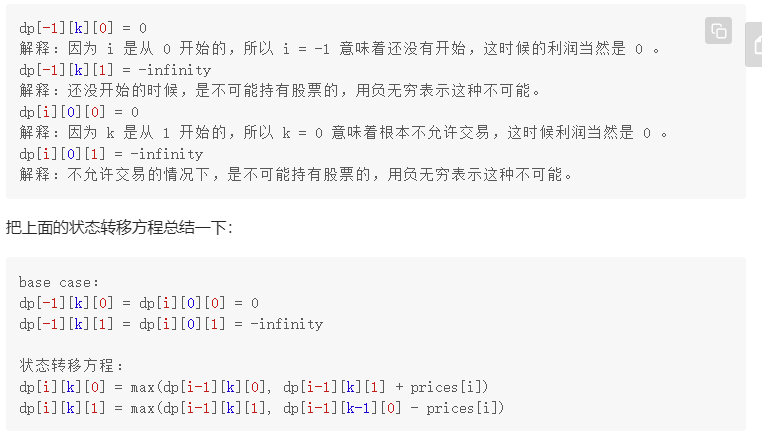

k当成是已经完成k笔交易，那么数组初始大小为k_max（即为最大交易完成次数）+1，遍历就从k==1到k_max，即为完成1笔到完成k_max笔，因为k=0的时候无交易收益即为0，而数组初始化的时候，所有的全是0



**三维数组，记录状态，dp(i)(k)(1)表示第i天，已经完成k笔交易，1 or 0表示是不是持有股票，而且这儿的完成交易是按照买算的，即买进一次就算完成一笔交易**

买卖股票的最佳时机（121）k=1

买卖股票的最佳时机2（122）k=无穷

买卖股票的最佳时机3（123）k=2

买卖股票的最佳时机4（188）k随机给定

买卖股票的最佳时机含冷冻期（309）

买卖股票的最佳时机含手续费（714）

三位数组

- #### 121   k==1

  - 简单解法就是遍历每个价格，用它减去它前面最低的价格，然后把这些保存起来取最小值。

    ```c++
    class Solution {
    public:
        int maxProfit(vector<int>& prices) 
        {
            int minprice=INT_MAX;
            int maxprofit=0;
            for(int price:prices)
            {
                maxprofit=max(maxprofit,price-minprice);
                minprice=min(price,minprice);
            }
         
            return maxprofit;
        }
    };
    ```

  - 初始版本

    ```c++
    class Solution {
    public:
        int maxProfit(vector<int>& prices) 
        {
            if(prices.empty())   
                return 0;
            int n=prices.size();
            vector<vector<int>> dp(n,vector<int>(2));
            for(int i=0;i<prices.size();i++)
            {
                if(i==0)
                {
                    dp[i][0]=0;
                    dp[i][1]=-prices[i];
                    continue;
                }
                dp[i][0]=max(dp[i-1][0],dp[i-1][1]+prices[i]);
                dp[i][1]=max(dp[i-1][1],-prices[i]);
            }
            return dp[n-1][0];
        }
    };
    ```

  - 每一个状态只和最邻近的状态有关，可以不用保存每个状态，只需要记录它前面的一个就行

    ```c++
    class Solution {
    public:
        int maxProfit(vector<int>& prices) 
        {
            if(prices.empty())  //这儿判空可以省略因为dp_i_0有初值
                return 0;
            int dp_i_0=0,dp_i_1=INT_MIN;
    
            for(int i=0;i<prices.size();i++)
            {
                dp_i_0=max(dp_i_0,dp_i_1+prices[i]);
                dp_i_1=max(dp_i_1,-prices[i]);
            }
            return dp_i_0;
        }
    };
    ```

- #### 122  k==无穷

  - 把折线图里的每一次上升段都加起来

    ```c++
    class Solution {
    public:
        int maxProfit(vector<int>& prices) 
        {
            int res(0);
            for(int i=1;i<prices.size();i++)
            {
                if(prices[i]>prices[i-1])
                    res+=prices[i]-prices[i-1];
            }
            return res;
                            
        }
    };
    ```

  - 把K换成无穷，改写121的第三种方法

    ```c++
    class Solution {
    public:
        int maxProfit(vector<int>& prices) 
        {
            int n=prices.size();
            int dp_i_0=0,dp_i_1=INT_MIN;
            for(int i=0;i<prices.size();i++)
            {
                int temp=dp_i_0;
                dp_i_0=max(dp_i_0,dp_i_1+prices[i]);
                dp_i_1=max(dp_i_1,temp-prices[i]);
            }
            return dp_i_0;
        }
    };
    ```

- #### 123  k==2

  前面两种的K要么无穷，要么就是base case，在状态转移方程中没啥印象，从这儿开始和下面的K随机取值，K就有影响了，因此这儿要对K穷举

  ```c++
  class Solution {
  public:
      int maxProfit(vector<int>& prices) 
      {
          if(prices.empty())
              return 0;
          int n=prices.size();
          int K=2;
          vector<vector<vector<int>>> dp(n,vector<vector<int>>(K+1,vector<int>(2)));
          for(int i=0;i<prices.size();i++)
          {
              for(int k=1;k<=K;k++)
              {
                  if(i==0)
                  {
                      dp[i][k][0]=0;       //这儿就和k无关了，如果第三个索引为0，那么收益必然为0，如果第三个索引为1，那么初始就是-prices[0]
                      dp[i][k][1]=-prices[i];
                      continue;
                  }
                  dp[i][k][0]=max(dp[i-1][k][0],dp[i-1][k][1]+prices[i]);
                  dp[i][k][1]=max(dp[i-1][k][1],dp[i-1][k-1][0]-prices[i]);     
              }
           
          }
          return dp[n-1][K][0];
      }
  };
  ```

- #### 188  k==任意整数

  有效的k值为1到n/2，因此当k>n/2时，就当成122的k为无穷的情况返回就可以

  ```c++
  class Solution {
  public:
      int maxProfit(int K,vector<int>& prices) 
      {
          if(prices.empty())
              return 0;
          int n=prices.size();
          if(K>n/2)
              return maxProinf(prices);
  
          vector<vector<vector<int>>> dp(n,vector<vector<int>>(K+1,vector<int>(2)));
          for(int i=0;i<prices.size();i++)
          {
              for(int k=1;k<=K;k++)
              {
                  if(i==0)
                  {
                      dp[i][k][0]=0;       //这儿就和k无关了，如果第三个索引为0，那么收益必然为0，如果第三个索引为1，那么初始就是-prices[0]
                      dp[i][k][1]=-prices[i];
                      continue;
                  }
                  dp[i][k][0]=max(dp[i-1][k][0],dp[i-1][k][1]+prices[i]);
                  dp[i][k][1]=max(dp[i-1][k][1],dp[i-1][k-1][0]-prices[i]);     
              }
           
          }
          return dp[n-1][K][0];
      }
      int maxProinf(vector<int>& prices) 
      {
          int n=prices.size();
          int dp_i_0=0,dp_i_1=INT_MIN;
          for(int i=0;i<prices.size();i++)
          {
              int temp=dp_i_0;
              dp_i_0=max(dp_i_0,dp_i_1+prices[i]);
              dp_i_1=max(dp_i_1,temp-prices[i]);
          }
          return dp_i_0;
      }
  };
  ```

- #### **309** k==无穷同时要间隔一下

  买入的地方变一下就行，变成从i-2天开始买入

  ```c++
  class Solution {
  public:
      int maxProfit(vector<int>& prices) 
      {
          int n=prices.size();
          int dp_i_0=0,dp_i_1=INT_MIN;
          int dp_pre_0=0; //代表dp[i-1][0]
          for(int i=0;i<prices.size();i++)
          {
              int temp=dp_i_0;
              dp_i_0=max(dp_i_0,dp_i_1+prices[i]);
              dp_i_1=max(dp_i_1,dp_pre_0-prices[i]);
              dp_pre_0=temp;  
          }
          return dp_i_0;
      }
  };
  ```

- #### 714  k==无穷加有手续费

  每次交易的时候把手续费减掉就行

  ```c++
  class Solution {
  public:
      int maxProfit(vector<int>& prices) 
      {
          int n=prices.size();
          int dp_i_0=0,dp_i_1=INT_MIN;
          for(int i=0;i<prices.size();i++)
          {
              int temp=dp_i_0;
              dp_i_0=max(dp_i_0,dp_i_1+prices[i]);
              dp_i_1=max(dp_i_1,temp-prices[i]-fee); 
          }
          return dp_i_0;
      }
  };
  ```

  