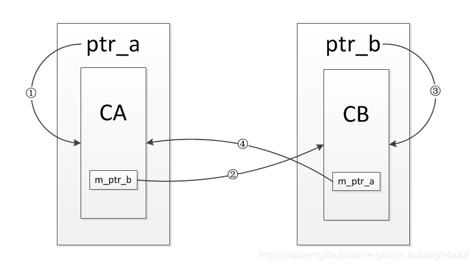
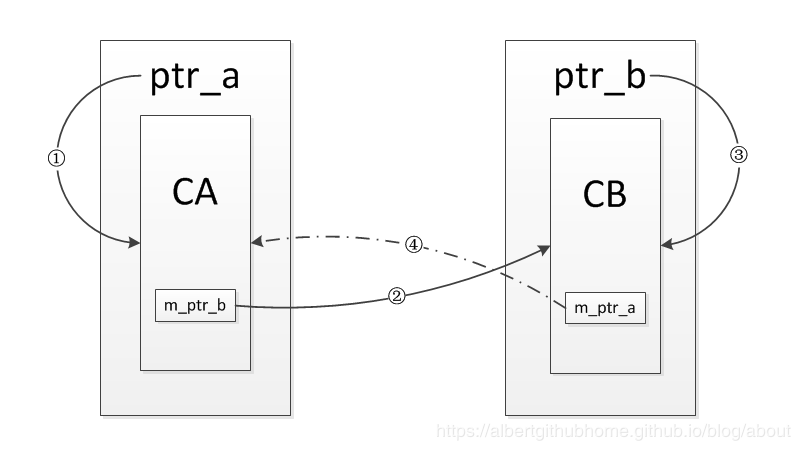

1. 不要使用auto_ptr,因为他的缺陷导致我们拷贝构造/赋值的时候有很大的麻烦
2. 在不需要拷贝构造/赋值的时候，可以使用unique_ptr。
3. 有拷贝构造/赋值的情况，推荐使用shared_ptr.
4. 类内有访问其他shared_ptr对象时，指针类型设为weak_ptr,可以不改其他shared_ptr对象的引用计数。
5. 代码中尽量不用delete关键字，因为我们的内存的管理与释放全权交给对象处理。

##### 补充：智能指针是线程安全的吗？

对于unique_ptr，由于只是在当前代码块范围内有效。所以不涉及线程安全的问题。

对于shared_ptr，多个对象要同时共用一个引用计数变量，所以会存在线程安全的问题，但是标准库实现的时候考虑到了这一点，使用了**基于原子操作（CAS）**的方式来保证shared_ptr能够高效、原子的操作引用计数。


# auto_ptr

它的独有模式只是说用一个auto_ptr给另外一个auto_ptr赋值时会把前面的拿走然后置空。

问题在于当两个指针指向同一个对象时，结束之后会对同一个对象delete两次，是不安全的

第一个delete之后变为野指针，那第二个delete就会在内存里随机delete，造成不安全.

因为是delete所以无法管理数组

同时因为所有权，无法放入容器中

```c++
#include <iostream>
using namespace std;

template <typename T>
class AutoPtr
{
public:
    T* _ptr;
public:
    //构造
    AutoPtr(T* tmp=nullptr):_ptr(tmp){}

    //析构
    ~AutoPtr()
    {
        if(_ptr)
            delete _ptr;
    }

    //重载*
    T& operator*()
    {
        return *_ptr;
    }

    //重载->
    T* operator->()
    {
        return _ptr;
    }

    //拷贝构造函数
    AutoPtr(const AutoPtr<T>& tmp)
    {
        _ptr=tmp._ptr;
        const_cast<AutoPtr<T>&> (tmp)._ptr=nullptr; //原来的被置空
    }

    //赋值运算符重载
    AutoPtr<T>& operator=(const AutoPtr<T>& tmp)
    {
        if(tmp._ptr!=_ptr)
        {
            if(_ptr)
                delete _ptr;
            _ptr=tmp._ptr;
            count_cast<AutoPtr<T>&> (tmp)._ptr=nullptr;   //原来的被置空
        }
        return *this;
    }


};
class A
{
public:
    int a;
    A(int x):a(x){}
    int geta()
    {
        return a;
    }
    ~A()
    {
        cout<<"delete"<<endl;
    }
};
int main()
{
    A *b=new A(2);
    AutoPtr<A> a(b);
    cout<<a->a;
    AutoPtr<A> c=a;
}

```


# unique_ptr

就是在auto_ptr的基础上把拷贝构造和赋值运算符重载delete了。实现简单，但是失去了赋值和拷贝的功能

同样的，它的独占是说不能从一个另外一个unique_ptr里拿，但是可以分别用相同的对象赋值，当然这样也是不安全的

```c++
#include <iostream>
using namespace std;

template <typename T>
class UniquePtr
{
public:
    T* _ptr;
    //构造
    UniquePtr(T* tmp=nullptr):_ptr(tmp){}
    

    //析构
    ~UniquePtr()
    {
        if(_ptr)
            delete _ptr;
    }

    //重载*
    T& operator*()
    {
        return *_ptr;
    }

    //重载->
    T* operator->()
    {
        return _ptr;
    }
private:
    //拷贝构造函数
    UniquePtr(const UniquePtr<T>& tmp)=delete;

    //赋值运算符重载
    UniquePtr<T>&operator=(const UniquePtr<T>& tmp)=delete;


};
class A
{
public:
    int a;
    A(int x):a(x){}
    int geta()
    {
        return a;
    }
    ~A()
    {
        cout<<"delete"<<endl;
    }
};
int main()
{
    A *b=new A(2);
    UniquePtr<A> a(b);
    UniquePtr<A> c(a); //错误

}
```


# share_ptr

**它的引用计数本身是安全且无锁的，但对象的读写则不是，因为shared_ptr 有两个数据成员，读写操作不能原子化**

**引用计数是指指针指向对象被引用的次数，即有多少个指针在指向该对象**

为了实现多个指针共享一个引用计数，因此我们要使用指针，不同指针的count计数指针指向同一块内存。不能用静态变量，那样的话就算指向不同对象的指针也会增加引用计数，eg：a和b指向A，cd指向B，用静态变量的所有的计数都是4

```c++
#include <iostream>
#include <memory>
using namespace std;

template <typename T>
class SharedPtr
{
public:
    T* _ptr;
    int* count;
public:
    //构造
    SharedPtr(T* tmp):_ptr(tmp),count(new int(1)){} //默认参数,即有参无参的构造函数都会调用它

    //析构
    ~SharedPtr()
    {
        if(--(*count)==0)   //count-1==0证明count==1即析构前只有一个引用，那直接全部删掉就行，如果不==0说明还有其他引用，那就不删除。ptr是指向T类对象的，只有最后一个引用要析构时才能删除，不然每个删一次会造成多次delete
        {
            delete _ptr;
            delete count;
        }
    }

    //重载*
    T& operator*()
    {
        return *_ptr;
    }

    //重载->
    T* operator->()
    {
        return _ptr;
    }

    //拷贝构造函数
    SharedPtr(const SharedPtr<T>& tmp):_ptr(tmp._ptr),count(tmp.count)
    {
        (*count)++;
    }

    //赋值运算符重载
    SharedPtr& operator=(const SharedPtr<T>& tmp)
    {
        if(tmp._ptr!=_ptr)
        {
            if(--(*count)==0)  //判断如果count--之后是0，那证明this是最后一个引用而且现在要被其他指针赋值了，就要把以前的资源都释放掉；如果不为0，那原来的引用--，资源不用管，留着最后一个引用析构时再释放
            {
                delete _ptr;
                delete count;
            }
            _ptr=tmp._ptr;
            count=tmp.count;
            (*count)++;
        }
        return *this;
    }
};
class A
{
public:
    int a;
    A(int x=1):a(x){}
    int geta()
    {
        return a;
    }
};
```

引用成环的问题

**注意ptr_a指向CA对象之后，她两就合体了，你的就是我的我的就是你的**



