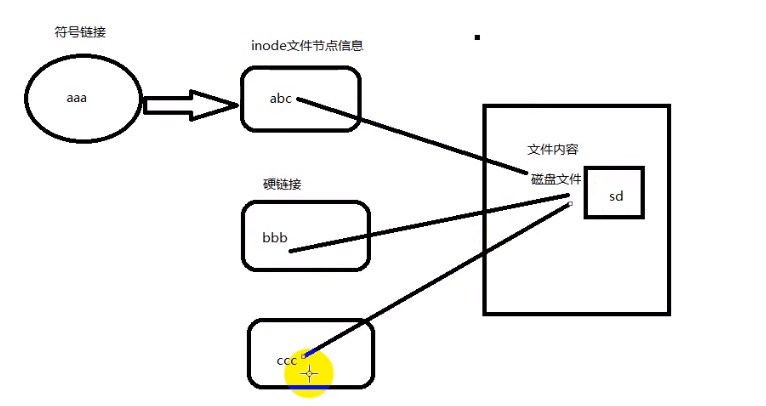
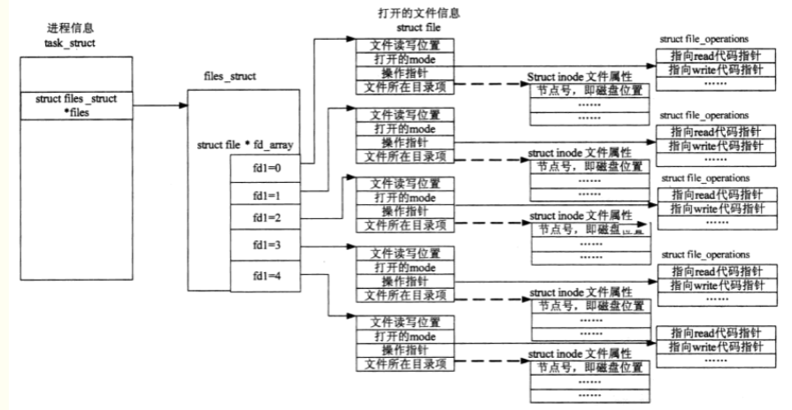

## 基本命令

- posix：定义了一组可移植操作系统api   win不符合这个标准

- shell：命令解释器       cat /etc/shells   查看当前系统下的shell版本

  echo $SHELL   查看当前使用的shell

- c+d 删除当前光标位置  c+u/k 光标至开头，光标至结尾   c+y粘贴

- ls -a显示所有  ls -l  显示可见文件和目录的详细信息（单位是字节B）   ll  两者结合

- which用来查找文件，而且只会在环境变量$PATH中查找。例如which ls就可以看到ls文件的目录位于/bin/ls，那么如果chmod变成644，那么ls命令就不能执行了

- g++ a.cpp -o a  把a.cpp编译成a   g++ -o  a   a.cpp效果一样

- tree命令，查看当前目录下的目录树信息

- mkdir创建目录，可以直接创建多个；如果要创建层级目录，需要加-p参数，例如mkdir -p a/b/b

- 创建目录默认是4096字节，用touch创建的文件默认是0字节，再用vim往里面加东西，默认是字符，例如加入一个a，文件大小就变成2（还有字符串结束符\0)

- cat显示文件内容。  head -n  filename 显示文件的前n行，tail显示文件的最后n行

- 硬链接和软连接。文件名其实只是一个索引结点，真正的文件内容在磁盘，而在磁盘中是没有文件名这个概念的

- wc+filename   显示文件的行数、单词数（以空格区分）和字符数。-l、-w和-c表示只显示行数、单词数和字符数（多少个字节）

- du -hm/hk/hb  dirname   显示目录的大小，以M/K/B为单位，不够的话向上取整

- df --block==GB  以GB为单位查看磁盘使用

- chown  bias : root  filename  把文件的所有者变为bias，所有组变为root。而且改的时候不要求bias必须在root组里，只要存在这个所有者和所有组就可以修改

  chowm bias：root dirname -R可以递归修改dirname目录下所有文件的所有者

- 根据文件名查找文件，默认是递归查找，即目录里的也能找到   find  ./* -name "*.avi"    第一个※表示当前目录下所有文件，第二个※是通配符，表示任意个字符，这儿即代表任意后缀为.avi的文件

- 根据文件内容查找   grep默认不是递归   grep "hello"  ./* -R

- sudo fdisk -l查看所的磁盘列表，先找到u盘的名字，例如u盘是/dev/sdb1，那么要把它挂载到系统上用sudo mount /dev/sdb1    /mnt   这样就挂载到了/mnt目录下，这样我们cd到/mnt就可以看到u盘的内容并操作

  卸载的时候直接sudo umount /mnt

- c+z是暂停作业到后台，c+c是直接中止

  暂停之后可以用jobs看那些作业暂停在后台，然后用fg+n即可唤醒n号作业到前台工作

- kill命令并不是杀死进程，而是把信号发送给指定进程。可以用kill -l查看kill可以发送的所有信号。前32是公用的，后面的就依据具体系统和硬件平台

  例如第二个SIGINT，当我们摁c+c时就是发送这个信号第九个SIGKILL就是杀死进程，kill -9 2020

  sigint只能中止前台进程，sigkill直接干掉

- 环境变量就是一堆路径，告诉机器，你输入的命令到到哪儿去找

  **PATH路径定义了解释器执行用户命令的路径**，例如ls命令，我们which ls命令可以得到/bin/ls，然后echo $PATH看到/bin在path里，那么我们执行ls的时候就回到/bin里找然后找到ls，执行

## 网络

- 设置临时ip

  sudo ifconfig eht0 192.168.1.1

## 共享库和静态库

共享库和静态库（静态库是.a，动态库是.so)

静态库的代码在编译过程中已经被载入到可执行程序，因此可执行文件体积较大。

动态库的代码是在可执行程序运行时才载入内存的，因此代码体积较小

如何制作共享库https://blog.csdn.net/qq_28114615/article/details/87274134

二者的区别https://blog.csdn.net/MOON5555/article/details/78327018

## 文件IO

- 一个进程运行时，进程控制块PCB即一个结构体，里面有个 file_struct  ※files，files指向一个file_struct类型的结构体，在这个结构体中有一个成员是file结构体类型的指针数组即file ※fd[]，其中每个指针又指向一个file结构体，其中就有文件描述符，操作指针，缓冲区等数据

  通过文件指针即file *指向file结构体得到文件描述符，再通过文件描述符指向真正的文件

  

- /dev/tty指向当前终端，是个泛型指针，谁打开就指向谁，类似于this指针

- inode结点是对文件的索引，就像是树的目录。但是一个文件可能被多个用户打开或被一个用户给打开多次，每个用户的操作都不一样，文件位移量也不一样，一个inode很难记录这么多信息。所以产生了文件描述符，每个用户每次打开一个文件，就产生一个文件描述符，多次打开就产生多个文件描述符，一一对应，不管是同一个用户，还是多个用户。该文件描述符就记录了当前打开的文件的偏移量等数据。**所以一个i节点可以有0个或多个文件描述符。多个文件描述符可以对应一个i节点**。

  使用stat命令可以查看文件的详细信息，例如inode值等

## 进程

- 查看进程id即运行状态等信息  ps aux
- 查看当前进程使用的资源上线 ulimit -a
- /proc/self/limits文件记录进程资源的上限，可以使用ulimit+对应参数修改对应数据，普通用户修改的值不能超过硬上限，超级用户可以超过
- OS 一般都是以页为单位管理，4096字节