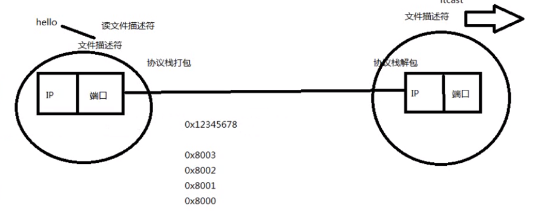

## 挂起和阻塞

挂起是主动行为，内存不够了，先把它放到外存，要用的话再整进来

阻塞是被动行为，还在内存中

睡眠也是阻塞状态

## 阻塞非阻塞和同步异步

**阻塞和非阻塞针对的是调用方的状态，即等待数据返回时的状态**。阻塞是如果收不到返回值，那就一直等待；非阻塞是立即返回一个值，有事件就是1，没有就是0。可以继续处理下面的逻辑而不用在这儿等着，然后过一会过来check一下看有没有结果

在处理io的时候，阻塞和非阻塞都是同步io

只有使用了特殊的api才是异步io

**同步异步针对的是被调用方返回消息的方式**。同步是不管等多久，只有没得出结果值就不会返回；而异步是直接返回消息，但是并没有返回值，返回值会后续通知

## linux内存管理

每个进程创建的时候都有4G的虚拟空间，0-3用户，3-4内核，然后在每个进程的内核空间里都存在着**页表**，页表里存储此进程的程序页的编号，是否在内存，程序页的在此进程中的虚拟地址，程序页的物理内存地址，映射是通过MMU(内存管理单元)完成的

# 中断

中断是指在计算机执行期间，系统内发生任何非寻常的或非预期的急需处理事件，使得CPU暂时中断当前正在执行的程序而转去执行相应的事件处理程序。待处理完毕后又返回原来被中断处继续执行或调度新的进程执行的过程。
它是计算机可以更好更快利用有限的系统资源解决系统响应速度和运行效率的一种控制技术。

> 就是我干我的事，如果有急事，那cpu就先停下来，记一下上次自己干到那儿了，然后处理中断请求，处理完之后从记录上继续上次没干完的事。

# 基本命令

- posix：定义了一组可移植操作系统api   win不符合这个标准

- shell：命令解释器       cat /etc/shells   查看当前系统下的shell版本

  echo $SHELL   查看当前使用的shell   echo $?   获取上个命令或程序退出时的返回值

- c+d 删除当前光标位置  c+u/k 光标至开头，光标至结尾   c+y粘贴

- ls -a显示所有  ls -l  显示可见文件和目录的详细信息（单位是字节B）   ll  两者结合

- which用来查找文件，而且只会在环境变量$PATH中查找。例如which ls就可以看到ls文件的目录位于/bin/ls，那么如果chmod变成644，那么ls命令就不能执行了

- g++ a.cpp -o a  把a.cpp编译成a   g++ -o  a   a.cpp效果一样

- tree命令，查看当前目录下的目录树信息

- mkdir创建目录，可以直接创建多个；如果要创建层级目录，需要加-p参数，例如mkdir -p a/b/b

- 创建目录默认是4096字节，用touch创建的文件默认是0字节，再用vim往里面加东西，默认是字符，例如加入一个a，文件大小就变成2（还有字符串结束符\0)

- cat显示文件内容。  head -n  filename 显示文件的前n行，tail显示文件的最后n行

- 硬链接和软连接。文件名其实只是一个索引结点，真正的文件内容在磁盘，而在磁盘中是没有文件名这个概念的

- wc+filename   显示文件的行数、单词数（以空格区分）和字符数。-l、-w和-c表示只显示行数、单词数和字符数（多少个字节）

- du -hm/hk/hb  dirname   显示目录的大小，以M/K/B为单位，不够的话向上取整

- df --block==GB  以GB为单位查看磁盘使用

- chown  bias : root  filename  把文件的所有者变为bias，所有组变为root。而且改的时候不要求bias必须在root组里，只要存在这个所有者和所有组就可以修改

  chowm bias：root dirname -R可以递归修改dirname目录下所有文件的所有者

- 根据文件名查找文件，默认是递归查找，即目录里的也能找到   find  ./* -name "*.avi"    第一个※表示当前目录下所有文件，第二个※是通配符，表示任意个字符，这儿即代表任意后缀为.avi的文件。不加目录默认是在当前目录下找

- 根据文件内容查找   grep默认不是递归   grep "hello"  ./* -R

- sudo fdisk -l查看所有的磁盘列表，先找到u盘的名字，例如u盘是/dev/sdb1，那么要把它挂载到系统上用sudo mount /dev/sdb1    /mnt   这样就挂载到了/mnt目录下，这样我们cd到/mnt就可以看到u盘的内容并操作

  卸载的时候直接sudo umount /mnt

- c+z是暂停作业到后台，c+c是直接中止

  暂停之后可以用jobs看那些作业暂停在后台，然后用fg+n即可唤醒n号作业到前台工作

- 环境变量就是一堆路径，告诉机器，你输入的命令到到哪儿去找

  **PATH路径定义了解释器执行用户命令的路径**，例如ls命令，我们which ls命令可以得到/bin/ls，然后echo $PATH看到/bin在path里，那么我们执行ls的时候就回到/bin里找然后找到ls，执行

  如果要在命令行输入app名字就启动它， 就得把它的可执行文件的路径加入到PATH中。例如要在命令行启动chrome就直接google-chrome，因为这个文件在usr/bin中，而usr/bin是在PATH的路径中的

# 网络

- 设置临时ip

  sudo ifconfig eht0 192.168.1.1

- netstat -anp|more

  逐页查看网络状态，more是逐页查看

# 共享库和静态库

共享库和静态库（静态库是.a，动态库是.so)

静态库的代码在编译过程中已经被载入到可执行程序，因此可执行文件体积较大。

动态库的代码是在可执行程序运行时才载入内存的，因此代码体积较小

如何制作共享库https://blog.csdn.net/qq_28114615/article/details/87274134

二者的区别https://blog.csdn.net/MOON5555/article/details/78327018

# 文件IO

- 一个进程运行时，进程控制块PCB即一个结构体，里面有个 file_struct  ※files，files指向一个file_struct类型的结构体，这个结构体即为文件描述符表，里面有每个文件描述符，以及对应的文件指针。文件描述符是一个非负整数，就是一个索引号，通过它找到文件指针，再通过文件指针指向真正的文件

  

- inode结点是对文件的索引，就像是树的目录。但是一个文件可能被多个用户打开或被一个用户给打开多次，每个用户的操作都不一样，文件位移量也不一样，一个inode很难记录这么多信息。所以产生了文件描述符，每个用户每次打开一个文件，就产生一个文件描述符，多次打开就产生多个文件描述符，一一对应，不管是同一个用户，还是多个用户。该文件描述符就记录了当前打开的文件的偏移量等数据。**所以一个i节点可以有0个或多个文件描述符。多个文件描述符可以对应一个i节点**。

  使用stat命令可以查看文件的详细信息，例如inode值等

# 进程

- 查看进程id即运行状态等信息  ps aux
- 查看当前进程使用的资源上限 ulimit -a
- /proc/self/limits文件记录进程资源的上限，可以使用ulimit+对应参数修改对应数据，普通用户修改的值不能超过硬上限，超级用户可以超过
- OS 一般都是以页为单位管理，4096字节
- 使用cout<<getenv("PATH")可以获得key为path对应的value

#### 进程原语

**1.创建进程fork**

```c++
pid_t pid;
pid=fork();  //两个返回值，在父进程中返回紫禁城id，在子进程中返回0
```

``` 
pid_t a=getpid();
pid_t b=getppid();   //获取当前进程的id，获取当前进程父进程id
```

sleep(1)在linux中是睡眠1s，在windows中是1ms

- 读时共享，写时复制

  fork出紫禁城之后，如果只是读，那么共享栈空间，如果要写的话才复制，不写的话就和原来用一样的.

  vfork是紫禁城和父进程共享地址空间，一个改了另一个也改了，不如fork的机制，已经被放弃

  

**exec函数族**

- 

  

  

- 大多数fork完之后子进程都会执行exec然后去执行其他的程序。此时读时共享写时复制就会很有用，如果直接就复制的，复制完之后其实是要exec执行其他程序的，那复制就会变得无意义

- 一个小例子

  b.cpp的代码为

  ```c++
  int main()
  {
      cout<<12334<<endl;
      return 0;
  }
  ```

  编译之后生成可执行文件b**（这个可执行文件即二进制代码文件，像ls命令这些命令本身其实就是一个二进制可执行文件，和这儿的b一样）**

  a.cpp

  ```c++
  int main()
  {
      cout<<"hello"<<endl;
      execl("/home/bias/b","b",NULL);   //最后的NULL是哨兵，不能缺少
      cout<<"world"<<end;
  }
  ```

  执行的结果即为

  ```
  hello
  12334
  ```

- 文件重定向就是通过exec来实现

  ```c++
  ls > file
  ```

  ls的结果就保存中file中，cat file即可看到

- 文件描述符复制函数

  int dup(int oldfd)，复制oldfd所指的文件描述符，复制成功时，返回最小的尚未使用的文件描述。即返回的fd和oldfd指向同一个文件

  int dup2(int oldfd,int newfd)，newfd指定文件描述符。如果old==new，那就返回old（返回new一样）；否则，关闭new指向的文件，然后把old复制给newfd然后返回newfd

  有时也会使用int dup2(fd,STDIN_FILENO)或者（STDIO标准输出），可以将当前进程的标准输入或者标准输入重定位到fd，就可以从fd中读取或者输出到fd

**3.wait和waitpid**


图片下面是waitpid的形参pid传不同值时的执行效果

status是一个指针，如果不是NULL的话，wait会把进程的终止信息传到status所指向的变量里，后面cout这个变量就可以知道进程的退出信息

- 僵尸进程

  **在每个进程退出的时候，内核释放该进程所有的资源，包括打开的文件，占用的内存等。但是仍然为其保留一定的信息（包括进程号the process ID，退出状态the termination status of the process，运行时间the amount of CPU time taken by the process等）。直到父进程通过wait / waitpid来取时才释放. 但这样就导致了问题，如果进程不调用wait / waitpid的话，那么保留的那段信息就不会释放，其进程号就会一直被占用，但是系统所能使用的进程号是有限的，如果大量的产生僵尸进程，将因为没有可用的进程号而导致系统不能产生新的进程. 此即为僵尸进程的危害，应当避免。**

  子进程先于父进程退出，即用户空间已经释放，但是父进程没有调用wait回收子进程的PCB，则子进程称为僵尸进程。任何进程在刚终止时都是僵尸进程，都要通过父进程执行wait去清除他

  int pid=wait(int * status)，父进程执行wait会回收状态为status的僵尸子进程并返回紫禁城的id号，如果传NULL那就所有的僵尸进程全部回收

  **status里会保存进程退出的一些信息**。

  **wait是一个阻塞函数**，父进程执行到这儿会发生阻塞，会一直等到子进程结束然后回收它，如果没有子进程，返回-1。

  如果要实现非阻塞的话使用waitpid函数，第三个参数可以设置为NOHANG，这样如果没有可回收的进程就立即结束返回0

- 孤儿进程

  父进程先于子进程退出，那么子进程变成孤儿进程，这时1号进程init就会领养子进程然后称为它的父进程

#### 进程通信（进程的用户空间都是独立的，因此通信只能通过内核空间）

##### pipe

- 无名pipe，默认是阻塞的，可以设置为非阻塞

  单向通信，而且用于有血缘关系的进程之间，因为子进程继承父进程的文件描述符，所以要先pipe，再fork下来

  通过队列实现

  int pipe(int fd[2]);它的读端和写端就是两个文件描述符，fd[0]是读，1是写，和标准输入输出相反

  ```c++
  int fd[2];
  pipe(fd);
  cout<<fd[0];  //结果即为3
  ```

  如果写的时候要关闭读端，close(fd[0])

  同样读的时候要关闭写端，close(fd[1])

- fifo(有名管道)，用于无血缘关系的进程之间

  也是在内核中创建缓冲区，但是以磁盘中的一个文件为缓冲区的索引（注意这个文件名只是个索引，实际的内容都是在内存的管道中，这个文件的大小是0），而不同的进程都可以访问磁盘中的文件，从而索引到内存中的管道

  

### 内存共享映射

**共享库就是通过这种方式**

mmap() 是一个系统调用函数，本质是一种进程虚拟内存的映射方法，可以将一个**文件**、一段**物理内存**或者其它对象映射到**进程的虚拟内存地址空间**。实现这样的映射关系后，进程就可以**采用指针的方式来读写**操作这一段内存，进而完成对文件的操作，而不必再调用 read/write 等系统调用函数了。

**<u>注意是映射到进程的虚拟地址空间</u>**。


# 信号

kill -l

kill命令并不是杀死进程，而是把信号发送给指定进程。可以用kill -l查看kill可以发送的所有信号。前32是公用的，后面的就依据具体系统和硬件平台

例如第二个SIGINT，当我们摁c+c时就是发送这个信号，第九个SIGKILL就是杀死进程，kill -9 2020

sigint只能中止前台进程，sigkill直接干掉

kill -9 -2020是杀死2020进程组的所有进程，使用ps ajx查看进程组

信号的产生方式

1. 终端摁键
2. 硬件异常
   - 除0
   - 非法访问内存
3. kill命令或者kill函数

**进程处理信号的行为**


# 进程间的关系

/dev/tty指向当前终端，是个泛型指针，谁打开就指向谁，类似于this指针。而标准的012文件描述符就指向的是tty

#### 进程组

进程组：一个或多个进程的集合。是一个整数，默认就是父进程的id号，之后可以修改

**从一个父进程fork下来的进程，后续继续fork，默认的进程组id都是刚开始的那个进程**


第一个可以获取指定id的进程的组id


修改进程组ID号


#### 会话

int getsid(pid_t pid)，如果pid=0表示查看当前进程的会话进程

sessionID是和shell绑定的，同一个shell下的进程的sessionID都是当前shell的，可以使用ps ajx查看。**当会话id对应的shell关闭时，里面所有的进程都会关闭**，**可以使用setsid脱离会话id即shell终端的控制，它的sid变成？,即不依赖于任何终端，成为守护进程**

使用setsid(void)可以设置调用的进程称为新会话首进程，该进程成为新进程组的组长 。**因此进程组组长不能调用这个函数，因为不允许一个进程成为两个进程组的组长**。调用之后该进程就会脱离原来的会话组，即丢弃原来的控制终端。

#### 守护进程

sid为？的进程

不依赖于控制终端，作为后台服务进程，生存周期较长，一般用于周期性的执行某种任务或者等待处理某些发生的事件

# 线程

进程是最小分配资源单位，线程是最小的执行单位

使用ps -eLF可以看到一个LWP，即轻量级进程，==线程号tid，tid可以通过系统调用获得。pthread_id是通过线程库生成的id，生效范围不在系统级别

具体到某一个进程的LWP可以使用ps -Lf pid。

#### 线程共享的资源


#### 线程不共享的资源


#### 线程原语

<pthead.h>

```c++
void* fun(void* arg)
{
    int* p=(int*)arg;
    cout<<"childThread pid"<<getpid()<<endl;
    cout<<"childThread id"<<pthread_self()<<endl;
    cout<<"arg"<<*p<<endl;
}

int main()
{
    pthread_t tid;
    int n=10;
    pthread_create(&tid,NULL,fun,(void*)&n);
    cout<<"mainThread pid"<<getpid()<<endl;
    cout<<"childThread id"<<tid<<end;
    cout<<"mainThread id"<<pthread_self()<<endl;
    sleep(2);
    return 0;
}
```

主控线程到return 0之间要加个sleep，不然它执行完之后直接退出，主控线程一旦推出所有的线程全部退出，上面的结果就打印不出来

#### 线程回收的方式，join函数


##### 不需要接受退出线程的返回值的话就pthread_join(id,NULL)

```c++
void* r;
pthread_t a;
pthread_create(&a,NULL,fun,NULL);
pthread_join(a,&r);
cout<<(long)r; //成功的话r变为空指针，对空指针*会出错，因为没有指向，所以直接把地址值转换成long输出，用long是因为在64位的机器上，指针8字节，int放不下
如果取错误号的话用*(long*)r
```

类似于进程中的wait().回收线程的PCB，但是这儿其他的线程也可以执行join，不一定非要是主控线程

#### 线程取消函数

可以中止其他线程


#### 线程退出函数


#### 分离态


使线程变成分离态，一旦中止OS就会自动回收，不用再保持终止状态然后等其他线程join了

# 线程同步

### 互斥锁

同一时间只允许一个线程执行

临界区：同一时间只能有一个线程访问；即锁住的范围，加锁和解锁之间的部分即为临界区。为了实现高效的并发，临界区要尽可能设置的小


```c++
int counter;
phtread_mutex_t counter_mutex=PTHERAD_MUTEX_INITIALIZER;
void* fun(void*)
{
    int val;
    for(int i=0;i<5000;i++)
    {
        pthread_mutex_lock(&counter_mutex);
        val=counter;
        counter=val+1;
        pthread_mutex_unlock(&counter_mutex);
    }
}
```

互斥锁死锁的情况

（1）在互斥锁默认属性的情况下，在同一个线程中不允许对同一互斥锁连续进行加锁操作，因为之前锁处于未解除状态，如果再次对同一个互斥锁进行加锁，那么必然会导致程序无限阻塞等待。
（2）多个线程对多个互斥锁交叉使用，每一个线程都试图对其他线程所持有的互斥锁进行加锁。如下图所示情况，线程分别持有了对方需要的锁资源，并相互影响，可能会导致程序无限阻塞，就会造成死锁。


A获得lock1之后想获得lock2，而B获得lock2之后想获得lock1，卡到这儿了。

#### 条件变量


**生产者消费者**

```c++
#include <iostream>
#include<pthread.h>
#include<stdio.h>
#include<stdlib.h>
#include<string.h>
#include<unistd.h>
#include<errno.h>
using namespace std;

struct node
{
    int val;
    node* next;
    node(int x):val(x),next(NULL){}
};
node* head;
pthread_mutex_t mutex_lock=PTHREAD_MUTEX_INITIALIZER;
pthread_cond_t has_product=PTHREAD_COND_INITIALIZER;
void* consumer(void*)
{
    node* tmp;
    while(1)
    {
        pthread_mutex_lock(&mutex_lock);
        while(head==NULL)
            pthread_cond_wait(&has_product,&mutex_lock);  //如果条件不满足，就进入阻塞队列然后释放锁，当收到signal时，重新加锁，然后执行下面的内容
        tmp=head;
        head=head->next;
        pthread_mutex_unlock(&mutex_lock);
        cout<<"消费节点"<<tmp->val<<endl;
        sleep(3);
    }
}
void* producer(void*)
{
    node* tmp;
    while(1)
    {
        tmp=new node(rand()%5);
        cout<<"生产节点"<<tmp->val<<endl;
        pthread_mutex_lock(&mutex_lock);
        tmp->next=head;
        head=tmp;
        pthread_mutex_unlock(&mutex_lock);
        pthread_cond_signal(&has_product);
        sleep(1);
    }
}

int main()
{
    pthread_t a,b;
    pthread_create(&a,NULL,consumer,NULL);
    pthread_create(&b,NULL,producer,NULL);
    pthread_join(a,NULL);
    pthread_join(b,NULL);
}
```

#### 信号量

信号量（sem）和互斥锁的区别：**互斥锁只允许一个线程进入临界区，而信号量允许多个线程进入临界区**

初始化用sem_t (&empty,0,num);第二个如果是0表示只能在当前进程的所有线程共享，否则可以在进程间共享，第三个是信号量值的大小

```c++
#include<iostream>
#include<pthread.h>
#include<semaphore.h>
#include<unistd.h>
#include<queue>
#define WAIT_TIME 10
#define buffer_size 10
using namespace std;


queue<int> buffer;
sem_t empty,full;


void* producer(void*)
{
    while(1)
    {
        sleep(rand() % WAIT_TIME);
        int product=rand()%100;     
        sem_wait(&empty);      
        cout<<"生产者生产出产品"<<product<<endl;
        buffer.push(product);
        sem_post(&full);
    }
}
void* consumer(void*)
{
    while(1)
    {
        sleep(rand()%WAIT_TIME);
        sem_wait(&full);
        cout<<"消费者消耗产品"<<buffer.front()<<endl;
        buffer.pop();
        sem_post(&empty);
    }
}
int main()
{
    pthread_t producerID,consumerID;
    sem_init(&empty,0,buffer_size);   //buff_size就是最大值，
    sem_init(&full,0,0);

    pthread_create(&producerID,NULL,producer,NULL);
    pthread_create(&consumerID,NULL,consumer,NULL);

    pthread_join(producerID,NULL);
    pthread_join(consumerID,NULL);

    sem_destroy(&empty);
    sem_destroy(&full);
    return 0;
}
```

#### 读写锁

读写锁特性：写锁优先级高，写独占，读共享

1. 写模式加锁时，解锁前，所有对该线程加锁的线程都会被阻塞。
2. 读模式加锁时，如果线程是读加锁则成功，如果线程是写加锁会阻塞。
3. 读锁、写锁并行阻塞时，写锁优先级高，即解锁后优先执行写锁操作。

多个线程可以同时读，但是不能同时写。而且写的时候不能读， 读的时候不能写

锁处于读模式时可以线程共享，而锁处于写模式时只能独占，所以读写锁又叫做共享-独占锁

```c++
#include<bits/stdc++.h>
#include<pthread.h>
#include<unistd.h>
using namespace std;

int counter;
pthread_rwlock_t rwlock=PTHREAD_RWLOCK_INITIALIZER;
void* _write(void*)
{
    while(1)
    {
        pthread_rwlock_wrlock(&rwlock);
        cout<<"写操作增加counter为"<<++counter<<endl;
        pthread_rwlock_unlock(&rwlock);
        sleep(4);
    }
}
void* _read(void*)
{
    while(1)
    {
        pthread_rwlock_rdlock(&rwlock);
        cout<<"读操作读取当前counter为"<<counter<<endl;
        pthread_rwlock_unlock(&rwlock);
        sleep(2);
    }
}
int main()
{
    pthread_t tid[3];
    for(int i=0;i<1;i++)
        pthread_create(&tid[i],NULL,_write,NULL);
    for(int i=1;i<3;i++)
        pthread_create(&tid[i],NULL,_read,NULL);
    for(int i=0;i<3;i++)
        pthread_join(tid[i],NULL);
}
```

# linux的三种锁

#### 互斥锁

同一时间只有一个进程可以操作临界区资源

#### 读写锁

读写锁适合于对数据结构的**读次数比写次数多得多的情况**.因为,读模式锁定时可以共享,以写模式锁住时意味着独占,所以读写锁又叫共享-独占锁.

多个读可以同时读，但是一但开始写只能有一个写而且所有的读也被阻塞

#### 自旋锁

与互斥锁类似，不是通过休眠使进程阻塞，而是在获取锁之前一直处于**忙等(自旋)阻塞状态**。用在以下情况：锁持有的时间短，而且线程并不希望在重新调度上花太多的成本。"原地打转"。一般用在多核情况下

**使用自旋锁会顺带关闭中断**，因为自旋锁要求不休眠，就要关闭调度器，而调度器通过时钟中断来判断何时唤醒任务，所以关了中断就没有睡眠了。

**当我们运行不能被打断的任务的时候就会关中断，这样就不会被打断。自旋锁不能睡眠，所以加锁前要关中断**

# 网络编程


首部的长度是可变的。MTU即最大传输单元，以太网的链路层的MTU1500字节，以太网帧的长度还要加上首部和尾部

- TCP以上属于用户空间，TCP及以下是内核空间，我们操作的部分就是应用层，设置用户层协议


- ip地址32位，mac地址48位

- 

  根据类型的2个字节的不同的值，表示中间包着的数据的类型

- ARP协议，根据ip地址获取物理mac地址

  mac和ip的关系就类似于身份证号和邮政编号的关系，二者缺一不可，如果只有mac没有ip，那么每台机器都要记录所有mac地址的映射，就算一个一字节也需要256TB；而ip属于因特网协议即3.4层，它诞生的时候就是基于现有的技术诞生的，下层可以使用以太网，可以使用atm也可以使用其他的，而ip只是体统了一个统一的接口，因此为什么有了ip地址还需要mac地址，这个问题就本末倒置了，mac先于ip就有了，ip有的时候，既然下层已经有了那么多能用的，那么直接兼容它就行，何必再从头开始造轮子呢，所有就促成了现在的tcp/ip协议栈

  > 来自于知乎大佬

  ##### 工作过程

  主机A的IP地址为192.168.1.1，MAC地址为0A-11-22-33-44-01；

  主机B的IP地址为192.168.1.2，MAC地址为0A-11-22-33-44-02；

  当主机A要与主机B通信时，地址解析协议可以将主机B的IP地址（192.168.1.2）解析成主机B的MAC地址，以下为工作流程：

  1. 第1步：根据主机A上的[路由表](https://baike.baidu.com/item/路由表)内容，IP确定用于访问主机B的转发IP地址是192.168.1.2。然后A主机在自己的本地ARP缓存中检查主机B的匹配MAC地址。
  2. 第2步：如果主机A在ARP缓存中没有找到映射，它将询问192.168.1.2的硬件地址，从而将ARP请求帧广播到本地网络上的所有主机。源主机A的IP地址和MAC地址都包括在ARP请求中。本地网络上的每台主机都接收到ARP请求并且检查是否与自己的IP地址匹配。如果主机发现请求的IP地址与自己的IP地址不匹配，它将丢弃ARc'c'cP请求。
  3. 第3步：主机B确定ARP请求中的IP地址与自己的IP地址匹配，则将主机A的IP地址和MAC地址[映射](https://baike.baidu.com/item/映射)添加到本地ARP缓存中。
  4. 第4步：主机B将包含其MAC地址的ARP回复消息直接发送回主机A。
  5. 第5步：当主机A收到从主机B发来的ARP回复消息时，会用主机B的IP和MAC地址映射更新ARP缓存。本机缓存是有[生存期](https://baike.baidu.com/item/生存期)的，生存期结束后，将再次重复上面的过程。主机B的MAC地址一旦确定，主机A就能向主机B发送IP通信了。

- ip首部中的源ip和目的ip永远不会变（除了做了nat转换），变得是以太网帧中的源mac和目的mac

- **不同局域网内的ip如何通信**

  

  #### 两个不同局域网的ip只要通信就必须使用内网穿透

  S为中间服务器，A和B为公网ip，a1和b1为要实现通信的两个局域网ip，他们的NAT端口号为port-a和port-b

  平常我们访问公网的ip是因为公网ip的服务器都是开放端口，端口号大家都知道，所以知道端口号知道ip就可以指直接发过去，然后发的时候NAT在发送之前会在tracker table中保存一条记录**<源ip：源端口->目的ip：目的端口>**，所以返回的也能接受到。

  但是不同局域网的ip提前并不知道对方NAT映射的端口号，因此只知道公网ip的话，a1随便指定端口号向B发过去，B的NAT中没有这个ip也没有这个端口号的记录，所以直接丢掉了。

  因此需要一个中间服务器S，它是开放性的，a1和b1都可以发送S-IP和S-port链接到S，那么S就记录了双方的IP和a1-port，b1-port，同时再告诉双方对方的ip和端口号。

  那么a1就可以发送B-IP：b1-port给B，这样B仍然不会接受，但是NAT-A中就保存了一条记录<A-IP:port a1->B-IP:port b1>，这样B-IP:port b1发过来的话就会转给a1；但是a1发的b1还是收不到，所有同样让b1重复同样的过程，这样NAT-B中就保存了<B-IP:port b1->A-IP:port a1>，这样A-IP:port a1发过来的就转交给b1

  至此就实现了内网穿透，双方就可以脱离服务器直接通信了。但是track table中的记录是有有效期的，所以每过一段时间AB就要和S发送心跳包来获取端口号，因此S还是不可或缺的，用它来维持链接，不然这次打洞成功了，但是一但退出，下一次没有S的话还是无法建立连接。

  qq早期就是利用这种内网穿透（也叫udp打洞），建立连接之后双方直接通信，S用来维持链接；但是这样不利于审查，所以现在都是流量先传到S，然后S再转发

##  编程

TCP/IP协议中，IP地址+TCP或UDP端口号唯一标识网络通信中的一个进程，这个IP地址+端口号就称为socket。**其实就把一个socket看成一个文件描述符**



TCP/IP中，建立连接的进程各自有一个socket标识，那么双方的两个socket就组成socket pait唯一标识一个连接

网络字节序用的是大端，即数据包前面加的那些首部使用大端，而用户数据就用默认的小端就行，因为用大端发送，那么就用大端就收，OS按照大端把首部去掉之后，剩下的用户数据用小端给用户就行，因为用户用的一直都是小端

---

#### socket相关函数

- socket函数，返回创建的文件描述符

  

- **创建了socket之后，服务端就要通过bind绑定ip地址和端口号到该socket。这样serveraddr的ip和端口号发过来的数据就传到listen_fd来处理，即把ip地址和端口号绑定到socket**

  

  网络地址和端口号是保存在一个结构体中，有下面三种 形式


早期设计socket的时候还没有ipv4，所以默认就是struct sockaddr结构体，现在bind v4的话要把sockaddr_in转成sockaddr传入

#### htonl和**inet_pton**

- htonl和htons是地址和端口的字节序转换，**转成二进制类型**，h标识hostname，n表示network，l表示32位长整数，s表示16位短整数。

  

  uint32_t即32位无符号整数，hl和hs时主机到网络，nl和ns是网络到主机

  htonl用的时候传的参数直接就是整数

  ```c++
  htons(8080);
  ntohs(htons(8080));
  htonl(192<<24|168<<16|3<<8|1);
  ```

- 而inet_pton和inet_ntop是用于字符串形式的ip地址和二进制类型之间的转换

  ```c++
  inet_pton(int family,const char* src, in_addr* dst)
  执行之后会把字符串src转换成二进制传给*dst.s_addr
  返回值：成功返回1，输入无效返回0，出错返回-1
  
  const char* inet_ntop(int family,const in_addr* src,char* str,socklen_t size)
  把接收到的ip二进制src.s_addr转换成点分十进制保存到字符str中，size是str的长度
  返回值：成功返回执行str的指针，出错返回NULL
  ```

  demo

  ```c++
  in_addr s;
  char* b;
  char* a="192.168.3.1";
  inet_pton(AF_INET,a,&s);
  inet_ntop(AF_INET,&s,b,sizeof(b));
  //会把a转换成32无符号整数然后传给s.s_addr
  //上述过程等价于s.addr=htonl(192<<24|168<<16|3<<8|1);
  ```

  ### 完整初始化过程

  ```c++
  /*struct sockaddr_in
  {
      __kernel_sa_family_t   sin_family;
      uint16_t               sin_port;
      struct in_addr         sin_addr;
  };
  struct in_addr
  {
      uint32_t    s_addr;    
  }; */
  
  sockaddr_in server;
  int sock=socket(AF_INET,SOCK_STREAM,0);
  bzero(&server,sizeof(server));
  bind(sock,(sockaddr*)&server,sizeof(server));
  server.sin_family=AF_INET;
  server.sin_port=htons(8080);
  inet_pton(AF_INET,"192.168.3.1",&server.sin_addr);
  ```

#### listen

**int listen(int sockfd,int backlog);让sockfd具备监听的能力，并不是直接让他进入listen状态**

backlog是排队建立三次握手队列和**刚刚**建立三次握手队列的连接数之后，可以使用cat /proc/sys/net/ipv4/tcp_max_syn_backlog查看默认值，服务器默认是2048.

等待三次握手链接就是收到客户端的SYN之后，回了ACK，但是还没有收到客户端的ACK，这时就处于等待三次握手状态。

但是已经建立tcp链接的数目可以很多，只是处于刚刚建立和等待三次握手的最大数只能是backlog

#### accept


**第二个参数是传出参数，会把建立连接的客户端的ip和端口号保存到addr里**


#### connect


和bind类似，区别在于bind是绑定自己的ip和端口号，而connect传入的服务器的端口号和ip

#### 完整流程


- 调用accept之后才进入阻塞监听状态，listen只是设置刚刚建立和等待握手的队列的数目
- 客户端不需要bind，执行connect的时候会自动给参数里的fd绑定ip和端口号，这样服务器传回来也会给指定的socket。而服务端必要绑定，不然客户端发过去却发现指定的IP和端口号没有绑定socket，无法通信
- 服务器端开始时绑定的socket其实是用来监听的，实际通信的是accept()返回的新的socket

## TCP/IP通信

由于read是阻塞函数，所以一次只能处理一个连接

- #### 服务端

  ```c++
  #include<bits/stdc++.h>
  #include<unistd.h>
  #include<sys/types.h>
  #include<sys/socket.h>
  #include<arpa/inet.h>
  #include<netinet/in.h>
  #include<string.h>
  #define MAX_SIZE 128
  using namespace std;
  
  int main()
  {
      sockaddr_in serveraddr,clientaddr;
      int listenfd,confd;  //第一个用来监听，第二个用来通信
      socklen_t addrlen;  //socklen_t是unsigned int类型，不能声明为int，保存客户端结构的大小
      char buf[MAX_SIZE];      //保存客户端发过来的数据
      char str[16];      //保存客户端的ip,ipv4转换成点分十进制的字符串最多15位，加上\0
  
      //socket
      listenfd=socket(AF_INET,SOCK_STREAM,0);
       
      //清零
      bzero(&serveraddr,sizeof(serveraddr));
      
      //设置地址
      serveraddr.sin_family=AF_INET;
      serveraddr.sin_addr.s_addr=htonl(INADDR_ANY);
      serveraddr.sin_port=htons(8000);
      
      //绑定ip、端口和socket
      bind(listenfd,(sockaddr*)&serveraddr,sizeof(serveraddr));
      
      //listen
      listen(listenfd,128);
  
      cout<<"等待建立连接"<<endl;
      while(1)
      {
          addrlen=sizeof(clientaddr);
          confd=accept(listenfd,(sockaddr*)&clientaddr,&addrlen);
  
          int n=read(confd,buf,MAX_SIZE);   //从confd所指的文件中读取max—_size个字节到buf中，返回读取字节的长度
          cout<<"收到的IP地址为:"<<inet_ntop(AF_INET,&clientaddr.sin_addr,str,sizeof(str))<<endl<<"收到的端口号为"<<ntohs(clientaddr.sin_port)<<endl;
  
          for(int i=0;i<n;i++)
          {
              buf[i]=toupper(buf[i]);
          }
          write(confd,buf,n);  //从confd文件中写n个字节到buf
          close(confd);
      }
  }
  ```

- #### 客户端

  ```c++
  #include<iostream>
  #include<unistd.h>
  #include<sys/types.h>
  #include<sys/socket.h>
  #include<arpa/inet.h>
  #include<netinet/in.h>
  #include<string.h>
  #define MAX_SIZE 128
  #define SERVER_PORT 8000
  using namespace std;
  
  
  int main(int argc,char* argv[])
  {
      sockaddr_in server;
      char buf[MAX_SIZE];
      char* str=argv[1];   //命令行第二个参数，即要变大的那个字符串
      
      int sockfd=socket(AF_INET,SOCK_STREAM,0);
      
      bzero(&server,sizeof(server));
      server.sin_family=AF_INET;
      server.sin_port=htons(SERVER_PORT);
      inet_pton(AF_INET,"10.170.45.112",&server.sin_addr);  //服务器的ip，也可以用127.0.0.1表示本机
      
      connect(sockfd,(sockaddr*)&server,sizeof(server));
      
      write(sockfd,str,sizeof(str));
      
      int n=read(sockfd,buf,MAX_SIZE);
      cout<<"收到服务器返回的信息为"<<endl;
      write(STDOUT_FILENO,buf,n);
      
      close(sockfd);
      return 0;
      
  }
  ```

## UDP通信

服务端和TCP的类似，客户端可以循环发数据。因为没有read所以没有阻塞


无连接，不需要listen也不需要accept。其中的recvfrom就类似于accept和read的结合体，sendto就类似于write

- #### 服务端

  ```c++
  #include<string.h>
  #include<iostream>
  #include<sys/socket.h>
  #include<unistd.h>
  #include<netinet/in.h>
  #include<sys/types.h>
  #include<arpa/inet.h>
  #define MAX_SIZE 80
  #define SERVER_PORT 8000
  using namespace std;
  
  int main()
  {
      sockaddr_in server,client;
      socklen_t client_len;  //recvfrom的时候用，类似于accept
      char buf[MAX_SIZE];
      char str[16];
      
      int sockfd=socket(AF_INET,SOCK_DGRAM,0);
      bzero(&server,sizeof(server));
      server.sin_port=htons(SERVER_PORT);
      server.sin_family=AF_INET;
      server.sin_addr.s_addr=htonl(INADDR_ANY);
      
      bind(sockfd,(sockaddr*)&server,sizeof(server));
      
      cout<<"等待建立连接"<<endl;
      
      while(1)
      {
          client_len=sizeof(client);
          int n=recvfrom(sockfd,buf,MAX_SIZE,0,(sockaddr*)&client,&client_len); //返回读取字节的大小，类似于read
          
          cout<<"客户端的IP地址为"<<inet_ntop(AF_INET,&client.sin_addr,str,sizeof(str))<<endl<<"客户端端口号为"<<ntohs(client.sin_port)<<endl;
          
          for(int i=0;i<n;i++)
              buf[i]=toupper(buf[i]);
          
          sendto(sockfd,buf,n,0,(sockaddr*)&client,sizeof(client));
      }
  }
  ```

- #### 客户端

  ```c++
  #include<iostream>
  #include<unistd.h>
  #include<sys/types.h>
  #include<sys/socket.h>
  #include<arpa/inet.h>
  #include<netinet/in.h>
  #include<string.h>
  #define MAX_SIZE 128
  #define SERVER_PORT 8000
  using namespace std;
  
  
  int main(int argc,char* argv[])
  {
      sockaddr_in server;
      char buf[MAX_SIZE];
      char* str=argv[1];   //命令行第二个参数，即要变大的那个字符串
      socklen_t server_len;
  
      int sockfd=socket(AF_INET,SOCK_DGRAM,0);
  
      bzero(&server,sizeof(server));
      server.sin_family=AF_INET;
      server.sin_port=htons(SERVER_PORT);
      inet_pton(AF_INET,"10.170.45.112",&server.sin_addr);  //服务器的ip，也可以用127.0.0.1表示本机
  
      while(cin.getline(buf,MAX_SIZE))
      {
          sendto(sockfd,str,sizeof(str),0,(sockaddr*)&server,sizeof(server));
          int n=recvfrom(sockfd,buf,MAX_SIZE,0,NULL,0);  //不关心是从哪个服务器收到的，所以可以设为NULL表示不关心其值
          cout<<"收到服务器返回的信息为"<<endl;
          write(STDOUT_FILENO,buf,n);
      }
      
      close(sockfd);
      return 0;
  }
  ```

# 高并发服务器

下面三种性能逐渐递增

### 多进程并发服务器

上面我们实现的简单链接，服务端在read的时候是阻塞的，不能同时处理多个请求

收到请求之后，fork出子进程让子进程去处理交互，父进程继续监听。就可以同时处理多个请求

client就可以不用一开始传入参数，可以命令行输出，然后输出，一直循环。**循环的过程就是创建多进程的过程**

**client类似于udp的实现**

```c++
#include<bits/stdc++.h>
#include<unistd.h>
#include<sys/types.h>
#include<sys/socket.h>
#include<arpa/inet.h>
#include<netinet/in.h>
#include<string.h>
#define MAX_SIZE 128
using namespace std;

int main()
{
    sockaddr_in serveraddr,clientaddr;
    int listenfd,confd; 
    pid_t pid;    //声明进程号
    socklen_t addrlen;  
    char buf[MAX_SIZE];     
    char str[16];   

    //socket
    listenfd=socket(AF_INET,SOCK_STREAM,0);
     
    //清零
    bzero(&serveraddr,sizeof(serveraddr));
    
    //设置地址
    serveraddr.sin_family=AF_INET;
    serveraddr.sin_addr.s_addr=htonl(INADDR_ANY);
    serveraddr.sin_port=htons(8000);
    
    //绑定ip、端口和socket
    bind(listenfd,(sockaddr*)&serveraddr,sizeof(serveraddr));
    
    //listen
    listen(listenfd,128);

    cout<<"等待建立连接"<<endl;
    while(1)
    {
        addrlen=sizeof(clientaddr);
        confd=accept(listenfd,(sockaddr*)&clientaddr,&addrlen);
        
        pid=fork();
        if(pid==0)    //子进程
        {
            close(listenfd); //子进程不需要监听
            while(1)
            {
                int n=read(confd,buf,MAX_SIZE);  
                cout<<"收到的IP地址为:"<<inet_ntop(AF_INET,&clientaddr.sin_addr,str,sizeof(str))<<endl<<"收到的端口号为"<<ntohs(clientaddr.sin_port)<<endl;
                for(int i=0;i<n;i++)
                {
                    buf[i]=toupper(buf[i]);
                }
                write(confd,buf,n); 
             }
            close(confd); //如果断开连接，那么关闭confd
        }
        else
            close(confd);  //父进程
    }
}
```

#### 客户端

```c++
#include<iostream>
#include<unistd.h>
#include<sys/types.h>
#include<sys/socket.h>
#include<arpa/inet.h>
#include<netinet/in.h>
#include<string.h>
#define MAX_SIZE 128
#define SERVER_PORT 8000
using namespace std;


int main(int argc,char* argv[])
{
    sockaddr_in server;
    char buf[MAX_SIZE];
    
    int sockfd=socket(AF_INET,SOCK_STREAM,0);
    
    bzero(&server,sizeof(server));
    server.sin_family=AF_INET;
    server.sin_port=htons(SERVER_PORT);
    inet_pton(AF_INET,"10.170.45.112",&server.sin_addr);  //服务器的ip，也可以用127.0.0.1表示本机
    
    connect(sockfd,(sockaddr*)&server,sizeof(server));
    
    while(cin.getline(buf,MAX_SIZE))
    {
        write(sockfd,buf,strlen(buf));
        int n=read(sockfd,buf,MAX_SIZE);
        cout<<"收到服务器返回的信息为"<<endl;
        write(STDOUT_FILENO,buf,n);
    }
    
    close(sockfd);
    return 0;   
}
```

### 多线程并发服务器

#### 服务端

客户端的和多进程的一样。实现的效果也和多进程的差不多。注意编译的时候要加-lpthread

```c++
#include<bits/stdc++.h>
#include<unistd.h>
#include<sys/types.h>
#include<sys/socket.h>
#include<arpa/inet.h>
#include<netinet/in.h>
#include<string.h>
#include<pthread.h>
#define MAX_SIZE 128
using namespace std;

struct s_info
{
    sockaddr_in client;
    int confd;
};
void* do_work(void* arg)
{
    int n,i;
    s_info *ts=(s_info*)arg;
    char buf[MAX_SIZE];
    char str[16];
    
    pthread_detach(pthread_self());
    
    while(1)
    {
        int n=read(ts->confd,buf,MAX_SIZE);   
        cout<<"收到的IP地址为:"<<inet_ntop(AF_INET,&ts->client.sin_addr,str,sizeof(str))<<endl<<"收到的端口号为"<<ntohs(ts->client.sin_port)<<endl;

        for(int i=0;i<n;i++)
        {
            buf[i]=toupper(buf[i]);
        }
        write(ts->confd,buf,n); 
    }
     close(ts->confd);
    
}
int main()
{
    sockaddr_in serveraddr,clientaddr;
    int listenfd,confd;  
    socklen_t addrlen; 
    pthread_t tid;
    int i=0;  //记录线程个数
    s_info ts[383];  //一个进程8M栈空间，3G的用户空间差不多300多个线程，即一个进程拥有的最大线程数
    
    //socket
    listenfd=socket(AF_INET,SOCK_STREAM,0);
     
    //清零
    bzero(&serveraddr,sizeof(serveraddr));
    
    //设置地址
    serveraddr.sin_family=AF_INET;
    serveraddr.sin_addr.s_addr=htonl(INADDR_ANY);
    serveraddr.sin_port=htons(8000);
    
    //绑定ip、端口和socket
    bind(listenfd,(sockaddr*)&serveraddr,sizeof(serveraddr));
    
    //listen
    listen(listenfd,128);

    cout<<"等待建立连接"<<endl;
    while(1)
    {
        addrlen=sizeof(clientaddr);
        confd=accept(listenfd,(sockaddr*)&clientaddr,&addrlen);
        ts[i].client=clientaddr;
        ts[i].confd=confd;
        
        pthread_create(&tid,NULL,do_work,(void*)&ts[i]);
        i++;
    }
}
```

### 多路I/O转接服务器

**select和poll，每次知道有io事件发生了，但是并不知道具体是谁**

**epoll会把哪个流发生了怎样的io事件通知给我们**

> 相比多线程多进程，由于这些都是单一进程中完成，不涉及进程上下文切换，所以开销小得多
>
> 但是同时，编程的复杂度也会高很多

数组，链表，树


select就是一个进程时监控多个，谁有问题谁举手我去处理它，都没问题就**轮询**（可以立即返回也可以等待固定时间返回）监控看谁举手

- #### select

  **受限于宏FD_SETSIZE大小的限制，1024，但是用poll和epoll的话直接修改OS允许单个进程最多打开的文件描述符个数即可**

  以数组形式保存文件描述符

  缺点是

  1. 单个进程可监视的fd数量有限
  2. 对socket进行扫描是线性，即轮询的方式，效率较低
     - 每次调用select，都需要把fd集合从用户态拷贝到内核态，这个开销在fd很多时会很大
     - 同时每次调用select都需要在内核遍历传递进来的所有fd，这个开销在fd很多时也很大
  3. 需要一个用来存放大量fd的数据结构，用户和内核空间传递该结构时复制开销大

  

  通过select来同时监控多个文件描述符，使用select函数，创建文件描述符集合即整形数组。

  NULL即没有时间就一直循环的轮询

  固定时间即固定时间后返回

  **轮询是从头到尾走一边然后返回，并不是一直循环**

  

- #### poll

  也是监控多个fd，本质上和select没有区别。**但是它没有最大连接数的限制，使用的是pollfd类型的结构体，所以可以以链表的形式来实现**。

  本质还是一样，遍历完把链表从用户空间拷贝内内存空间

  特点

  （1）大量的fd的数组被整体复制于用户态和内核地址空间之间，而不管这样的复制是不是有意义；

  （2）poll还有一个特点是“水平触发”，如果报告了fd后，没有被处理，那么下次poll时会再次报告该fd。

  

  nfds是结构体中元素的个数

- #### epoll

  **每次不用遍历所有的，只遍历因为内核IO事件异步唤醒，即因调用callback函数而加入就绪队列的描述符集合**

  只把要出事的fd的拎出来，加入到就绪队列，内核中所有的文件描述符集合是用红黑树保存

  三个函数

  epoll_create建树

  epoll_ctl插入删除和修改

  epoll_wait返回就绪的节点个数

  epoll的优点：

  1. 没有最大并发连接的限制，能打开的FD的上限远大于1024（1G的内存上能监听约10万个端口）

  2. 效率提升，不是轮询的方式，不会随着FD数目的增加效率下降。只有活跃可用的FD才会调用callback函数；（**每个fd初始时都会指定一个callback函数**）

     即Epoll最大的优点就在于它只管你“活跃”的连接，**即只关心就绪队列中的fd**，而跟连接总数无关，因此在实际的网络环境中，Epoll的效率就会远远高于select和poll。

  3. 内存拷贝，利用mmap()文件映射内存加速与内核空间的消息传递；即epoll使用mmap减少复制开销

  4. 两种触发方式：水平触发LT和边缘触发ET

     - LT是水平触发模式，在这个模式下，如果文件描述符IO就绪，内核就会进行通知，如果不对它进行IO操作，只要还有未操作的数据，内核都会一直进行通知。**优点**就是可以确保数据可以完整输出。**缺点**就是由于内核会一直通知，会不停从内核空间切换到用户空间，资源浪费严重。
     - ET是边缘触发模式，在这种模式下，只有当描述符从未就绪变成就绪时，内核才会通过epoll进行通知。然后直到下一次变成就绪之前，不会再次重复通知。也就是说，如果一次就绪通知之后不对这个描述符进行IO操作导致它变成未就绪，内核也不会再次发送就绪通知。优点就是只通知一次，减少内核资源浪费，效率高。缺点就是不能保证数据的完整，有些数据来不及读可能就会无法取出。
     - ET必须工作在非阻塞模式下


