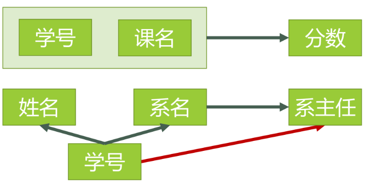
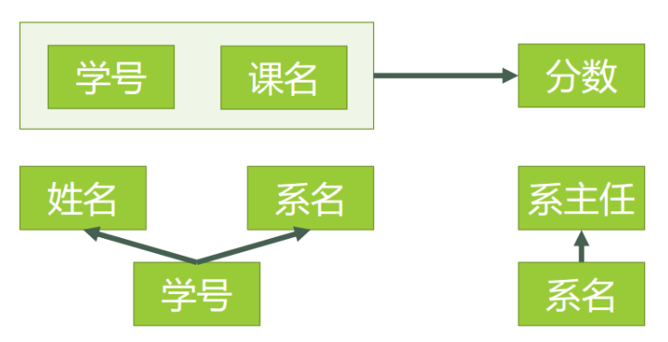

- ### 基本操作

  1. 如何登录，退出数据库

     ```sql
     mysql -uroot -p123
     quit;
     ```

  2. 创建数据库，删除数据库，

     创建数据表及表中各字段及字段类型，删除数据表

     ```sql
     create database test;
     drop database test;
     
     create table person(name varchar(10),gender char(1),birth date); 
     drop table person;
     ```

  3. 显示所有的数据库服务器上所有的数据库及每个数据库下所有的数据表

     ```sql
     show databases;
     
     show tables;
     ```

  4. 选中某个数据库

     显示数据表的结构

     ```sql
     use test;
     
     describe(可以简写为desc) person;
     ```

  5. 添加和删除字段名

     ```sql
     添加字段
     alter table 表名 add 字段名 字段类型;
     删除一个字段
     alter table 表名 drop column 字段名;  //加一个字段名即增加了一列
     ```

  6. 增删改查

     ```SQL
     insert into person values('bob','f','1996-08-17');
     
     delete from person where name='bob';
     
     update person set name='tom' where owner='hoh';//用其他列的列名，如果不用where的话就把着一列的值子段值全部改成tom了
     
     select * from person;  //*是看全部，select name from person;可以只看某一列或者某几列
     ```

- ### 常用数据类型

  MySQL支持多种类型，大致可以分为三类：https://www.runoob.com/mysql/mysql-data-types.html

  1. 数值
  2. 日期/时间
  3. 字符串(字符)类型。
     - variable是变长字符串，和char的区别在于会根据实际传入的字符串的长度调整实际占用的大小，例如char(10),variable(10)，当插入'abc'时，char(10)仍然占用10个字节，但是variable(n)只占用3个字节
     - variable(n)中的n表示的**最多存储**的字符的个数，而不是字节数，一个汉字也是一个字符，可有存进去，但是再utf-8下一个汉字占3个字节，GBK占两个
     - 此外，varchar需要使用1或者2个额外字节记录字符串的长度：如果列的最大长度小于或等于255字节，则只使用1个字节表示，否则使用2个字节

- ### 建表约束条件

  这样不满足约束条件的数据插入时就会失败。可以建表时使用，也可以修改表的时候添加

  建表之后添加和删除

  ```sql
  alter table user add primary key(id);   //注意添加的时候要保证原表中没有主键才可以添加，因此如果要添加联合主键的话必须一次性全部添加，不能依次
  alter table user drop primary key;  //全部删除
  ```

  1. **主键约束**（一张表只能有一个主键，但是这个主键可以有多个字段值即联合主键，这也就是联合主键要一起add的原因）**同时会创建主键索引**

     - 唯一主键

       能够唯一确定一张表中的一条记录，通过给某个字段添加约束，就可以使得该字段不重复且不为空

       ```sql
       create table person(id int primaty key，name varchar(10)); 
       ```

       这样之后往里面添加了一个id为1的数据，那么再次添加id为1就会报错，而且添加id为NULL也会报错。这样每个id都唯一对应一条数据记录。

     - 联合主键，可以同时给几个字段添加

       ```sql
       create table person(id int, name varchar(10),primary key(id,name)); 
       ```

       **不要求两个都不一样，至少有一个不一样即可**

     - 自增约束

       和主键约束联合使用，可以自增主键字段的值

       ```sql
       create table person(id int primary key auto_increment, name varchar(10)); 
       ```

       这样insert的时候可以选择不传入id字段的值，它会帮我们自增的设置，第一个默认设置为1，后面的会把id设置为它前一个记录的id值+1

       ```sql
       insert into person (name) values('Bol');
       ```

       这样插入第一个数据的话id就会自动设置为1，手动插入的话可以选择不连续的，但是不能和前面的重复

  2. **唯一约束**（多少个都行）,**同时会创建唯一索引**

     > 表中有字段存在唯一约束时，还是可以给其他字段添加唯一约束，但是主键的话添加的时候表中必须没有主键约束。而且唯一约束约束的字段的值可以为空，当字段值是空值它和其他记录都不重复，即NULL和NULL不重复

     约束修饰的字段的值不能重复，可以同时添加多个，**多个话也是多个键在一起不重复就行**。**<u>但是如果一个一个添加唯一约束的话就是每一个都唯一</u>**

     ```c++
     create table person(id int unique,name varchar(10)); 
     ```

     删除的时候用

     ```sql
     alter table person drop index id;
     ```

  3. **非空约束**

     修饰的字段不能为空

     ```sql
     create table user(id int not null);
     ```

  4. **默认约束**

     插入字段值时，如果没有传值，就使用默认值

     ```sql
     create table user(id int default 10);
     insert into user values();
     ```

  5. **外键约束**

     设计到两个表：一个主表，一个是副表**（会自动为外键字段创建普通索引）**

       主表：

     ```sql
     create table classes(
         id int primary key;
         name varchar(20);
         );
     insert into classes values(1,'一班');
     insert into classes values(2,'二班');
     insert into classes values(3,'三班');
     ```

     副表

     ```sql
     create table student(
         id int primary key;
         name varchar(20);
         class_id int;   //会自动为class_id创建名为class_id的普通索引
         foreign key(class_id) references classes(id)
         );
     ```

     **即把class_id关联到classes的id字段，这样class_id插入时的值只能为classes的id字段值的其中一个**

     注意：

     1. 主表中被关联的键必须是主键
     2. 要删除外键
        - 使用`show create table student`显示表的信息
        - `alter table student drop constraint` 约束名；
     3. 不删除外键主表无法删除
     4. 同时主表中被引用的行不能删除。例如id=4被副表引用了，那么delete from classes where id=4无法删除，出错

- ### 数据库三大设计范式

  1. **第一范式  1NF**

     表中所有字段都是不可分割的原子值，即一个字段只存储一项信息。**关系型数据库必须满足第一范式**

     例如

     

     

     第一个表中的address可以继续拆分成其他的字段值，因此不满足第一范式。第二个的每一个字段值都不能被拆分，满足第一范式。

  2. **第二范式 2NF**

     首先必须满足第一范式，其次除主键外的每一列都必须完全依赖于主键。即不能依赖于部分主键。

     如果主键是联合主键，那么如果只依赖于主键中一个字段而不依赖于另外的，就是依赖部分主键，这时就要把部份依赖的字段和主键中的那部分拿出来单独成表

     

     这种情况下姓名、系名和系主任都是部份依赖与主键{学号，课名}，不满足第二范式，进行拆分

     

  3. **第三范式**

     先满足第二范式，其次除去主键列的其他列不能有传递依赖关系

     

- ### 查询练习

  1. 查询student表所有记录

     ```sql
     select * from student;
     ```

  2. 查询student所有记录sname，ssex和class的列

     ```sql
     select sname,ssex,class from student;
     '可以用sname as s_n'给显示出来的取个别名
     ```

  3. 查询教师的所有单位即不重复的section列

     ```sql
     select dintinct section from teacher;
     ```

  4. 查询score表中成绩在60-80之间的。

     and也可以用于不同字段

     ```sql
     select * from score where degree between 60 and 80;
     select * from score where degree > 60 and degree < 80;
     select * from score where degree limit 60,80;
     ```

  5. 查询score表中成绩为85、86或88的记录。用in关键字

     ```sql
     select * from score where degree in(85,86,88);
     ```

  6. 查询score中“95031”班或性别为“女”的同学记录

     前面的5是同一个字段下，这个是不同的字段下

     ```sql
     select * from student where class='95031' or ssex='女';
     ```

  7. 以class降序查询student表的所有记录。只使用order的话默认是升序

     desc是降序，asc是升序

     ```sql
     select * from student order by class desc;
     ```

  8. 以cnumber升序、degree降序查询score表的所有记录

     即先满足cnumber升序，需要相同的cnumber再降序排列

     ```sql
     select * from student order by cnumber,degree desc;
     ```

  9. 查询95032班的学生人数。括号里也可以用class

     ```sql
     select count(*) from student where class='95032';
     ```

  10. 查询score表中的最高分的学生号和课程号

      ```sql
      select snumber,cnumber from score where degree=(select max(degree) from score);
      ```

  11. 查询每门课的平均成绩

      ```sql
      select avg(degree) from score where cnumber='3-105';
      ```

      这样得一个一个的查，我们可以用group分组查

      ```sql
      select cnumber,avg(degree) from score group by cnumber;
      ```

  12. 查询score表中至少有两名学生选修的并以3开头的课程的平均分数

      having count表示有多少个，括号里也可以用*，后面的like表示模糊查询，%是通配符

      ```sql
      select cnumber,avg(degree) from score group by cnumber having count(cnumber)>=2 and cnumber like '3%';
      ```

  13. 查询分数大于70，小于90的snumber列

      ```sql
      select snumber,degree from score where degree>70 and degree<90;
      ```

  14. 查询所有学生的sname，cnumber和degree列。注意这些来自不同的表。多表查询

      ```sql
      select sname,cnumber,degree from score,student where score.snumber=student.snumber;
      ```

  15. 三表关联查询

      查询所有学生的sname，cname，degree列.。利用外键的关联

      ```sql
      select sname,cname,degree from student,course,score where student.snumber=score.snumber and course.cnumber=score.cnumber;
      ```

  16. 查询95031班学生每门课的平均分

      ```sql
      select snumber from student where class='95031';
      
      select cnumber,avg(degree) from score where snumber in(select snumber from student where class='95031') group by cnumber;
      ```

  17. 查询选修3-105课程的成绩高于109号同学3-105成绩的所有同学的记录

      ```sql
      select degree from score where cnumber='3-105' and snumber='109';
      
      select snumber from score where cnumber='3-105' and degree>(select degree from score where cnumber='3-105' and snumber='109');
      ```

  18. 查询成绩高于学号为109、课程号为3-105的成绩的所有记录

      ```sql
      select degree from score where cnumber='3-105' and snumber='109';
      ```

  19. 查询和学号为108、101的同学同年出生的所有学生的snumber、sname和sbirth列

      ```sql
      select year(sbirth) from student where snumber in(108,109);
      
      select snumber,sname,sbirth from student where year(sbirth) in(select year(sbirth) from student where snumber in(108,109));
      ```

  20. 查看“张旭”老师任课的学生成绩

      ```sql
      select tnumber from teacher where tname="张旭";
      
      select cnumber from course where tnumber=(select tnumber from teacher where tname="张旭");
       
      select snumber,cnumber,degree from score where cnumber=(select cnumber from course where tnumber=(select tnumber from teacher where tname="张旭"));
      ```

  21. 查询选修某课程的同学人数多余5人的教师姓名

      ```sql
      select cnumber from score group by cnumber having count(*)>5;
      select tnumber from course where cnumber in(select cnumber from score group by cnumber having count(*)>5);
      select tname from teacher where tnumber in(select tnumber from course where cnumber in(select cnumber from score group by cnumber having count(*)>5)); 
      ```

  22. union

      可以把两条字段个数相同的查询结果并成一条，合并后的字段名字以union前面的为主

  23. any

      a>any(b) ，表示a大于b中**至少一个**

      all表示大于其中所有的

  24. 模糊查询

      取反not like

  25. year和now函数

      year()函数求年份，now()表示当前时间

      year(now())即可以得出当前年份

- #### sql的四种连接查询

  1. 内连接。其实就是两张表中的数据，通过某个字段相等，查询出相关记录数据。inner join或者join。

     ```sql
     select * from person join card on person.cardId=card.id
     ```

  2. 外连接，有左外连接和右外连接。

     ```sql
     left join或者left outer join
     ```

     内连接是只会把字段相等的展示出来，如果一边有一边没有那就不要了。左外连接就是把左边的全部加入，右边的有就加入，没有就置为空。

     ---

     

     0就是内连接，12分别是左连接和右连接，而3本应是全连接，但是mysql没有全连接，要实现的话用左边一个查询union右边一个拆查询来实现

- ## mysql事务

  事务是数据库管理系统执行过程中的一个**逻辑单位，由一个有限的数据库操作序列构成。**意思就是一连串的数据库操作，即一串增删查改的集合

  **事务是一个最小的不可分割的工作单元，事务能保证一个业务的完整型。**

  例如银行转账，a给b转100

  ```sql
  update user set money=money-100 where name='a';
  update user set money=money+100 where name='b'; 
  ```

  这两条语句执行必须同步，要么都成功，要么都失败

  1. mysql默认是开启事务的(自动提交)

     ```
     select @@autocommit;
     ```

     开启之后sql语句的操作就无法回滚，因为已经自动commit了，使用rollback，虽然可以执行，但是回滚没有效果

     使用`set autocommit=0;`就可以关闭自动提交，这样运行完sql语句的话如果不commit；就可以用rollback回滚撤销当前暂存区所有的更改。确定提交的时候再commit。

     **类似于git的add和commit**

  2. 除了更改默认设置，也可以手动设置提交

     ```sql
     begin; //或者start transaction;
     insert .....
     ......
     rollback;
     ```

     这样rollback就会把begin之后的更改都撤销

- ### 事务的四大特征

  1. A 原子性：一个事务中的操作，要么全部完成，要么全部不完成，if发生错误，就回滚到事务开始前的状态
  2. C 一致性。**<u>事务使得</u>**系统从一个正确的状态,迁移到另一个正确的状态.从事务开始之后和事务结束以后，数据库的完整性没有被破坏。这表示写入的资料必须完全符合所有的预设约束、触发器、级联回滚等。**AID是手段，而C是目的，正式因为事务有AID的特征，才保证了事务有C的特征**
  3. I 隔离性。数据库允许多个并发事务同时对其数据进行读写和修改的能力，隔离性可以防止多个事务并发执行时由于交叉执行而导致数据的不一致。事务隔离分为不同级别，包括读未提交（Read uncommitted）、读提交（read committed）、可重复读（repeatable read）和串行化（Serializable）
  4. D 持久性。事务一旦结束（即commit之后，就不能再rollback），就不可以返回

  #### 事务的隔离性

  

  查看数据库的隔离级别

  ```sql
  select @@global.transaction_isolation
  ```

  修改隔离级别

  ```sql
  set global transaction isolation level read uncommitted;
  ```

  1. read uncommitted

     所有的事务都可以看到其他未提交事务的执行结果。

     在这种隔离级别下会出现**脏读**，即**一个事务读取到了其它事务尚未提交的数据，如果b回退，那么a读取的就是无效的数据。**实际开发一定不允许脏读出现。

     例如，a修改了money50->100，这时b读取到money为100,那么它以为有100块所以点了100块的菜，但是这时a回滚了，money100->50,这时b结账时就会发现只有50块，这种情况下b读取的就是脏数据

  2. read committed

     所有事务只能读取其他事务已经提交的内容。大部分数据库默认的隔离级别

     例如，a要算money(50,70)的平均值，准备开始算的时候有事出去了，这时b更改money为(50,100)，然后commit，这时a回来了，avg(money)却得到了75，而预先的结果是却是60。**造成了读取同一个表的数据，却发现前后不一致**，即**不可重复读**现象

  3. repeatable read（这时mysql默认的隔离级别）

     解决了上面不可重复读的现象，对同一笔数据的读取结果是相同的，不管其他事务是否在对共享数据进行更新。（但是如果这边也commit的话两边就一样了）

     但是存在了幻读的问题**（插入和修改时才会出现）**。原先有id=1，2，3共3条数据，同时打开a和b，在a中插入id4，然今提交，这时在b中select只能看到3条，这儿就解决了上一个不可重复读的现象，**但是在b中insert id4时**会显示主键冲突，即b中select明明看不到id 4，但是insert 4缺会出现错误，仿佛出现了幻觉。

     还有一种情况就是，原数据是（id，money）=（1，1000），（2，2000），（3，3000），a和b同时开启，b中插入（4，4000），然后commit，这时a中select看不到id=4，**但是如果a中修改数据**，例如update user set money=9999 where money>=3000，然后再select，这时就会看到（1，1000），（2，2000），（3，9999）,(4，9999），即凭空出来一个id4，仿佛出现了幻觉。

  4. serializable（最高的隔离级别，但性能很低）
  
     一个事务在执行的时候，其他的事务只能读，不能写，类似于线程中的互斥锁。直到当前执行的事务commit，后面的事务才可以执行。

## 乐观锁和悲观锁

https://www.cnblogs.com/suger43894/p/11024102.html