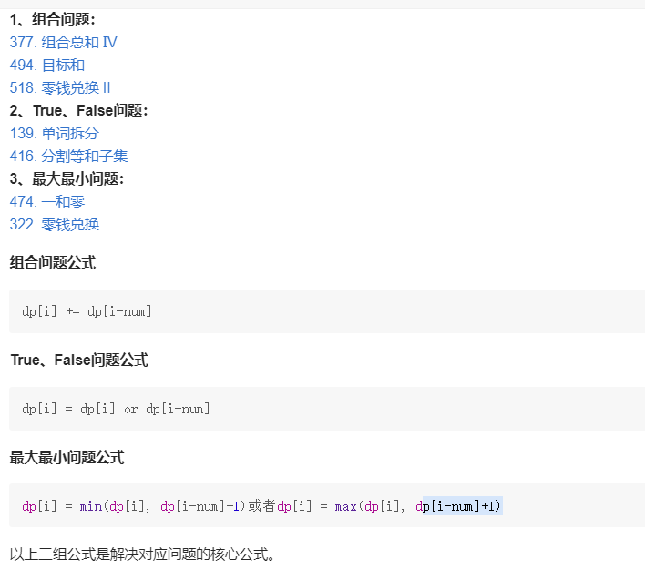

1. **01和完全背包的区别就在于状态转移方程中完全是i而01是i-1**
2. **二维的时候N和W里层外层没有区别，但是如果是1维的话即近把W作为状态变量，那么N外W内 的话求得是组合数，而N内W外求的是排列数**
3. **一维得话如果求得是组合或者排列的数目，那么vector初值就是0，dp[0]初始化为为1即可，即无为而治，凑金额为0就一种方法，即一个硬币都不用；如果求的是使用硬币得最小得个数，那么vector得初值就是target+1，dp[0]初始化为0，即一个硬币都不用，就算全部用1最多也就target个，这儿用target+1其实就等价于正无穷，最后return得时候看下是不是==target+1，如果等于，既没有找到硬币可以凑成，返回对应的解决方案，如果不是target说明min中找到了更小的，那就返回dp[target]即可**
4. **二维得话初始化`dp[i][0]`为1**
5. **求最大最小的时候内外循环是可以交换的，其他的都不能交换**

---

给一个可以装载重量为W的背包和N个物品，每个物品有重量和价值两个属性，现在用这个背包装东西 ，最多能装的价值是多少

```c++
例如W=4，有三个物品
wt={2,1,4}
val={4,2,3}
```

结果是6，选择前2件物品装，总重量为3，<4，活得了最大价值6

- 首先定义状态：

  ```c++
  dp[i][w]，对于前i件物品，当背包容量限制为w时，可以获得的最大价值。
  例如dp[3][4]=6,表示W不超过4的情况下，只从前3个物品中选择，获得的最大价值为6
  ```

- 状态转移

  ```c++
  对于dp[i][w]，可以根据是否装了第i件物品分为两种状态
  1.没有装。那么dp[i][w]=dp[i-1][w]
  2.装了第i件物品，那么dp[i][w]=dp[i-1][w-wt[i-1]]+val[i-1]
  ```

  用i-1是因为我们描述的i为第i个，是从1开始的，那么对应到数组中对应的索引就是i-1

- 代码实现

  N和W在内层外层循环结果都一样，因为最后得出的是依次组合问题。
  
  ```c++
  int knapsack(int W,int N,vector<int>& wt,vector<int>& val)
  {
      vector<vector<int>> dp(N+1,vector<int>(W+1)); //初始化为0，我们定义的i是第i个，所有最后要能选择到dp[N][W],即要有N+1 * W+1大的二维数组
      
      for(int i=1;i<=N;i++)   //从选择第一个物品开始遍历
      {
          for(int w=1;w<=W;w++)
          {
              if(w-wt[i-1]<0)  //即当前的背包容量装不下第i个物品，那么只能选择不装
                  dp[i][w]=dp[i-1][w];
              else
              {
                  dp[i][w]=max(dp[i-1][w],
                               dp[i-1][w-wt[i-1]]+val[i-1]);
              }
          }
      }
      return dp[N][W];
}
  ```
  
- 完全背包和01的区别就在于每个物品可以重复的选取

  01的状态转移方程为

  ```c++
  dp[i][w]=max(dp[i-1][w],dp[i-1][w-wt[i-1]]+val[i-1]);
  ```

  那么完全的状态转移方程就是

  ```c++
  dp[i][w]=max(dp[i-1][w],dp[i-1][w-K*wt[i-1]]+K*val[i-1]);
  ```

  https://blog.csdn.net/sunqi568/article/details/81320364

  经过推导，上面的方程等价于

  ```c++
  dp[i][w]=max(dp[i-1][w],dp[i][w-wt[i-1]]+val[i-1]);
  ```

  就差了一个后面的dp的x坐标，01的是i-1，完全的是i

  ## 状态压缩

  可以压缩成1维的

  ```c++
  for(int j=0;j<N;j++)
  {
      for(int i=W;i>=0;i--)  //一般情况下写>=0就是对的，为了简单可以把下面的if条件放到for里
      {
          if(i-wt[j]>=0)
              dp[i]=max(d[i],dp[i-wt[j]]+val[j]);
      }
  }
  //变成
  for(int i=W;i>=wt[j];i--)
  ```

  **完全背包的话内层循环从[1,W]即可，01背包的话就[W,0]**

  

  ## 究极模板

  #### 首先确定状态转移方程

  

  #### 然后确定内外循环的安排和循环的开始顺序

  

- ### 组合问题

  - #### **377.组合总数**

    明显的完全背包问题，注意结果要算的是排列数，所以N要放在内循环，初始vector都置为0，dp[0]置为1，然后dp[i]+=dp(i-nums[j])

  - #### **494.目标和**

    只有正负号两种情况，类似于01背包，但是并不是选和不选，而是正数和负数，要尝试往01背包的方向转换，转成选和不选，即要么正数，要么0，这儿用了个数学推导

    

    

    这样问题就转换成从nums中找n个正数，他们的和等于等号右边的表达式即可

    dp[i]就表示从nums中找n个正数，相加结果等于i的情况有多少个

    ```c++
    class Solution {
    public:
        int findTargetSumWays(vector<int>& nums, long S) 
        {
            long sum=0;
            for(auto i:nums)
                sum+=i;
            if ((S + sum) % 2 == 1 || S > sum) return 0;
            S=(S+sum)/2;
            vector<long> dp(S+1);
            dp[0]=1;
    
            for(int i=0;i<nums.size();i++)
            {
                for(long j=S;j>=0;j--)   //一定要到0，到1不行，但是正序的时候从1开始
                {
                    if(j-nums[i]>=0)
                        dp[j]+=dp[j-nums[i]];                            
                }
            }
            return dp[S];
        }
    };
    ```
    
    **主要内循环要倒序**

- ### **true和false问题**

  - #### **139.单词拆分**

    **完全背包问题**，用dict中的单词来凑目标字符串s，套模板，

    **由于和次序有关系，所以类似于求排列数**，要把target放在外循环，nums放在内循环

    ```c++
    class Solution {
    public:
        bool wordBreak(string s, vector<string>& wordDict) 
        {
            vector<bool> dp(s.size()+1); //dp[i]表示s的前i个字符能不能被wordDict里的字符串构成
            unordered_set<string> m; 
            for(auto i:wordDict)
                m.insert(i);
            dp[0]=1;
    
            for(int i=1;i<=s.size();i++)
            {
                for(int j=0;j<i;j++)
                {
                    if(dp[j] && m.count(s.substr(j,i-j))) //前j个可以，同时后面的i-j个也可以，那么前i就可以
                    {
                        dp[i]=true;
                        break;
                    }
                        
                }
            }
            return dp[s.size()];
        }
    };
    ```

  - #### **416.分割等和子集**

    01背包，内循环逆序
    
    ```c++
    class Solution {
    public:
        bool canPartition(vector<int>& nums) 
        {
            int sum=accumulate(nums.begin(),nums.end(),0);
            if(sum%2==1)
                return false;
            vector<unsigned long long> dp(sum/2+1);
            dp[0]=1;
    
            for(int j=0;j<nums.size();j++)
            {
                for(int i=sum/2;i-nums[j]>=0;i--)
                {
                    dp[i]=dp[i] || dp[i-nums[j]]; //dp[i]即为能不能凑成和为i
                }
            }
            return dp[sum/2];
        }
    };
    ```

- ### **最大最小问题**

  - #### **474.1和0**
  
    用或者不用，确定为01背包，然后N外循环，W内循环且逆序
  
    ```c++
    class Solution {
    public:
        int findMaxForm(vector<string>& strs, int m, int n) 
        {
            vector<vector<int>> dp(m+1,vector<int>(n+1));
    
            for(auto p:strs)
            {
                int one=0;
                int zero=0;
                for(auto q:p)
                {
                    if(q=='0')
                        zero++;
                    else
                        one++;
                }
                for(int i=m;i>=zero;i--) 
                {
                    for(int j=n;j>=one;j--)
                        dp[i][j]=max(dp[i][j],dp[i-zero][j-one]+1); //dp[i-zero][j-one]即为i-zero个0和j-one个1可以拼出的最大字符串的数量，而现在i和j比他们多了zero个0和one个1，那么就可以拼成当前遍历到的这个字符串，所以个数加1
    
                }
            }
            return dp[m][n];                                
        }
    };
    ```
  
  - 

