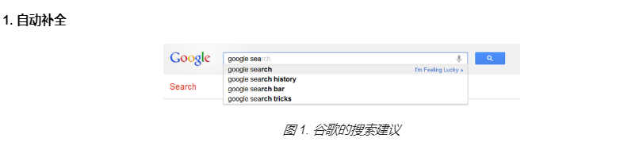
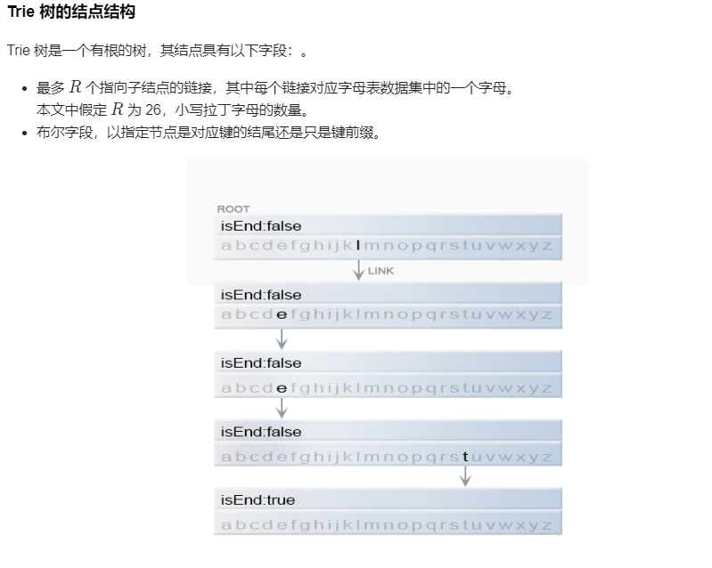
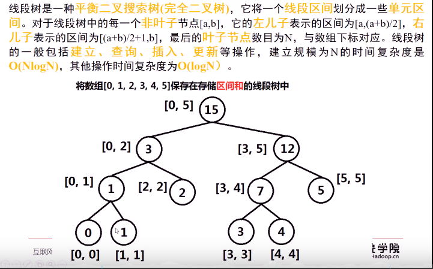
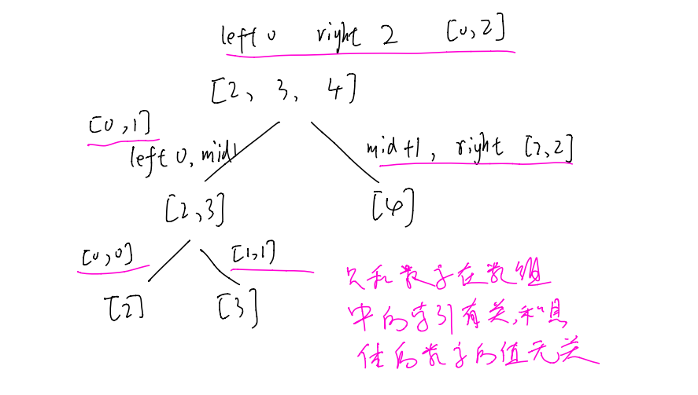

- #### 547.朋友圈（并查集）

  这个题和找岛屿那个有些类似，但是不完全相同

  - 使用深度优先搜索，定义visit数组，visit[i]就表示i同学是否有朋友圈，然后从0同学开始搜，找到满足条件的就把visit置1表示加入当前搜索的这个同学的朋友圈，然后再从满足条件的同学开始继续搜，直到搜不到为止；然后从1即下一个同学开始dfs

    ```c++
    class Solution {
    public:
        int findCircleNum(vector<vector<int>>& M) 
        {
            vector<int> visit(M.size());//visit[i]就表示i同学有没有朋友圈
            int circle=0;
    
            for(int i=0;i<M.size();i++)
            {
                if(visit[i]==0)   //没有朋友圈就开始dfs，有的话表示之前搜索时已经加入到其他人的朋友圈里了
                {
                    dfs(i,M,visit);
                    circle++;   //表示以i为开头的朋友圈
                }
            }
            return circle;
        }
        void dfs(int u,vector<vector<int>> &M,vector<int> &visit)
        {
            visit[u]=1;   //表示u已有朋友圈
            for(int i=0;i<M.size();i++)
            {
                if(visit[i]==0&&M[u][i]==1)  //i和u是朋友而且i还没加入其他朋圈，那么就把i加入到u的朋友圈，然后继续搜索i认识的朋友
                    dfs(i,M,visit);
            }
        }
    };
    ```

  - 广度优先搜索

    ```c++
    class Solution {
    public:
        int findCircleNum(vector<vector<int>>& M) 
        {
            vector<int> visit(M.size());//visit[i]就表示i同学有没有朋友圈
            int circle=0;
            queue<int> Q;
            for(int i=0;i<M.size();i++)
            {
                if(visit[i]==0)
                {
                    circle++;
                    Q.push(i);
                    while(!Q.empty())
                    {
                        int temp=Q.front();
                        Q.pop();
                        visit[temp]=1; //从一个队列里面出来的元素都是一个朋友圈的，出一个visit置一个1
                        for(int j=0;j<M.size();j++)
                        {
                            if(visit[j]==0&&M[temp][j]==1)
                            {
                                Q.push(j);
                            }
                        }
                    }
                }
            }
            return circle;
        }
    };
    ```

  - #### 并查集

    并查集是一种树型的数据结构，用于处理一些**不相交[集合](https://baike.baidu.com/item/集合/2908117)（Disjoint Sets）的合并及查询问题**。常常在使用中以森林来表示。

    > 用于统计图中连通块即连通分量的数目
    >
    > [无向图](https://baike.baidu.com/item/无向图)G的极大连通子图称为G的**连通分量**( Connected Component)。任何[连通图](https://baike.baidu.com/item/连通图)的连通分量只有一个，即是其自身，非连通的[无向图](https://baike.baidu.com/item/无向图)有多个连通分量

    

    

    **并查集完整的代码实现即简单测试**（进行了路径压缩和树平衡的优化，下面的574代码是简化的实现）

    ```c++
    #include <bits/stdc++.h>
    using namespace std;
    class UF
    {
    public:
        vector<int> father; //初始保存自己，然后随着union操作，不断跟新为自己的父节点，执行findRoot操作之后改节点的father就更新为自己的root，如果每个都执行find操作，那么最终所有节点的father中存储的都是自己的root
        vector<int> size; //保存该节点的子树的节点个数
        int count;  //记录图的连通分量，也就是并查集中集合的个数
    
        UF(vector<int>& a)
        {
            for(int i=0;i<a.size();i++)
                father.push_back(i);
            size.assign(a.size(),1); //初始就一个节点，个数就是1
            count=a.size();
        }
        int findRoot(int x)   //寻找根节点
        {
            while(father[x]!=x)
            {
                father[x]=father[father[x]]; //这一步不加也对，加了这一步相当于每次跳一个节点，压缩路径,因为最后在root处就会环，所以不用担心越界。同时还把x的father不断向root更新
                x=father[x];
            }  //用这个也可以return x==father[x] ? x : father[x]=findRoot(father[x]);每次都会把路径上所有的元素的father都更新成自己的root，下次再找就不用再每次一个一个的找了
            return x;
        }
        void Union(int x,int y)   //合并两个集合
        {
            int rootX=findRoot(x);
            int rootY=findRoot(y);
            if(rootX==rootY)
                return;
            if(size[rootX]>size[rootY])
            {
                father[rootY]=rootX;
                size[rootX]+=size[rootY];
    
            }
            else
            {
                father[rootX]=rootY;
                size[rootY]+=size[rootX];
            }
            count--;
        }
        bool isConnected(int x,int y)
        {
            int rootX=findRoot(x);
            int rootY=findRoot(y);
            return rootX==rootY;
        }
    };
    
    int main()
    {
        vector<int> a{0,1,2,3,4};  //因为father访问时用的是索引，所以初始数组的第一个元素必须从0，要和索引对应，不然顺序会出错，而且union的时候传入的实参也是数组索引
        UF t(a);
        t.Union(4,3);
        t.Union(1,2);
        t.Union(1,4);
    }
    ```
    

  进阶版本，使用unordered_map来作为uf和size数组，这样就不用每次操作索引，可以直接操作元素了

  ```c++
    class UF
    {	
    public:
        unordered_map<int,int> uf;
        unordered_map<int,int> size;
        int count;
    
        UF(vector<int>& a)
        {
            for(int i:a)
            {
                uf[i]=i;
                size[i]=1;
            }
            count=a.size();
        }
    
        int find(int x)
        {
            return x==uf[x] ? x : uf[x]=find(uf[x]);
        }
    
        void _union(int x,int y)
        {
            int d=find(x);
            int f=find(y);
            if(d==f)
                return;
            if(size[d]>size[f])
            {
                uf[f]=d;
                size[d]+=size[f];
            }
            else
            {
                uf[d]=f;
                size[f]+=size[d];
            }
            count--;
        }
    };
    int main()
    {
        vector<int> a{1,2,3,4,5,6,7};
        UF t(a);
    }
  ```

  **547的实现**

  ```c++
    class UF
    {
        public:
        unordered_map<int,int> father;
        int count;
        UF(vector<int>& a)
        {
            for(auto i:a)
                father[i]=i;
            count=a.size();        
        }
        int findRoot(int x)
        {
            return x==father[x] ? x : father[x]=findRoot(father[x]);
            //father[x]=findRoot(father[x])时，等价于先执行这个语句，然后返回赋值运算符“=”右边的值
        }
        void Union(int x,int y)
        {
            int a=findRoot(x);
            int b=findRoot(y);
            if(a==b)
                return;
            father[a]=b;
            count--;
        }
    };
    class Solution {
    public:
        int findCircleNum(vector<vector<int>>& M) 
        {
            vector<int> a;
            for(int i=0;i<M.size();i++)
                a.push_back(i);
            UF res=UF(a);
            for(int i=0;i<M.size();i++)
            {
                for(int j=0;j<M[0].size();j++)
                {
                    if(M[i][j]==1)
                        res.Union(i,j);
                }
            }
            return res.count;        
        }
    };
  ```

- #### Trie Tree（字典树）

  

  是一种高效的数据结构，用于检索字符串数据集中的键（即搜索字符串）。有多种用途

  

  

  还有其他的数据结构，如平衡树和哈希表，使我们能够在字符串数据集中搜索单词。为什么我们还需要 Trie 树呢？尽管哈希表可以在 O(1)时间内寻找键值，却无法高效的完成以下操作：

  - 找到具有同一前缀的全部键值。
  - 按词典序枚举字符串的数据集

  Trie 树优于哈希表的另一个理由是，随着哈希表大小增加，会出现大量的冲突，时间复杂度可能增加到 O(n)，其中 n 是插入的键的数量。与哈希表相比，Trie 树在存储多个具有相同前缀的键时可以使用较少的空间。此时 Trie 树只需要 O(m)的时间复杂度，其中 m 为键长。而在平衡树中查找键值需要 O(mlogn) 时间复杂度。

  **注意每个节点并没有保存具体的字符的值，而是保存一个字符数组，形成一个字母映射表。初始化节点时char数组里面元素全为空，当有下一个节点时，就用对应char数组中对应位置的指针指向下一个节点，即可知道下一节点的字符值。eg下图，root的char数组的I位置指针指向下一个节点，证明下一个节点的char值即为I**

  

  代码实现

  ```c++
  class Trie {
  public:
      private:
      bool isEnd;
      Trie* next[26];
  
      public:
      Trie() 
      {
          isEnd=false;
          memset(next,0,sizeof(next));  //指针全部初始化，不然就是野指针
      }
      
     
      void insert(string word) 
      {
          Trie* root=this;
          for(char c:word)
          {
              if(root->next[c-'a']==nullptr) 
                  root->next[c-'a']=new Trie();   //节点本身并不保存信息，而是根据指针数组的索引来判断表示的字符
              root=root->next[c-'a'];
          }
          root->isEnd=true;
      }
      
      bool search(string word) 
      {
          Trie* root=this;
          for(char c:word)
          {
              if(root->next[c-'a']==nullptr)
                  return false;
              root=root->next[c-'a'];
          }
          return root->isEnd;
      }
      
      
      bool startsWith(string prefix) 
      {
          Trie* root=this;
          for(char c:prefix)
          {
              if(root->next[c-'a']==nullptr)
                  return false;
              root=root->next[c-'a'];
          }
          return true;
      }
  };
  
  /**
   * Your Trie object will be instantiated and called as such:
   * Trie* obj = new Trie();
   * obj->insert(word);
   * bool param_2 = obj->search(word);
   * bool param_3 = obj->startsWith(prefix);
   */
  ```


## 线段树




**构造线段树**

**实际使用要开4N的数组，防止越界，N是叶子节点的个数，即原数组元素的个数**

其实并没有存左端点右端点，都是从开始传入的两个参数算出来的

```c++
//pos即value中的下标，从0开始，到14
//left和right为nums的下标，从0到N-1
void build_segment_tree(vector<int>& value,vector<int>& nums,int pos,int left,int right)
{
    if(left==right)
    {
        value[pos]=nums[left];
        return;
    }
    int mid=(left+right)/2;
    build_segment_tree(value,nums,pos*2+1,left,mid);
    build_segment_tree(value,nums,pos*2+2,mid+1,right);
    value[pos]=value[pos*2+1]+value[pos*2+2];
}
```

**线段树求和**

```c++
//qleft为目标左端点，left为当前左端点，pos为当前位置
int sum_range_segment_tree(vector<int>& value,int pos,int left,int right,int qleft,int qright)
{
    if(right<qleft || left>qright) //区间不相交
        return 0;
    if(left>=qleft && right<=qright) //区间覆盖
        return value[pos];
    int mid=(left+right)/2;
    return sum_range_segment_tree(value,pos*2+1,left,mid,qleft,qright)+sum_range_segment_tree(value,pos*2+2,mid+1,right,qleft,qright);
}
```

**线段树更新（更新更新的是原数组nums对应索引的元素，即线段树中的叶子节点）**

index是原数组的下标，例如原数组为{0,1,2},现在要把2更新为10，那么index=2，new_value=10

### 这儿的索引是数组的索引，只于在数组中的相对位置有关，和具体的值是多少没关系



```c++
void update_segment_tree(vector<int>& value,int pos,int left,int right,int index,int new_value)
{
    if(left==right && left==index)
    {
        value[pos]=new_value;
        return;
    }
    int mid=(left+right)/2;
    if(index<=mid)
        update_segment_tree(value,pos*2+1,left,mid,index,new_value);
    else
        update_segment_tree(value,pos*2+2,mid+1,right,index,new_value);
    value[pos]=value[pos*2+1]+value[pos*2+2];
}
```


#### 307.区域和检索

```c++
class NumArray {
public:

    vector<int> value;   //存储线段树数组
    int right_end;
    
    NumArray(vector<int>& nums) 
    {
        if(nums.size()==0)   //数组为空需要特判
            return;        
        value.assign(4*nums.size(),0);  //初始化value数组，为了防止数组越界，线段树数组一般开辟4N大小，N为原数组大小
        right_end=nums.size()-1;
        build(value,nums,0,0,right_end);  
    }
    
    void update(int i, int val) 
    {
        _update(value,0,0,right_end,i,val);
    }
    
    int sumRange(int i, int j) 
    {
        return _sumRange(value,0,0,right_end,i,j);
    }

    void build(vector<int>& value,vector<int>& nums,int pos,int left,int right)   //后序遍历递归建树
    {
        if(left==right)   //证明到达叶子节点，value中索引pos的值即为原数组中索引left或right对应的值
        {
            value[pos]=nums[left];
            return;
        }
        int mid=(left+right)/2;
        build(value,nums,pos*2+1,left,mid);  //左子树
        build(value,nums,pos*2+2,mid+1,right);  //右子树
        value[pos]=value[pos*2+1]+value[pos*2+2];  //value[pos]即为左右孩子结点的和
    }
    int _sumRange(vector<int>& value,int pos,int left,int right,int qleft,int qright)
    {
        if(right<qleft || left>qright)   //搜寻区间和待查找区间无交集，返回0
            return 0;
        if(left>=qleft && right<=qright)   //搜寻区间在被待查找区间覆盖，那么全部返回
            return value[pos];
        int mid=(left+right)/2;
        return _sumRange(value,pos*2+1,left,mid,qleft,qright)+_sumRange(value,pos*2+2,mid+1,right,qleft,qright); //待查找区间只覆盖了搜寻区间的一部分，那么就递归左右子树
    }
    void _update(vector<int>& value,int pos,int left,int right,int index,int new_value) //后序遍历更新结点
    {
        if(left==right && left==index)  //到达叶子节点同时索引相同，证明找到对应的结点，更新
        {
            value[pos]=new_value;
            return;
        }
        int mid=(left+right)/2;
        if(index<=mid)      //待更新索引在当前结点的左子树
            _update(value,pos*2+1,left,mid,index,new_value);
        else                 //待更新索引在当前结点的左子树
            _update(value,pos*2+2,mid+1,right,index,new_value);
        value[pos]=value[pos*2+1]+value[pos*2+2];  //左右子树更新完之后，根据孩子结点的值更新根结点的值
    }
};
```

