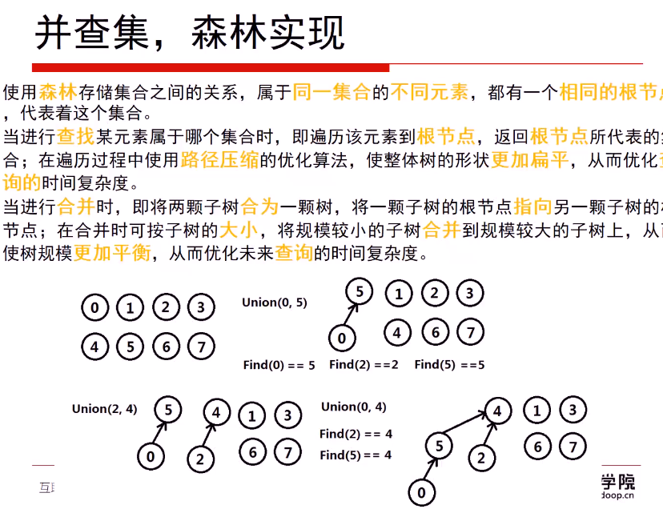
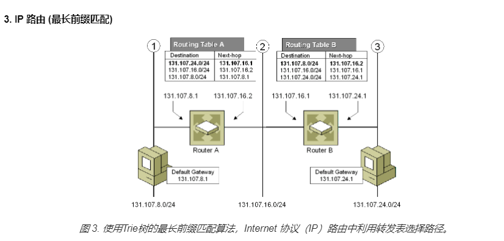

- #### 547.朋友圈（并查集）

  这个题和找岛屿那个有些类似，但是不完全相同

  - 使用深度优先搜索，定义visit数组，visit[i]就表示i同学是否有朋友圈，然后从0开始搜，找到满足条件的就把visit置一表示加入朋友圈，然后再从满足条件的同学开始继续搜，直到中不到为止；然后从1开始dfs

    ```c++
    class Solution {
    public:
        int findCircleNum(vector<vector<int>>& M) 
        {
            vector<int> visit(M.size(),0);//visit[i]就表示i同学有没有朋友圈
            int circle=0;
    
            for(int i=0;i<M.size();i++)
            {
                if(visit[i]==0)   //没有朋友圈就开始dfs，有的话表示之前搜索时已经加入到其他人的朋友圈里了
                {
                    dfs(i,M,visit);
                    circle++;   //表示以i为开头的朋友圈
                }
            }
            return circle;
        }
        void dfs(int u,vector<vector<int>> &M,vector<int> &visit)
        {
            visit[u]=1;   //表示u已有朋友圈
            for(int i=0;i<M.size();i++)
            {
                if(visit[i]==0&&M[u][i]==1)  //i和u是朋友而且i还没加入其他朋圈，那么就把i加入到u的朋友圈，然后继续搜索i认识的朋友
                    dfs(i,M,visit);
            }
        }
    };
    ```

  - 广度优先搜索

    ```c++
    class Solution {
    public:
        int findCircleNum(vector<vector<int>>& M) 
        {
            vector<int> visit(M.size(),0);//visit[i]就表示i同学有没有朋友圈
            int circle=0;
            queue<int> Q;
            for(int i=0;i<M.size();i++)
            {
                if(visit[i]==0)
                {
                    circle++;
                    Q.push(i);
                    while(!Q.empty())
                    {
                        int temp=Q.front();
                        Q.pop();
                        visit[temp]=1; //从一个队列里面出来的元素都是一个朋友圈的，出一个visit置一个1
                        for(int j=0;j<M.size();j++)
                        {
                            if(visit[j]==0&&M[temp][j]==1)
                            {
                                Q.push(j);
                            }
                        }
                    }
                }
            }
            return circle;
        }
    };
    ```

  - #### 并查集

    并查集是一种树型的数据结构，用于处理一些**不相交[集合](https://baike.baidu.com/item/集合/2908117)（Disjoint Sets）的合并及查询问题**。常常在使用中以森林来表示。

    > 用于统计图中连通块即连通分量的数目
    >
    > [无向图](https://baike.baidu.com/item/无向图)G的极大连通子图称为G的**连通分量**( Connected Component)。任何[连通图](https://baike.baidu.com/item/连通图)的连通分量只有一个，即是其自身，非连通的[无向图](https://baike.baidu.com/item/无向图)有多个连通分量

    

    

    **并查集完整的代码实现即简单测试**（进行了路径压缩和树平衡的优化，下面的574代码是简化的实现）

    ```c++
    class UF
    {
        public:
        vector<int> father;//保存的是每个节点的father，并不是root，只有root节点的father对应的是它本身，因此可以根据一个节点的father是不是它本身来判断这个节点是不是根节点
        vector<int> size; //保存该节点的子树的节点个数
        int count;  //记录图的连通分量，也就是并查集中集合的个数
    
        UF(int n)
        {
            for(int i=0;i<n;i++)
                father.push_back(i);
            size.assign(a.size(),1); //初始就一个节点，个数就是1
            count=n;
        }
        int findRoot(int x)   //寻找根节点
        {
            while(father[x]!=x)   
            {
                father[x]=father[father[x]]; //这一步不加也对，加了这一步相当于每次跳一个节点，压缩路径
                x=father[x];
            }  //用这个也可以return x==uf[x] ? x : uf[x]=find(uf[x]);每次都会把路径上所有的元素的uf都跟新，下次再找就不用再每次一个一个的找了
            return x;
        }
        void Union(int x,int y)   //合并两个集合
        {
            int rootX=findRoot(x);
            int rootY=findRoot(y);
            if(rootX==rootY)
                return;
            if(size[rootX]>size[rootY])
            {
                father[rootY]=rootX;
                size[rootX]+=size[rootY];
    
            }
            else
            {
                father[rootX]=rootY;
                size[rootY]+=size[rootX];
            }
            count--;
        }
        bool isConnected(int x,int y)
        {
            int rootX=findRoot(x);
            int rootY=findRoot(y);
            return rootX==rootY;
        }
    };
    
    int main()
    {
        vector<int> a{0,1,2,3,4,5,6};  //必须从0开始，不然顺序会出错，而且union的时候传入的实参也是数组索引
        UF t(a);
        t.Union(2,3);
        t.Union(2,4);
        for(auto i:t.father)
        {
            cout<<i;
        }
    }
    ```

    进阶版本，使用unordered_map来作为uf和size数组，这样就不用每次操作索引，可以直接操作元素了

    ```c++
    class UF
    {
    public:
        unordered_map<int,int> uf;
        unordered_map<int,int> size;
        int count;
    
        UF(vector<int>& a)
        {
            for(int i:a)
            {
                uf[i]=i;
                size[i]=1;
            }
            count=a.size();
        }
    
        int find(int x)
        {
            return x==uf[x] ? x : uf[x]=find(uf[x]);
        }
    
        void _union(int x,int y)
        {
            int d=find(x);
            int f=find(y);
            if(d==f)
                return;
            if(size[d]>size[f])
            {
                uf[f]=d;
                size[d]+=size[f];
            }
            else
            {
                uf[d]=f;
                size[f]+=size[d];
            }
            count--;
        }
    };
    int main()
    {
        vector<int> a{1,2,3,4,5,6,7};
        UF t(a);
    }
    ```

    **547的实现**

    ```c++
    class Solution {
    public:
        int father[200];   //这儿用索引就可以代表不同的同学，所以就不用map了，用数组会更快
        int count;
        int find(int x)
        {
            while(father[x]!=x)
                x=father[x];
            return x;
        }
        void Union(int x,int y)
        {
            int p=find(x);
            int q=find(y);
            if(p==q)
                return;
            father[p]=q; 
            count--;
        }
        int findCircleNum(vector<vector<int>>& M) 
        {
            for(int i=0;i<M.size();i++)
                father[i]=i;
            for(int i=0;i<M.size();i++)
            {
                for(int j=0;j<M.size();j++)
                {
                    if(M[i][j]==1)
                        Union(i,j);
                }
            }
            return count;
        }
    };
    ```

- #### Trie Tree（字典树）

  

  是一种高效的数据结构，用于检索字符串数据集中的键（即搜索字符串）。有多种用途

  

  

  还有其他的数据结构，如平衡树和哈希表，使我们能够在字符串数据集中搜索单词。为什么我们还需要 Trie 树呢？尽管哈希表可以在 O(1)O(1) 时间内寻找键值，却无法高效的完成以下操作：

  - 找到具有同一前缀的全部键值。
  - 按词典序枚举字符串的数据集

  Trie 树优于哈希表的另一个理由是，随着哈希表大小增加，会出现大量的冲突，时间复杂度可能增加到 O(n)O(n)，其中 nn 是插入的键的数量。与哈希表相比，Trie 树在存储多个具有相同前缀的键时可以使用较少的空间。此时 Trie 树只需要 O(m)O(m) 的时间复杂度，其中 mm 为键长。而在平衡树中查找键值需要 O(m \log n)O(mlogn) 时间复杂度。

  **注意每个节点并没有保存具体的字符的值，而是保存一个字符数组，形成一个字母映射表。初始化节点时char数组里面元素全为空，当有下一个节点时，就用对应char数组中对应位置的指针指向下一个节点，即可知道下一节点的字符值。eg下图，root的char数组的I位置指针指向下一个节点，证明下一个节点的char值即为I**

  

  代码实现

  ```c++
  class Trie 
  {
      private:
      bool is_end;
      Trie *next[26];
      
      public:
      //构造函数，初始化成员变量
      Trie() 
      {
          is_end=false;
          memset(next,0,sizeof(next));  //将数组所有元素赋为0，即将指针数组赋值为NULL，不然只声明不初始化的指针就是野指针 
      }
      
      //在树中插入元素，借助于this指针，this指针指向当前对象，测试的时候this指针指向的对象即为树的根节点
      void insert(string word) 
      {
          Trie *node=this;
          for(char c:word)
          {
              if(node->next[c-'a']==NULL)
                  node->next[c-'a']=new Trie();//找不到就新建节点
              node=node->next[c-'a'];
          }
          node->is_end=true;
      }
      
      //查找，一个一个按顺序移动指针
      bool search(string word) 
      {
          Trie *node=this;
          for(char c:word)
          {
              node=node->next[c-'a'];
              if(node==nullptr)
                  return false;
          }
          return node->is_end;        
      }
      
      //查找是否有prefix为前缀的
      bool startsWith(string prefix) 
      {
          Trie *node=this;
          for(char c:prefix)
          {
              node=node->next[c-'a'];
              if(node==nullptr)
                  return false;
          }
          return true;    
      }
  };
  /**
   * Your Trie object will be instantiated and called as such:
   * Trie* obj = new Trie();
   * obj->insert(word);
   * bool param_2 = obj->search(word);
   * bool param_3 = obj->startsWith(prefix);
   */
  ```

- #### 