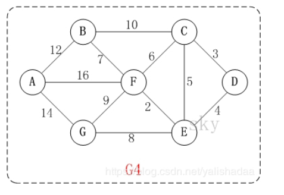
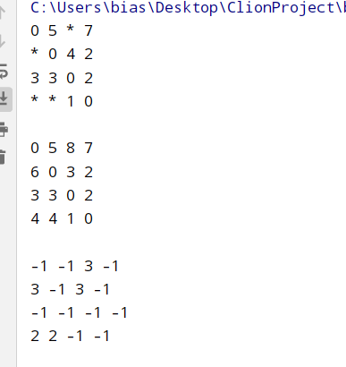

## dijkstra

**算的是单源最短路径，有向图无向图都可以，有没有环都可以，唯一缺点就是图中不能存在负权边**

**用邻接表保存**

时间复杂度O(mn)，m为边的数量，n为顶点的数量。用优先级队列之后是O(mlogm)

空间复杂度O(m)



用的这个图，节点按照0开始编号，即A对应0，后面一次对应

算的是A到其他节点的最短路径，起点可以在main函数中调用的第三个形参处修改

```c++
#include<bits/stdc++.h>

// dijkstra算法
class Solution {
public:
    vector<int> maxProbability(int n, vector<vector<int>>& edges, vector<int>& weigh, int start) {

        vector<vector<pair<int, int>>> g(n);   //构造邻接表
        int m = edges.size();
        for (int i = 0; i < m; i ++) {
            g[edges[i][0]].push_back({edges[i][1], weigh[i]});
            g[edges[i][1]].push_back({edges[i][0], weigh[i]});
        }
        vector<int> distance(n, INT_MAX);  //默认全部不可达
        distance[start] = 0;
        priority_queue<pair<int, int>,vector<pair<int,int>>,greater<pair<int,int>>> heap;
        heap.push({start, 0});
        while (heap.size())
        {
            auto ele = heap.top();
            heap.pop();
            int node = ele.first;
            int dis = ele.second;
            if(dis>distance[node])
                continue;
            for (auto x : g[node])
            {
                int nn = x.first;
                int dd = x.second;
                if (dd+dis<distance[nn])
                {
                    distance[nn] = dd+dis;
                    heap.push({nn, distance[nn]});
                }
            }
        }
        return distance;
    }
};

int main()
{
    vector<vector<int>> edges{{0,1},{0,6},{0,5},{1,2},{2,3},{3,4},{4,6},{4,5},{5,6},{2,5},{2,4}};
    vector<int> weigh{12,14,16,10,3,4,8,2,9,6,5};
    vector<int> distance=Solution().maxProbability(7,edges,weigh,0);
    for(int i=0;i<distance.size();i++)
        cout<<"0到"<<i<<"节点的最短路径为"<<distance[i]<<endl;
}
```

---

## floyd

**计算多源最短路径，可以带负权边，有向图无向图都可以，有没有环都可以**

**时间复杂度为O(n^3)，dijkstra计算单源最短路径是n^2，floyd是多源的相当于对每个结点都执行了依次单源，即n^3。**

**使用的是邻接矩阵**

```c++
#include<bits/stdc++.h>

void floyd(int n,vector<vector<int>>& path,vector<vector<int>>& res)
{
    for(int k=0;k<n;k++)
    {
        for(int i=0;i<n;i++)
        {
            for(int j=0;j<n;j++)
            {
                int tmp=(res[i][k]==INT_MAX || res[k][j]==INT_MAX)? INT_MAX :(res[i][k]+res[k][j]); //注意要判别一下，不然res[i][k]里面有一个是无穷，下面相加都会造成结果溢出，所以如果其中有一个是无穷，那结果就按照无穷算
                if(tmp<res[i][j])
                {
                    res[i][j]=tmp;
                    path[i][j]=k;
                }
            }
        }
    }
}
int main()
{
    vector<vector<int>> graph(4,vector<int>(4));   //n个节点的话邻接矩阵就是n*n的方阵
    vector<vector<int>> path(4,vector<int>(4,-1));   //path矩阵是等res矩阵更新完之后，我们可以到这个矩阵中回溯的找所求得的最短路径具体是经过那些节点
    graph={{0,5,INT_MAX,7},{INT_MAX,0,4,2},{3,3,0,2},{INT_MAX,INT_MAX,1,0}};
    vector<vector<int>> res=graph;

    floyd(4,path,res);
}
```

最后算完之后`res[i][j]`即为i到j的最短距离，同时如果要保存回溯路径的可以用设置path数组，初始化全是-1，然后循环里修改，可以根据这个矩阵把最短路径具体经过哪些结点输出

**path i j==-1表示不可到达或者可以直达**



分别是邻接矩阵g，最短路径矩阵res，路径矩阵path

例如`res[1][2]`=3，即1到3的最短路径是3，到了path中`path[1][2]`=3，表示中间经过3结点，看再`path[1][3]`==-1，表示可1可以直到3，再看`path[3][2]`==-1，也可以直达，因此1->2的最短路径对应的最短路径为1->3->2