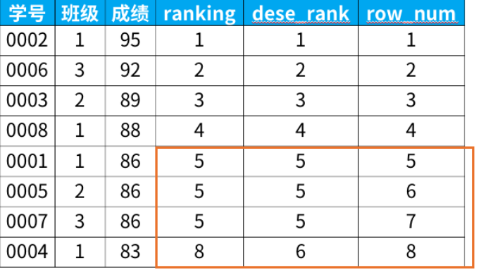

- 使用ifnull来避免结果出现空（即查询结果为空，它和查询结果为null是不一样的）

  要把空查询结果转换成null可以使用临时表或者ifnull的方式

- limit a,b表示跳过a个，然后后面取b个

  limt a表示取a个

  offset a表示跳过a个   limit a,b就等价于limit b offset a

- 窗口函数rank

  1. `select score,rank() over(order by 成绩 desc) as ranking from 班级`
  2. `select score,dense_rank() over(order by 成绩 desc) as dese_rank fron 班级`
  3. `selectscore,row_number() over(order by 成绩 desc) as row_num from 班级`

  区别在于

  

  rank()：相同的元素排名相同，同时同名的元素会占用下一行

  dense_rand()：相同的元素排名相同，同时同名的元素不会占用下一行

  row_number：完全按照次序，没有重复的序号
  
- truncate、delete、trop区别

  1. delete from 表名 where...

     可以删除行数据，也可以整表删除。只删除内容，不删除表结构和表定义

  2. truncate table 表名

     不能删除行数据，只能整表删除。只删除内容，不删除表结构和表定义

  3. drop table 表名

     整表的内容结构、内容和定义全部删除

  还有一些小细节

  1. delete每删除一行会记录在事务日志中，可以回滚
  2. 执行速度drop>truncate>delete。因为delete要在日志中记录
  3. delete可以回滚，事务提交之后才会生效。
  4. truncate和drop不能回滚，而且是立即生效

