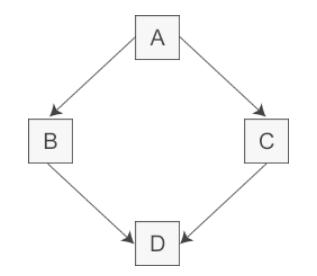
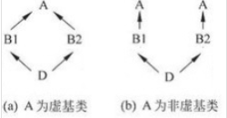

#### 1.ARP欺骗

ARP协议是建立在局域网内主机相互信任的基础上

ARP欺骗就是利用这一特点，伪造ip地址和mac地址的对应关系。

例如A的ip为192.168.1.1，mac地址为AAA，那么攻击者C就可以向局域网中大量广播已将ip地址192.168.1.1的mac地址改为CCC的ARP应答包，那么局域网内的计算机就会把伪造的ARP写入自身的ARP缓存表中，下次再发给A的数据包就发到了CCC，那么C就可以在CCC截取发送给A的信息

#### 2.ping

利用了ICMP协议，用于检测统一局域网下的两台机器的网络是否连通

源主机构建一个ICMP请求数据包，然后里面有一些相关信息，然后给ip层

ip封装上ip地址和端口号， 然后到数据链路层再加上mac地址封装成数据帧，然后传出去

B收到以后检查，然后构建ICMP应答数据包返回A

#### 3.数据单位

应用层：报文。完整的信息

传输层：报文段。为了方便传输，对报文进行分段

网络层：数据包

数据链路层：帧

一层一层封装，越来越大

#### 4.虚继承

菱形继承





```c++
class A
{
public:
    int a=2;
};
class B: public A
{};
class C:public A
{};
class D:public B,public C
{
public:
    void set(int x)
    {
        //这种情况下，D不知道a是从A->B->D,还是A->C->D,因为A是有两份拷贝的，等价于上面的图b
        a=x;    
    }
};
```

两种解决方式

1.显示声明来自于哪个类，即使用B::a=x或者C::a=x，表明它是从哪个路线下来的

2.使用虚继承的方式，即B和C都虚继承自A，那么D从BC继承的话，就只会保存一份A的拷贝，而不会像上面的情况一样，出现两个A的拷贝

#### 5.c++小说虚函数

1. 先构造虚表指针，再构造数据成员。

   虚表在运行构造函数前就已经构造好了。它是在编译阶段由编译器创建的，在运行时已经创建好了。

   在一个拥有虚函数的类对象的内存布局里，首先是8个字节的虚表指针，然后后面根据声明的先后顺序存成员变量

2. 构造函数的执行过程

   - 初始化阶段：所有**类类型**的成员都会在这个阶段初始化，还有就是初始化列表中的成员
   - 计算赋值阶段：构造函数体内的赋值操作

   ```c++
   class A
   {
       public:
       A()
       {
           cout<<"ctor A"<<endl;
       }
   }
   class B
   {
       public:
       A t;
       B(A& a)
       {
           cout<<"ctor B"<<endl;
       }
   }
   int main()
   {
       A a;
       B b(a);
   }
   输出为
   ctor A      //创建a时调用构造函数
   ctor A      //构造函数的初始化阶段，会初始化B中所有类类型的成员，所有会初始化B中的t
   ctor B      //执行构造函数的函数体
   ```

3. 当类中有const和引用成员时，必须且只能通过构造函数的初始化列表初始化他们，否则会报错

   ```c++
   class A
   {
       public:
       int a;
       int& b;
       const int c;
       A():b(a),c(1) //必须要在初始化列表中初始化
       {}
   }
   ```

#### 6.zero-copy技术

减少内存的拷贝次数

正常情况下，从磁盘中读文件同时写入到另一个磁盘文件中需要四个步骤

1. 调用read从磁盘读到内核缓冲区
2. 数据从内核缓冲区拷贝到用户内存缓冲区
3. 嗲用write从内核缓冲区读取到内核缓冲区
4. 从内核缓冲区写到目标文件中

使用零拷贝，可以省掉24步骤，读到内核然后从内核直接写

#### 7.只能在堆上创建对象

对象的创建方式有两种

1. 静态建立：A a 这种是在栈上
2. 动态建立：A* a  这种是在堆上

只能在堆上

1. 讲析构函数声明为private。

   **这样的话无法实现多态**

   因为在栈上建立对象时，是编译器来调用ctor和dtor来管理对象的整个声明周期，当dtor是私有时，编译器无法调用dtor。因此编译器在创建对象是检查dtor，发现dtor无法调用，那么就不会在栈上创建对象。

   同时因为delete类对象时会调用析构函数，如果dtor声明为private，那么类外就无法delete，所有必须类内写一个调用dtor的public函数来delete a

   ```c++
   class A
   {
   public:
       A(){}
       void destory()
       {
           delete this;
       }
   private:
       ~A(){}
   };
   int main()
   {
       A* a=new A();
       a->destory();
   }
   ```

2. 将构造函数和析构设为protected，然后提供一个public的static函数来完成构造。不使用new，而是使用一个函数来构造，使用一个函数来析构，类似于单例模式

   **可以继承，可以实现多态**

   ```c++
   class  A  
   {  
   protected :  
       A(){}  
       ~A(){}  
   public :  
       static A* create()  
       {  
           return new A();  
       }  
       void  destory()  
       {  
           delete this ;  
       }  
   };
   ```

#### 8.只在栈上生成对象

使用new才会在堆上创建内存，可以将new声明为私有成员，或者delete new

```c++
class A
{
    private:
    //size_t是个宏定义，它的取值的最大值是当前平台下最大可以开辟的数组的尺寸。因此不同平台的size_t的取值可能不一样，有的是unsigned int，有的是其他的。这儿即表示new的最大的数组的大小
    void* operator new(size_t t){}
    void operator delete(void* ptr){}
    public:
    A(){}
    ~A(){}
};
```

#### 9.http1.0和1.1区别

1. 1.1默认使用长连接：多个请求可以复用一个链接

   1.0默认是短链接，每个请求都要新建一个链接

2. 新增了一些方法，如PUT(幂等)，HEAD等；

3. 新增host子段。同一个ip地址即物理主机上可能会有多个虚拟机，可以给不同的虚拟机绑定不同的hostname，这样就可以根据这个字段把请求发送到一个服务器上的不同的网站

#### 10.2.0

仍然是使用tcp多路复用，但是使用数据流的概念，即发送的时候是以数据流为单位，会对每个数据流进行标记，表示来自于哪个请求或响应。然后发送的时候就乱序发送

因为不需要按顺序，那么一个TCP链接就可以同时发送多个请求或者响应而不用像原来那样按序一个一个发

#### 11.tcp如何有序

给每个数据包一个序列号，及一个定时器，if没有收到收到确认就重传。接收到之后会根据这个序列号检查接收到的内容，看是否丢失或者乱序

#### 12.http状态码

200 请求成功   201已收到请求但是未处理

301 永久重定向   302临时重定向 

400  客户端语法错误  403 服务端理解客户端的请求，但是拒绝执行  404 请求资源不存在

500 服务器内部错误

#### 13.tcp过程

服务端：socket  bind   listen   accept                          read write        close

客户端：socket                                       connect       write         read      close

#### 14.recv的返回值

1. 成功返回接收到的字节数
2. 另一端已经关闭返回0
3. 失败返回-1

#### 15.tcp优化方法

- 服务端
  1. 增大TCP的初始化拥塞窗口（cwnd），这样每次往返的数据会变多
  2. 减少慢启动，链接空闲时，使用快启动
- 客户端
  1. 压缩数据，减少发送和接受
  2. 使用CDN，把数据存到里客户端较近的地方，减少网络延时
  3. 尽可能使用已经建立的tcp链接
- CDN：内容分发网络，通过部署在各地的边缘服务器，**类似于代理缓存的角色，使用户就近获取所需内容**


