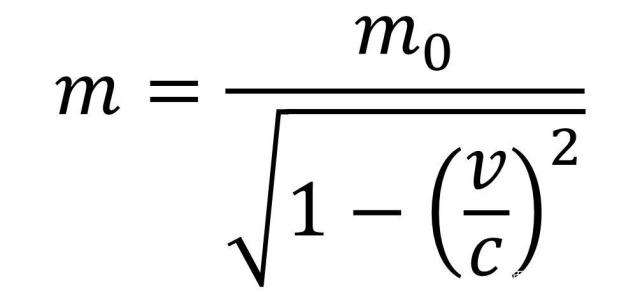

**温度就是分子运动的平均动能。**

绝对零度，热力学的最低温度，即0K（K即开尔文，国际单位制中的[温度单位](https://baike.baidu.com/item/温度单位/9460959)），273.15摄氏度。

绝对零度即绝对真空，如果达到绝对零度，原子的运动完全停止了，那么就意味着我们能够精确地测量出粒子的速度（即0），而根据海森堡不确定性原理，位置和速度的不确定度要大于等于h/4Π，这是我们生活着的宇宙所具有的一个基本物理定律。精确测出速度为0与该定律不符合，因此得出，绝对零度时不可以达到的。

也可以理解为绝对零度需要一个完全初始时就没有能量输入的环境，这在实际中是不存在的。

**理论上在绝对零度下，原子和分子拥有量子理论允许的最小能量，并没不是没有能量，拥有量子力学所允许的最小能量。**

---

那么最高温度为什么没有上限呢，动能是Ek=mv^2/2,速度的上限是v，但是根据相对论质量公式

当速度逼近光速时，质量趋近于无穷，因此动能趋近于无穷，温度趋近于无穷

