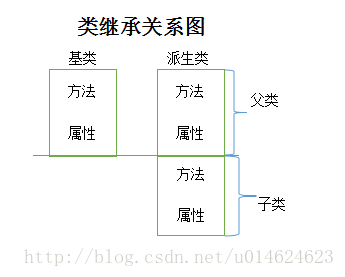
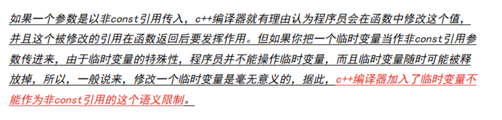

- ### static

1. 局部变量（函数内部）

   - 普通局部变量。即为在函数内部定义的变量，编译器不会对其进行初始化。存储于进程栈空间，使用完立刻释放内存。如果未初始化赋值，那么他的值是唯一的。

   - 静态局部变量。在前面加了个static，如果声明时未赋初值，编译器会自动初始化为０。同时它存储于进程的全局数据区，即使函数返回，它的值也保持不变，直到程序运行结束。**可以在循环时担当计数器**。

     ```c++
     #include "iostream"
     using namespace std;
     int add(int x,int y)
     {
         static int a;
         a++;
         cout<<a<<endl;
         return x+y;
     
     }
     int main()
     {
         add(1,2);
         add(2,3);
         return 0;
     }
     ```

     输出为

     ```c++
     1
     2
     ```

2. 全局变量

   - 普通全局变量。定义在函数体外，全局存储，如果无初值编译器会自动对其初始化为0。**对整个工程可见，其他文件想用它加个extern声明一下就可以访问，但是不能再定义和它重名的。**
   - 静态全局变量。声明时未赋初值，编译器会自动初始化为０。只在当前文件可见，其他文件可以定义与他同名的，互不影响。

3. 静态函数

   与静态全局变量类似，只在本文件中可见而且其他文件可以使用重名函数，互不影响。

   ------

4. 类的静态数据成员

   - 存储在全局数据区

   - 只有一个拷贝，一个对象对他修改那么所有的全改了

   - **类的普通数据成员只能在类内定义时初始化或者通过对象x初始化。但是类的静态数据成员只能通过类名初始化，初始化用<数据类型><类名>::<静态数据成员名>=<值>**

     ```c++
     class A
     {
         public:
         int static value;
     };
     int A::value=1;
     int main()
     {
         A a;
         cout<<a.value;
     }
     ```

     **只能在类外这样初始化，也不能在main里**

   - 访问的话类名和对象名都可以，但是普通数据成员只能通过对象。静态数据成员可以使用A::value来访问

   - 可以作为类的成员函数的默认参数，但是普通的数据成员不行

     ```c++
     class A
     {
       public:
       int x;
       static int y;
       void add(int z=y)   //可以，但是int z=x不行
       {
         return z+1;
       }  
     ```

5. 类的静态成员函数

   - **只能访问类的静态数据成员或静态成员函数，而不能访问普通数据成员和普通成员函数。**
   - 非静态成员函数可以任意地访问静态成员函数和静态数据成员。

- ### 不同文件之间读取

  c++源文件A.cpp想读取另一个源文件B.cpp的函数int add(int x)：

  1. 直接调用。在调用之前加一个声明
  
     B.cpp
  
     ```c++
     int add(int x)
     {
       return x+1;
     }
     ```
  
     A.cpp
  
     ```c++
     #include"iostream"
     using namespace std;
     
     int main()
     {
       int add(int x);
       cout<<add(1);      //结果输出2
       return 0;
     }
     ```
  
  2. 头文件引用。B.cpp的代码不变，函数体仍然在B.cpp中，创建一个和B.cpp同名的头文件B.h，将函数声明写在头文件中
  
     B.h
  
     ```c++
     #ifndef UNTITLED_H_H
     #define UNTITLED_H_H
     
     int add(int x);
     #endif //UNTITLED_H_H   //是自动生成的三行，是防止头文件重复引用的，代码写到他们中间就行。
     ```
  
     A.cpp
  
     ```c++
     #include"iostream"
     #include"B.h"        //导入头文件B.h
     using namespace std;
     
     int main()
     {
       cout<<add(1);      //结果输出2
       return 0;
     }
     ```
  
  > 两种方式可以达到同样的结果，其实第二种的#include"B.h"在预处理的时候做的操作是把B.h的代码以文本形式复制过来，其实本质上和第一种一样。
  >
  > 最好用第二种方式，文件清晰明了，整齐，便于管理
  
- ### 参数传递的两种方式
  
  - 值传。函数操作的是实参值的一个拷贝，操作完之后实参值并不变。
  
  - 引用传。函数操作的是实参的引用，即实参的别名，操作完之后实参值也变了。
  
    ```c++
    int swap(int x,int y)
    {
        int temp=0;
        temp=x;
        x=y;
        y=temp;
        return 0;
    }
    int main()
    {
        int a=1,b=2;
        swap(a,b);
        cout<<a<<" "<<b<<endl;
        return 0;
    }
    //运行完之后结果是1、2，a、b的值并没有交换就因为swap函数操作的是a、b的值的拷贝，相当于int x=a,int y=b,只是把a和b的值拷贝给x和y了但是a和b本身的值并没有变。但如果用引用传值的话就可以了
    int swap(int &x,int &y)
    {
        int temp=0;
        temp=x;
        x=y;
        y=temp;
        return 0;
    
    }
    int main()
    {
        int a=1,b=2;
        swap(a,b);
        cout<<a<<" "<<b<<endl;
        return 0;
    }
    //这样的话结果就是2、1了，函数参数是引用，调用的时候相当于int &x=a，对x操作就是对a操作
    ```
  
-  ### 字符数组和字符串数组
  
  - 定义字符数组就用下面两种方法，而且char*定义的时候不需要写长度和中括号，更简洁。
  
    char a[]="……."（**括号里可以预先不写大小，初始化会自动分配大小）**或者char *a="…..."
  
    调用的时候直接用数组或者指针的名字就可以代表整个字符串。
  
    例如
  
    char a[3]="my"；和char *b="my"；效果是一样的，cout<<a和cout<<b都会输出“my”
  
  - 定义字符串数组和字符数组类似
  
    char a[] [10]={"….","…..."}**（这块第二个括号里必须写数字，就是最大字符串的大小，第一个可以不写，调用的时候就当成二维数组就可以**）或者char *a[]={"……..","……..."}**（a后面括号里的是字符串数组的长度，不写的话就多少个元素都可以，但如果写了的话，里面的数字必须大于等于后面元素的个数）**
  
  - 但是整型数组就不一样了,int a[]和int *a效果是不一样的，而且不能用数组名代替整个数组，数组名只能代表数组首元素的地址并不能代表全部数组
  
    主要是因为cout的原因
  
- ### public，private和protected

  这里说的类外其实就是类对象，因为就算public的成员函数在类外访问也只能通过类对象

  - 访问控制修饰符

    - public:对所有的都可见，类内类外都可以。

    - protected：对本类的成员函数以及本类的派生类和友元类（在类A的private中声明B为友元，friend class B）的成员函数可见，即派生类和友元类的成员函数可以访问它；对其他不可见，包括类对象，类对象想访问保护成员只能先用类的public成员函数访问保护成员，然后类对象再访问public成员函数。

    - private：对本类的成员函数及友元类的成员函数可以访问，子类不可见

      > protected和private的区别就是protected多了个可被派生类访问

  - 继承方式

    - public：父类的public和protected成员到了子类中仍是子类的public和protected成员，子类内成员函数可以直接访问，但是子类对象只能访问public不能访问protected。父类的私有成员子类不可见
    - protected：父类的public和protected成员到了子类变成了子类的protected成员，子类内的成员函数可以直接访问，子类对象统统不能访问。父类的私有成员对子类不可见。
    - private：父类的public和protected到了子类变成了子类的private成员，只有子类的成员函数可以访问，类对象不行。父类的private对子类不可见

- ### stl中的begin和end

  vector的的begin指向开头第一个元素，但是end是指向末尾元素的下一个位置，并不是最后一个元素，使用迭代器输出时可以明显看到，迭代器指向begin()时就是第一个元素，但是指向end()时会输出一个很大的数，应该时下一位置的地址，指向end()-1时才会输出最后一个元素，**即是左闭右开区间**
  
- ### Typeid获取数据类型

  获取变量或表达式占用的字节数，用sizeof函数

  获取变量或表达式的数据类型用typeid操作符，要配合name()函数一起使用，因为typeid是操作符，返回的是系统库类对象的一个引用

  ```c++
  #include "iostream"
  #include "typeinfo"
  using namespace std;
  
  int main()
  {
      int c=1;
      cout<< typeid(c).name();
  }
  ```

  输出结果是i，表示是int型

  **i 表示int，b=bool c=char  s=short  l=long f=float, d=double x=long long** 

  **注意添加头文件**：`#include"typeinfo"`
  在上头文件中定义了typeid()操作符可以输出变量的类型。

- ### 位域

  - 概念

    类和结构**可以包含比1个变量声明时的类型占用更小空间的**成员（声明变量时声明的数据类型，如果声明是int型，那么位域可以占比一个int即4字节更小的空间）。 这些成员被指定为位域。

    位域是一种特殊的**类数据成员（结构体数据成员）**，用于保存特定的位数

  - 定义

    在成员名后面加一个冒号以及指定位数的**常量表达式**，指出成员是一个位域

  eg：

  ```c++
  struct{
          unsigned int a ;
          unsigned int b ;
      } i;      //size(i)是8,因为i中两个int变量，两个4
  ```

  但是如果用位域

  ```c++
   struct{
          unsigned int a : 1;
          unsigned int b : 4;
      } i;      //就表示i有两个位域成员，a和b
                //size(i)是4,a和b的位数之后没有超过一个int的32位；一旦他们的位数之和超过了32位，那就要再用一个int，size(i)即为8
  ```

- ### 宏定义和内联函数

  - 宏定义

    ```
    #define 标识符 字符串
    ```

    用来将一个标识符(宏名)定义为一个字符串，该标识符被称为宏名，被定义的字符串称为替换文本。程序编译之前的预处理阶段所有的宏名都会被定义的字符串替换，这便是宏替换，发生在预处理也叫做预编译阶段。

    >优点：
    >
    >1. 提高了程序的可读性，同时也方便进行修改；
    >
    >2. 提高程序的运行效率：使用带参的宏定义既可完成函数调用的功能，又能避免函数的出栈与入栈操作，减少系统开销，提高运行效率；
    >3. 宏是由预处理器处理的，通过字符串操作可以完成很多编译器无法实现的功能。比如##连接符。
    >
    >缺点：
    >
    >1. 由于是直接嵌入的，所以代码可能相对多一点；
    >
    >2. 嵌套定义过多可能会影响程序的可读性，而且很容易出错；
    >
    >3. 对带参的宏而言，由于是直接替换，并不会检查参数是否合法，存在安全隐患。

  - inline

    在函数定义的时候前面加上inline关键字，就变成了内联函数。在编译时将函数体展开，发生在编译过程中，因此可以进行诸如类型安全检查、语句是否正确等编译功能。

    > inline函数一般用于比较小的，频繁调用的函数，这样可以减少函数调用带来的开销

  - 不同点

    - inline是函数展开，而宏只是简单的文本替换
    - 宏定义在预处理阶段，而inline是编译阶段。因此后者可以安全检查
    - 宏定义时后面的宏参数最好用括号括起来防止出现二义性，而inline不会

- ### 函数模板

  属于泛函编程，即不考虑数据类型，有点像动态语言

  ```c++
  template <class A>   //这儿class关键字就类似于typename的意思，只是习惯用class
  A function(A a,A b)
  {
    return a+b;
  }
  ```

  其中的A并不是一个具体的数据类型，而是泛指任意数据类型，这儿就把他看作是A型。

  **调用函数模板时可以自动推导数据类型，例如上面的，调用时用function(1,2)那么就会自动推导A为int。也可以显示指定。**

  显示指定就function<int>(a,b)

  > 用的时候最好显示指定好参数的数据类型

- ### 类模板

   ```c++
   template<class A>    //这儿的class关键字和模板函数里的用处一样，表示A是一个泛型的数据类型
   class P
   {
       public:
       A a;
   }
   ```

- ### 函数指针和指针函数

  - 函数指针即指向函数的指针

    ```c++
    int (*p)(int ,int );
    p=f;    //f即函数名
    ---
    typedef int (*P)(int ,int );
    P p=f;
    ```

    前面的int是函数的返回类型，后面是函数的形参的数据类型

    赋值时直接赋值函数名即可，因为函数名就表示函数的地址

    ```c++
    int a(int x,int y)
    { 
      return x+y;
    }
    int (*p)(int ,int);
    p=a;
    //调用的时候就
    (*p)(1,2); //等价于a(1,2)
    ```

    **函数指针可以作为函数参数传递给函数，类似于python的高阶函数**

    ```c++
    int test1(int a)
    {
      return a-1;
    }
    int test2(int (*p)(int),int y)
    {
      return (*p)(10)+y;
    }
    int main()
    {
      int (*p)(int);
      p=test1;
      cout<<test2(p,2)<<endl;
      return 0;
    }
    //结果即为11
    ```

    **函数指针数组**

    ```c++
    void a()
    {
      cout<<'a'<<endl;
    }
    void b()
    {
      cout<<'b'<<endl;
    }
    void c()
    {
      cout<<'c'<<endl;
    }
    typedf void (*P)(void);
    P f[]={a,b,c};  //f即为函数指针数组
    f[0]();  //即调用a函数，等价于a();
    ```

  - 指针函数即函数的返回值是一个指针的函数

    int*  p(int x,int y）
  
- ### #和##

  都是用在宏定义中。

  - `#`的作用是将宏参数**不经扩展的**转换成字符串**常量**(不能再修改，和const一样）。

    ```c++
    #define F abc  
    #define B def  
    #define FB(arg) #arg  
    #define FB1(arg) FB(arg)  
    #include"iostream"
    using namespace std;
    
    int main()
    {
      cout<<FB(F B)<<end;    
      cout<<FB1(F B)<<endl;   
      return 0;
    }  
    ```

    第一行输出为`F B`，因为是不经扩展 地转换所以没有用上面的宏定义换。变换过程为FB(F B) -> #F B ->"F B"

    第二行输出为`abc def`，转换过程为FB1(F B) ->FB1(abc def) ->FB(abc def) -> #(abc def) ->"abc def"

  - `##`的是连接操作符。将出现在其左右的字符序列合并成一个变量名

    ```c++
    #define F(x)  x##ias
    #include "iostream"
    using namespace std;
    int main()
    {
        int bias=1;
        F(b)+=1;
        cout<<bias;      //F(b)其实就相当于是bias的引用，因此输出为2
        return 0;
    }
    ```

- ### c++堆和栈

  C++程序的5种内存存储区（**注意程序没有运行时是不会占用内存的，但是程序在编译的时候就会分配好到时候谁占哪儿，所以这儿说的内存占用其实是编译器规划好的内存使用方案**）

  - 内存栈区：局部变量的变量名，函数传参值，自动释放，效率高但内存少

  - 内存堆区：malloc函数从堆上申请内存，用free释放内存，若不释放，程序结束释放

    > 自由存储区：自由存储区是C++基于new操作符的一个抽象概念。new操作符在此申请内存，用delete释放内存，若不释放，程序结束释放（一般就认为是在堆上）

  - 全局/静态区：存储全局变量或静态变量名。内存在编译时就分配好了（程序执行前），整个程序运行期间都存在，程序结束时释放。

  - 常量区：存放字面值常量（右值）。

    eg：const string a="abc"，a放在栈区，而“abc"就放在这儿.

    对于局部常量，存放在栈区；对于全局常量，编译期一般不分配内存，放在符号表中以提高访问效率；字面值常量（const int a=1，1就是字面值常量，像上面的“abc”也是字面值常量），放在常量区。（局部常量和全局常量说的是常量名，左值，而字面值常量是右值）

  - 代码区：二进制代码

  **注意：**

  **（1）堆是c语言和操作系统的术语，是操作系统维护的一块内存。自由存储是C++中通过new和delete动态分配和释放对象的抽象概念。
  （2）new所申请的内存区域在C++中称为自由存储区，编译器用malloc和free实现new和delete操作符时，new申请的内存可以说是在堆上。
  （3）堆和自由内存区有相同之处，但并不等价。<u>自由存储区不仅可以是堆，还可以是静态存储区，这都看operator new在哪里为对象分配内存</u>**

  ---

  **栈和堆主要的区别**

  - 堆由程序员控制（通过malloc/free，new/delete），内存动态分配（就是要多少给多少），是不连续的内存区域，大小受限于计算机的有效内存（32位即4G）。因此更灵活，但是因为灵活度大容易造成内存泄漏。通过new和malloc由低到高分配，由delete或free手动释放或者程序结束自动释放。效率低但是灵活且空间大。
  - 栈由编译器自动管理，静态分配，是一块连续的内存区域，大小是操作系统预定好的。由高到低，由编译器自动分配释放。效率高但是空间有限

- #### malloc/free和new/delete区别

  - new/new[]用法

    ```c++
    int *p=new int;     //开辟sizeof(int)的空间，即4字节，没有赋初值那就初始化为0.注意这儿开辟的空间是p指向的空间
    cout<<*p;           //输出0
    cout<<sizeof(*p);   //输出4，*p为p指向的空间
    cout<<siezeof(p);   //输出8，因为64位系统，那么指针表示地址，就需要64位二进制数即8字节
    int *q=new int(5);  //开辟sizeof（int）的空间，并初始化为5
    --------------------
    一维动态数组
    int *a=new int [n]{1,2,3,...};  //后面的大括号里可以跟初始值，不写的话就是随机数
    二维动态数组用
    int **a=new int[n]; //首先开辟一个n的数组，数组元素为n个动态数组
    for(int i=0;i<n;i++)
        a[i]=new int [n];//初始化a的每一个元素
    ```

  - delete/delete[]

    ```c++
    int *a=new int;
    delete a;
    ---------------
    int *a=new int[10];
    delete []a;     //不管几维数组删除都用这种形式
    ```

  使用new操作符申请内存分配时无须指定内存块的大小，编译器会根据类型信息自行计算。而malloc则需要显式地指出所需内存的尺寸。

  而且malloc默认是返回void*类型，还需要加强制转换

  malloc不能初始化，而new可以赋初值

  ```
  int *p1 = (int*)malloc(sizeof(int));  
  ```

  #### Summary

  |        特征        |              new/delete               |             malloc/free              |
  | :----------------: | :-----------------------------------: | :----------------------------------: |
  |   分配内存的位置   |              自由存储区               |                  堆                  |
  | 内存分配失败返回值 |             完整类型指针              |                void*                 |
  | 内存分配失败返回值 |             默认抛出异常              |               返回NULL               |
  |   分配内存的大小   |       由编译器根据类型计算得出        |          必须显式指定字节数          |
  |      处理数组      |       有处理数组的new版本new[]        | 需要用户计算数组的大小后进行内存分配 |
  |  已分配内存的扩充  |            无法直观地处理             |         使用realloc简单完成          |
  |    是否相互调用    | 可以，看具体的operator new/delete实现 |             不可调用new              |
  | 分配内存时内存不足 | 客户能够指定处理函数或重新制定分配器  |       无法通过用户代码进行处理       |
  |      函数重载      |                 允许                  |                不允许                |
  | 构造函数与析构函数 |                 调用                  |                不调用                |

  malloc给你的就好像一块原始的土地，你要种什么需要自己在土地上来播种

  

  而new帮你划好了田地的分块（数组），帮你播了种（构造函数），还提供其他的设施给你使用:

  

  当然，malloc并不是说比不上new，它们各自有适用的地方。在C++这种偏重OOP的语言，使用new/delete自然是更合适的。

- ### string，(const) char*和char[]

   `const char*`常量指针，指向的是常量字符串，即指向的内容不能修改，但是指向可以修改，即可以指向其他字符串

   ```c++
   const char *a="abc";
   a="vvv";   //这样是可以的
   a[1]='b';  //错误，a指向的是常量字符串，其内容不能修改
   ```

   使用`char*`时，如果是`char *a="abc"`这样的形式，那么效果和`const char*`一样，表示指向的是常量字符串，内容不能改但是指向可以改。如果是采用引用的方式那char *的内容就可以修改

   ```c++
   char a[]="abc";
   char *b=a;
   b[1]='v';
   cout<<b;   //结果输出avc
   ---
   string a="abc";
   char *b=const_cast<char*>(a.c_str()); //c_str()函数返回一个指向正规C字符串的指针常量, 内容与本string串相同，const_cast是去掉const char*，因为char*初始化时只能用非常量字符串即char *，不能用const char*型
   b[1]='v';
   cout<<b;   //输出avc
   ```

   要修改内容的的话就用string和char a[].

   ---

   string和char *a之间的转换

   > c_str()函数可以将string转换成const char *，如果要换成char *可以用
   >
   > `char *a=const_cast<char*>(s.c_str())`

   char a[]到string，直接赋值即可

   ```
   char a[]="abv";
   string b=a;
   ```

   string到char a[]可以通过strcpy函数

   > char * strcpy ( char * destination, const char * source );

   ```c++
   string a="abv";
   char b[100];   //注意b的初始化长度一定要能放下a，记得a的最后还有个字符串结束符\0,在此例中b最小长度为4；
   strcpy(b,a.c_str());
   ```

- ### 多个if与多个else if

   if ……if……if……else

   if ……else if …… else if……else……

   前者的else只和最接近的if匹配，他两势必有一个会执行，而前面的if只要满足了也会执行

   后者就是从头开始找到第一个匹配的就执行，然后后面的全都跳过

   ```c++
   int i=1;
   if(i==0)
       cout<<0;
   if(i==1)
       cout<<1;
   if(i==2)
       cout<<2;
   else
       cout<<"xixi";    
   //输出为1xixi
   --------------
   int i=1;
   if(i==0)
       cout<<0;
   else if(i==1)
       cout<<1;
   else if(i==2)
       cout<<2;
   else
       cout<<"xixi";
   //输出为1；
   ```

- ### 使用new和delete创建和删除一、二维动态数组

   - 一维

     ```c++
     int n;
     int *a=new int[n];
     delete []a;        //n为数组大小，可以通过屏幕输入确定，也可以后面随便指定
     ```

   - 二维

     创建数组元素全是一维动态数组的一维动态数组

     ```c++
     int n;
     int **a=new int *[n];
     for(int i=0;i<n;i++)
     {
         a[i]=new int [n];
     }   //创建了n*n的二维动态数组
     for(int i=0;i<n;i++)
         delete []a[i];
     delete []a;
     ```

- ### 使用数组作为函数参数

   - 普通的一维和二维数组

     ```c++
     int a[]={1,2,3,4}
     int fun(int *a)
     {}
     int fun(int a[])
     {}
     int fun(int a[10])
     {}  
     fun(a);                  
     //这三种函数定义方式是一样的，但是调用的时候直接fun(a)即可，即实参只要把函数名传进去即可，只是形参有这三种形式。
     ```

     这三种函数定义方式是一样的，编译器会自动将数组名转换成指向数组第一个元素的指针。在函数里操作数组元素的时候可以直接a[2]这样访问

   - 动态数组

     ```c++
     int *a =new int[n];
     int fun(int *a)
     {}
     int **a =new int *[n];
     int fun(int **a)
     {}
     fun(a);
     ```

     动态数组作为形参时只能用指针形式，剩下的东西和普通数组一样

   - ### 杨辉三角

     ```c++
     #include"iostream"
     using namespace std;
     
     void YangHuiTrangle(int n,int **a)
     {
         for(int i=0;i<n;i++)
             a[i][0]=a[i][i]=1;
         for(int i=2;i<n;i++)
         {
             for(int j=1;j<i;j++)
                 a[i][j]=a[i-1][j-1]+a[i-1][j];
         }
     }
     void print(int n,int **a)
     {
         for(int i=0;i<n;i++)
         {
             for(int j=0;j<=i;j++)
                 cout<<a[i][j]<<" ";
             cout<<endl;
         }
     }
     int main()
     {
         int n;
         cin>>n;
         int **a=new int *[n];
         for(int i=0;i<n;i++)
             a[i]=new int[i];
         YangHuiTrangle(n,a);
         print(n,a);
         for(int i=0;i<n;i++)
             delete []a[i];
         delete []a;
         return 0;
     }
     ```
   
- #### static_cast,dynamic_cast,reinterpreter_cast和const_cast

   都是cast<new_type>(expression)的形式，将expression转换为new_type型

   - const_cast用来把常量转换成非常量

     ```c++
     string s="abv";
     char *a=const_cast<char*>(s.c_str());
     ```

     将`const char*`转换为char *

   - static_cast

     用于各种隐式转换，一种比普通的强制类型转换更安全的类型转换方式，在**无关类的类指针之间转换上，有安全性的提升**

     ```c++
     int a=1;
     char b=(char)a;
     char b=static_cast<char>(a);  //这两种形式的转换是一样的
     ```

     但是当涉及到无关类的类指针时，static_cast会有类型检查，而普通的强制类型转换不会

     ```c++
     class A
     {
         public:
         int a;
     }
     class B
     {
         public:
         int b;
     }
     int main()
     {
         A *a;
         B *b=static_cast<B*>(a);  //如果使用B *b=(B*)a;那么并不会报错；但是如果使用static_cast的话就会显示二者无继承关系无法转换，报错，因此在设计无关类的类指针时使用static_cast更安全
     }  
     ```

   - dynamic_cast

     

     > 把派生类的指针或引用转换成用基类表示，称为上行转换，相当于基类指针成了派生类指针的引用，这时使用static和dynamic都是一样的
     >
     > ```c++
     > Derive *b=new Derive;
     > Base *a=static_cast<Base*>(b);//使用dynamic一样
     > a->fun(); //结果调用的是派生类的fun
     > ```
     >
     > 但是反之，直接转换基类到派生类，转换后派生类自己的方法和属性丢失了，即下行转换，一般要借助于dynamic和static_cast，但是dynamic有动态类型检查，因此更安全

     当基类是多态（基类中至少包含一个虚函数）时，才能用dynamic，否则报错。

     > 但是多态时也可以使用static，上行多态时用static和dynamic都可以，但是下行多态时最好用dynamic，有动态类型检查，更安全

     ```c++
     class Base 
     {
         public:
         int baba=1;
         virtual void dummy() 
         {
             cout<<"father";
         }
     };
     class CDerived: public Base 
     {
         public:
         int erzi=2;
         void dummy()
         {
             cout<<"son";
         }
     };
     int main()
     {
         Base *a=new CDerived();
         CDerived *b=dynamic_cast<CDerived *>(a);
         b->dummy(); //结果是son，而且直接a->dummy()也是son
         cout<<b->erzi; //结果即为2
     }
     ```

     这种属于安全的下行转换，使用static也可以。但是如果把19行改成Base *a=new Base();此时a指向父对象，下面的转换就是不安全的，因为b由a转换而来而a指向父对象，根本没有erzi这个数据成员，b->erzi这个操作就是不安全的。这时使用dynamic会动态检查出来这个不安全，而且会把指针b置为0；但是用static的话就不会发现这个不安全，最后23行的结果为father，24行直接越界访问，会给一个随机数。不安全。因此下行转换用dynamic更安全

   - reinterpret_cast

     啥都能转，不安全，少用

- ### 内存泄漏与智能指针（智能指针需要使用memory头文件）

   内存泄漏是指因为疏忽或程序错误未能释放已经不再使用的内存。**对于C++的内存泄漏，总结一句话：就是new出来的内存没有通过delete合理的释放掉。**那么以后这部分空间将无法再使用，就会产生heap leak

   智能指针就是一个类，新建一个指针即定义一个类对象，当超出了类的作用域时，类会自动调用析构函数，析构函数会自动释放资源。所以智能指针的作用原理就是在函数结束时自动释放内存空间，不需要手动释放内存空间。

   - auto_ptr

     使用所有权模式，即该对象只能有一个指针指向它

     c98定义的，c++11之后舍弃改为使用unique_str，因为auto_str会造成潜在的内存泄漏

     ```c++
     auto_ptr<string> p1(new string("hahah"));  //只能用这种初始化的方式，而不能使用new赋值的形式，因为new的是普通指针和智能指针不是一种类型
     auto_ptr<string> p2=p1;  //并不会报错，p2剥夺了p1的所有权，但是当程序访问p1时会出错，因此使用auto_ptr存在潜在的内存崩溃问题
     ```

   - unique_ptr

     auto_ptr的替代版本，更安全

     ```c++
     unique_ptr<string> p1(new string("hahah"));
     unique_ptr<astring> p2=p1;  //报错，从而避免了p1不再指向有效数据的问题
     ```

     ```c++
     unique_ptr<string> p1(new string("hahah"));
     unique_ptr<astring> p2=p1;  //报错
     unique_ptr<string> p2=unique_ptr<string>(new string("ffff"));
     //这样是可以的，当把一个unique_ptr赋值给另外一个时，如果这个unique_ptr是一个临时右值，如第三行的，那是可以的；如果它还要存在一段时间，如2，那是不可以的
     ```

   - shared_ptr

     每个shared_ptr所指向的**对象**都有一个引用计数，它记录了有多少个shared_ptr指向自己

     shared_ptr的析构函数：递减它所指向的对象的引用计数，如果引用计数变为0，就会销毁对象并释放相应的内存

     引用计数的变化：决定权在shared_ptr，而与对象本身无关

     ```c++
     int n=1;
     shared_ptr <int> p(&n)
         
     shared_ptr <int> p(new int (2));
     
     shared_ptr <int> p=make_shared<int>(20);
     
     shared_ptr <int> q=p;   //这四种方式都可以得到shared_ptr
     ---
     多个sharde_ptr对象可以共同托管一个指针p
     shared_ptr<int> p(q);
     shared_ptr<int> m<q>;
     
     ```

     p.use_count()就是引用次数，多一个指针计数加1.

     p.unique()是否独占所有权，返回0或1

     p.get()获取原指针，eg：int *a=p.get()，即可以把智能指针给普通指针

     p.reset()，如果括号里是空的，那么引用计数减一；如果是reset(new int(xxx))，那么首先生成新对象，然后将新对象交给p保管，原来的析构掉

     p.get()返回类对象，即指针，可以赋值给普通指针，eg：

     ```c++
     shared_ptr <int> p(new int (3));
     int *q=p.get();
     ```

   - weak_ptr

     只可以从一个 shared_ptr 或另一个 weak_ptr 对象构造,

     weak_ptr是用来解决shared_ptr相互引用时的死锁问题,如果说两个shared_ptr相互引用,那么这两个指针的引用计数永远不可能下降为0,资源永远不会释放。

     它是对对象的一种弱引用，它的构造和析构不会引起引用记数的增加或减少，和shared_ptr之间可以相互转化，shared_ptr可以直接赋值给它，它可以通过调用lock函数来获得shared_ptr。
     
     https://blog.csdn.net/albertsh/article/details/82286999

- ### fork()函数

   > 注意是linux系统的函数，windows上是不能用的

   创建一个主进程的副本，即为父进程创建一个子进程，同时返回两个数，在父进程中，返回字进程id，在子进程中，返回0

   ```c++
   #include "iostream"
   #include "cmath"
   #include <unistd.h>
   using namespace std;
   
   
   int main() {
       pid_t pid;
       pid=fork();
       int count =1;
       if(pid<0)
           cout<<"fork error";
       else if(pid==0)
       {
           cout<<"我是子进程，我的进程id是"<<getpid()<<endl;
           count++;
           cout<<count<<endl;
          
       }
       else
       {
           cout<<"我是父进程，我的进程id是"<<getpid()<<endl;
           count++;
           cout<<count<<endl;
           cout<<pid<<endl;
   
       }
   }
   ```

   输出结果为

   ```c++
   我是父进程，我的进程id是7093
   2
   7094
   我是子进程，我的进程id是7094
   2
   ```

- #### i++和++i

   i++不能作为左值，而++i可以

   ```c++
   int i = 0;
   int *ip = &(i++); //错误
   int *ip = &(++i); //正确
   ```

   具体的函数实现

   ```c++
   int& int::operator++() //这里返回的是一个引用形式，就是说函数返回值也可以作为一个左值使用
   {//函数本身无参，意味着是在自身空间内增加1的
     *this += 1;  // 增加
     return *this;  // 取回值
   }
   
   
   //后缀形式:
   const int int::operator++(int) //函数返回值是一个非左值型的，与前缀形式的差别所在。
   {//函数带参，说明有另外的空间开辟
     int oldValue = *this;  // 取回值
     ++(*this);  // 增加
     return oldValue;  // 返回被取回的值
   }
   ```

- #### const

   - const修饰变量

     ```c++
     const int a;         //a为const
     int const a;         //a为const，和1是一样的，a被赋初值之后其值无法更改
     const int *c;        //c为常量指针，为指向常整数的指针，所指向的内存数据不能修改，但是指针的指向可以修改（但是不能修改只是说不能通过c修改，如果是i
     int *const d;        //int *为const，即d为指针常量，指向的内存数据可以修改，但是指针指向不能修改
     const int * const e; //int*和e都为const，都不能改
     ```

     const在*左边，变量为const，即数据不能改，指向能改

     const在*右边，指针为const，即数据能改，指向不能改

     > 注意const和引用的关系，有常量引用但是没有引用常量
     >
     > 常量引用即引用的对象是一个const，但是没有引用常量，因为引用的指向本来就是不可变的，声明的时候是哪个对象的引用就一直是那个对象的。
     >
     > 因此只有常量引用即const int a=1;
     >
     > ​                                  const int &b=a;
     >
     > 而没有引用常量

   - const修饰类的成员函数，放在函数声明的最后，表明函数不会对数据成员做任何更改，同时因为const对象只能调用const数据成员和const成员函数，加上之后可以被const对象访问。（成员函数不管加不加const都可以被类的普通对象访问，只是const对象只能访问加const的成员函数）

- #### 获取当前路径

   ```c++
   #include"iostream"
   #include"unistd.h"
   using namespace std;
   
   int main()
   {
       char* path=NULL;
       path=getcwd(NULL,0);
       cout<<path;
       delete(path);
       return 0;
   }
   ```

   使用头文件unistd.h中的getcwd函数，函数原型为

   `char *getcwd(char *buf,size_t size);`

   getcwd会把当前工作目录的绝对路径复制到复制到buf所指的内存空间中，size_t_size是buf的大小，而且会用new动态分配，因此最后要delete

- ### 文件读写

   `#include"fstream"`

   ```c++
   ofstream   //写文件，将内存写入存储设备，out
   ifstream   //读文件，将存储设备读取到内存，in
   fstream    //读写操作
   ```

   **fstream outfile("/Users/bias/desktop/ClionProjects/untitled/1.txt",ios::out);   
   如果事先没有这个文件新建的时候一定要加上ios::out,而且如果有了这个文件再次写的时候不加ios:out的话是半覆盖写而不是全覆盖，加了才是全覆盖**

   ```c++
   #include <iostream>
   #include <fstream>
   
   using namespace std;
   int main()
   {
       fstream outfile("/Users/bias/desktop/ClionProjects/untitled/1.txt",ios::out);   
       //如果事先没有这个文件新建的时候一定要加上ios::out,而且如果有了这个文件再次写的时候不加ios:out的话是半覆盖（从头开始覆盖而不是后面接着写）写而不是全覆盖，加了才是全覆盖
       outfile<<"hello world \n";
       outfile<<"ii";
       outfile.close();  
   //写文件操作，创建文件流对象之后用outfile<<往里写就行了，\n是换行符，这里使用绝对路径因为clion默认的路径并不在untitled下而是在untitled下的cmake-bulid-debug下
   
       char buffer[256];
       fstream infile("/Users/bias/desktop/ClionProjects/untitled/1.txt");
       infile.getline(buffer, 256,'\0');  
       //getline函数原型为getline(str,n,结束符),即从文件中读取字符存到字符串str中，直到读取n-1个字符或遇到结束符时结束，结束符默认是'\n'，所以这儿如果不声明结束符为'\0'的话，读取到第一行的'\n'时就会结束而不会读取下一行的ii
           cout << buffer;
   
       infile.close();
   
   }
   ```

   输出为

   ```
   hello world 
   ii
   ```

- #### 文件指针

   seekp(n,ios::beg/cur/end)    设置写指针的位置

   seekg(n,ios::beg/cur/end)    设置读指针的位置

   outfile.seekg(0,ios::beg)

   tellp()  写内容时返回一个文件读指针位置的int值

   tellg()  读内容时返回一个文件写指针位置的int值

   seekp()设置写指针，有两个参数，第一参数是偏移量，正数表示向后偏移，负数表示向前偏移，0即不偏移，第二个参数是文件指针的基地址，ios::beg表示输出流的开始位置，ios::cur表示当前位置，ios::end表示输出流的结束位置。**第一个参数必须得有，第二个参数没有的话默认是在文件的开头**

   seekg()设置读指针，和seekp一样，就是读和写的区别

   **tellp()和tellg()用来查找文件中文件指针的位置同时返回一个int值**

   > fstream默认时ios::in，这个时候也可以写但是是半覆盖写，不是全覆盖

   ```c++
   #include <iostream>
   #include <fstream>
   
   using namespace std;
   int main()
   {
       fstream outfile("/Users/bias/desktop/ClionProjects/untitled/1.txt",ios::out);
       outfile<<"www.biasbb.top";
       outfile.close();
   
   
       char buffer[256];
       fstream infile("/Users/bias/desktop/ClionProjects/untitled/1.txt");
       infile.seekg(0,ios::end);
       int maxpos=infile.tellg();
       cout<<"文件中字符的最大索引位置"<<maxpos<<endl;
       
       infile.seekg(4);
       char a;
       infile.get(a);   //get()函数将当前指针所指的字符赋值给括号里的参数，同时读指针下移一位
       cout <<a<<endl;
       infile.getline(buffer,100);
       cout<<buffer;
       
       infile.close();
   
   }
   ```

   输出为

   ```
   文件中字符的最大索引位置14
   b
   iasbb.top
   ```

- #### 隐式类型转换（隐式转换指的是不需要用户干预，编译器私下进行的类型转换行为）

   - 低精度赋给高精度时会发生

   - 可以用单个形参来调用的构造函数定义了从形参类型到该类类型的一个隐式转换。可以用单个形参来调用构造函数，并不是说构造函数只有一个形参，也可以有多个形参，只是有多个形参的话那么除了第一个其余的都是有默认实参的

     ```c++
     #include <iostream>
     #include <fstream>
     #include "string"
     using namespace std;
     class A {
     private:
         string m_name;
         int m_age;
     
     public:
         bool isSameName(const A &other) {
             return other.m_name == m_name;
         }
         A(string name, int age = 18) : m_name(name), m_age(age) {}
     };
     int main() 
     {
         A a("bob");
         A b("mike");
         cout << a.isSameName(b);//两个对象正常比较
         cout << a.isSameName(string("bob")); //隐式类型转换，string类对象->A类对象。如果不想让程序使用默认的隐式类型转换，在构造函数前面加explicit关键字。那么这样就只能显式的转换，用a.isSameName(A("bob"));
         //可以直接把string("bbb")作为实参输入，也可以string c="bbb";然后把c作为实参传入
         return 0;
     }
     ```
     
     
     
     > 如果参数以非const引用传入，c++编译器就认为要修改这个值。把临时变量作为一个非const引用传进来，那么就认为要修改它，而程序员并不能操作临时变量，因此修改一个临时变量毫无意义。因此如果临时变量要作为实参传入，形参必须为const引用
     
     因此后面要把string("bbb")这个临时变量传入引用，前面的形参就必须定义成常量引用
   
- ### RTTI

   RTTI(Run Time Type Identification)即通过运行时类型识别，**主要通过typeid操作符来实现**，可以在程序的运行阶段确定对象类型。

   > 要输出完整的类型名，首先引用头文件#include<cxxabi.h>
   >
   > 然后cout<<abi::__cxa_demangle(typeid(int).name(),0,0,0 )<<endl;即可

   RTTI提供了两个非常有用的操作符：typeid和dynamic_cast。

   **typeid操作符，接受参数（类名或者结果为对象的表达式），返回一个type_info类对象的引用，同时type_info类有一个成员函数name()，返回由参数的类名构成的字符串。**

   dynamic_cast操作符，将基类类型的指针或引用安全地转换为其派生类类型的指针或引用。

- ### 赋值运算符

   > 只有当用A类型或非A类型的值给A类对象赋值且类的数据成员有指针时才需要显示的声明，没有指针数据成员的化需要显示声明。

   - 没有指针数据成员

     当程序没有显式地提供一个**以本类或本类的引用为参数的赋值运算符重载函数**时，编译器会自动生成这样一个赋值运算符重载函数

     ```c++
     #include"iostream"
     using namespace std;
     
     class A
     {
         private:
         int age;
         public:
         A(){}
         A(int _age):age(_age){}
         A& operator=(const int _age) 
         {
             age=_age;
             return *this;
         }    //11-15行可有可无，没有的话编译器会自动生成它
     };
     int main()
     {
         A a(10);
         A b,c;
         b=1;    //调用赋值运算符重载函数，如果把函数注释掉，那就会调用相应的构造函数
         c=b;    //调用默认的赋值运算符重载函数，是因为没有显示的声明以本类或本类的引用为参数的赋值运算符重载函数，因此编译器自动生成一个这样的函数
         return 0;
     }   
     ```

   - **当用类A类型的值为类A的对象赋值，且类A的数据成员中含有指针的情况下，必须显式提供赋值运算符重载函数**

     ```c++
     #include"iostream"
     using namespace std;
     
     class A
     {
         private:
         int age;
         char* name;
         public:
         A():age(0),name(NULL){}     //无参构造函数
         A(int _age,char *_name)     //带参构造函数
         {
             age=_age;
             name=new char[strlen(_name)+1];
             strcpy(name,_name);                                       
         }
         A(const A& a)                //复制构造函数
         {
             age=a.age;
             name=new char[strlen(a.name)+1];
             strcpy(name,a.name);
         }
         A& operator=(const A& a)    //赋值运算符重载函数
         {
             if(this!=&a)
             {
                 if(name!=NULL)
                     delete[] name;
                 age=a.age;
                 name=new char[strlen(a.name)+1];
                 strpy(name,a.name);
             }
             return *this;
         }
         ~A()
         {
             delete[] name;
         }
     };
     int main()
     {
         A b(1,"aa");    //调用带参构造函数
         A c=b;          //调用复制构造函数
         A d(b);         //调用复制构造函数
         c=d;            //调用赋值运算符重载函数
         return 0;
     }   
     ```

- ### 复制构造函数

   - 首先注意赋值和初始化的区别

     A a(b);

     A a=b

     这两种都是初始化，即创建a的同时给他赋值

     A a;

     a=b;

     这种是赋值。

     **用一个对象去初始化同类的另一个对象时，会引发复制构造函数被调用。而且如果不定义复制构造函数，那么会默认生成一个缺省的复制构造函数，会把所有的数据成员全复制过去。**

   - 复制构造函数调用的条件

     1. 用一个对象去初始化同类的另一个对象时，会引发复制构造函数被调用
     2. 如果函数 F 的参数是类 A 的对象，那么当 F 被调用时，类 A 的复制构造函数将被调用。换句话说，作为形参的对象，是用复制构造函数初始化的，而且调用复制构造函数时的参数，就是调用函数时所给的实参。
     3. 函数的返回值为类对象

- #### 从屏幕读入整行的字符串

   用char[]和string

   - ```c++
     char a[1024];
     cin.getline(a,1024);
     ```

     ```c++
     #include <iostream>
     
     using namespace std;
     int main()
     {
         int n;
         while(cin>>n)
         {
             if(cin.get()=='\n')
                 break;
         }
         char *a=new char [n];
         cin.getline(a,n);
         cout<<a;
     
     }
     ```
     
   - ```c++
     string s;
     getline(cin,s);
     ```

- #### cin（尤其是cin.get()函数）

   cin的每次读取会自动跳过不可见字符，如空格制表符等

   使用cin.get()可以获取cin当前读取的内容并且不会跳过不可见字符

   eg：输入一行以空格间隔的数字，输出其中最大的数

   ```c++
   #include <iostream>
   using namespace std;
   
   int main()
   {
       int a;
       int max=0;
       while(cin>>a)
       {
           if(a>max)
               max=a;
           if(cin.get()=='\n')   //当遇到回车时，就结束读取
               break;
       }
       cout<<max;
   }
   ```

- #### stringstream类

   使用需要引入头文件sstream

   用处

   - 进行数据类型转换

     ```c++
     int a=100;
     stringstream sstream;
     string s;
     
     sstream<<a; //将int类型的值放入到输入流中。看箭头朝向那边那边就是接受赋值的一方
     sstream>>s; //从sstream提取前面插入的int类型的值赋给string
     
     cout<<s;//即输出字符串"100"
     ```

     完整的用法如下，目的时读取一行以空格分开的一组数值，并存入数组或容器中

     ```c++
     #include <iostream>
     #include"sstream"
     #include"vector"
     using namespace std;
     int main()
     
     {
         string input;
         getline(cin,input);
         stringstream a;
         a<<input;   //11和10行也可以用stringstream a(input);这样的写法代替
     
         int sum;
         vector<int> b;
         while(a>>sum)
         {
             b.push_back(sum);
         }
         for(int i=0;i<b.size();i++)
         {
             cout<<b[i]<<endl;
         }
     }
     ```

   - 字符串拼接

     ```c++
     stringstream ss;
     ss<<"hello"<<" "<<world;
     cout<<ss.str();  //ss.str()方法将ss转换成string
     ```

   - clear和str方法

     ss.clear()方法：清除流的状态标志，但不改变流中的内容，即流可以继续接受数据，不然每次<<和>>完之后是不能接受新数据的（一次<<和>>之后可以再次写ss<<a;但是之后ss>>b,是输出不了任何数据的）

     ss.str()是将ss转换成string

     ss.str("")是清空流中的数据 ，并且将状态符固定，即无法再往流中输入

     1. 二者均没有

        ```c++
        stringstream ss;
        int a=1,b=2;
        string c,d;
        ss<<a; //插入int数据，插入之后，流的eofbit位固定，流将不再接受数据
        ss>>c; 
        ss<<b; //此时eofbit位固定，不会接受b；
        ss>>d; //读入一次只能写一次，第一次写入的已经读走了，而第二次没有读入，因此第二次读出即为空，n="";
        cout<<c<<endl<<d<<endl<<ss.str()<<endl;//流的内容仍为1
        ```

        运行结果：

        ```
        1
        
        1
        ```

     2. 只有clear

        ```c++
        stringstream ss;
        int a=1,b=2;
        string c,d;
        ss<<a; //插入int数据，插入之后，流的eofbit位固定，流将不再接受数据
        ss>>c; 
        ss.clear();
        ss<<b; //清除了eofbit位，可以继续接受数据；
        ss>>d; //将刚才读入的b读出
        cout<<c<<endl<<d<<endl<<ss.str()<<endl;
        ```

        运行结果

        ```c++
        1
        2
        12
        ```

     3. 只有str("")

        ```c++
        stringstream ss;
        int a=1,b=2;
        string c,d;
        ss<<a; 
        ss>>c; 
        ss.str(""); //清除了流的内容，同时eofbit位再次固定，流将不再接收数据
        ss<<b; 
        ss>>d; 
        cout<<c<<endl<<d<<endl<<ss.str()<<endl;
        ```

        运行结果

        ```c++
        1
        
        
        ```

     4. 两个都有

        > 二者的顺序前后无所谓，效果一样

        ```c++
        stringstream ss;
        int a=1,b=2;
        string c,d;
        ss<<a; 
        ss>>c; 
        ss.str(""); 
        ss.clear();
        ss<<b; 
        ss>>d; 
        cout<<c<<endl<<d<<endl<<ss.str()<<endl;
        ```

        运行结果

        ```c++
        1
        2
        2
        ```

- #### string和int的转换

   1. int到string使用to_string()函数

      ```c++
      int a=0;
      string b=to_string(a); //则b为"0"
      ```

   2. string到int使用atoi函数

      > atoi即ascii to integer，那么对应浮点数即atof，对应long型就atol

      ```c++
      string s="123";
      int a=atoi(s.c_str());//atoi函数的参数为一个常量指针，因此使用c_str()
      ```

   3. 使用stringstream流

      - int->string

        ```c++
        stringstream ss;
        int a=123;
        string b;
        ss<<a;
        ss>>b;
        ```

      - string->int

        ```c++
        string a="123";
        stringstream ss(a);
        int b;
        ss<<a;
        ss>>b;
        ```

- #### setw()函数

   setw(int n)，相当于先给了8个空位，当后面紧跟着的输出字段长度小于n时，在该字段前面用空格补齐；大于n的话就完整输出字段

   ```c++
   cout<<setw(3)<<1<<endl;
   cout<<setw(3)<<1234;
   ```

   结果为

   ```c++
     1
   1234
   ```

- #### 按照某一进制输出

   ```c++
   #include"bitset"
   cout<<oct<<10<<endl;
   cout<<dec<<10<<endl;
   cout<<hex<<10<<endl;
   cout<<bitset<8>(10)<<endl;
   ```

   oct、dec和hex分别对应8、10、16进制

   2进制的特殊一点，需要引入头文件，用的时候bitset<n>(m),n为保留的二进制的位数，m为所求的数

- #### 让函数在main()之前/之后执行

   使用gcc的扩展

   ```c++
   __attribute((constructor))void before()
   {
       cout<<"before main()";
   }
   //之后的话就改成destructor和after，当然这儿的函数名无所谓，用before和after是便于理解
   ```

- #### c++可以定义引用数据成员

   但是有要求

   1. 不能用默认构造函数初始化，必须显式提供构造函数初始化引用变量
   2. 构造函数的形参必须也是引用类型
   3. 不能在构造函数内部初始化，要在构造函数的初始化列表中初始化

   ```c++
   class A
   {
       public:
       A (int &target):refer(target)
       {
           cout<<"调用构造函数"<<endl;
       }
       private:
       int &refer;
   }
   int main()
   {
       int a=1;
       A r(a); //int &target=a; refer=target;
   }
   ```

- #### STl中的reserve()和resize()

   vector才有的

   这两个函数对应两个属性，a.size()和a.capacity()

   - size()是当前容器含有元素的个数。
   - capacity()是当前容器的最大容量。size变小它不变，size变大它也变大

   vector<int> v;

   - 当v.resize(len)中len>v.capacity()，则v中的size和capacity均设置为len；
   - 当v.resize(len) 中len<=v.capacity()，则v中的size设置为len，而capacity不变; 如果此时len<v.size(),那么多出的那些对象(v[len], v[len+1]…)会被销毁，v[0]-v[len-1]仍保留在原地。
   - 当v.reserve(len)中len>v.capacity()，则v中的capacity变为len，size不变，size只跟容器中元素数和resize有关（v.resize(len)将原来不存在的元素设为初值0）。
   - 当v.reserve(len)中len<=v.capacity()，则v中的capacity不变，size不变，即不对容器做任何改变。

   **总结：size可能改变capacity，但capacity不会改变size;**

- #### auto

   自动推导，auto就是一个占位符，编译器会根据初始化来推演出类型，填充位置，所以auto必须要初始化 

   不能auto a;必须auto a=1；这样

- #### NULL和nullptr

   NULL是宏定义，而nullptr是c++11引入的关键字

   NULL本质上就是整数0，定义空指针时可以用int *p=NULL，这其实等价于int *p=0；这两种都表示p为空指针。c++11之后用int *p=nullptr取代了前面的方式，主要是因为可以避免重载后函数匹配的问题。

   ```c++
   void fun(int *p)
   {
       cout<<1;
   }
   void fun(int a)
   {
       cout<<2;
   }
   int main()
   {
       fun(NULL);
   }
   ```

   由于NULL可以表示空指针，因此我们认为fun(FULL)应该调用的是第一个函数，但实际上NULL就是int 0,因此调用的是第二个函数，nullptr就可以解决这个问题。使用fun(nullptr)就是调用第一个函数

- 
