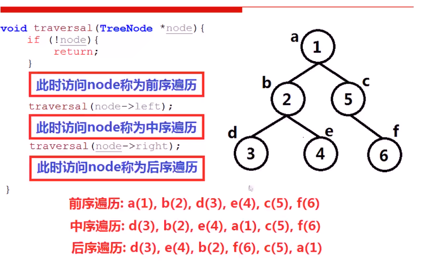

- ### static

1. 局部变量（函数内部）

   - 普通局部变量。即为在函数内部定义的变量，初始化时未赋值则自动初始化为0。存储于进程栈空间，使用完立刻释放内存。如果未初始化赋值，那么他的值是唯一的。

   - 静态局部变量。在前面加了个static，如果声明时未赋初值，编译器会自动初始化为０。同时它存储于进程的全局数据区，即使函数返回，它的值也保持不变，直到程序运行结束。**可以在循环时担当计数器**。

     ```c++
     #include "iostream"
     using namespace std;
     int add(int x,int y)
     {
         static int a;
         a++;
         cout<<a<<endl;
         return x+y;
     
     }
     int main()
     {
         add(1,2);
         add(2,3);
         return 0;
     }
     ```

     输出为

     ```c++
     1
     2
     ```

2. 全局变量

   - 普通全局变量。定义在函数体外，全局存储，如果无初值编译器会自动对其初始化为0。**对整个工程可见，其他文件想用它加个extern声明一下就可以访问，但是不能再定义和它重名的。**
   - 静态全局变量。声明时未赋初值，编译器会自动初始化为０。只在当前文件可见，其他文件可以定义与他同名的，互不影响。

3. 静态函数

   与静态全局变量类似，只在本文件中可见而且其他文件可以使用重名函数，互不影响。

   ------

4. 类的静态数据成员

   - 存储在全局数据区

   - 只有一个拷贝，一个对象对他修改那么所有的全改了

   - **类的普通数据成员只能在类内定义时初始化或者通过对象x初始化。但是类的静态数据成员只能通过类名初始化，初始化用<数据类型><类名>::<静态数据成员名>=<值>**

     ```c++
     class A
     {
         public:
         int static value;
     };
     int A::value=1;
     int main()
     {
         A a;
         cout<<a.value;
     }
     ```

     **只能在类外这样初始化，也不能在main里**

   - 访问的话类名和对象名都可以，但是普通数据成员只能通过对象。静态数据成员可以使用A::value来访问

   - 可以作为类的成员函数的默认参数，但是普通的数据成员不行

     ```c++
     class A
     {
       public:
       int x;
       static int y;
       void add(int z=y)   //可以，但是int z=x不行
       {
         return z+1;
       }  
     ```

5. 类的静态成员函数

   - **只能访问类的静态数据成员或静态成员函数，而不能访问普通数据成员和普通成员函数。**
   - 非静态成员函数可以任意地访问静态成员函数和静态数据成员。

- ### 指针和引用的区别

  引用本质上也是用指针实现的，只不过我们访问引用的时候内涵了一次解引用（即*）的操作
  
  1. 引用必须被初始化而指针不必
  2. 引用初始化之后不能变，而指针可以
  3. 引用无法指向空值，而指针可以
  4. 有const指针但是没有const引用
  5. 可以有多级指针但是没有多级引用
  
- ### 不同文件之间读取

  c++源文件A.cpp想读取另一个源文件B.cpp的函数int add(int x)：

  1. 直接调用。在调用之前加一个声明
  
     B.cpp
  
     ```c++
     int add(int x)
     {
       return x+1;
     }
     ```
  
     A.cpp
  
     ```c++
     #include"iostream"
     using namespace std;
     
     int main()
     {
       int add(int x);
       cout<<add(1);      //结果输出2
       return 0;
     }
     ```
  
  2. 头文件引用。B.cpp的代码不变，函数体仍然在B.cpp中，创建一个和B.cpp同名的头文件B.h，将函数声明写在头文件中
  
     B.h
  
     ```c++
     #ifndef UNTITLED_H_H
     #define UNTITLED_H_H
     
     int add(int x);
     #endif //UNTITLED_H_H   //是自动生成的三行，是防止头文件重复引用的，代码写到他们中间就行。
     ```
  
     A.cpp
  
     ```c++
     #include"iostream"
     #include"B.h"        //导入头文件B.h
     using namespace std;
     
     int main()
     {
       cout<<add(1);      //结果输出2
       return 0;
     }
     ```
  
  > 两种方式可以达到同样的结果，其实第二种的#include"B.h"在预处理的时候做的操作是把B.h的代码以文本形式复制过来，其实本质上和第一种一样。
  >
  > 最好用第二种方式，文件清晰明了，整齐，便于管理
  
-  ### 字符数组和字符串数组
  
  - 定义字符数组就用下面两种方法，而且char*定义的时候不需要写长度和中括号，更简洁。
  
    char a[]="……."（**括号里可以预先不写大小，初始化会自动分配大小）**或者char *a="…..."
  
    调用的时候直接用数组或者指针的名字就可以代表整个字符串。
  
    例如
  
    char a[3]="my"；和char *b="my"；效果是一样的，cout<<a和cout<<b都会输出“my”
  
  - 定义字符串数组和字符数组类似
  
    char a[] [10]={"….","…..."}**（这块第二个括号里必须写数字，就是最大字符串的大小，第一个可以不写，调用的时候就当成二维数组就可以**）或者char *a[]={"……..","……..."}**（a后面括号里的是字符串数组的长度，不写的话就多少个元素都可以，但如果写了的话，里面的数字必须大于等于后面元素的个数）**
  
  - 但是整型数组就不一样了,int a[]和int *a效果是不一样的，而且不能用数组名代替整个数组，数组名只能代表数组首元素的地址并不能代表全部数组
  
    主要是因为cout的原因
  
- ### 友元

  首先是友元的概念，友元有三种方式

  **友元之后访问是通过在函数内部使用类对象的方式。**

  1. 友元类。这样B类中的成员函数都可以通过在函数中新建A对象或直接把形参设置为A对象或者直接用临时对象来通过A对象访问A的所有成员

     !!注意友元类的声明必须在使用之前，即前面A将B声明为友元类之后，下面再写B的定义，不然顺序不对
     
     ```c++
     class A 
     {
         int num=1;
         friend class B;
     };
     class B
     {
         int n=A().num;
     };
     ```
     
  2. 友元成员函数。在类中声明，但是定义需要在类外。而且这个顺序和上面的友元类相反，先声明方法，然后在下面的类中声明友元函数，再在下面定义友元函数。而且B中的友元方法必须是public

     ```c++
     class B
     {
     public:
         int test();
     };
     class A
     {
         int num=1;
         friend int B::test();
     };
     int B::test()
     {
         return A().num;
     }
     ```

  3. 友元全局函数。这个和1的顺序一样，先A再函数

     ```c++
     class A
     {
         firend int get(A);
         int num=2;
     }
     int get(A a)
     {
         return a.num;
     }
     ```

- ### public，private和protected

  这里说的类外其实就是类对象，因为就算public的成员函数在类外访问也只能通过类对象

  - 访问控制修饰符

    - public:对所有的都可见，类内类外都可以。

    - protected：对本类的成员函数以及本类的派生类和友元类的成员函数可见，即派生类和友元类的成员函数可以访问它；对其他不可见，包括类对象，类对象想访问保护成员只能先用类的public成员函数访问保护成员，然后类对象再访问public成员函数。

    - private：对本类的成员函数及友元类的成员函数可以访问（**友元类的成员函数访问其实是通过对象来访问，只不过这个对象在类的成员函数里而不在类外**），子类不可见

      > protected和private的区别就是protected多了个可被派生类访问

  - 继承方式

    - public：父类的public和protected成员到了子类中仍是子类的public和protected成员，子类内成员函数可以直接访问，但是子类对象只能访问public不能访问protected。父类的私有成员子类不可见
    - protected：父类的public和protected成员到了子类变成了子类的protected成员，子类内的成员函数可以直接访问，子类对象统统不能访问。父类的私有成员对子类不可见。
    - private：父类的public和protected到了子类变成了子类的private成员，只有子类的成员函数可以访问，类对象不行。父类的private对子类不可见

- ### stl中的begin和end

  vector的的begin指向开头第一个元素，但是end是指向末尾元素的下一个位置，并不是最后一个元素，使用迭代器输出时可以明显看到，迭代器指向begin()时就是第一个元素，但是指向end()时会输出一个很大的数，应该时下一位置的地址，指向end()-1时才会输出最后一个元素，**即是左闭右开区间**
  
- ### Typeid获取数据类型

  获取变量或表达式占用的字节数，用sizeof函数

  获取变量或表达式的数据类型用typeid操作符，要配合name()函数一起使用，因为typeid是操作符，返回的是系统库类对象的一个引用

  ```c++
  #include "iostream"
  #include "typeinfo"
  using namespace std;
  
  int main()
  {
      int c=1;
      cout<< typeid(c).name();
  }
  ```

  输出结果是i，表示是int型

  **i 表示int，b=bool c=char  s=short  l=long f=float, d=double x=long long** 

  **注意添加头文件**：`#include"typeinfo"`
  在上头文件中定义了typeid()操作符可以输出变量的类型。

- ### 位域

  - 概念

    类和结构**可以包含比1个变量声明时的类型占用更小空间的**成员（声明变量时声明的数据类型，如果声明是int型，那么位域可以占比一个int即4字节更小的空间）。 这些成员被指定为位域。

    位域是一种特殊的**类数据成员（结构体数据成员）**，用于保存特定的位数

  - 定义

    在成员名后面加一个冒号以及指定位数的**常量表达式**，指出成员是一个位域

  eg：

  ```c++
  struct{
          unsigned int a ;
          unsigned int b ;
      } i;      //size(i)是8,因为i中两个int变量，两个4
  ```

  但是如果用位域

  ```c++
   struct{
          unsigned int a : 1;
          unsigned int b : 4;
      } i;      //就表示i有两个位域成员，a和b
                //size(i)是4,a和b的位数之后没有超过一个int的32位；一旦他们的位数之和超过了32位，那就要再用一个int，size(i)即为8
  ```

- ### 宏定义和内联函数

  - 宏定义

    ```
    #define 标识符 字符串
    ```

    用来将一个标识符(宏名)定义为一个字符串，该标识符被称为宏名，被定义的字符串称为替换文本。程序编译之前的预处理阶段所有的宏名都会被定义的字符串替换，这便是宏替换，发生在预处理也叫做预编译阶段。

    >优点：
    >
    >1. 提高了程序的可读性，同时也方便进行修改；
    >
    >2. 提高程序的运行效率：使用带参的宏定义既可完成函数调用的功能，又能避免函数的出栈与入栈操作，减少系统开销，提高运行效率；
    >3. 宏是由预处理器处理的，通过字符串操作可以完成很多编译器无法实现的功能。比如##连接符。
    >
    >缺点：
    >
    >1. 由于是直接嵌入的，所以代码可能相对多一点；
    >
    >2. 嵌套定义过多可能会影响程序的可读性，而且很容易出错；
    >
    >3. 对带参的宏而言，由于是直接替换，并不会检查参数是否合法，存在安全隐患。

  - inline

    在函数定义的时候前面加上inline关键字，就变成了内联函数。在编译时将函数体展开，发生在编译过程中，因此可以进行诸如类型安全检查、语句是否正确等编译功能。可以减少函数调用，即减少栈的开销

    > inline函数一般用于比较小的，频繁调用的函数，这样可以减少函数调用带来的开销

  - 不同点

    - inline是函数展开，而宏只是简单的文本替换
    - 宏定义在预处理阶段，而inline是编译阶段。因此后者可以安全检查
    - 宏定义时后面的宏参数最好用括号括起来防止出现二义性，而inline不会

- ### 函数模板

  属于泛函编程，即不考虑数据类型，有点像动态语言

  ```c++
  template <class A>   //这儿class关键字就类似于typename的意思，只是习惯用class
  A function(A a,A b)
  {
    return a+b;
  }
  ```

  其中的A并不是一个具体的数据类型，而是泛指任意数据类型，这儿就把他看作是A型。

  **调用函数模板时可以自动推导数据类型，例如上面的，调用时用function(1,2)那么就会自动推导A为int。也可以显示指定。**

  显示指定就function<int>(a,b)

  > 用的时候最好显示指定好参数的数据类型

- ### 类模板

   ```c++
   template<class A>    //这儿的class关键字和模板函数里的用处一样，表示A是一个泛型的数据类型
   class P
   {
       public:
       A a;
   }
   ```

   函数模板和类模板的区别在于函数模板实例化时可以不用显式声明数据类型，编译器会自动推导；而类模板实例化必须在程序中显示的指定数据类型。

   ```c++
   template <class A>   
   A function(A a,A b)
   {
     return a+b;
   }
   cout<<function(1,2);  //会自动推导为function<int>(1,2);
   ------
   template<class A,class B>    
   class P
   {
       private:
       A a;
       B b;
       public:
       P(A x,B y):a(x),b(y){}
   }
   P<int,string> p(2,"bog");  //必须显式声明类型，不然会报错
   ```

- ### 函数指针和指针函数

  - 函数指针即指向函数的指针

    ```c++
    int (*p)(int ,int );  //定义了指针p，它指向返回值为int，有两个int形参的函数
    p=f;    //f即函数名
    ---
    typedef int (*P)(int ,int );
    P p=f;    //和上面意思一样
    但是用typedef这样写不容易凸显出P是个类型，这儿我们借助using
  using P=int(*)(int,int);
    P p=f;  //这样更能凸显出P是一个类型名
    ```
    
    ```c++
    int a(int x,int y)
    { 
        return x+y;
    }
    int (*p)(int ,int);
    p=a;
    //调用的时候就
    (*p)(1,2); //p(1,2),这样也对，但是推荐前面的写法，等价于a(1,2)
    ```
    
    **函数指针可以作为函数参数传递给函数，类似于python的高阶函数**
    
  ```c++
    int test1(int a)
  {
      return a-1;
    }
    int test2(int (*p)(int),int y)
    {
      return (*p)(10)+y;
    }
    int main()
    {
      int (*p)(int);
      p=test1;
      cout<<test2(p,2)<<endl;
      return 0;
    }
    //结果即为11
  ```
  
    **函数指针数组**
  
  ```c++
    void a()
  {
      cout<<'a'<<endl;
    }
    void b()
    {
      cout<<'b'<<endl;
    }
    void c()
    {
      cout<<'c'<<endl;
    }
    typedf void (*P)(void);
    P f[]={a,b,c};  //f即为函数指针数组
    f[0]();  //即调用a函数，等价于a();
  ```
  - 指针函数即函数的返回值是一个指针的函数
  
    int*  p(int x,int y）

- ### #和##

  都是用在宏定义中。

  - `#`的作用是将宏参数**不经扩展的**转换成字符串**常量**(不能再修改，和const一样）。

    ```c++
    #define F abc  
    #define B def  
    #define FB(arg) #arg  
    #define FB1(arg) FB(arg)  
    #include"iostream"
    using namespace std;
    
    int main()
    {
      cout<<FB(F B)<<end;    
      cout<<FB1(F B)<<endl;   
      return 0;
    }  
    ```

    第一行输出为`F B`，因为是不经扩展 地转换所以没有用上面的宏定义换。变换过程为FB(F B) -> #F B ->"F B"

    第二行输出为`abc def`，转换过程为FB1(F B) ->FB1(abc def) ->FB(abc def) -> #(abc def) ->"abc def"

  - `##`的是连接操作符。将出现在其左右的字符序列合并成一个变量名

    ```c++
    #define F(x)  x##ias
    #include "iostream"
    using namespace std;
    int main()
    {
        int bias=1;
        F(b)+=1;
        cout<<bias;      //F(b)其实就相当于是bias的引用，因此输出为2
        return 0;
    }
    ```

- ### c++堆和栈

  

  可执行程序在存储时（未调入内存运行）分为三部分。执行之后才会有栈和堆

  1. data：已初始化全局变量和静态变量（包括全局和局部静态）
  2. BSS：未初始化的全局变量和静态变量。后面会由exec初始化为0
  3. text：存放只读数据，包括程序执行代码，即二进制机器指令和常量

  

  **注意：**

  **（1）堆是c语言和操作系统的术语，是操作系统维护的一块内存。自由存储是C++中通过new和delete动态分配和释放对象的抽象概念。
  （2）new所申请的内存区域在C++中称为自由存储区，编译器用malloc和free实现new和delete操作符时，new申请的内存可以说是在堆上。
  （3）堆和自由内存区有相同之处，但并不等价。<u>自由存储区不仅可以是堆，还可以是静态存储区，这都看operator new在哪里为对象分配内存</u>**

  ---

  **栈和堆主要的区别**

  - 堆由程序员控制（通过malloc/free，new/delete），内存动态分配（就是要多少给多少），是不连续的内存区域，大小受限于计算机的有效内存（32位即4G）。因此更灵活，但是因为灵活度大容易造成内存泄漏。通过new和malloc由低到高分配，由delete或free手动释放或者程序结束自动释放。效率低但是灵活且空间大。
  - 栈由编译器自动管理，静态分配，是一块连续的内存区域，大小是操作系统预定好的。由高到低，由编译器自动分配释放。效率高但是空间有限

- #### malloc/free和new/delete区别（new既是操作符也是关键字）

  - new/new[]用法

    ```c++
    int *p=new int;     //开辟sizeof(int)的空间，即4字节，没有赋初值就是随机数
    int *q=new int(5);  //开辟sizeof（int）的空间，并初始化为5
    --------------------
    一维动态数组
    int *a=new int [n]{1,2,3,...};  //后面的大括号里可以跟初始值，不写的话就是随机数
    二维动态数组用
    int **a=new int*[n]; //首先开辟一个n的数组，数组元素为n个动态数组
    for(int i=0;i<n;i++)
        a[i]=new int [n];//初始化a的每一个元素
    ```
    
  - delete/delete[]

    **！！！！delete删除指针，编译器只是释放了该指针所指向的内存空间，而不会删除这个指针本身，这时指针就变成了野指针。这时最好将指针赋值为空。**

  ```c++
    int *a=new int;
  delete a;
    ---------------
    int *a=new int[10];
    delete []a;     //不管几维数组删除都用这种形式
  ```

  使用new操作符申请内存分配时无须指定内存块的大小，编译器会根据类型信息自行计算。而malloc则需要显式地指出所需内存的尺寸。

  而且malloc默认是返回void*类型，还需要加强制转换

  malloc不能初始化，而new可以赋初值

  malloc不能初始化类对象，而new可以

    `int *p1 = (int*)malloc(sizeof(int));`  

  #### Summary

  |        特征        |              new/delete               |             malloc/free              |
  | :----------------: | :-----------------------------------: | :----------------------------------: |
  |   分配内存的位置   |              自由存储区               |                  堆                  |
  | 内存分配失败返回值 |             完整类型指针              |                void*                 |
  | 内存分配失败返回值 |             默认抛出异常              |               返回NULL               |
  |   分配内存的大小   |       由编译器根据类型计算得出        |          必须显式指定字节数          |
  |      处理数组      |       有处理数组的new版本new[]        | 需要用户计算数组的大小后进行内存分配 |
  |  已分配内存的扩充  |            无法直观地处理             |         使用realloc简单完成          |
  |    是否相互调用    | 可以，看具体的operator new/delete实现 |             不可调用new              |
  | 分配内存时内存不足 | 客户能够指定处理函数或重新制定分配器  |       无法通过用户代码进行处理       |
  |      函数重载      |                 允许                  |                不允许                |
  | 构造函数与析构函数 |                 调用                  |                不调用                |

  new和delete会自动调用构造和析构函数，因此一定不能把new和delete写到构造和析构函数里，否则会造成无限递归调用

  malloc给你的就好像一块原始的土地，你要种什么需要自己在土地上来播种

  

  而new帮你划好了田地的分块（数组），帮你播了种（构造函数），还提供其他的设施给你使用:

  

  当然，malloc并不是说比不上new，它们各自有适用的地方。在C++这种偏重OOP的语言，使用new/delete自然是更合适的。

- ### string，(const) char*和char[]

   `const char*`常量指针，指向的是常量字符串，即指向的内容不能修改，但是指向可以修改，即可以指向其他字符串

   ```c++
   const char *a="abc";
   a="vvv";   //这样是可以的
   a[1]='b';  //错误，a指向的是常量字符串，其内容不能修改
   ```

   使用`char*`时，如果是`char *a="abc"`这样的形式，那么效果和`const char*`一样，表示指向的是常量字符串，内容不能改但是指向可以改。如果是采用引用的方式那char *的内容就可以修改

   ```c++
   char a[]="abc";
   char *b=a;
   b[1]='v';
   cout<<b;   //结果输出avc
   ---
   string a="abc";
   char *b=const_cast<char*>(a.c_str()); //c_str()函数返回一个指向正规C字符串的指针常量, 内容与本string串相同，const_cast是去掉const char*，因为char*初始化时只能用非常量字符串即char *，不能用const char*型
   b[1]='v';
   cout<<b;   //输出avc
   ```

   要修改内容的的话就用string和char a[].

   ---

   string和char* a之间的转换

   > c_str()函数可以将string转换成const char *，如果要换成char *可以用
   >
   > `char *a=const_cast<char*>(s.c_str())`
   >
   > 还可以用s.data();
   >
   > char* b=s.data().这个的返回结果用`char*`和`const char*`都可以接受

   char a[]到string，直接赋值即可

   ```
   char a[]="abv";
   string b=a;
   ```

   string到char a[]可以通过strcpy函数

   > char * strcpy ( char * destination, const char * source );

   ```c++
   string a="abv";
   char b[100];   //注意b的初始化长度一定要能放下a，记得a的最后还有个字符串结束符\0,在此例中b最小长度为4；
   strcpy(b,a.c_str());
   ```

- ### 多个if与多个else if

   if ……if……if……else

   if ……else if …… else if……else……

   前者的else只和最接近的if匹配，他两势必有一个会执行，而前面的if只要满足了也会执行

   后者就是从头开始找到第一个匹配的就执行，然后后面的全都跳过

   ```c++
   int i=1;
   if(i==0)
       cout<<0;
   if(i==1)
       cout<<1;
   if(i==2)
       cout<<2;
   else
       cout<<"xixi";    
   //输出为1xixi
   --------------
   int i=1;
   if(i==0)
       cout<<0;
   else if(i==1)
       cout<<1;
   else if(i==2)
       cout<<2;
   else
       cout<<"xixi";
   //输出为1；
   ```

- ### 使用new和delete创建和删除一、二维动态数组

   - 一维

     ```c++
     int n;
     int *a=new int[n];
     delete []a;        //n为数组大小，可以通过屏幕输入确定，也可以后面随便指定
     ```

   - 二维

     创建数组元素全是一维动态数组的一维动态数组

     ```c++
     int n;
     int **a=new int *[n];
     for(int i=0;i<n;i++)
     {
         a[i]=new int [n];
     }   //创建了n*n的二维动态数组
     for(int i=0;i<n;i++)
         delete []a[i];
     delete []a;
     ```

- ### 使用数组作为函数参数

   使用数组作为函数参数都是传的引用

   - 普通的一维和二维数组
   
     ```c++
     int a[]={1,2,3,4}
     int fun(int *a)
     {}
     int fun(int a[])
     {}
     int fun(int a[10])
     {}  
     fun(a);                  
  //这三种函数定义方式是一样的，但是调用的时候直接fun(a)即可，即实参只要把函数名传进去即可，只是形参有这三种形式。
    ```

     这三种函数定义方式是一样的，编译器会自动将数组名转换成指向数组第一个元素的指针。在函数里操作数组元素的时候可以直接a[2]这样访问

   - 动态数组
  
     ```c++
     int *a =new int[n];
     int fun(int *a)
     {}
     int **a =new int *[n];
     int fun(int **a)
     {}
  fun(a);
     ```

     动态数组作为形参时只能用指针形式，剩下的东西和普通数组一样

   - ### 杨辉三角
  
     ```c++
     #include"iostream"
     using namespace std;
     
     void YangHuiTrangle(int n,int **a)
     {
         for(int i=0;i<n;i++)
             a[i][0]=a[i][i]=1;
         for(int i=2;i<n;i++)
         {
             for(int j=1;j<i;j++)
                 a[i][j]=a[i-1][j-1]+a[i-1][j];
         }
     }
     void print(int n,int **a)
     {
         for(int i=0;i<n;i++)
         {
             for(int j=0;j<=i;j++)
                 cout<<a[i][j]<<" ";
             cout<<endl;
         }
     }
     int main()
     {
         int n;
         cin>>n;
         int **a=new int *[n];
         for(int i=0;i<n;i++)
             a[i]=new int[i];
         YangHuiTrangle(n,a);
         print(n,a);
         for(int i=0;i<n;i++)
             delete []a[i];
         delete []a;
         return 0;
     }
     ```
  
- #### static_cast,dynamic_cast,reinterpreter_cast和const_cast

   > 转换对象指针上下行都可以，但是对象的话只能上行转换，下行转换会失败

   都是cast<new_type>(expression)的形式，将expression转换为new_type型

   - const_cast用来去掉const。注意它只能作用于指针和引用上，不能直接作用于数上

     ```c++
     const int a=1;
     int* p=&a;  (无法将常量绑定到非常量指针)
     const int* p=&a;
     int* q=p;  (错误，无法将const指针赋值给普通指针)
     int* q=const_cast<int*>(p);  正确
         
         
     string s="abv";
     char *a=const_cast<char*>(s.c_str());
     ```

     将`const char*`转换为char * 

   - static_cast

     用于各种隐式转换，一种比普通的强制类型转换更安全的类型转换方式，在**无关类的类指针之间转换上，有安全性的提升**

     ```c++
     int a=1;
     char b=(char)a;
     char b=static_cast<char>(a);  //这两种形式的转换是一样的
     ```

     当涉及到**无关类的类指针**时，static_cast会有类型检查，而普通的强制类型转换不会

     ```c++
     class A
     {
         public:
         int a;
     }
     class B
     {
         public:
         int b;
     }
     int main()
     {
         A *a;
         B *b=static_cast<B*>(a);  //如果使用B *b=(B*)a;那么并不会报错；但是如果使用static_cast的话就会显示二者无继承关系无法转换，报错，因此在设计无关类的类指针时使用static_cast更安全
     }  
     ```

   - dynamic_cast

     

     例如父类是animal，子类是dog，那么上行即dog->animal，这是安全的的，因为dog是从animal派生的，那么dog必然是animal

     但是下行就不安全了，因为animal不一定都是dog

     > 把派生类的指针或引用转换成用基类表示，称为上行转换，相当于基类指针成了派生类指针的引用，这时使用static和dynamic都是一样的
     >
     > ```c++
     > Derive *b=new Derive();
     > Base *a=static_cast<Base*>(b);//使用dynamic一样
     > a->fun(); //结果调用的是派生类的fun
     > ```
     >
     > 但是反之，直接转换基类到派生类，转换后派生类自己的方法和属性丢失了，即下行转换，一般要借助于dynamic和static_cast，但是dynamic有动态类型检查，因此更安全

     当基类是多态（基类中至少包含一个虚函数）时，才能用dynamic进行下行转换，否则报错。

     > 但是多态时也可以使用static，上行多态时用static和dynamic都可以，但是下行多态时最好用dynamic，有动态类型检查，更安全

     ```c++
     class Base 
     {
         public:
         int baba=1;
         virtual void dummy() 
         {
             cout<<"father";
         }
     };
     class CDerived: public Base 
     {
         public:
         int erzi=2;
         void dummy()
         {
             cout<<"son";
         }
     };
     int main()
     {
         Base *a=new CDerived();
         CDerived *b=dynamic_cast<CDerived *>(a);
         b->dummy(); //结果是son，而且直接a->dummy()也是son
         cout<<b->erzi; //结果即为2
     }
     ```

     这种属于安全的下行转换，使用static也可以。但是如果把21行改成Base *a=new Base();此时a指向父对象，下面的转换就是不安全的，因为b由a转换而来而a指向父对象，根本没有erzi这个数据成员，b->erzi这个操作就是不安全的。这时使用dynamic会动态检查出来这个不安全，而且会把指针b置为0；但是用static的话就不会发现这个不安全，最后23行的结果为father，24行直接越界访问，会给一个随机数。不安全。因此下行转换用dynamic更安全

   - reinterpret_cast

     啥都能转，不安全，少用

- ### 内存泄漏与智能指针（智能指针需要使用memory头文件）

   内存泄漏是指因为疏忽或程序错误未能释放已经不再使用的内存。**对于C++的内存泄漏，总结一句话：就是new出来的内存没有通过delete合理的释放掉。**那么以后这部分空间将无法再使用，就会产生heap leak

   智能指针就是一个类，新建一个指针即定义一个类对象，当超出了类的作用域时，类会自动调用析构函数，析构函数会自动释放资源。所以智能指针的作用原理就是在函数结束时自动释放内存空间，不需要手动释放内存空间。

   - auto_ptr

     使用所有权模式，即该对象只能有一个指针指向它

     c98定义的，c++11之后舍弃改为使用unique_str，因为auto_str会造成潜在的内存泄漏

     ```c++
     auto_ptr<string> p1(new string("hahah"));  
     auto_ptr<string> p2=p1;  //并不会报错，p2剥夺了p1的所有权，但是当程序访问p1时会出错，因此使用auto_ptr存在潜在的内存崩溃问题
     
     直接剥夺原对象的所有权，并将对象指针置空
     ```

   - unique_ptr。直接把拷贝和构造设置成了delete不让用

     auto_ptr的替代版本，更安全

     ```c++
     unique_ptr<string> p1(new string("hahah"));
     unique_ptr<astring> p2=p1;  //报错，从而避免了p1不再指向有效数据的问题
     ```

     ```c++
     unique_ptr<string> p1(new string("hahah"));
     unique_ptr<astring> p2=p1;  //报错
     unique_ptr<string> p2=unique_ptr<string>(new string("ffff"));
     
     可以使用move
     unique_ptr<int> p1(new int(1));
     unique_ptr<int> p2=move(p1);
     ```

   - shared_ptr

     每个shared_ptr所指向的**对象**都有一个引用计数，它记录了有多少个shared_ptr指向自己

     shared_ptr的析构函数：递减它所指向的对象的引用计数，如果引用计数变为0，就会销毁对象并释放相应的内存

     引用计数的变化：决定权在shared_ptr，而与对象本身无关

     **使用make_shared模板函数可以返回一个shared_ptr对象**

     ```c++
     int n=1;
     shared_ptr <int> p(&n)
         
     shared_ptr <int> p(new int (2));
     
     shared_ptr <int> p=make_shared<int>(20);
     
     shared_ptr <int> q=p;  
     
     int* p=new int(2);
     shared_ptr<int> p1=make_shared<int>(*p);//这五种方式都可以得到shared_ptr
     ---
     多个sharde_ptr对象可以共同托管一个指针p
     shared_ptr<int> p(q);
     shared_ptr<int> m<q>;
     
     ```

     p.use_count()就是引用次数，多一个指针计数加1.

     p.unique()是否独占所有权，返回0或1

     p.reset()，如果括号里是空的，那么引用计数减一；如果是reset(new int(xxx))，那么首先生成新对象，然后将新对象交给p保管，原来的析构掉

     p.get()返回类对象，即指针，可以赋值给普通指针，eg：

     ```c++
     shared_ptr <int> p(new int (3));
     int *q=p.get();
     ```

   - weak_ptr

     只可以从一个 shared_ptr 或另一个 weak_ptr 对象构造，而且构造的过程不会引起引用计数的变化

     weak_ptr是用来解决shared_ptr相互引用时的死锁问题,如果说两个shared_ptr相互引用,那么这两个指针的引用计数永远不可能下降为0,资源永远不会释放。

     它是对对象的一种弱引用，它的构造和析构不会引起引用记数的增加或减少，和shared_ptr之间可以相互转化，shared_ptr可以直接赋值给它，它可以通过调用lock函数来获得shared_ptr。
     
     https://blog.csdn.net/albertsh/article/details/82286999

- ### fork()函数

   > 注意是linux系统的函数，windows上是不能用的

   创建一个主进程的副本，即为父进程创建一个子进程，同时返回两个数，在父进程中，返回字进程id，在子进程中，返回0

   ```c++
   #include "iostream"
   #include "cmath"
   #include <unistd.h>
   using namespace std;
   
   
   int main() {
       pid_t pid;
       pid=fork();
       int count =1;
       if(pid<0)
           cout<<"fork error";
       else if(pid==0)
       {
           cout<<"我是子进程，我的进程id是"<<getpid()<<endl;
           count++;
           cout<<count<<endl;
          
       }
       else
       {
           cout<<"我是父进程，我的进程id是"<<getpid()<<endl;
           count++;
           cout<<count<<endl;
           cout<<pid<<endl;
   
       }
   }
   ```

   输出结果为

   ```c++
   我是父进程，我的进程id是7093
   2
   7094
   我是子进程，我的进程id是7094
   2
   ```

- #### i++和++i

   i++不能作为左值，而++i可以

   ++i是直接把原变量的引用加1，然后返回引用；而i++是把原变量的引用加1，但是返回一个原变量值的临时变量

   ```c++
   int i = 0;
   int *ip = &(i++); //错误
   int *ip = &(++i); //正确
   ```

   具体的函数实现

   ```c++
   int& int::operator++() //这里返回的是一个引用形式，就是说函数返回值也可以作为一个左值使用
   {//函数本身无参，意味着是在自身空间内增加1的
     *this += 1;  // 增加
     return *this;  // 取回值
   }
   
   
   //后缀形式:
   const int int::operator++(int) //函数返回值是一个非左值型的，与前缀形式的差别所在。
   {//函数带参，说明有另外的空间开辟
     int oldValue = *this;  // 取回值
     ++(*this);  // 增加
     return oldValue;  // 返回被取回的值
   }
   ```

- #### const

   const和define的区别，一个是在编译期一个是在预处理阶段。

   const仅能保证运行时常量
   constexpr特指编译期常量

   ```c++
   const int A()
   {
       return 1;
   }
   int main()
   {
       int a[A()]={1}; //错误，把const换成constexpr后可以
   }
   ```

   还有就是const初始化时常量和变量都可以，而constexpr必须是常量

   ```c++
   int a=1;
   const int b=a;
   constextpr int c=a;//错误
   ```

   - const修饰变量

     > 顶层const和低层const，对于一般的变量被const修饰时并没有顶层和底层的区别，只有修饰指针时才会有底层和顶层之分
     >
     >  int* const  p 
     >
     > 这个const就是顶层const，使得被修饰变量本身无法改变
     >
     > const int* p
     >
     > 这个const就是低层const，是的p指向的内容为常量（这儿并不是底层，只是低层，只要比顶层低的都是低层

     

     const int *const *const p;

     从右往左看，p是个const指针，这个const是顶层const，指向一个const指针，这个const也是顶层const，指针指向一个const int，这个const就是低层const

     ```c++
     const int a;         //a为const
     int const a;         //a为const，和1是一样的，a被赋初值之后其值无法更改
     const int *c;        //c为常量指针，为指向常整数的指针，所指向的内存数据不能修改，但是指针的指向可以修改（但是不能修改只是说不能通过c修改，如果是i
     int *const d;        //int *为const，即d为指针常量，指向的内存数据可以修改，但是指针指向不能修改
     const int * const e; //int*和e都为const，都不能改
     ```

     const在*左边，指向的变量为const，即数据不能改，指向能改

     const在*右边，指针为const，即数据能改，指向不能改

     > 注意const和引用的关系，有常量引用但是没有引用常量
     >
     > 常量引用即引用的对象是一个const，但是没有引用常量，因为引用的指向本来就是不可变的，声明的时候是哪个对象的引用就一直是那个对象的。
     >
     > 因此只有常量引用即const int a=1;
     >
     > ​                                  const int &b=a;
     >
     > 而没有引用常量

   - const修饰类的成员函数，放在函数声明的最后，表明函数不会对数据成员做任何更改，同时因为const对象只能调用const数据成员和const成员函数，加上之后可以被const对象访问。（成员函数不管加不加const都可以被类的普通对象访问，只是const对象只能访问加const的成员函数）

- #### 获取当前路径

   ```c++
   #include"iostream"
   #include"unistd.h"
   using namespace std;
   
   int main()
   {
       char* path=NULL;
       path=getcwd(NULL,0);
       cout<<path;
       delete(path);
       return 0;
   }
   ```

   使用头文件unistd.h中的getcwd函数，函数原型为

   `char *getcwd(char *buf,size_t size);`

   getcwd会把当前工作目录的绝对路径复制到复制到buf所指的内存空间中，size_t_size是buf的大小，而且会用new动态分配，因此最后要delete

- ### 文件读写

   `#include"fstream"`

   ```c++
   ofstream   //写文件，将内存写入存储设备，out
   ifstream   //读文件，将存储设备读取到内存，in
   fstream    //读写操作
   ```

   **fstream outfile("/Users/bias/desktop/ClionProjects/untitled/1.txt",ios::out);   **

   **如果事先没有这个文件新建的时候一定要加上ios::out,而且如果有了这个文件再次写的时候不加ios:：out的话是半覆盖写而不是全覆盖，加了才是全覆盖**

   ```
   C:/Users/bias/Desktop/ClionProject/test/1.txt
   ```

   ```c++
   #include <iostream>
   #include <fstream>
   
   using namespace std;
   int main()
   {
       fstream outfile("C:/Users/bias/Desktop/ClionProject/test/1.txt",ios::out);   
       //如果事先没有这个文件新建的时候一定要加上ios::out,而且如果有了这个文件再次写的时候不加ios:out的话是半覆盖（从头开始覆盖而不是后面接着写）写而不是全覆盖，加了才是全覆盖。追加写是ios::app
       outfile<<"hello world \n";
       outfile<<"ii";
       outfile.close();  
   //写文件操作，创建文件流对象之后用outfile<<往里写就行了，\n是换行符，这里使用绝对路径因为clion默认的路径并不在untitled下而是在untitled下的cmake-bulid-debug下
   
       string s;
       fstream infile("C:/Users/bias/Desktop/ClionProject/test/1.txt");
       getline(infile, s,'\0');  
       //getline函数原型为	istream& getline (istream& is, string& str, char delim);分隔符默认为\n,可以手动指定，指定的话就是读到分隔符就停，然后再getline的话就从上次独到的地方继续读
       直接infile>>s也可以，但是和cin一样碰到一个特殊符号就停下来了
   
           cout << s;
   
       infile.close();
   
   }
   ```

   输出为

   ```
   hello world 
   ii
   ```

- #### 文件指针

   seekp(n,ios::beg/cur/end)    设置写指针的位置

   seekg(n,ios::beg/cur/end)    设置读指针的位置

   outfile.seekg(0,ios::beg)

   tellp()  写内容时返回一个文件读指针位置的int值

   tellg()  读内容时返回一个文件写指针位置的int值

   seekp()设置写指针，有两个参数，第一参数是偏移量，正数表示向后偏移，负数表示向前偏移，0即不偏移，第二个参数是文件指针的基地址，ios::beg表示输出流的开始位置，ios::cur表示当前位置，ios::end表示输出流的结束位置。**第一个参数必须得有，第二个参数没有的话默认是在文件的开头**

   seekg()设置读指针，和seekp一样，就是读和写的区别

   **tellp()和tellg()用来查找文件中文件指针的位置同时返回一个int值**

   > fstream默认时ios::in，这个时候也可以写但是是半覆盖写，不是全覆盖

   ```c++
   #include <iostream>
   #include <fstream>
   
   using namespace std;
   int main()
   {
       fstream outfile("/Users/bias/desktop/ClionProjects/untitled/1.txt",ios::out);
       outfile<<"www.biasbb.top";
       outfile.close();
   
   
       char buffer[256];
       fstream infile("/Users/bias/desktop/ClionProjects/untitled/1.txt");
       infile.seekg(0,ios::end);
       int maxpos=infile.tellg();
       cout<<"文件中字符的最大索引位置"<<maxpos<<endl;
       
       infile.seekg(4);
       char a;
       infile.get(a);   //get()函数将当前指针所指的字符赋值给括号里的参数，同时读指针下移一位
       cout <<a<<endl;
       infile.getline(buffer,100);
       cout<<buffer;
       
       infile.close();
   
   }
   ```

   输出为

   ```
   文件中字符的最大索引位置14
   b
   iasbb.top
   ```

- #### 隐式类型转换（隐式转换指的是不需要用户干预，编译器私下进行的类型转换行为）

   - 低精度赋给高精度时会发生

   - 可以用单个形参来调用的构造函数定义了从形参类型到该类类型的一个隐式转换。可以用单个形参来调用构造函数，并不是说构造函数只有一个形参，也可以有多个形参，只是有多个形参的话那么除了第一个其余的都是有默认实参的

     在构造函数前加explicit关键字来抑制隐式类型转换
     
     ```c++
     #include <iostream>
     #include <fstream>
     #include "string"
     using namespace std;
     class A {
     private:
         string m_name;
         int m_age;
     
     public:
         bool isSameName( A other) { //如果传入的临时变量的，这儿最好写成const A &other,因为临时变量无法被修改，定义成常量引用更清晰
             return other.m_name == m_name;
         }
         A(string name, int age = 18) : m_name(name), m_age(age) {}
     };
     int main() 
     {
         A a("bob");
         A b("mike");
         cout << a.isSameName(b);//两个对象正常比较
         cout << a.isSameName(string("bob")); //隐式类型转换，string类对象->A类对象。如果不想让程序使用默认的隐式类型转换，在构造函数前面加explicit关键字。那么这样就只能显式的转换，用a.isSameName(A("bob"));
         return 0;
     }
     ```
     
   
- ### RTTI

   RTTI(Run Time Type Identification)即通过运行时类型识别，**主要通过typeid操作符来实现**，可以在程序的运行阶段确定对象类型。

   > 要输出完整的类型名，首先引用头文件#include<cxxabi.h>
   >
   > 然后cout<<abi::__cxa_demangle(typeid(int).name(),0,0,0 )<<endl;即可

   RTTI提供了两个非常有用的操作符：typeid和dynamic_cast。

   **typeid操作符，接受参数（类名或者结果为对象的表达式），返回一个type_info类对象的引用，同时type_info类有一个成员函数name()，返回由参数的类名构成的字符串。**

   dynamic_cast操作符，将基类类型的指针或引用安全地转换为其派生类类型的指针或引用。

- ### 赋值运算符

   

   > 只有当用A类型或非A类型的值给A类对象赋值且类的数据成员有指针时才需要显示的声明，没有指针数据成员的话不需要显式声明。

   - 没有指针数据成员

     当程序没有显式地提供一个**以本类或本类的引用为参数的赋值运算符重载函数**时，编译器会自动生成这样一个赋值运算符重载函数

     ```c++
     #include"iostream"
     using namespace std;
     
     class A
     {
         private:
         int age;
         public:
         A(){}
         A(int _age):age(_age){}
         A& operator=(const int _age) 
         {
             age=_age;
             return *this;
         }    //11-15行可有可无，没有的话编译器会自动生成它
     };
     int main()
     {
         A a(10);
         A b,c;
         b=1;    //调用赋值运算符重载函数，如果把函数注释掉，那就会调用相应的构造函数
         c=b;    //调用默认的赋值运算符重载函数，是因为没有显示的声明以本类或本类的引用为参数的赋值运算符重载函数，因此编译器自动生成一个这样的函数
         return 0;
     }   
     ```

   - **当用类A类型的值为类A的对象赋值，且类A的数据成员中含有指针的情况下，必须显式提供赋值运算符重载函数**

     ```c++
     #include"iostream"
     using namespace std;
     
     class A
     {
         private:
         int age;
         char* name;
         public:
         A():age(0),name(NULL){}     //无参构造函数
         A(int _age,char *_name)     //带参构造函数
         {
             age=_age;
             name=new char[strlen(_name)+1];
             strcpy(name,_name);                                       
         }
         A(const A& a)                //复制构造函数
         {
             age=a.age;
             name=new char[strlen(a.name)+1];
             strcpy(name,a.name);
         }
         A& operator=(const A& a)    //赋值运算符重载函数
         {
             if(this!=&a)
             {
                 if(name!=NULL) //必须判断，因为使用赋值运算符前对象可能已经被初始化过了，这儿如果不释放name的话会内存泄漏
                     delete[] name;
                 age=a.age;
                 name=new char[strlen(a.name)+1];
                 strpy(name,a.name);
             }
             return *this;
         }
         ~A()
         {
             delete[] name;
         }
     };
     int main()
     {
         A b(1,"aa");    //调用带参构造函数
         A c=b;          //调用复制构造函数
         A d(b);         //调用复制构造函数
         c=d;            //调用赋值运算符重载函数
         return 0;
     }   
     ```

- #### 临时对象

   临时对象会调用对应的构造函数，但是无法调用赋值运算符重载函数和复制构造函数，

- #### 深拷贝与浅拷贝

   用一个对象初始化另一个对象时调用赋值构造函数，如果类的数据成员没有指针时，那么会把所有的值都复制过去；但是如果有指针，那么默认的复制构造函数只会浅拷贝，即只复制了一个指针，和原来的指针指向同样的地址，对一个操作另一个也会变。而且最后析构的时候两个指针要析构两次但是却指向同样的地址，会崩溃

   这时就要自定义拷贝构造函数，不但复制指针，还复制指针指向的内容，实现深拷贝。

- #### 复制构造函数

   - 首先注意赋值和初始化的区别

     A a(b);

     A a=b

     这两种都是初始化，即创建a的同时给他赋值

     A a;

     a=b;

     这种是赋值。

     **用一个对象去初始化同类的另一个对象时，会引发复制构造函数被调用。而且如果不定义复制构造函数，那么会默认生成一个缺省的复制构造函数，会把所有的数据成员全复制过去。**

   - 复制构造函数调用的条件

     1. 用一个对象去初始化同类的另一个对象时，会引发复制构造函数被调用
     
     2. 如果函数 F 的参数是类 A 的对象，那么当 F 被调用时，类 A 的复制构造函数将被调用。换句话说，作为形参的对象，是用复制构造函数初始化的，而且调用复制构造函数时的参数，就是调用函数时所给的实参。
     
     3. 函数的返回值为类对象
     
        这种情况下可能会引发编译器的copy elision，从而将调用复制构造函数的过程省去，
     
        ```c++
        A fun(int x)
        {
            A a(x);
            return a;
        }
        ```
     
        这种情况下只会调用一次构造函数，因为编译器认为创建临时对象之后先复制再删除临时对象不如直接不删除了把临时对象传过去，本质上就是move，但这是编译器自己实现的。
     
        ```c++
        A c=fun(2);
        ```
     
        只会调用一次构造函数，不会有copy，编译器通过copy elision自动把move做了

- #### 从屏幕读入整行的字符串

   用char[]和string

   - ```c++
     char a[1024];
     cin.getline(a,1024);
     ```

     ```c++
     #include <iostream>
     
     using namespace std;
     int main()
     {
         int n;
         while(cin>>n)
         {
             if(cin.get()=='\n')
                 break;
         }
         char *a=new char [n];
         cin.getline(a,n);
         cout<<a;
     
     }
     ```
     
   - ```c++
     string s;
     getline(cin,s);
     ```

   注意cin和getline混合使用时要注意空格

   ```c++
   vector<string> s;
   int n;
   cin>>n;
   string a;
   while(n--)
   {
       getline(cin,a);
       s.push_back(a);
   }
   ```

   原意是读取n行字符串加入到s中，如果n输入完之后不回车紧跟着输入，那结果没问题；但是如果输入n之后摁了下回车，这时cin读取完之后就到了会车上，但是getline在碰到分隔符时不会自动跳过，而是停止读取，因此第一次的genline碰到了n后面紧跟着的回车，会读入空读入，然后停止读取开始下一次的读取。

   ```
   例如输入
   2
   sdf
   再回车就停了，因为getline已经读了两次了，第一次是2后面的回车，空读入，第二次是sdf
   ```

   要达到目标就要把这个回车忽略，使用cin.ignore()函数，

   cin.ingore(int length,char a )  忽略cin读取的length个字符或者碰到字符a，满足任何一个条件函数就退出。如果没有参数默认是cin.ignore(int length=1,dilim=EOF)，即默认忽略一个，所以我们可以在上面的while循环开始前用cin.ignore()把回车忽略掉再用getline读取

- #### cin（尤其是cin.get()函数）

   cin的每次读取会自动跳过不可见字符，如空格制表符等

   使用cin.get()可以获取cin当前读取的内容并且不会跳过不可见字符

   eg：输入一行以空格间隔的数字，输出其中最大的数

   ```c++
   #include <iostream>
   using namespace std;
   
   int main()
   {
       int a;
       int max=0;
       while(cin>>a)
       {
           if(a>max)
               max=a;
           if(cin.get()=='\n')   //当遇到回车时，就结束读取
               break;
       }
       cout<<max;
   }
   ```

- #### stringstream类

   使用需要引入头文件sstream

   用处

   - 进行数据类型转换

     ```c++
     int a=100;
     stringstream sstream;
     string s;
     
     sstream<<a; //将int类型的值放入到输入流中。看箭头朝向那边那边就是接受赋值的一方
     sstream>>s; //从sstream提取前面插入的int类型的值赋给string
     
     cout<<s;//即输出字符串"100"
     ```

     完整的用法如下，目的时读取一行以空格分开的一组数值，并存入数组或容器中

     ```c++
     #include <iostream>
     #include"sstream"
     #include"vector"
     using namespace std;
     int main()
     
     {
         string input;
         getline(cin,input);
         stringstream a;
         a<<input;   //11和10行也可以用stringstream a(input);这样的写法代替
     
         int sum;
         vector<int> b;
         while(a>>sum)
         {
             b.push_back(sum);
         }
         for(int i=0;i<b.size();i++)
         {
             cout<<b[i]<<endl;
         }
     }
     ```

   - 字符串拼接

     ```c++
     stringstream ss;
     ss<<"hello"<<" "<<world;
     cout<<ss.str();  //ss.str()方法将ss转换成string
     ```

   - **clear和str方法（多次读入读出时需要使用）**

     **最好一次性全部写完，然后再读；或者一次性全部读完，然后再写**

     如果读写要交替重复进行的话，中间加上ss.str("")和ss.clear();

- #### string和int的转换

   1. int到string使用to_string()函数

      ```c++
      int a=0;
      string b=to_string(a); //则b为"0"
      ```

   2. string到int使用atoi函数或者stoi

      > atoi即ascii to integer，那么对应浮点数即atof，对应long型就atol

      ```c++
      string s="123";
      int a=atoi(s.c_str());//atoi函数的参数为一个常量指针，因此使用c_str()
      ```

      stoi接受string类型的参数

   3. 使用stringstream流

      - int->string
   
        ```c++
        stringstream ss;
        int a=123;
        string b;
        ss<<a;
       ss>>b;
        ```

      - string->int
   
        ```c++
        string a="123";
        stringstream ss(a);
        int b;
        ss>>b;
        ```
   
- #### setw()函数

   setw(int n)，相当于先给了8个空位，当后面紧跟着的输出字段长度小于n时，在该字段前面用空格补齐；大于n的话就完整输出字段

   ```c++
   cout<<setw(3)<<1<<endl;
   cout<<setw(3)<<1234;
   ```

   结果为

   ```c++
     1
   1234
   ```

- #### 按照某一进制输出

   ```c++
   #include"bitset"
   cout<<oct<<10<<endl;
   cout<<dec<<10<<endl;
   cout<<hex<<10<<endl;
   cout<<bitset<8>(10)<<endl;
   ```

   oct、dec和hex分别对应8、10、16进制

   2进制的特殊一点，需要引入头文件，用的时候bitset<n>(m),n为保留的二进制的位数，m为所求的数

- #### 让函数在main()之前/之后执行

   使用gcc的扩展

   ```c++
   __attribute((constructor))void before()
   {
       cout<<"before main()";
   }
   //之后的话就改成destructor和after，当然这儿的函数名无所谓，用before和after是便于理解
   ```

   引申的一个题目，c++所有的动作是不是都在main()之中执行？

   不是。**静态变量、全局变量、全局类对象的分配早在main()之前就已经完成了**

   全局类对象如

   ```c++
   class A
   {
       public:
       int x;
       A(int t):x(t){}
   }
   A a(1);   //定义在main函数之外，这就是全局类对象
   int main()
   {}
   ```

- #### c++可以定义引用数据成员

   但是有要求

   1. 不能用默认构造函数初始化，必须显式提供构造函数初始化引用变量
   2. 构造函数的形参必须也是引用类型
   3. 不能在构造函数内部初始化，要在构造函数的初始化列表中初始化

   ```c++
   class A
   {
       public:
       A (int &target):refer(target)
       {
           cout<<"调用构造函数"<<endl;
       }
       private:
       int &refer;
   }
   int main()
   {
       int a=1;
       A r(a); //int &target=a; refer=target;
   }
   ```

- #### STl中的reserve()和resize()

   vector才有的

   这两个函数对应两个属性，a.size()和a.capacity()

   - size()是当前容器含有元素的个数。
   - capacity()是当前容器的最大容量。size变小它不变，size变大它也变大

   vector<int> v;

   - 当v.resize(len)中len>v.capacity()，则v中的size和capacity均设置为len；
   - 当v.resize(len) 中len<=v.capacity()，则v中的size设置为len，而capacity不变; 如果此时len<v.size(),那么多出的那些对象(v[len], v[len+1]…)会被销毁，v[0]-v[len-1]仍保留在原地。
   - 当v.reserve(len)中len>v.capacity()，则v中的capacity变为len，size不变，size只跟容器中元素数和resize有关（v.resize(len)将原来不存在的元素设为初值0）。
   - 当v.reserve(len)中len<=v.capacity()，则v中的capacity不变，size不变，即不对容器做任何改变。

   **总结：size可能改变capacity，但capacity不会改变size;**

- #### NULL和nullptr

   NULL是宏定义，而nullptr是c++11引入的关键字

   NULL本质上就是整数0，定义空指针时可以用int *p=NULL，这其实等价于int *p=0；这两种都表示p为空指针。c++11之后用int *p=nullptr取代了前面的方式，主要是因为可以避免重载后函数匹配的问题。

   ```c++
   void fun(void*)
   {
       cout<<1;
   }
   void fun(int)
   {
       cout<<2;
   }
   int main()
   {
       fun(NULL);
   }
   ```

   由于NULL可以表示空指针，因此我们认为fun(NULL)应该调用的是第一个函数，但实际上NULL就是int 0,因此实际调用的是第二个函数，nullptr就可以解决这个问题。使用fun(nullptr)就是调用第一个函数

- #### 顺序容器和关联容器

   

   顺序容器和关联容器的区别:

   1. 顺序容器只有实值val。
   2. 关联容器的一个元素包含两个部分:键值对(key-value) 即<k值(键值)|实值>。
   3. 顺序容器不涉及排序,关联容器内部自动排序。
   4. 本质区别:顺序容器通过元素在容器中的位置顺序存储和访问元素,而关联容器则是通过键(key)存储和读取元素的。

   关联容器中的 有序容器和无序容器的区别:

   1. 有序容器(底层结构是:红黑树)
      - map;//key不允许重复
      - multimap;//key允许重复
      - set;//Key=val;key不允许重复
      - multiset//Key=val;key允许重复
   2. 无序容器（底层结构散列表）
      - unorder_map; 
      - unorder_multimap; 
      - unorder_set; 
      - unorder_multiset

- #### 迭代器失效

   失效分为两种

   - 指向仍是容器的元素但是值变了。用erase之后，原来指向从i开始包括i后面元素的迭代器都失效了，因为元素整体迁移，都指向原来的后一个元素
   - 指向空地址。例如vector，因为是连续的内存，所以如果插入的元素大于capicity-size的话，原来的内存空间不够，而由于内存要连续，又不能在后面续上，所以赋值原来的元素重新分配内存空间，原来的迭代器指向的地址已经被析构了，指向就非法，从而失效

- #### char和int的转换

   > 其实直接用强制类型转换就可以。下面这两种情况只适用于0-9这10个数字或者字符

   - int->char

     ```c++
     int a=1;
     char b=a+'0'; //b即为字符1
     ```

   - char->int

     ```c++
     char a='1';
     int b=a-'0';  //b即为int 1
     ```

- #### 去除字符串中的空格

   使用find函数，find函数的一种形参为find('a',n)，即从索引n开始找a，返回a第一次出现位置的索引，入如果没找到返回string::npos(这是一个固定值的整数），类似于set的find，没找到返回sed.end()

   ```c++
   string a="abv vv v";
   int index=0;
   while(index!=string::npos)
   {
       index=a.find(' ',index);
       if(index!=string::npos)
           a.erase(index,1);  //string的erase函数如果不给第二个参数n默认会把后面的所有全删除
   }
   ```

- #### 后缀表达式

   后缀表示式的计算方法：遇到数字就压栈，遇到符号就弹出栈顶的两个数字进行运算，然后把运算结果压栈

   中缀表达式转后缀表达式，从左到右遍历

   - 遇到数字直接输出
   - 遇到左括号直接压栈
   - 遇到右括号，不断弹出栈顶运算符直到遇到左括号，然后弹出左括号
   - 遇到运算符
     - 如果运算符优先级高于栈顶运算符或遇到左括号，压栈
     - 如果运算符优先级小于等于栈顶运算符，那么弹出栈顶运算符，然后比较新的栈顶运算符，直到优先级大于栈顶运算符或者栈空或者遇到左括号,再将该运算符入栈

- #### 大顶堆和小顶堆

   对于一个数组：维护一个大小为K的大顶堆，可以得出第K小的数子

   维护一个大小为K的小顶堆，可以得出第K大的数字

   ```c++
   int findKthLargest(vector<int>& nums, int k) 
       {
           priority_queue<int,vector<int>,greater<int>> q;
           for(int x:nums)
           {
               q.push(x);
               if(q.size()>k)
                   q.pop();
           }
           return q.top();
       }
   ```

- #### upper_bound和lower_bound(用二分查找实现的)

   **首先要求数组有序**

   upper_bound(i,j,x)  i和j为迭代器，x为一数值，函数返回一个迭代器，指向第一个大于x的数的位置

   low_bound(i,j,x)       i和j为迭代器，x为一数值，函数返回一个迭代器，指向第一个大于等于x的数的位置

- #### 二叉树的深度遍历

   根据访问根节点的顺序分为前序遍历、中序遍历、后续遍历

   precoder前序即先遍历根节点，再遍历左右子树

   inorder中序即先遍历左子树，再遍历根节点，再遍历右子树

   postorder后续即先遍历左子树，再遍历右子树，再遍历根节点

   

- #### 二叉排序（查找）树

   1. 若左子树不空，则左子树上所有节点的值均小于根节点的值
   2. 若右子树不空，则左子树上所有节点的值均大于根节点的值
   3. 左右子树也分别为二叉排序树

   > 将二叉排序树进行**前序遍历**，将遍历得到的结果按顺序重新插入到新的二叉查找树，新的树和旧的树完全一样 

   **二叉查找树查找算法**

   ```c++
   bool BST_search(TreeNode *node,int value)
   {
       if(node->val==value)
           return true;
       if(value<node->val)
       {
           if(node->left)
               return BST_search(node->left,value);
           else
               return false;
       }
       else
       {
           if(node->right)
               return BST_search(node->right,value);
           else
               return false;
       }
   }
   ```

   **节点插入二叉排序树的代码**

   ```c++
   void BST_insert(TreeNode *node,TreeNode *insert_node)
   {
       if(insert_node->val < node->val)
       {
           if(node->left)
               BST_insert(node->left,insert_node);
           else
               node->left=insert_node;
       }
       else
       {
           if(node->right)
               BST_insert(node->right,insert_node);
           else
               node->right=insert_node;        
       }
   }
   ```

- #### 不适用第三方变量交换两个变量的值

   1. ```c++
      a=a+b;
      b=a-b;
      a=a-b;
      ```

   2. 利用异或运算，a和b异或的结果，再和a异或结果就是b；和b异或结果就是a

      即a^b^a=b,a^b^b=a

      ```c++
      a=a^b;
      b=a^b;
      a=a^b;
      ```

- #### 打印当前源文件的文件名、当前行号、当前调用的函数名等（通过使用编译器预定义的宏）

   ```c++
   cout<<__FUNCTION__<<endl;
   cout<<__func__<<endl;
       
   cout<<__TIME__<<endl;
   cout<<__DATE__<<endl;
   cout<<__TIMESTAMP__<<endl;
       
   cout<<__LINE__<<endl;
   cout<<__FILE__<<endl;
   ```

   结果为

   ```c++
   main
   main
   19:11:12
   Jul  7 2020
   Tue Jul 07 19:11:12 2020
   26
   C:\Users\bias\Desktop\ClionProject\test\main.cpp
   ```

- #### 空类

   空类的大小是1而不是0。如果是0的话声明一个对象数组class A[10]，每一个对象占用的空间都是0，就无法区分每个元素了。因为**类的大小和实例化出的类对象大小是一样的。**

   空类中包含的成员函数

   - 缺省构造函数
   - 析构函数
   - 拷贝构造函数
   - 赋值运算符重载函数

- #### 函数重载小问题

   字面值小数默认的类型是double，要用float的话要显式的在后面加个f

   ```c++
   int fun(int a,int b)
   {
       return a+b;
   }
   float fun(float a,float b)
   {
       return a+b;
   }
   int main()
   {
       cout<<fun(1.0,2.0); //这儿默认是double类型，而double是可以隐式转换成float和int的，所以这儿就会出现歧义。可以把float换成double或者调用的时候用fun(1.0f,2.0f)
   }
   ```

   还有就是重载必须是参数的个数或类型不一样，如果只是修改函数的返回类型，并不是重载，是无法通过编译的

   ```c++
   int f(int a,int b)
   {
       return a+b;
   }
   double f(int a,int b)   //这样并不能看作重载，是错误的
   {
       return a+b;
   }
   ```

- #### return不可返回指向栈内存的指针

   ```c++
   int *p()
   {
       int a=1;
       return &a;
   }                     //返回的指针指向a，而a是局部变量，存储在栈上，栈内存在函数调用结束时会自动销毁，因此返回的p()里的内容是未知的，所以下面的结果无输出
   int main()
   {
      int *b=p();
      cout<<*b;     
   }         
   ```

- #### struct和class的区别

   struct的访问权限是public，而class的默认访问权限是private;继承的时候struct默认是public，而class是private。

   除此之外剩下的东西几乎都一样的，struct也可以继承，多态等

- #### new创建类对象与不new区别

   - new创建类对象需要指针接收，一处初始化，多处使用

     ```c++
     class A
     {
         public:
         int a;
         A(int x)
         {
             a=x;
         }
     }
     
     A a(1);
     A *b=new A(1);
     ```

   - new创建类对象使用完需delete销毁

   - new创建对象直接使用**堆**空间，而局部不用new定义类对象则使用**栈**空间

   - new对象指针用途广泛，比如作为函数返回值、函数参数等

   - 频繁调用场合并不适合new，就像new申请和释放内存一样

- #### INT的最大最小值及取反操作

   使用INT_MAX和INT_MIN需要使用头文件<limits.h>

   数字在计算机中是以补码的形式存储的，可以将符号位和数值域统一处理；同时，加法和减法也可以统一处理。

   `~`是取反运算符，连同符号位统一取反

   ```
   ~INT_MAX==INT_MIN
   ~INT_MIN==INT_MAX
   ```

   用补码表示的意思是对这个数的实际值求补码，然后把他的补码存进去。例如8位有符号数-1，原码为10000001，补码为111111111，因此计算机中存储的11111111转换成十进制就是-1。原码到补码取反加一，那么补码到原码就-1然后取反。

   给一个计算机中的二进制数，例如10001000，因为是负数补码，我们-1取反为11111000，即-120.

   进制表示

   1. 直接写的是十进制
   2. 十六进制前面加0x或者0X
   3. 8进制前面加0
   4. 2进制前面加0b或者0B

- #### 随机数

   rand()函数返回随机数，RAND_MAX是rand返回随机数的最大值的宏，是32767

   rand()生成随机数时会读取随机数种子，初始默认是1，可以使用srand()函数改变种子的值，相同的种子会生成相同的随机数。

   ```c++
   int a=rand();  //41.  seed为1对应的始终是41，用srand修改之后就会使其他值
   int b=rand();  //18467
   int c=rand();  //6334
   ```

- #### 时钟函数

   clock()函数，返回类型为clock_t，实际就是long型，返回从“开启这个程序进程”到“程序中调用clock()函数”时之间的CPU时钟计时单元（clock tick）数

   而宏定义常量CLOCKS_PER_SEC表示当前电脑一秒钟有多少个计时单元数

   可以设置一个clock，然后执行代码，在设置一个clock，二者相减即为中间使用的计时单元数，再根据常量可以兑换成具体的时间

   相对应的还有一个time函数，表示从CUT（Coordinated Universal Time）时间1970年1月1日00:00:00（称为UNIX系统的Epoch时间）到当前时刻的秒数

   `time_t  a=time(NULL);`

   或者

   ```c++
   int t;
   time(&t);
   ```

- #### void*，空指针和野指针

   `void*`泛指所有的指针类型，如果函数的形参`void*`，那么不管传进去什么指针都可以调用它

   ```c++
   int f(void*)
   {
       return 1;
   }
   int main()
   {
       int* p;
       int* q=nullptr;
       int* r=NULL;   
       //用这三个调用f都会返回1
   }
   ```

   - void*的指针表示该指针指向数据的数据类型待定，后面可以任意转换到其他类型

   - 野指针即没有赋初值的指针，它是有指向的地址的，系统随机分配指向

     ```c++
     int* p;
     void* q;
     cout<<*p;  //有结果的
     ```

   - 空指针是赋值为0的指针，它是没有指向的,即没有实际物理内存地址

     ```c++
     int* p=nullptr;
     cout<<*p;  //没有结果输出证明
     ```

- #### memset函数和小端序(头文件string.h里)

   作用是将某一块内存中的内容全部设置为指定的值， 是对较大的[结构体](https://baike.baidu.com/item/结构体)或[数组](https://baike.baidu.com/item/数组)进行清零操作的一种最快方法。

   > void *memset(void *s, int ch, size_t n);

   **函数解释：将s中当前位置后面的n个字节 用 ch 替换并返回 s 。**

   读字符数组使用的时候直接替换就可以，因为一个字符一个字节刚好；但是对于int 型就不一样了

   由于memset是以字节为单位修改，而int占4个字节,初始化int只能用0和-1

   ```c++
   int a[3]={1,2,3};
   memset(a,0,sizeof(a)); //true
   //但是用1的话
   memset(a,1,sizeof(a));//由于每次操作一个字节，所以a中的元素就变成了0x01010101即16843009，因此初始化整型只能用0和-1
   ```

   > 还有个要注意就是x86架构下使用的小端序，即存数的时候，低位是存储在低地址而高位存储在高地址，例如int 1，按照顺序访问它的四个字节，内容分别是00000001，00000000，00000000，00000000.这样的，可以使用char*来获取int的每一个字节

   ```c++
   int a=1;
   char *b=(char*)&a;  //默认取第一个字节，即int的低位的字节，使用b+1可以依次访问后面的字节
   ```

- #### this指针

   **类的非静态成员函数**都有一个隐含的形式参数this指针，指向当前对象。同时成员函数中所有的类的成员均被隐含地施加this指针，即缺省的情况下类的非静态成员函数中所使用的非静态成员是this指针所指向的对象成员。

   ```c++
   class A
   {
       public:
       int a,b;
       A(int x,int y)
       {
           a=x;   //这儿会默认调用this指针指向当前的对象
           b=y;
       }
   }
   ```

   this指针不能被修改，它是一个指针常量，即指向的内容可以修改，但是指向不能修改。想操作this指针指向的内容可以通过间接接指针的方式，即用this初始化一个指针然后用初始化的指针操作。

   ```c++
   class A
   {
       public:
       A *next[10];
       
       void test()
       {
           A *temp=this;
           temp=temp->next[0];  //不能直接this=this->next[0]
       }
       
   }
   ```

- #### `sizeof(vector<int>),类对象的大小`

   结果为12，里面三个指针，第一个即beign，第二个end，第三个指向capacity的末尾即end_of_storage

   ```c++
   vector<int> a;
   cout<<sizeof(a);  //12，即a对象的大小，后面往vector里加元素只是a.size()变化，但是对象本身的大小是不变的
   ```

   deque是40，它的迭代器4个指针，deque包括2个迭代器和2个指针。

- #### typedef

   typedef用来为一种数据类型定义一个新名字。这儿的数据类型可以是内置的数据类型，如int等；也可以是自定义的数据类型，如class和struct。**还可以用来对数组类型或指针类型取新名**

   ```c++
   //内置类型
   typedef int i;
   i a=1;
   
   //自定义类型
   class Apple               typedef class Apple
   {};                       {}A;
   typedef Apple A;          A a;   //效果一样，写法不一样
   A a; 
   
   
   //数组类型
   typedef int A[100];  //A为int数组类型，包含100个元素
   A a;  //等价于int a[100];
   
   //指针类型
   typedef int* p;  //p为int型指针类型
   int a=1;
   p b=&a;  //int* b=&a
   ```

   复杂一点的嵌套

   ```c++
   template <typename T,typename S>
   struct _iterator
   {
       typedef T val;
       typedef S ptr;
       val a=1;
       ptr b=&a;
   
   };
   template<typename T>
   struct _list
   {
       typedef _iterator<T,T*> it; //it就是模板参数实例化为<T,T*>的结构体的别名
   
   };
   int main() {
       _list<int>::it i; //相当于iterator<int,int*> i;注意在_list中只有typedef定义的新名字it属于_list，可以通过用_list通过::调用，但是_iterator并不是_list的，它是别的类型，这儿我们只是借用了一下它，给他取的别名才属于_list
       cout << i.a;
   }
   ```

- #### typename（只能用在结构体或者类或者模板函数）

   第一种用法就是用在模板声明里标明类型参数

   还有一种用法就是强调后面跟的是类型名而不是变量

   ```c++
   class A
   {
   public:
       static int a;
       struct a{        //这儿是为了下面效果的展示把两个定义成同名的，这样是可以通过编译的，但是最好还是不要定义重名的，把两个名字区分开，例如可以定义成a和a1
           int r=2;
       };
   };
   int A::a=1;
   
   template <typename T>
   class B
   {
   public:
       int b1=T::a;       //不加typename的话T::a默认是调用T的静态数据成员，
       typename T::a t;  //加了typename表示T::a是个类型
       int b2=t.r;      
   };
   
   int main()
   {
       B<A> b;
       cout<<b.b1<<b.b2;
   }
   ```

- #### **作用域运算符::**

   1. 全局作用域，表示是全局变量

      ```c++
      int a=1;
      int main()
      {
          int a=2;
          cout<<a;   //2
          cout<<::a; //1
      }
      ```

   2. 命名空间

      ```c++
      namespace A
      {
          int a=1;
      }
      namespace B
      {
          int a=2;
      }
      int main()
      {
          cout<<A::a;  //1
          cout<<A::a;  //2
      }
      ```

   3. 类或结构体作用域

      ```c++
      class A
      {
          int a=1;
          static int b;
          int test();
          static int c()
          {
              return 1;
          }
          
      }
      int A::test()  //表示该函数是A类的
      {
          return 0;
      }
      //类名可以通过::直接访问静态数据成员，或者静态成员函数
      int A::b=2; 
      cout<<A::b;
      cout<<A::c; //加不加括号都行
      ```

   4. 类或结构体中的类型

      ```c++
      class A
      {
          public:   //使用类的话必须要声明为public才可以用作用域运算符网访问typedef，结构体的话默认就是public所以可以直接用
          typedef int size;
          struct B{};
      }
      int main()
      {
          A::size a=1;//等价于int a=1;
          A::B b;
      }
      ```

- #### typedef中的数组类型

   ```c++
   template<typename _Tp,std::size_t _Nm>
   struct array
   {
       ...
       typedef __array_traits<_Tp,_Nm> _AT_Type;
       typename _AT_Type::_Type  _M_elems;
   }
   template<typename _Tp,std::size_t _Nm>
   struct __ayyay_traits
   {
       typedef _Tp  _Type[_Nm];
   }
   ```

   

- #### 逆向迭代器

   rbegin和rend，逆向思维的begin和end

   rbegin即反向看的第一个元素，rend即反向的最后一个元素的下一个位置

   rbegin++对应的是正向的--

- #### 复数类型

   头文件complex

   ```c++
   complex<int> a{1,2};
   complex<int> a={1,2};
   complex<int> a(1,2);
   complex<int> a=(1,2);  //error
   //赋值运算符后面加括号表示只取括号中值的最后一个，相当于实部取2，然后虚部没有初值默认为0，相当于a(2,0)
   ```
   
- #### STL的erase、remove和remove_if

   - vector的erase()的参数可以传入两种，传入一个迭代器，那么就会删除对应位置的元素；还有就是传入两个迭代器，会删除两个迭代器范围内的元素，注意是左闭右开的范围
   
     ```c++
  a.erase(a.begin());
     a.erase(a.begin(),a.begin()+2);
    ```
  
   - string的erase()传参有三种形式。如果只传入一个参数，positon，会删除从positon开始后面的所有元素；如果传入两个参数，第一个是positon，第二个是n，表示从positon开始删除n个元素；传入迭代器就删除迭代器对应位置的元素
  
     ```
     a.erase(2);
     a.erase(2,10);
     a.erase(a.begin);
     ```
  
   - reomve
  
     ```c++
     vector<int> a{1,2,2,3,4,5,6,7};
     vector<int>::iterator it=remove(a.begin(),a.end(),2);
     ```
  
     表面上会把等于2的移动到都移走，实际上是用后面不是2的往前推覆盖掉2，上面的容器执行完remove操作之后实际上变成了1，3，4，5，6，7，6，7 。结果会返回迭代器指向6，要删除的话就配合erase
  
     remove_if可以加入更多的谓词
  
     ```c++
     vector<int> a{1,2,3,4,5,6,7,8};
     int left=2,right=6;
     a.erase(remove_if(a.begin(),a.end(),[left,right](int n){return left<n&&n<right;}),a.end());
     //结果为1，2，6，7，8
     ```
  
- #### 内存分配顺序

   局部变量只有在函数调用时才会编译分配内存，而且是在栈中由高到低分配内存

   全局变量在程序编译时就分配好了，而且内存分配的顺序是从低到高
   
- #### 操作符重载

   操作符重载其实就是函数，它会把这个操作符作用在它后面的形参列表中的参数

   ```c++
a->num
   *a.num
    //等价
   ```
   
- #### 临时对象

   临时对象创建时会调用对应的构造函数

   用临时对象初始化调用移动构造函数

   用临时对象赋值调用移动赋值运算符重载函数

- #### cosnt对象和const函数和const数据成员

   1. const数据成员和普通的数据成员对于对象的访问没有限制，const对象和非const对象都可以访问
   2. const函数也没有限制，const和非const对象都可以访问
   3. 但是const对象只能访问const函数而不能访问其他函数

   **而且在函数后面加const只有在类中对于成员函数才可以，类外不能用const修饰函数，类成员函数加const后可以同名，相当于函数重载**
   
- #### 获取当前位置

   头文件为<unistd.h>

   ```
   char a[100];
   getcwd(a,100);
   cout<<a;
   ```

- #### vector的全排列函数

   next_permutation(a.begin(),a.end()) 返回a的下一个排列排列，这个全排列的次序是按照字典序的，如果下一个没有就返回空。所以如果要获得全部的全排序的话使用前必须把数组排序，然后再用这个函数，不然它只会返回当前排序的下一个字典排序
   例如1234，下一个字典序就是1243
   如果是1342，那么下一个就是1423，就是慢慢变大的顺序

   **而且对于重复的元素，它会自动跳过重复，所以不用担心有重复元素时重复排列**

   ```c++
   vector<string> res;
   string a="abv";
   sort(a.begin(),a.end());
   do
   {
       res.push_back(a);  
   }while(next_permutation(a.begin(),a.end()));
   ```

- #### exit和return的区别

   1. exit是函数，return是关键字
   2. exit是系统调用，表示一个进程的结束；return是语言级别的，表示调用堆栈的返回
   3. **return**用于结束一个函数的执行，将函数的执行信息传出个其他调用函数使用；**exit**函数是退出应用程序，删除进程使用的内存空间，并将应用程序的一个状态返回给OS，这个状态标识了应用程序的一些运行信息，这个信息和机器和操作系统有关，一般是 0 为正常退出， 非0 为非正常退出。
   4. **非主函数中调用return和exit效果很明显，但是在main函数中调用return和exit的现象就很模糊，多数情况下现象都是一致的**

- #### 内存对齐

   寻址时每一次跳的步长都是要访问的数据类型的大小，为了减少访存次数，内存对齐

   为了减少访问次数

   特别是对于struct而言

   

- #### 函数调用过程

   

- #### 枚举

   ```c++
   enum A{a,b,c,d};
   int main()
   {
       cout<<a;  //0
       int r=a;  //可以给int赋值
       a=3; //error，枚举变量不能直接被赋值，通过类型转换可以，a=（enum）4
       //a的typeid即为A
       A r=b;
       cout<<r;//1
   }
   ```

- #### union

   A对象的大小就是其中最大的数据成员的大小，其中的成员类型只能是基本数据类型，像string或者struct类型的不行。
   
   同一时间只能保持其中一个数据成员的值为真实值。
   
   ```c++
      A t;
      t.a=1;
      t.b='s';
      //这时只有t.b的值是s，a的值并不是正确的1；
   ```
   
   ```c++
      union A
      {
          int a;
          char b;
          float c;
      };
   ```

- #### 移动构造函数的调用时机

  ```c++
  A a=A();
  A a();
  A a;
  ```

  这三种形式是等价的，都是调用依次ctor。后两种显而易见，第一种理论上来说先ctor，然后move copy，但是编译器存在copy elision，会自动把这个copy忽略掉，即创建a的时候直接把A()给a，即A()就等价于a，相当于忽略了无用的copy过程。

  如果不要编译器做这个优化就需要手动添加move，A a=move(A())，这样就会先ctor再move copy

- #### return返回赋值语句时等价于先执行这个语句，然后返回=右边的值

- #### avl和re_tree

   1. avl是严格平衡，而rb-tree是弱平衡
   2. avl由于严格平衡，所以插入删除结点时rebalance的频率更高。因此对于插入删除操作，re的效率更高；但是由于严格平衡，所以avl的查找效率更高
   3. 二者的查询复杂度都是logn
   4. 如果**插入**一个node引起了树的不平衡，AVL和RB-Tree都是最多只需要2次旋转操作，即两者都是O(1)；但是在**删除**node引起树的不平衡时，最坏情况下，AVL需要维护从被删node到root这条路径上所有node的平衡性，因此需要旋转的量级O(logN)，而RB-Tree最多只需3次旋转，只需要O(1)的复杂度。

- #### 数据类型的字节数和最大值

   ```c++
   short i=1;                 //2
   int a=1;                   //4
   unsigned  int b=2;         //4
   long c=3;                  //4
   unsigned long d=4;         //4
   long long e=6;             //8
   unsigned long long f=4;    //8
   ```

   注意vector的size()默认使用的数据类型是unsigned long long，所以如果直接作为for循环的判断条件时

   ```c++
   vector<int> a{1，2，3}；
   cout<<a.size()-3<<endl;
   cout<<a.size()-4;
   ```

   

   结果不会减成负数，因此作为如果直接用size()作为循环判断条件时会出现意想不到的错误，所以size作为for循环时，最好提前int n=nums.size()，强转一下，防止出错

