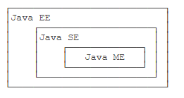

JDK即java development kit，Java语言的软件开发工具包。

JRE即java runtime environment，java运行时环境，

JVM即java virtual machine，java虚拟机

三者是包含的关系JVM是JRE的一部分，而JRE又是JDK的一部分。Java的跨平台性就是因为不同的平台有不同的JVM，它把字节码文件翻译成对应平台的机器码。

.java运行的时候要先编译成.class字节码文件，这个必须要用jdk，编译后的.class文件jre才能运行。如果只要运行.class的只有jre就行了，完整的开发即从源代码到机器码的话就需要jdk了，先编译成.class再由jvm翻译成对应不同平台的机器码。

---

简单来说，Java SE就是标准版，包含标准的JVM和标准库，而Java EE是企业版，它只是在Java SE的基础上加上了大量的API和库，以便方便开发Web应用、数据库、消息服务等，Java EE的应用使用的虚拟机和Java SE完全相同。

Java ME就和Java SE不同，它是一个针对嵌入式设备的“瘦身版”，Java SE的标准库无法在Java ME上使用，Java ME的虚拟机也是“瘦身版”。

