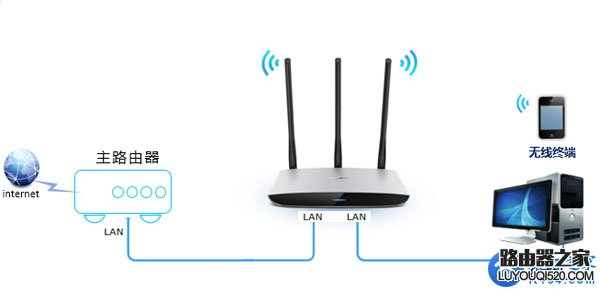

- #### RFC 

   Request For Comments（RFC），是一系列以编号排定的文件。文件收集了有关互联网相关信息，以及UNIX和互联网社区的软件文件。

- #### 真值，原码，补码，反码，移码

  到目前为止，我们学习了十进制、二进制、八进制、十六进制等用来代表实际数值的数，称为真值。
  正数的原码，反码，补码都是一致的就是前面加了个0表示正数，就是符号位加上真值的绝对值。如+11，这就是真值，原码即为011，**原码就是把真值的符号用0和1表示了**
  负数的（1）原码要在前面加个1表示表示是负数。
  ​            （2）反码除符号位外全部取反。
  ​            （3）补码除符号位以外剩下的取反加一。

   移码:对正数而言就是把符号位取反就可以了，对负数而言就是所有的位（包括符号位）取反加一。

   0的表示形式   原码: [+0]原=0000000  [-0]原=1000000
  ​                         反码: [+0]反=0000000  [-0]反=11111111
  ​                         补码: [+0]补=0000000  [-0]补=0000000
  ​                         移码: [+0]移=1000000  [-0]移=1000000

- #### 平假名和片假名

  平假名主要是用来表示日本固有的一些文字，说是平其实看着拐弯那种

  片假名是用来表示外来语等，看起来横平竖直不拐弯

- #### 固态硬盘那些事

  - 总线标准，是数据传输方式，也可以叫通道：PCI-E、SATA、并口（PATA）

    并口（PATA）对应的是IDE协议，为旧机械硬盘量身定做

    串口（SATA）对应的是AHCI协议，为新机械硬盘量身定做（为了缩短磁盘寻道时间）；

    扩展串口（PCIe） 对应的是NVMe协议，为厉害的固态硬盘量身定做

  - 物理接口：SATA、M.2，pci-e

     其实物理接口用什么和速度是没什么关系的，如果是SATA接口那么就是使用SATA通道走AHCI协议。而M.2接口有两种接口模式socket2和socket3，socket2对应的接口是bkey，对应的是传输模式为sata,如果用这个话那么用M.2物理接口和SATA是没有区别的。而socket3对应的接口是mkey，走的是PCI-e，这个时候才用的是更快的PCI-e。注意，走pcie不等同于支持nvme，pcie硬盘也有支持AHCI的

     **因为总线是pci-e标准，其实m.2接口的固态使用的时候是通过pci-e通道传数据，也有物理接口的pci-e，这种接口比m.2少了个转化的过程，理论上比m.2接口的速度快一些。**

  -   传输协议：AHCI、NVMe

      PCIE相比SATA有更快的速度，SATA总线一般采用AHCI协议，而PCIE一般使用NAMe协议。

      但需要注意的是使用NVMe的一定使用PCI-e，但是使用PCI-e的未必使用Nvme，也可能使用AHCI

      目前来看PCI-e搭配NVMe是最快的

  - **<u>总结</u>**：ssd的快慢和物理接口用什么没哈关系，主要看通道的选择和传输协议的选择，使用PCI-e的比SATA的更快，而且使用PCI-e的里面使用NVMe的最快。

- #### 渲染render（给予，呈现，递交，表达）

  - 存在于CG领域，电脑绘图中以软件由模型生成图像的过程，通俗理解就是绘制，其实把render直接翻译为绘制更好，就是把场景画出来的意思。
  - 我们平常说的渲染视频是一个过程，把一个视频进行各种处理添加字幕音乐等等等，把这些内容整合到一个完整的符合某个视频格式的视频文件中的过程就叫做渲染，也可以叫整合输出吧。

- #### P问题，NP问题，NPC问题。

   - P问题：可以找到一个能在多项式的时间里解决它的算法的问题

   - NP问题：可以在多项式时间里验证一个解。即可以在多项式时间内猜看给定的这个解对不对。(显然P属于NP，多项式时间的解都出来了，那么验证一个解当然可以，但是NP是否等于P现在还没有解决，是一个信息学巅峰问题)

   - NPC问题（NP完全问题）：首先是NP问题，其次所有的NP问题都能约化（**A问题的解法是B问题的一种特例，则A可以归约出B，即问题B的解法可以解决A，但是A的不能解决所有的B，A是B的一种特例。但要注意复杂度是A<=B。一个问题约化为另一个问题，时间复杂度增加了，问题的应用范围也增大了。通过对某些问题的不断约化，我们能够不断寻找复杂度更高，但应用范围更广的算法来代替复杂度虽然低，但只能用于很小的一类问题的算法。联想起约化的传递性，如果不断地约化上去，不断找到能“通吃”（即复杂度>=所有的NP问题）若干小NP问题的一个稍复杂的大NP问题，最后能找到一个时间复杂度最高，并且能“通吃”所有的 NP问题的这样一个超级NP问题，这样的问题就是NPC问题**）成它，当然不仅仅一个，是一类问题（他们之间复杂度取等号）。所有的NP问题都能在多项式时间内转化成NPC问题。

     证明一个问题是 NPC问题也很简单。先证明它至少是一个NP问题，再证明其中一个已知的NPC问题能约化到它。（注意找规约是找复杂度>=它的，如果不是NPC要找NPC的话就找>它的；如果是要从已知的NPC证它是NPC的话，就要取等号了，它和已知的NPC问题有相同的复杂度，都是最高的，那它也是NPC问题）现在已经有很多已证明是NPC问题的NP问题。

   - 现在要证明的P是否等于NP就是看P和NPC的关系，就是看NPC问题能否在多项式时间内求解。因为所有的NP问题都可以约化到NPC问题，一旦证明P=NPC，即NPC问题可以在多项式时间内求解，自然就证明了NP问题可以在多项式时间内求解。

     > 3SAT即布尔可满足性问题，也是第一个被证明的NP完全问题。
   
- #### brew

   类似于ubuntu上apt-get，可以实现包管理而不用关心各种依赖和文件路径的情况，简单的一些操作

   - 安装包  brew install <packagename>
   - 卸载包  brew uninstall <packagename>
   - 查询可用包 brew search <packagename>
   - 查询已安装列表 brew list
   - 查询任意包的信息 brew info <packagename>
   - 更新homebrew  brew update
   
- #### RGB

   RGB色彩模式是工业界的一种颜色标准，通过对红(R)，绿(G)，蓝(B)三个颜色通道的变化以及他们的相互之间的叠加得到各种各样的颜色。

   通常情况下，RGB各有256级亮度，从0到255，因此三种颜色可以组合出256✖️256✖️256=16777216种颜色。通常被简称为1600万色或千万色，也成24位色(2的24次方)。

- #### 单精度和双精度浮点数的十进制有效位数及误差出现的条件

   V=(-1)^s ✖️M✖️2^E

   s符号，M尾数，**<u>E阶码(是用阶数的移码减一表示的，在数值上就等于阶数+偏置值，偏置值就是2的n次方减一，n为阶码的位数</u>**)

   float

   float的规格化表示为：±1.f×2^E，其中，f是尾数，E是阶码，

   符号1位

   尾数23位

   阶码8位 

   比如十进制数123.125，其二进制表示为：1111011.001，规格化表示为1.111011001×2^6，阶数是6，即00000110，它的移码即为10000110，减1即为10000101；数值上即为133，就等于是阶数6加上偏置值128.

   ---

   double

   符号1位

   尾数52位

   阶码11位

   ---

   > <u>**规格化之后整数部分默认是1，可以省略，所以对于float而言，可以用23位存储24位的尾数。那么要把int用float表示时，只要int值（二进制表示）序列里只要存在这样的序列：从最低位开始找到第一个1，然后从这个1向高位数移动24位停下，如果更高的位上不再有1，那么该int值即可被float精确表示，否则就不行。简单说，就是第一个1开始到最后一个1为止的总位数超过24，那么该int值就不能被float类型精确表示。</u>**

   因此很容易得出，从1开始的连续整数里面第一个不能被float精确表示的整数，其二进制形式为：1000000000000000000000001，即16777217：1.000000000000000000000001×2^24，f
   有24位，最后一个1只能舍弃，也就是 1.00000000000000000000000×2^24，即1.0×2^24

   ，这个数实际上是16777216。也就是说16777217和16777216的内存表示是一样的。那么16777217之后下一个可以被float精确表示的是哪一个呢，就不断加1，直到满足第一个1和最后一个1不超过24位，即

   1000000000000000000000010，即16777218，如此下去。

   ```
   可以说7位的十进制可以完全精确，但是8位的不一定能精确
   ```

   双精度就是位数变了其他都一样的。

- #### 主析取范式和主合取范式

   主析取范式是极小项的析取（和），主合取范式是极大项的合取（积），主析取范式和主合取范式都是唯一的，那么相应的极小项和极大项也要为一，而极小项是且的形式，要表达结果唯一只能每个极小项都取真值为1，同样极大项要唯一只能取假。

   在用真值表法求主析取范式和主合取范式时，每个命题变元按照01变化展开，然后求出对应的整个命题表达式的真假值

   求主析取范式就取表达式的值为1时对应的P，Q，R的下标

   求主合取范式就取表达式的值为0

- #### 线性组合及线性相关

   > 一组向量A可以被另一组向量B线性表示，我A是B的一个线性组合，也可以说A可以被B线性表示。
   >
   > 在[向量空间](https://baike.baidu.com/item/%E5%90%91%E9%87%8F%E7%A9%BA%E9%97%B4)V的一组向量**A:** 如果存在**不全为零**的数 k1, k2, ···,km ,和向量组的每个向量相乘加起来结果是0向量，则称向量组**A**是线性相关的。如果不存在这样的一组不全为0的数，即当且仅当 k1, k2, ···,km全为0时，相乘相加才是0向量，那么我们就称A是线性无关的。

- #### 激活函数

   激活函数就是在人工神经网络上运行的函数，引入它的目的是为了增加网络模型的非线性，就是增加拟合性。

   > 如果不用激励函数，每一层输出都是上层输入的线性函数，无论神经网络有多少层，输出都是输入的线性组合，这种情况就是最原始的[感知机](https://baike.baidu.com/item/%E6%84%9F%E7%9F%A5%E6%9C%BA/12723581)（Perceptron）。
   >
   > 如果使用的话，激活函数给神经元引入了非线性因素，使得神经网络可以任意逼近任何非线性函数，这样神经网络就可以应用到众多的非线性模型中。

   [详情请点击这篇博客](https://blog.csdn.net/v_july_v/article/details/51812459)

- #### 卷积神经网络

   - 卷积层

     > 对图像（不同的数据窗口数据）和滤波矩阵（一组固定的权重：因为每个神经元的多个权重固定，所以又可以看做一个恒定的滤波器filter）做**内积**，也叫点积（逐个元素相乘再求和）的操作就是所谓的『卷积』操作，也是卷积神经网络的名字来源

     中间滤波器filter与数据窗口做内积，其具体计算过程则是：4✖️0 + 0✖️*0 + 0*✖️0 + 0✖️*0 + 0*✖️1 + 0✖️*1 + 0✖️*0 + 0✖️*1 + -4*✖️2 = -8。

   - 池化层

     池化，简言之，即取区域平均或最大。

- #### 机器学习

   机器学习中分为有监督、半监督和无监督学习，主要就是看给的数据中有无数据标注，也就是答案，即给个x有对应的y与之对应，事先已经完成分类或说明即完成标注。无监督学习给的数据都是未标注的，要自己找数据间的内在关系。还有就是增强学习，这个与前三类区别较大，**他是没有标注数据集的**。

   > 根据周围环境的情况（预先给出大规则），采取行动，根据采取行动的结果，学习行动方式 ，仅根据环境情况自我学习。
   >
   > 我们机器学习的算法叫做Agent .要根据周围的环境来采取行动，在我们采取了行动之后，我们的算法相应就会收到反馈，这种反馈有的时候是reward奖赏机制反馈，有的时候是惩罚机制进行反馈，不管怎样当我们Agent算法得到反馈之后，就会相应改进自己的行为模式，之后再面对环境的其他情况下根据改进的算法再做出相应的action动作，环境再反馈给我们的Agent以此类推 我们的Agent实在一轮一轮的行动反馈中组件增强自己的智能 

- #### 深度学习过拟合

   如果一味的为了**提高对训练数据的预测能力**，所选的模型就要不断增加复杂性，不断增加参数，最终就会导致拟合的函数完美的预测训练集，但对新数据的测试集预测结果差。 过度的拟合了训练数据，而没有考虑到泛化能力。

   通俗讲就是模型太好了，给的都能学到，由于数据集的抽样本质，那么其中不可避免就会存在有误差的数据。比如样本是X，X=x（真值）+u（随机误差），给的是X他就按照X学，但我

- #### 集合预算的两个重要定律

   集合的分配对偶率：A∩(B∪C)=(A∩B)∪(A∩C)；A∪(B∩C)=(A∪B)∩(A∪C) 

   > 需要注意的是括号是在后面的，这样才可以分配，如果括号里的是前面连个就不能用分配对偶率了。

   集合的对偶率：(A∪B)^C=A^C∩B^C；(A∩B)^C=A^C∪B^C

   > 这里后面^C的意思是取余集，其实就是德摩根率，真是闲的蛋疼。

- #### 奇偶校验

   就是在传输的数据中加上了一位校验位。选择奇校验还是偶校验是事先确定好的。

   奇校验：原始数位+校验位总共有奇数个1（就是说如果原数位有奇数个1，那么校验位就是0；同样如果数据位有偶数个1那么校验位就是1.就是无论如何确保所有位一共有奇数个1，即全部异或起来之后是1。）

   偶校验：原始数位+校验位总共有偶数个1（原理和上面的奇校验相反）

   那么检测的时候就把接收到的所有数据位全部异或，奇校验的话结果是1就代表正确，偶校验的话结果是0就代表正确。**但是这种方法只能检测出奇数个错误，由异或的原理我们可以知道偶数个错误的结果和正确情况的结果是一致的；其次它只能检测出错误但是并不能修改。**

- #### 使用终端编写java

   与c++类似，vim 文件名.java新建一个java文件，i编辑然后esc退出编辑，：wq保存之后javac 文件名.java即可编译文件，生成一个.class后缀的文件，然后java 文件名即可执行出结果（文件名必须是类名，还有就是最后执行的时候输入文件名即可不用输入.class后缀）。

- #### 网关

   本质上就是个IP，因此在第三层实现不同网段之间的通信。网关的功能可以由不同的物理设备来实现，例如路由器或者三层交换机等。网关相当于一个网段的大哥，这个网段中的A要给其他网段的人B发东西需要先发给大哥，然后大哥发给目的网段的大哥，目的网段的大哥再给目的人B。

- #### 路由器和交换机

   **交换机一般会用到VLAN技术，即将物理的局域网LAN分割为不同的VLAN，根据MAC（二层交换机）或者IP（三层交换机，就和子网一样了）**

   **划分子网就是就要用到IP了，处于第三层，需要用到路由器或者三层交换机。**

   **路由器等于网络代理+交换机，交换机的功能路由器有，但是组建局域网的时候只需要交换机的连接功能而不需要网络代理功能，而且交换机的口一般很多，所以组建局域网一般用交换机<u>`（理论上只用交换机也可以组建局域网，如果不同网段不需要通信的话。但是不同网段要通信就需要用到网络模型中第三层的部分，例如路由器或者三层交换机）`</u>，当然路由器也可以但是用路由器的话它的网络代理功能就浪费了，而且路由器的口少，同样的设备用路由器需要更多个，就带来了更高的成本。**

   - 路由器工作在网络层，交换机工作在数据链路层

   - 路由器根据ip地址来转发ip数据报/分组，交换机是根据mac地址转发数据帧

   - 交换机主要是配合路由器用来组建局域网，只是做转发，ip划分是上层的路由器在做，交换机不分ip；而路由器主要是用来连接外网。通过交换机组建的局域网是不能访问外网的，所有主机用的都是私网的ip，必须通过路由器转换成公网的ip之后才能访问外网。

   - 简单来说交换机共享一根网线但是ip不同，而路由器共享一个ip

     > 交换机主要是用来构建局域网的，只转发数据，没有上网的功能，要上网的话交换机上面必然还有一个路由器。
     >
     > IP地址分为共有地址和私有地址。共有地址就是从ISP那儿申请的，私有地址就是局域网络里可以随便用的，不同的共有地址里的私有地址可以一样因为他们属于不同的局域网，而局域网与外网通信的话过的都是共有地址那个大IP。
     >
     > **校园网就是一个大的局域网，有一个或多个总的大ip即公网ip连接到internet，内部的局域网ip访问外部都是通过这一个或几个大ip，但是从外网看他们是一个ip，公网ip是独一无二的。**

- #### 路由器当交换机使用

   - 关闭dhcp服务器（因为当交换机用的话就是前面的路由器来dhcp了，这儿再开就冲突了）

   - 在网络参数的lan口设置里把IP地址修改为与主路由器的LAN口IP在同一网段但不冲突。

     

     在学校的话主路由器就是前面的大路由器，插网线使用ipconfig命令得到ip，跟他在一个网段然后不重复就行。

     再比如是网线先接主路由器，从lan口拉了一条出来又想接从路由器，而tplink路由器的默认IP地址为192.168.1.1，那么这儿我们就把后面的从路由器修改为192.168.1.X（X位于2-254之间）。**保存并重启路由器**。

   - 网线接lan口，然后设备也接lan口上网即可，无线也是可以用的

- #### 以太网

   它并不是网，而是一种局域网技术，包括一些局域网标准和一些通讯协议。

- #### IP

   用于局域网中的ip都是私有ip，是可以重复的，与共有ip不冲突，对内用内网ip来区分，对外上因特网的话是用一个公网的ip。

   - 私有IP地址范围：

     **A: 10.0.0.0~10.255.255.255 即10.0.0.0/8**

     **B:172.16.0.0~172.31.255.255即172.16.0.0/12**

     **C:192.168.0.0~192.168.255.255 即192.168.0.0/16**

   - 公有IP地址范围：

     **A: 0.0.0.1-- 9.255.255.255 & 11.0.0.0--126.255.255.255/8**

     **B:128.0.0.0--172.15.255.255 & 172.32.0.0--191.255.255.255/12**

     **C: 192.0.0.0-- 192.167.255.255 &192.169.0.0--223.169.255.255/16**

     > 私有的ip是非注册地址，是不允许出现在公网中的。

- #### 条形码与二维码

   - 条形码又一维码，仅在水平方向记录表达信息，其高度是为了扫描器的对准
   - 二维码相对于一维码增加了垂直方向，可以表达的信息大大增加因此更广泛的使用

- #### 物联网定义

   **物联网**(The Internet of Things)的概念是在1999年提出的，它的定义很简单：把所有物品通过射频识别等信息传感设备与互联网连接起来，实现智能化识别和管理。

- #### RFID

   射频识别技术，又称无线射频识别。是物联网中常用的一种技术，是一种[通信技术](https://baike.baidu.com/item/%E9%80%9A%E4%BF%A1%E6%8A%80%E6%9C%AF/2865397)，可通过无线电讯号识别特定目标并读写相关数据，而无需识别系统与特定目标之间建立机械或光学接触。包括三部分

   - [应答器](https://baike.baidu.com/item/%E5%BA%94%E7%AD%94%E5%99%A8)：由天线，耦合元件及芯片组成，一般来说都是用[标签](https://baike.baidu.com/item/%E6%A0%87%E7%AD%BE)作为应答器，每个标签具有唯一的电子编码，附着在物体上标识目标对象。
   - 阅读器：由天线，[耦合](https://baike.baidu.com/item/%E8%80%A6%E5%90%88)元件，芯片组成，读取（有时还可以写入）标签信息的设备，可设计为手持式rfid读写器或固定式读写器。
   - 应用软件系统 ：是应用层软件，主要是把收集的数据进一步处理，并为人们所使用。

   像我们日常使用的身份证银行卡等都用到这个技术，这个技术可以有效的的吧物品于互联网连接起来，再通过一些软件我们可以很方便的对物品进行识别和管理。

- #### 数据和信息

   data并不等于information

   数据是事实或观察的结果，是对客观事物的逻辑归纳，适用于表示客观事物的未经加工的原始材料。

   而数据根据我们的要求进行加工处理之后提炼出来的我们想要的东西就是信息。

- #### 密钥

   密钥是一种参数，它是在明文转换为密文或将密文转换为明文的算法中输入的参数。密钥分为对称密钥与非对称密钥。


- #### 编译的过程

  - 预处理。g++  -E  test.cpp  -o  test.i

    处理宏定义和头文件。将原文件test.cpp扩展为test.i文件

  - 编译。    g++  -S  test.i**(也可以用g++ -S test.cpp直接把.cpp变成test.s)**

    将c++代码转换为汇编代码。将预处理输出文件test.i会变成test.s

  - 汇编。    g++  -c  test.s**(同理也可以直接g++ -c test.cpp直接编译生成test.o)**

    将汇编语言翻译成机器指令。将汇编文件test.s变成test.o文件

  - 链接。   g++  test.o  -o  test

    将.o文件与.lib库文件链接生成可执行文件。生成可执行文件test

- #### CDN和cookie

  CDN的全称是Content Delivery Network，即内容分发网络，是通过在网络各处放置[节点服务器](https://baike.baidu.com/item/节点服务器/4576219)所构成的在现有的互联网基础之上的一层智能[虚拟网络](https://baike.baidu.com/item/虚拟网络/855117)，CDN系统能够**实时**地根据**网络流量和各节点的连接、负载状况以及到用户的距离和响应时间等综合信息**将用户的请求重新导向离用户最近的服务节点上。其目的是使用户可就近取得所需内容，解决 Internet网络拥挤的状况，提高用户访问网站的响应速度。 

  cookie是网站存储在用户本地终端上的数据，Cookie是当你浏览某网站时，网站存储在你机器上的一个小文本文件，它记录了你的用户ID，密码、浏览过的网页、停留的时间等信息，当你再次来到该网站时，网站通过读取Cookie，得知你的相关信息，就可以做出相应的动作，如在页面显示欢迎你的标语，或者让你不用输入ID、密码就直接登录等 

- #### typora调整图片大小

  使用img标签

  ```text
   
  ```

  在我这儿src即为"image/1.jpg"

  不用点上面的插入图像，直接输出这个代码即可