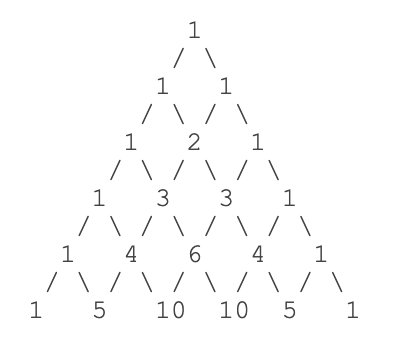
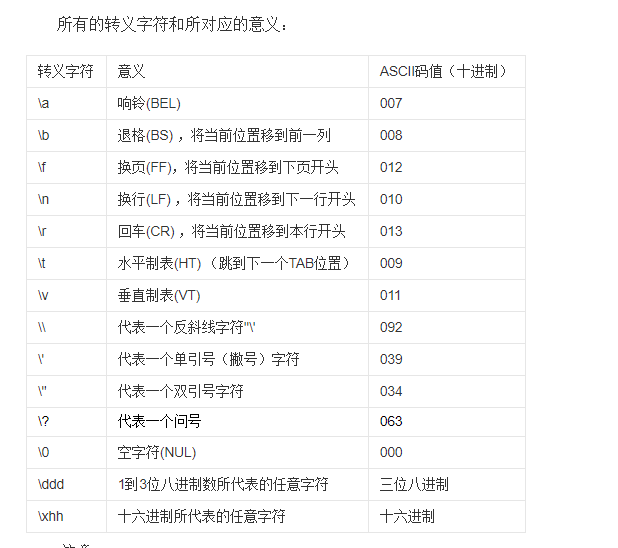
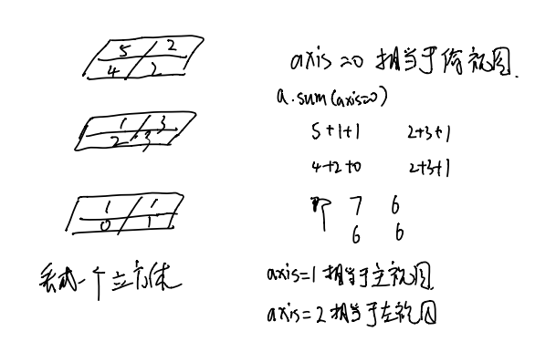

- #### x的y次方

  可以用x**y，也可以导入math模块之后使用pow函数，pow(x,y)

  c++里只能用cmath模块(math是以前老的，现在cmath才是标准库函数），没有x**y这种用法

- #### 逗号和加号

  print语句中会把逗号，当成空格

  eg print 'a','b'   输出就是a b

  ​     print 'a'+'b'  输出就是ab，没有空格

  但是+不能连接不同数据类型，例如print 'a'+':',3，后面是数字前面是字符串不能用加号+连接，可以改成print 'a'+':'+'3'，这样是可以的，而且没有空格。

- #### 动态语言

  python是动态语言，就是变量本身的类型是不固定的，在Python中，等号`=`是赋值语句，可以把任意数据类型赋值给变量，同一个变量可以反复赋值，而且可以是不同类型的变量，例如：

  ```python
  a = 123    # a是整数
  print a
  a = 'imooc'   # a变为字符串
  print a
  ```

  这种**变量本身类型不固定的语言称之为动态语言，与之对应的是静态语言**。

  静态语言在定义变量时必须指定变量类型，如果赋值的时候类型不匹配，就会报错

- #### python里的字符串可以用单引号或者双引号表示都可以

  - 一般就用单引号。例如print 'helloworld'。
  - 但如果输出的本身有单引号，那就要用双引号了。如“I‘am OK”
  - 同样输出本身有双引号那就用单引号廓住
  - 如果一个字符串包含很多需要转义的字符，对每一个字符都进行转义会很麻烦。为了避免这种情况，直接用''' …….''' 或者r''' …….''' 即用三个单引号或者双引号把中间的东西包住就行了
  
- #### False的定义
  
  Python把`0`、`空字符串''`和`None`看成 False，其他数值和非空字符串都看成 True

  但None和空字串' '是不一样的，一个是Nonetype型，一个是str型

- #### 短路计算

  python中使用短路计算(首先要遵循上面那个大定义)

  - 在计算` a and b `时，如果 a 是 False，则根据与运算法则，整个结果必定为 False，因此返回 a；如果 a 是 True，则整个计算结果必定取决与 b，因此返回 b。

  - 在计算` a or b `时，如果 a 是 True，则根据或运算法则，整个计算结果必定为 True，因此返回 a；如果 a 是 False，则整个计算结果必定取决于 b，因此返回 b。

  所以Python解释器在做布尔运算时，只要能提前确定计算结果，它就不会往后算了，直接返回结果，如果只看前面确定不了，结果就根据后面的值决定。eg：

  ```
  a = 'python'
  print 'hello,', a or 'world'
  
  b = ''
  print 'hello,', b or 'world'
  ```

  输出结果为

  ```
  hello, python
  hello, world
  ```

  第一个a为非空字符串，真，后面是or因此无论后面是啥结果都是真，故取python

  第二个b为空字符串，假，后面是or因此整个表达式的取值就要看后面的了，world为真故取world。

- #### list类似于c++的数组

  python中定义的list就类似于c++中的数组，但是list中可以有不同类型的元素。a[3]就表示有三个元素a[0],a[1]a[2]

  在python里还有个可以倒着输出的表示但是数字顺序略有不同例如a[-1,],a[-2],a[-3]就相当于前面的a[2],a[1],a[0]

  - 插入元素

    在list里插入元素使用insert().如在上面的a中加元素可以使用a.insert(0,'Paul')，两个参数，第一个表示插入的位置，第二个表示插的是什么。

  - 删除元素

    删除的话用pop(),里面只有一个参数就是要删除元素的索引位置，即a[0]中的0

- #### tuple

  tuple是另一种有序的列表，中文翻译为“ 元组 ”。tuple 和 list 非常类似，但是，tuple一旦创建完毕，就不能修改了。但要注意这里所说的不变说的是每个索引的指向不变，如果tuple里面有一个list，例如
  
  ```python
  >>> t = ('a', 'b', ['A', 'B'])
  >>> t[2][0] = 'X'
  >>> t[2][1] = 'Y'
  >>> t
('a', 'b', ['X', 'Y'])
  ```

  这样是可以的，因为本质上tuple[2]的指向仍然没有变，变得只是list

  > 当tuple只有一个元素时，要在这个元素后面加个逗号不然会把括号当成表示运算优先级的括号。
  
  t=(1)

​       t的类型就是int，因为把括号当成了运算优先级

​       t=(1,)

​       这样t的类型就是tuple了

- #### c++中用else if，而python中用elif

  c++是if(...)                             python是if ……:

  ​           …………....;                                        …………......

  ​          else if(....  )                                   elif……:

  ​           …………....;                                        ………………...

- #### dict（字典）

  表示一个关键字和值的对应关系的集合，用{}表示。dict={ key1:value1 , key2;value2 ...}

   如学生姓名list

   ['Adam', 'Lisa', 'Bart']

  和考试的成绩list

  [95, 85, 59]

  可以关联起来

  ```python
   d = {
        'Adam': 95,
        'Lisa': 85,
        'Bart': 59
    }
  ```

  前面的名字叫key，后面的分数叫value，dict的作用就是根据key来找value

  >list和tuple是有序的，每个元素都有固定的顺序索引，而且内容是可以重复的，因为索引不一样；
  >
  >dict和set都是无序的，但是dict的key和set的元素内容是不能重复的。有时候我们只想要dict中的key而不想要value，这个时候就可以用set，它和dict一样没有顺序但是不可重复。

- #### Set

  set初始化需要传入一个list

  ```python
  l=set([1,2,3,4])
  print(type(l),l)
  ```

  输出为

  ```python
  <class 'set'> {1, 2, 3, 4}
  ```

- #### list，tuple，dict，set添加删除元素

  - list

    - 添加：list.insert(i,'s')。i是位置索引，'s'是要插入的内容

      ​           list.append('s')。加到结尾

    - 删除：list.pop(i)

  - tuple

    tuple的值不能变，但是其中嵌套有list时，list的值可以改

  - dict。key和value的键值对，一个key只能对应一个value，但是一个value可以对应多个key，属于满射

    - 添加：dict['key']=value     
    - 删除：dict.pop('key')

    > dict操作时dict要带引号，而set不用

  - set。set和dict类似，是一组key的集合，但没有value。因为key不能重复，因此set中无重复元素，且无序。

    - 添加：set.add(key)
    - 删除：set.remove(key)

- #### 汉诺塔

  给a,b,c三个柱子，a上面放着n个圆盘，且都是下面的比上面的大，借助b全部移动到c上去，要求顺序一致

  代码为：

  ```python
  def hanoi(n, a, b, c):
      if n == 1:
          print a, '-->', c
      else:
          hanoi(n - 1, a, c, b)
          print a, '-->', c
          hanoi(n - 1, b, a, c)
  hanoi(4, 'A', 'B', 'C')
  ```

  这里取n为4来测试结果是正确的，这里用的是递归的思想，把a上面的圆盘看成两部分，最下面的一块和的上面的n-1块，line 5意思是通过c把a上面的n-1块放到b上，line 7就是通过a把刚才放到b上的n-1块再放到c上。递归调用。

   <u>整个算法可以理解为三步：(就是else下面的那三步)</u>

  <u>1.先把A上的n-1个移动到B上</u>

  <u>2.把A上最大的那一个移动到C上</u>

  <u>3.再把刚才移动到B上的n-1个移动到C上</u>

- #### 默认参数与可变参数

  - 默认参数

    python函数一般有两个参数（也可以定义多个），但是必须参数必须在默认参数的前面，eg def abs（a,b=1）这样是可以的，但是def abs(a=1,b)这样就是错误的.默认参数的作用是简化调用，你只需要把必须的参数传进去。但是在需要的时候，又可以传入额外的参数来覆盖默认参数值。

    我们来定义一个计算 x 的N次方的函数:

    ```python
    def power(x, n):
        s = 1
        while n > 0:
            n = n - 1
            s = s * x
        return s
    ```

    假设计算平方的次数最多，我们就可以把 n 的默认值设定为 2：

    ```python
    def power(x, n=2):
        s = 1
        while n > 0:
            n = n - 1
            s = s * x
        return s
    ```

    这样一来，计算平方就不需要传入两个参数了：

    ```
    print power(5)
    25
    print power(5,3)
    123
    ```

    > 简言之默认参数就是为了方便，如果定义函数时默认参数有一个默认值，那么调用函数时如果不给默认参数赋值，就用默认值，如果赋新值就用新的.

  - 可变参数

    可变参数有两种，*args非关键字参数和**kwargs关键字参数。

    *args可以接受任意数量的参数，并打包成tuple给函数

    ```python
    def f(x,y,*args):
        print(args,type(args))
        print(x,y,args)
    f(1,2,3,4,5)
    ```

    输出结果为

    ```python
    (3, 4, 5) <class 'tuple'>
    1 2 (3, 4, 5)
    ```

    而**kwargs接受任意数量的参数打包成dict给函数

    ```python
    def f(x,y,**kwargs):
        print(kwargs,type(kwargs))
        print(x,y,kwargs)
    f(1,2,a=3)
    ```

    输出结果为

    ```python
    {'a':3} <class 'dict'>
    1 2 {'a':3}
    ```

- #### 切片操作

  **l[a:b :1(-1)]**

  **切片操作有三个参数前两个表示开始和结束的索引位置，最后一个参数默认为1，表示从从左往右切片，如果是-1的话表示从右往左切片。最后一个参数代表的切片方向必须和起始点表示的方向相同即a->b，不然结果就是空列表。如**

  **l[1:6:-1]:1->6表示从左往右，而最后-1表示的是从右往左，冲突，因此结果为空列表。**

  例如L为一list

  L[0:2]就表示从索引0开始取取到索引2为止但不包括索引2，即索引0，1。

  L[1:3]取的就是L[1],L[2]

  L[:]表示从头取到尾

  还可以有第三个参数表示每N个取一个，eg:L[::2]就表示从头取到尾而且每两个元素只取一个即L[0],L[2]……...

  list[a:b]就是从下表a开始取值取到b，但是不包括b，如list[-2:-1]，-1表示最后一个，这个就表示从倒数第二个开始取取到倒数第一个，但是不包括最后一个，就是取第二个。**即list[start, end）**

  > list[0]表示第一个，但如果list为空时没有0这个索引这样用会报错，应该用list[:1],这样不管是不是空都表示第一个，不会出错。

  > 同样list[-1]表示最后一个，但如果list为空时同样会报错，应该用list[-1:]

- 对字符串同样可以用切片操作slice，只是切片的结果还是字符串

  有个字符串方法upper()可以吧字符串变成大写字母，eg：'abc'.upper()，输出即为'ABC'.现在利用切片操作定义一个函数只让字符串的第一个字母变大写，

  ```
  def firstcharupper(s):
     return s[:1].upper()+s[1:]   ##为了安全起见最好用s[:1]而不要用s[0],这样索引不会出错
  print firstcharupper('hello')
  ```

  输出结果即为Hello

- #### 迭代和递归

  - 迭代其实就是循环，迭代是利用变量的原值推算出一个新值，即为了实现某个目的不断调用某个算法，即A不断调用B
  - 递归是一个函数在自己的函数体里自己调用自己，不断缩小问题的规模，将迭代中的A不断调用B中的B换成A即变为递归。

  递归中一定有迭代，但迭代中不一定有递归，递归是一种特殊的迭代，即刚好调用的是A本身，大部分可以相互转换.能用迭代的不用递归,递归调用函数,浪费空间,并且递归太深容易造成堆栈的溢出.

- #### enumerate()

  对于一个list，可以使用enumerate()方法为它的每个元素加上索引

  注意enumerate()函数返回的是enumerate(枚举)对象，要输出成list的样子需要对enumerate的对象再list一下，即list(enumerate(L)).

  ```python
  L = ['Adam', 'Lisa', 'Bart', 'Paul']
  print(list(enumerate(L))
  ```

  结果即为

  0 : Adam
  1 : Lisa
  2 : Bart
  3 : Paul

  再比如在for循环中：

  ```python
  l=['a','b','c']
  for x,y in enumerate(l):
      print(x,y)
  ```

  输出即为

  0 a
  1 b
  2 c

- #### dict的迭代

  - key的迭代直接用for key in **d**:
  - value的迭代用for value in **d.values()**:
  - key和value同时迭代用for key，value in **d.items()**:

- #### 在python中函数名其实就是指向函数的变量

  eg：求绝对值的函数abs()

  abs(-1)

  结果即为1

  f=abs

  f(-1)

  结果也为1

  如果abs=len

  那么这时abs(-1)就会报错

  而abs([1,2,3])结果正确且输出3

- #### 高阶函数：能够把函数作为传入参数。同样也可以把函数作为返回值

  ```python
  def add(x,y,f):
      return f(x)+f(y)
  add(-5,9,abs）
  ```

  结果即为14，即把函数名看做指向函数的变量之后，就可以把函数看成变量从而当作参数，高阶函数的参数里面就有作为参数的函数

  同样也可以把函数作为返回值

  ```python
  def lazy_sum(*args):
      def sum():
          ax = 0
          for n in args:
              ax = ax + n
          return ax
      return sum
  ```

  使用lazy_sum([1,2,3])时，输出是，

  ```
  <function lazy_sum.<locals>.sum at 0x100cd49e0>
  ```

  即内部嵌套函数的地址，要输出结果就要用

  ```python
  f=lazy_sum(1,2,3)
  print(f())   #调用f才会输出结果
  ```

  两步也可以合起来

  ```python
  print(lazy_sum(1,2,3)())
  ```

  和上面结果一样

- #### 闭包（closure[ˈkləʊʒə(r)]）

  闭包：如果在一个内部函数里对外部函数（不是在全局作用域）的变量进行引用，内部函数就被认为是闭包。

  要创建闭包，必须满足以下条件：

  - 必须包含一个嵌套函数

  - 嵌套函数必须引用封闭函数中定义的值（自由变量）

  - 封闭函数必须返回嵌套函数

    ```python
    def fun1(x):
      def fun2():
        return x+1
      return fun2
    print(fun1(2))
    print(fun1(2)())
    #或者
    a=fun1(2)
    print(a)
    print(a())
    ```

    两个输出一样

    ```python
    <function fun1.<locals>.fun2 at 0x104299ea0>  #fun1中fun2函数的地址即fun2函数
    3                                             #加括号之后才是调用
    ```

    当外部函数fun1(x)被调用时，一个闭包**fun2()**就形成了，并且该闭包持有自由变量 - `x`。这也意味着，当函数 `outer(x)` 的生命周期结束之后，变量 `x` 的值依然会被记住。

- #### iterable和iterator

  - 凡是可作用于for循环的对象都是Iterable类型；

  - 凡是可用作next()函数的对象都是Iterator类型，它表示一个惰性计算的序列。例如map()函数返回值即为iterator，例如

    ```python
    def f(x):
        return x*x
    a=map(f,[1,2,3])
    print(next(a))    #输出1
    print(next(a))    #输出4
    print(next(a))    #输出9
    ```

    但是一个一个next太麻烦了，因为iterator也是iterable的，所以实际中使用for循环输出

    ```python
    def f(x):
        return x*x
    a=map(f,[1,2,3])
    for x in a:
        print(x)
    ```

  - 集合数据类型如list，dict，str等是Iterable但不是Iterator，不过可以通过iter()函数获得一个Iterator对象。

    Iterator对象表示的是一个数据流，Iterator对象可以被next()函数调用并不断返回下一个数据，直到没有数据时抛出StopIteration错误。可以把这个数据流看做是一个有序序列，但我们却不能提前直到序列的长度，只能不断通过next()函数实现按需计算下一个数据，所以Iterator的计算是惰性的，只有在需要返回下一个数据时它才会计算。

    而像list这些提前就知道了长度


- #### map()函数

  为python中内置的一个高阶函数，两个参数，第一个参数是一个函数f(x)，第二参数是iterable，输出结果为将每个list中的元素执行函数f(x)，结果作为一个iterator返回，想打印出来的话要list()一下

  eg： def f(x):

  ​         return x*x

  ​         print(list(map(f,[1,2,3])))

  输出结果即为[1,4,9]

- #### reduce和filter

  - ```python
    from functools import reduce
    ```

    reduce函数的参数函数f要有两个参数，每次操作两个数，reduce把这两个数的结果继续和下一个元素用f做累计运算,reduce的结果是一个数而不是iterabtor

  - filter()函数接收一个函数 f 和一个list，这个函数 f 的作用是对每个元素进行判断，返回 True或 False，filter()根据判断结果自动过滤掉不符合条件的元素，结果是一个filter对象，和map一样也需要list()一下。

- #### **匿名函数**

  关键字为lambda(希腊字母中的拉姆达)

  - 创建

    例如用map函数的时候上面那种情况就可以写成map(lambda x:x*x [1,2,3])

    lambda表示这个函数是匿名函数，冒号前面的是参数（可以有多个），后面是函数的表达式，而且只能有一个表达式，不用写return，函数的返回结果直接就是表达式的值。

  - 调用

    用一个变量来接受这个匿名函数，然后通过这个变量调用

    ```python
    a=lambda x:x*x
    print(a(3))  
    ```

- #### 关于包和模块

  - 模块：是一个单独的.py文件，用于存放一些功能相关的代码，可以是代码更加容易维护，提高代码的重用价值。相同名字的函数和变量可以放到不同的模块中，除了python的内置函数。**导入的时候直接import+模块名就行。**
  - 包：是一个有层级的目录结构，包含n个模块或者n个子包，包中一定要有_  _init_ _.py文件，这个文件可以是空的啥都不写但是必须得有，不然就会被当作普通的目录而不是package。**可以from 包 import 模块也可以直接import 包**
  
  - 库：是完成一定功能的代码集合，其实也是个包。即为了处理某一问题的包含多个module的一个package。**import tensorflow就是导入包，然后tf.train.a()，train就是其中一个模块，a是模块中一个函数**
  
- #### try、except语句

  用来抓错误，没有错误就执行try后面正常的，捕捉到指定错误是执行except语句。

  ```
  try:
      from cStringIO import StringIO
  except ImportError:
      from StringIO import StringIO
  ```

  正常就从cStringIO安装，如果出现导入错误就执行except下面的，从StringIO安装。

- #### 类和对象

  ```python
  class Person:
     address='china'       #这个是定义了一个类属性
     def __init__(self,name,gender)：   #初始化函数，每次创建对象都会调用这个函数，self是对象的引用，后面的参数是对象的属性
     self.name=name
     self.gender=gender
  xiaoming=Person('xiaoming','男)     #创建对象
  xiaoming.addres   #实例对象也是可以调用类属性的，但是当类属性和对象属性名字存在冲突时，先调用对象属性
  ```

  但是类对象是不能调用实例属性的

  ```python
  class People(object):
      name = 'Tom'  # 公有的类属性
  
      __age = 12  # 私有的类属性
      #  实例属性
      def __init__(self,height):
          self.height = height
  
  p = People("183cm")
  
  print(p.name)  # 正确,实例对象可以访问类属性
  
  print(People.name)  # 正确，类对象可以访问类属性
  
  print(People.height)  #  错误，类对象不能访问实例属性
  ```

- #### private

  如果要让内部属性不被外部访问，可以把属性的名称前加上两个下划线`__`，在Python中，实例的变量名如果以`__`开头，就变成了一个私有变量（private），只有内部可以访问，外部不能访问

  ```python
  class Person:
    def __int__(self,name,gender):
      self.__name=name
      self.__gender=gender
  ```

  这样对象就无法直接访问name和gender属性，可以通过创建类方法间接访问

  ```python
  class Person:
    def __int__(self,name,gender):
      self.__name=name
      self.__gender=gender
    def get_name(self):
      return self.__name
    def set_name(self,name):
      self.__name=name
  ```

- #### 类的继承

  比如从Person类继承得Student类
  
  定义Student类从Person类继承，加了一个额外的属性score，加到初始化函数里，同时注意一定要在def __init__(self, name, gender):后面加一句`super(Student, self).__init__(name, gender)` 去初始化父类，否则，继承自 **Person** 的 **Student** 将没有 **name** 和 **gender**，相当于再重复一下父类的属性。
  
  ```python
  class Student(Person):
    def __init__(self, name, gender, score):
      super(Student, self).__init__(name, gender)
      self.score = score
  ```
  
- #### 使用**kw定义多个对象属性

  ```python
  class Person(object):
      def __init__(self, name, gender, **kw):
          self.name=name
          self.gender=gender
          for k,v in kw.items():
              setattr(self,k,v)
  p = Person('Bob', 'Male', age=18, course='Python')
  print p.age
  print p.course
  ```

  关键字**kw代表的意思就是多个属性，下面用一个循环

  ```python
  for k,v in kw.iteritmes():
    setattr(self,k,v)
  ```

  这样就把**kw的属性加入到初始化类中了，直接print p.属性   就可以输出

- #### 最大公因数

  求最大公因数的函数

  ```
  def gcd(a,b):
     if b==0:
         return a
     return gcd(b,a%b)
  ```

  其实就是用了欧几里得算法，即辗转相除法（在数论中也有涉及）

  > a=k*b+c,则a，b的最大公约数等于b，c的最大公约数

- #### 字母大小写函数

  title()函数，首字母大写

  upper（）全部大写

  lower（）全部小写

- #### 传值和传引用

  ```python
  a = [1,2,3]
  b = a          #传引用，两者指向同一个list，一个修改另一个也改了
  a.pop(2)       #print(a)和print(b)结果都是[1,2]
  --------------------
  a = [1,2,3]
  b = a[:]       #传值，利用切片操作，相当于是一个copy，这样二者互不干扰
  a.pop(2)       #print(a)结果[1,2]，而prin(b)结果仍为[1,2,3]
  ```

  但是如果重新赋值，那就变了

  ```python
  a=[1,2,3]
  b=a
  a=[4,5,6]   #并不是对原来的list操作，而是重新赋值，即重新给了一个指向，因此a变了但b还是指向原来的list
  print(a)    #[4,5,6]
  print(b)    #[1,2,3]
  ```

- #### 在python中除法分为三种

  - /：是精确除法，除的结果是浮点数，即使是两个整数恰好整除能除尽，也是浮点数。
  - //：称为地板除，两个整数相除结果永远是整数，即只取整数部分，但两个浮点数就不一定了
  - %：整数相除取余数，这个就是常规的了

- #### 输出格式化的字符串

  使用%来实现，%d是整数。%f是浮点数，%s是字符串（这个是万能的，如果提前不知道后面要输入的是什么类型的，就用这个）

  print('hello,%s'%'world')

  hello,world

  中间那个百分号前面是要模板，后面时输入的，如果只有一个就不用括号括住了，用后面的部分替代前面%s的位置。

  print('hi,%s,your have$%d'%('yinuo',10000))

  hi,yinuo,your have$10000

- #### input()函数

  用来接收屏幕的输入，注意input有个参数prompt**(adj:迅速的，及时的，立即；n：提示，提示符）**即input（prompt），实际上括号里这个可有可无，就是个提示语，有的话就会在屏幕上打印出来，然后在这个字符串后面输入的值就会被赋值给前面的变量，没有的话就直接把输入的赋值给前面的变量。！！！input返回的数据类型是str，所以如果要和数操作的话要用int（）转换类型。

  a=input("hahah")

  执行之后屏幕上就会显示hahah，然后在后面输入个字符串回车，这个字符串就被赋值给了a

  a=input()

  执行之后屏幕上什么都不显示，你输入什么就把什么赋值给a，其实和上面那个一样，就是里面多了个提示语prompt

- #### range()

  有三个参数，start，stop和step，start表示从start开始（包括start，默认是0），stop表示到这儿停（不包括stop这个数），step表示步长，即隔几取一个数，默认是1

  `range(101)`就可以生成0-100的整数序列，range(n)就会生成0到n-1共n个整数的整数序列，一般用在循环中的时候自动变成了list，eg:for x in range(10)。但是其实range(n)并没生成一个list，直接print就可以知道，print(range(10))，结果是range(10),要让结果输出list的样子，还需要在输出的时候加上list关键字，即print(list(range(10)))

  arange有着和range类似的功能，也是三个参数，但是range返回的是range object，而arange返回的是numpy.ndarray

- #### dict和list的优缺点

  1. 查找和插入的速度极快，不会随着key的增加而变慢；（相当于看目录查字典）
  2. 需要占用大量的内存，内存浪费多。

  而list相反：

  1. 查找和插入的时间随着元素的增加而增加；（相当于从头开始一个一个翻着找）
  2. 占用空间小，浪费内存很少。

  所以，dict是用空间来换取时间的一种方法。

- #### replace()

  ```python
  a = 'abc'
  b = a.replace('a', 'A')
  print(b)   #结果为'Abc'
  print(a)   #结果为'abc'
  ```
  
    a.replace相当于创建了一个新的Abc字符串，但是a仍然指向abc
  
- #### python的函数可以有多个返回值

  ```python
  import math
  
  def move(x, y, step, angle=0):
      nx = x + step * math.cos(angle)
      ny = y - step * math.sin(angle)
      return nx, ny
  ```

  ```python
  >>> x, y = move(100, 100, 60, math.pi / 6)
  >>> print(x, y)
  151.96152422706632 70.0
  ```

  但其实只是一种假象，

  ```python
  >>> r = move(100, 100, 60, math.pi / 6)
  >>> print(r)
  (151.96152422706632, 70.0)
  ```

  其实返回值是一个tuple

- #### 换行输出

  - 字符串换行输出的话直接再print里换行就行

    print("""aaa

    aaa

    aaa

    aaa""")   (单引号双引号都可以)

  - 变量的话用print(a,b,sep='\n')，sep即间隔符，默认是空格，即print(a,b)即会输出a空格b

    可以人为生命sep，如换行\n，逗号","等

- #### 列表生成式

  运用列表生成式，可以快速生成list，可以通过一个list推导出另一个list，而代码却十分简洁。

  用来生成列表。如果要生成list[1,2,3,4,5,6,7,8,9,10],可以用用list(range(1,11))，但是如果要生成list[1x1, 2x2, 3x3, ..., 10x10]，一种方法是用循环

  ```python
  l=[]
  for i in range(1,11):
    l.append(i*i)
  ```

  但是循环比较繁琐，而列表生成式一行代码就可以代替上面的循环

  ```python
  l=[x*x for x in range(1,11)]
  ```

  后面还可以加上if判断进一步筛选

  ```python
  l=[x*x for x in range(1,11) if x%2==0]  //把偶数再挑出来
  ```

  还可以用两层循环生成全排列

  ```python
  l=[m+n for m in "AB" for n in "CD"
  ```

- #### 生成器

  **保存生成算法，根据生成算法想要多少生成多少**

  列表生成式可以创建列表，但是由于内存受限，列表容量毕竟有限。如果我们需要一个庞大的列表，但是只需要用到前面的几项。如果列表元素可以按照某种算法推算出来(**算法即列表生成式中的表达式**），我们是就可以在循环的过程中不断推算出后续的元素呢，这样就不必创建完整的list，从而节省大量的空间。在Python中，这种**一边循环一边计算的机制，称为生成器：generator。**

  > 简单一句话，又想要得到庞大的数据，又想让它占用空间少，那就用生成器

  创建生成器有很多种方法：

  - 把列表生成式的[]变成()

    ```python
    l=[x*x for x in range(1,11)]   #列表生成式
    -----------------------------------------
    g=(x*x for x in range(1,11))   #生成器
    print(next(g))         #输出第一个，1
    print(next(g))         #输出第二个，4
    ……
    #如果要一次全输出，用for循环
    for x in g:
      print(x)
    ```

  - 如果推算的算法很复杂，无法用for循环，例如斐波那契数列，这时可以用函数实现。因此如果一个函数包含yield关键字，那么这个函数就不再是一个函数，而是一个生成器。调用函数就是创建一个生成器。

    普通的函数：

    ```python
    def fib(max):
        n, a, b = 0, 0, 1
        while n < max:
            print (b)
            a, b = b, a + b
            n = n + 1
    fib(5)    //调用函数输出数列的前5项
    ```

    输出为：

    ```python
    1
    1
    2
    3
    5
    ```

    要把这个函数变成generator，只需要把print(b)变成yield b即可

    ```python
    def fib(max):
        n, a, b = 0, 0, 1
        while n < max:
            yield b
            a, b = b, a + b
            n = n + 1
    ```

    调用的时候用next调用

    ```python
    a=fib(5)
    print(next(a)      #1
    print(next(a)      #2
    ```

    全部输出就用for循环

    > generator和函数的执行流程不一样。函数是顺序执行，遇到`return`语句或者最后一行函数语句就返回。而变成generator的函数，在每次调用`next()`的时候执行，遇到`yield`语句返回，再次执行时从上次返回的`yield`语句处继续执行。**yield就相当于print的效果**

- #### 生成器实战：杨辉三角

  

  ```python
  def triangle(n):
    a=[1]
    while n>0:
      yield a
      a=[1]+[a[i]+a[i+1] for i in range(0,len(a)-1)]+[1]
      n-=1
  n= int(input("要求三角形的行数:"))
  for i in triangle(n):
    print(i)
  #输出为
  要求三角形的行数:6
  [1]
  [1, 1]
  [1, 2, 1]
  [1, 3, 3, 1]
  [1, 4, 6, 4, 1]
  [1, 5, 10, 10, 5, 1]
  ```

- #### 装饰器

  就是在函数执行之前先对函数执行一些操作

  ```python
  def log(func):
      def wrapper(*args,**kw):     #(*args,**kw)表示任意形式的参数都可以接受
          print('call %s()'%func.__name__)   #函数也是对象，也有__name__属性
          return func(*args,**kw)
      return wrapper
  @log                             #修饰下面紧挨着的函数
  def cout(a):
      print(a)
  cout(1)
  ```

  结果即为：

  ```
  call cout()
  1
  ```

  其实加装饰器就相当于是`cout=log(cout)`,原来的函数cout()仍然存在只是现在变量cout指向了新的函数，因此调用cout()将执行新函数，即log()函数返回的wrapper()函数。因此装饰完之后，`cout.__name__`输出变成了wrapper而不是cout，所以我们要把原来cout函数的一些属性复制到wrapper()函数中,否则有些依赖函数签名的代码执行就会出错。

  不需要编写`wrapper.__name__ = func.__name__`这样的代码，Python内置的`functools.wraps`就是干这个事的，所以，一个完整的decorator的写法如下：

  ```python
  import functools
  def log(func):
      @functools.wraps(func)
      def wrapper(*args,**kw):     #(*args,**kw)表示任意形式的参数都可以接受
          print('call %s()'%func.__name__)   #函数也是对象，也有__name__属性
          return func(*args,**kw)
      return wrapper
  @log                             #修饰下面紧挨着的函数
  def cout(a):
      print(a)
  cout(1)
  print(cout.__name__)      #输出cout，不加第3行的话输出是wrapper
  ```

  如果装饰器本身需要传入参数，就需要写一个返回decorator的高阶函数，例如，我们要自定义log的文本而不是固定的‘call’，外面再套一层

  ```python
  import functools
  def log(text):
      def decorator(func):
          @functools.wraps(func)
          def wrapper(*args,**kw):     #(*args,**kw)表示任意形式的参数都可以接受
              print('%s %s()'%(text,func.__name__))  #函数也是对象，也有__name__属性
              return func(*args,**kw)
          return wrapper
      return decorator
  @log("excute")                             #修饰下面紧挨着的函数
  def cout(a):
      print(a)
  cout(1)
  ```

  输出为

  ```python
  excute cout()
  1
  ```

- #### int()

  用于将字符串转换为十进制int输出，是有两个参数的，第一个即字符串，第二参数base默认是10，即表示从10进制转换成10进制，如果换其他的数比如说base=2，就表示字符串是2进制的，输出转换成10进制。

- #### type()

  用来判断对象的类型，返回的是对应的class类型

  eg：

  type(123)

  输出为<class 'int'>

- #### isinstance()

  判断对象是否属于某个类型，而且可以有好几个候选项。

  isinstance([1,2,3],(list,tuple))

  输出为True，只要是候选项中的一个即为正确

- #### 使用types模块中的MethodType函数给类或者类的某个对象绑定方法

  - ```python
    from types import MethodType
    
    class Student():
        pass
    def set_age(self, age):
        self.age = age
        
    s=Student()
    a=Student()
    s.set_age = MethodType(set_age, s) # 将set_age方法绑定给实例s
    s.set_age(25) # 调用实例方法
  print(s.age)  # 输出25
    print(a.age)  # 报错，实例a没有age属性
    ```
    
    给实例s绑定方法set_age，但是对其他的实例是不起作用的
    
  - 也可以直接对类绑定方法，那么对所有的实例都生效。

    ```python
    from types import MethodType
    class Student(object):   
        pass
    def set_name(self, name):    
        self.name = name
    s1=Student()
    s2=Student()
    Student.set_name=MethodType(set_name,Student)
    s1.set_name('tom')     
    s2.set_name('tony')
    print (s1.name, ',', s2.name)   #由于实例对象没有name属性，因此调用类属性。而类属性name是公用的，类似于静态局部变量，因此s1和s2调用name输出都是新来的tony
    ```

    s2会覆盖s1，因此结果为tony
    
    但如果实例有name属性，即实例属性和类属性重名，那么实例对象就优先调用实例属性

- #### raise抛出异常

  raise的语法为：raise exceptionName (reason)

  其中exceptionName和reason都是可有可无的

  - 如果单独一个raise就是把当前的错误再次抛出
  - 也可以raise exceptionName，表示抛出指定错误名字的错误
  - raise exceptionNmae（reason），在抛出指定错误时后面还附加上说明
  
- #### 文件的读写

  - 读文件用f=open('path','r')        

    > 路径写的时候用d:/.....，注意是/，\是转义的意思。
    >
    > 还有就是路径名或文件命中有中文的时候要加上第三个参数，encoding='utf-8'

    ​               f.read()        这样就会一次性显示出文件的全部内容。

    ​               f.close()       使用完之后再关闭文件，不然会占用操作系统的资源

    但是每次用完都要close很麻烦，更省事的一种写法是

    ```python
    with open('path','r') as f：
        print(f.read())    
    ```

    这样用完之后会自动调用close

  - 写文件用f=open('path','w')

    ​               f.write()

    ​               f.close()

    同样可以用with来简化。

  ​                                                                       **不同参数的意义**

  | 参数 | 可做操作 | 若文件不存在 | 是否覆盖                        |
  | :--: | -------- | ------------ | ------------------------------- |
  |  r   | 只能读   | 报错         | -                               |
  |  r+  | 可读可写 | 报错         | 半覆盖而不是全覆盖              |
  |  w   | 只能写   | 新建         | 全覆盖(即不管以前是啥干掉重写） |
  |  w+  | 可读可写 | 新建         | 全覆盖                          |
  |  a   | 只能写   | 新建         | 只能在末尾接着写                |
  |  a+  | 可读可写 | 新建         | 只能在末尾接着写                |

  - r。只读，f.read()之后指针移动到文件内容的末尾，**如果文件不存在则报错**
  - w。只写，没有就新建是覆盖写，即f.write()之后括号里写入的内容会把以前的内容完全覆盖
  - r+。可读可写。**如果文件不存在同样报错，先写后读也不行。**
    - 如果先读再写的话，那么读完之后指针位于末尾，直接write的话就拼接在后面；f.seek(0)即把指针调回索引位置，读完之后seek之后再写就位从头半覆盖式的写，即不是像w一样全覆盖而是写一个覆盖一个
    - 先写后读也是半覆盖式写，然后读的时候注意seek指针的位置。
  - w+。可读可写。写是覆盖式的写，因此先读再写是读不出来任何内容的。
  - a。只写，没有就新建。是在原内容的后面接着写，而且只能在末尾写，就算seek(0)了也不行
  - a+。可读可写，但也是只能在末尾写

- #### 操作文件和目录

  输出当前目录下所有的文件和目录用

  ```python
  for x in os.listdir(path):
      print (x)  #也可以用print(os.path.join(path,x))把path加到输出的文件名和目录名的前面
  ```

  如果要把目录和文件分开的话可以用os.path.isfile(path)和os.path.isdir(path)来区分输出文件还是目录,但注意path必须是绝对路径，如果前面用了listdir的话后面必要要用join把path补齐

  ```python
  import os
  for x in os.listdir('/Users/bias/'):
      a=os.path.join('/Users/bias/',x)
      if os.path.isfile(a):
          print(a)
  ```

  输出为

  ```
  /Users/bias/.condarc
  /Users/bias/.DS_Store
  /Users/bias/.CFUserTextEncoding
  /Users/bias/.bashrc
  /Users/bias/.zshrc
  /Users/bias/.zsh_history
  /Users/bias/.bash_profile-anaconda3.bak
  /Users/bias/.vimrc
  /Users/bias/.bash_profile
  /Users/bias/.bash-profile.swp
  /Users/bias/.Xauthority
  /Users/bias/.python_history
  /Users/bias/.gitconfig
  /Users/bias/.bash_history
  /Users/bias/.viminfo
  ```

  ---

  上面这种方法只是能遍历当前目录下，如果要继续遍历所有的子目录的话用os.walk方法，该方法返回一个三元组(root,dirs,files),是一个生成器，需要for循环输出

  ```python
  import os
  for root,dirs,files in os.walk(path):  #root即当前正在遍历的文件或目录的路径
      for name in files:
          print(os.path.join(root,name))
      for name in dirs:
          print(os.path.join(root,name))
  ```

  > 其中唯一的可变参数就是path，会遍历出path下所有的目录和文件，包括子目录中的

- #### import和from import的区别

  import后面直接跟module的名字，把整个模块都引进来了，但是每次使用其中的函数时都必须在函数名前面加上module的name

  而from module import是导入module中确定的函数，导入之后使用函数的时候直接用函数名就行，不用在前面加module的名字了

- #### 转义字符

  就是在一个字符前加了一个\，字符就不表示它本来的意思了

  如原字符是n，前面加个\变成\n就是转义字符了，表示换行。

  

  例如python输出时print('he'llo'),这样会被认为非法，因为中间那个单引号会默认与第一个单引号结合，后面的内容出现语法错误不能输出。这时就可以使用转义字符`print('he\'llo)`,这样第二个单引号就和\一起变成了转义字符，表示一个单引号字符而不是原来的单引号的意思，就可以输出了。

- #### base64编码

  64个可见可打印字符，常用于在通常处理文本[数据](https://zh.wikipedia.org/wiki/数据)的场合，表示、传输、存储一些二进制数据

  > 我们知道在计算机中任何数据都是按ascii码存储的，而ascii码的0～31之间的值是不可见字符。而在网络上交换数据时，比如说从A地传到B地，往往要经过多个路由设备，由于不同的设备对字符的处理方式有一些不同，这样那些不可见字符就有可能被处理错误，这是不利于传输的。所以就先把数据先做一个Base64编码，统统变成可见字符，这样出错的可能性就大降低了。

  ascii是8bit一个字符，现在按照6bit一个字符编码，即原来如果是3个字符，3*8共24位，现在就4x6bit，编码成4个字符。

  规则是ascii码三个三个一组一组的转，8bit*3=24位，然后6bit一组分为4组，每一组最高位前面加两个0，然后按照base64规则表转过去，即字符的二进制位数变为原来4/3倍。

  > 即转换的ascii码的个数必然是3的倍数，转化后的base64码的个数必然是4的倍数。

  因此ascii码要转换成base64编码都是需要3的倍数个ascii码，如果个数不够就在ascii后面补0，即补全为0的字节，补到3的倍数为止，即补0个，1个或2个。前面的ascii字符补一个0就在最后编码的base64码后面加一个等号。

  ```
  转换前 10101101,10111010,01110110
  
  转换后 00101011, 00011011 ,00101001 ,00110110
  
  十进制 43 27 41 54
  
  对应码表中的值 r b p 2
  
  所以上面的24位编码，编码后的Base64值为 rbp2
  ```

- #### bytes型和str型

  encode是从str到bytes

  decode是从bytes到str

  bytes是字节流型，前面加一个b，即a=b’abc‘，那么a就是bytes型，和str不一样，不能直接拼接，二者要操作必须转换成一个类型才可以

  ```python
  a=b'a'
  b=a.decode() #默认用utf-8解码a
  a='a'
  b=a.encode() #默认用utf-8编码a
  ```

  ```python
  str = "菜鸟教程";
  str_utf8 = str.encode("UTF-8")
  str_gbk = str.encode("GBK")
   
  print(str)
   
  print("UTF-8 编码：", str_utf8)
  print("GBK 编码：", str_gbk)
   
  print("UTF-8 解码：", str_utf8.decode('UTF-8','strict'))
  print("GBK 解码：", str_gbk.decode('GBK','strict'))
  ```

- #### 摘要算法

  又称哈希算法和散列算法，通过一个哈希函数，把任意长度的数据转换为一个长度固定的数据串。

  最常用的MD5算法，生成128bit，通常由一个32位的16进制数表示

- #### pillow

  很强大的图像处理模块，可以用很简单的代码完成各种复杂的图像处理。python3上下载的时候名字是pillow，但是导入的时候用PIL

  - 缩放

    ```python
    from PIL import Image
    image=Image.open('1.jpg') #图片要保存在当前目录下，可以引入os模块然后print(os.getcwd())来获取当前路径
    width,height=image.size   #可以直接print获得图片的宽度和高度
    image.thumbnail((w//2,h//2)) #将图片缩放50%
    image.save('2.jpg')   #要保存成什么格式就直接把后缀写成那个格式就可以了，这里用的jpg，如果写2.png就会保存成png格式
    ```

  - 模糊等操作，利用滤镜函数filter

  - 绘图方法

- ### matplotlib

  画图库，`import marplotlib.pyplot as plt`

  ```python
  import numpy as np
  import matplotlib.pyplot as plt
  
  x = np.arange(1, 11)
  y = 2 * x + 5
  plt.title("Matplotlib demo")
  plt.xlabel("x axis caption")
  plt.ylabel("y axis caption")
  plt.plot(x, y)            #可以多次plot，然后最后只用一个show就可以在一个图上画好几个重叠的
  plt.savefig('1.jpg')      #save一定要在show之前
  plt.show()
  ```

- #### 网络通信

  计算机通过网络进行通信实际上是两个计算机上的两个进程在通信，知道双方的ip之后通过tcp协议在两台计算机之间建立连接。

  一个TCP报文除了包含要传输的数据外，还包含源ip地址和目标ip地址，源端口和目标端口。端口号是网络程序向操作系统申请的，这样tcp报文来了之后就可以根据端口号知道要把信息交给哪个程序，比如是给qq还是给浏览器。

  客户端主动发起TCP连接必须知道服务器的ip地址和端口号，网站的地址会通过DNS转换为ip。对于服务器而言，提供特定的服务的端口号是固定的，Web服务的端口标准是80，SMTP的是25等。**端口号小于1024的是Internet标准服务，大于1024的可以自己随便用，就和公有和私有ip差不多。**

- #### if _ _name__=='_ _ _main_ _':

  一个python文件有两种使用的方法，一种是直接在该文件点击run，一种是import到其他的python文件中被调用。

  加入这个的用处就是确保文件只要在第一种情况下才会执行。即if _ _name__=='_ _ _main_ _':后面的代码只有在当前python文件点击运行才会执行，import到其他python文件时在那个文件点运行只会运行if _ _name__=='_ _ _main_ _':上面的代码而不会运行if _ _name__=='_ _ _main_ _':后面的代码

  举个栗子：test.py
  
  ```python
  print('hello')
  if _ _name__=='_ _ _main_ _':
  print('world')
  ```
  
  在这个文件点run那么两个都会输出，但是如果在另一个py文件
  
  ```python
  import test
  ```
  
  在这个文件点运行，结果只会输出hello
  
  > python是解释执行，执行的时候从模块顶部逐行开始解释执行，不像java和c++那样需要一个统一的程序入口main()函数。
  >
  > 下面的语句只有在当前的py文件点击运行的才会执行，类似于int main()的作用，在python运行时，只有点击run所在的py文件的name会变成`__main__`，可以`print(format(__name__)`来查看。
  >
  > 一个a.py文件
  >
  > ```python
  > print(format(__name__)
  > ```
  >
  > 一个b.py文件
  >
  > ```python
  > import a
  > print(format(__name__)
  > ```
  >
  > 在b中点run，结果即为
  >
  > ```
  > a
  > __name__
  > ```
  
- #### 生成随机数

  - np.random.rand()

    随机生成[0,1)之间的数据

    > np.random.random()和这个功能一样，括号里就是生成的array的shape。但是random和rand括号里的格式不一样，rand后面就是(a,b)，而random后面是((a,b))，多了一层括号

  - np,random.randn()

    生成的数据符合标准正态分布

  - np.random.randint(low，high)

    返回[low,high)之间的随机数，如果high没有填写，默认的范围是[0,low)

  - np.random.seed(),括号里输入一个数字，然后后面第一次调用random生成的随机数为a（可能是一个也可能是一个array），后面再用np.random.seed()如果里面的数字和上面的一样，那么它后面第一次调用random生成的随机数也是a。

    > 注意的就是作用效果只有后面的第一次有效

- #### batch和epoch

  batch就是每次更新用多少个数据，如果有1000个，batch_size=100，那就是迭代10次

  epoch把整个数据集要轮几次的次数，epoch=1就是把整个数据集迭代一次，等于2就两次

  深度学习的优化算法就是梯度下降法，原函数y=ax+c，我们现在假设y^=wx+b,然后给定一个初始值，不断迭代更新w和b让他们逼近a和c

  > 要注意这里的函数是loss，变量是w和b，要找最小的点使loss的值最小，所以要沿着loss函数的梯度方向，数据集中的x和y不是变量，只是作为常量输入，w和b才是变量根据梯度下降一直在变，寻求梯度为0的点(w,b)

  - 常见的有批量梯度下降，即算一次所有的再更新参数，计算开销大，速度慢
  - 随机梯度，建一个数据算一次，速度快但收敛性能不好，晃来晃去的
  - 小批梯度下降，按批来更新，这样一批数据决定本次的梯度方向，不容易跑偏，然后计算量又不大。是上面两种的折中情况
  
- #### tensor

  张量，就是向量、矩阵的一种推广形式，可以用来表示广泛的数据类型

  0维就是一个数，1维就是一个行向量，二维矩阵，以此类推。

  张量的维数也叫做轴数，axis。比如，二位张量就有两个轴，0和1，相当于从两个方向看过去
  
  ```python
  import numpy as np
  a = np.array([[1,2],[3,4]])
  sum0 = np.sum(a, axis=0)
  sum1 = np.sum(a, axis=1)
  print (sum0)
print (sum1)
  ```
  
  结果为[4,6],
  
  ​            [3,7]，即两个方向看过去
  
  ---
  
  如果是三维的话就比较有意思了 
  
  ```python
  >>> np.random.seed(123)
  >>> X = np.random.randint(0, 5, [3, 2, 2])
  >>> print(X)
  
  [[[5 2]
    [4 2]]
  
   [[1 3]
    [2 3]]
  
   [[1 1]
    [0 1]]]
    
  >>> X.sum(axis=0)
  array([[7, 6],
         [6, 6]])
  
  >>> X.sum(axis=1)
  array([[9, 4],
         [3, 6],
         [1, 2]])
  
  >>> X.sum(axis=2)
  array([[7, 6],
         [4, 5],
         [2, 1]])
  ```
  
  三维相当于是把三个二维的平面叠(stack)起来，
  
  
  
- ### 矩阵乘法

  - numpy中的*乘是元素乘，矩阵对应位置的元素相乘，两个矩阵的尺寸必须相同。

  - 矩阵乘用a.dot(b)或者a@b，a的列数必须和b的行数相同才能乘

  - 行列向量表示方法

    a=np.array([[1,2,3,4]])，即用两层中括号，或者是

    a=np.arary([1,2,3,4],reshape=(1,-1))

    同样列向量就是

    a=np.array([[1,2,3,4]]).T  或者

    a=np.array([1,2,3,4],reshape=(-1,1))

    > 注意np.array([[1,2]])是行向量但是只有一个中括号时仅表示一个数组
    
  - 矩阵求逆

    np.linalg.inv()

  - 矩阵求行列式

    np.linalg.det()

- #### 等差数列等比数列

  - 等差np.linspace(start,stop,num,endpoint)

    start为开始的数，stop为结束的数，num为数列的数的数目，endpoint表示是否包含stop，默认为true

    eg：

    np.linspace(1,4,4) 结果为[1,2,3,4]

    np.linspace(1,4,4,endpoint=False) 结果为[1,1.75,2.5,3.25]

  - 等比np.logspace(start,stop,num,endpoing,base),base默认是10

    base即为公比，start和stop为开始和结束的幂数

    np.logspace(1,4,4)结果为[10,100,1000,10000]
    
    np.logspace(1,4,4,base=3)结果为[3,9,27,81]
    
  
- 
