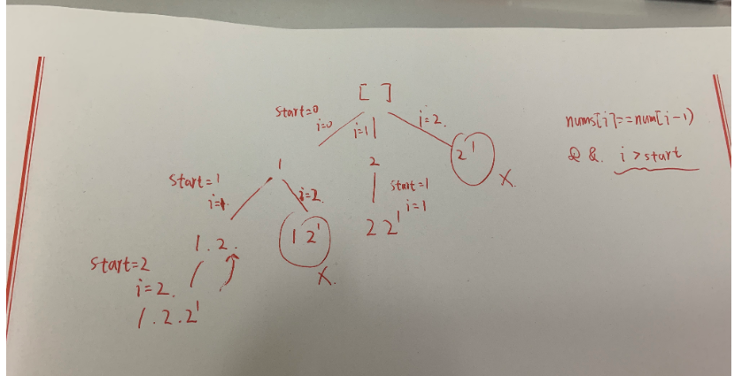
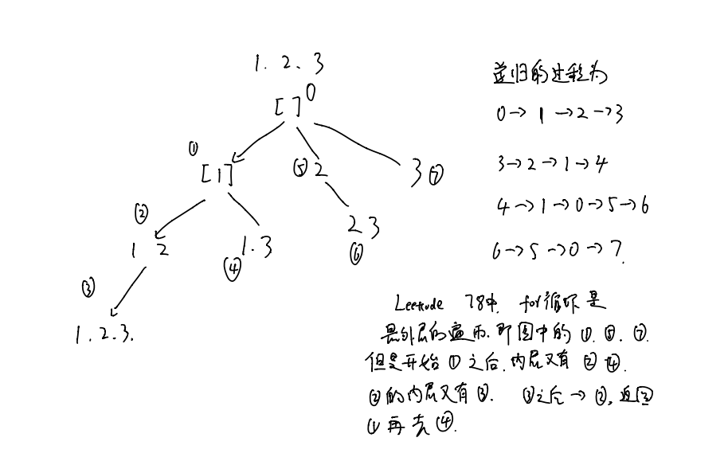
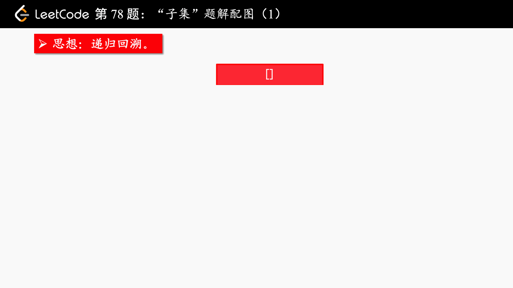
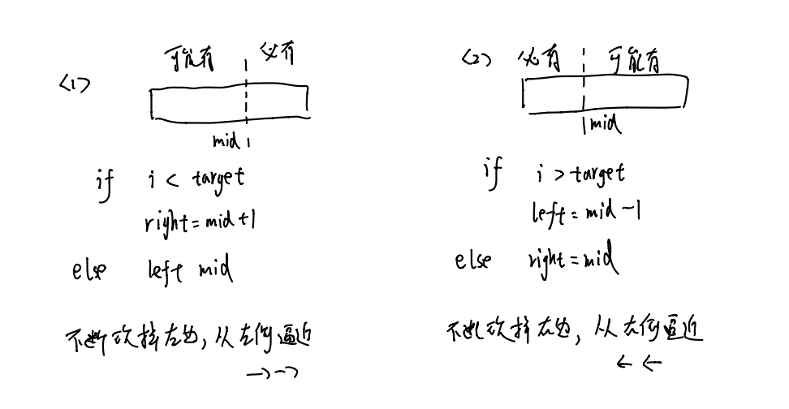
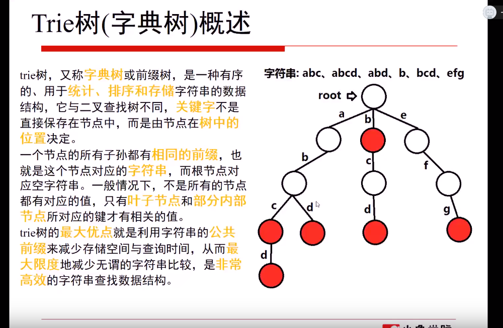
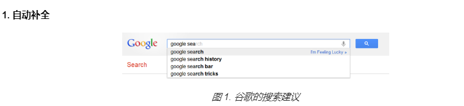
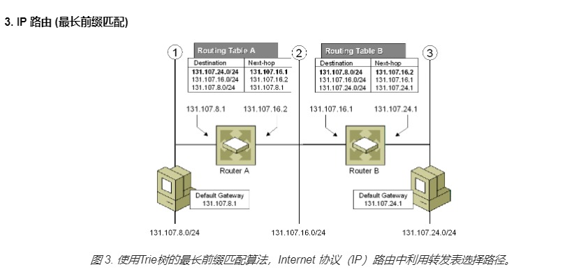
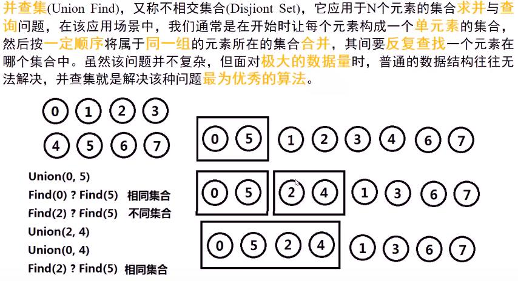
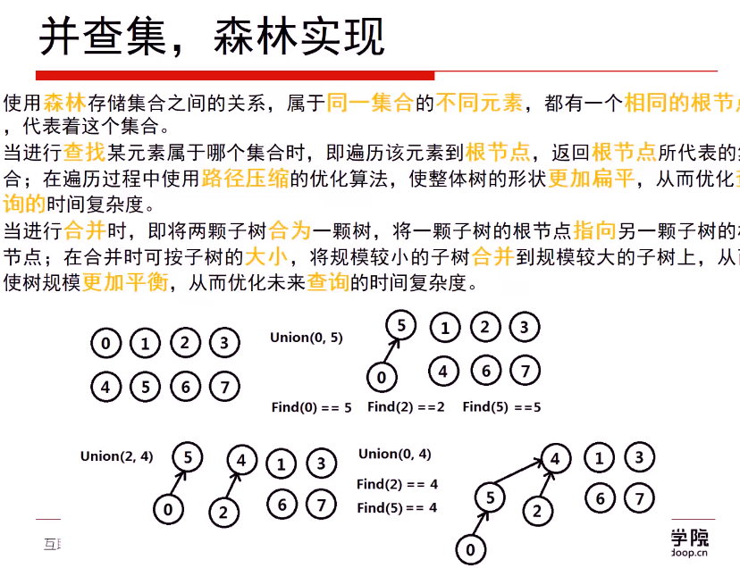

- #### 1.两数之和

  这里用到了vector，是容器的意思，相当于一个数组而且里面什么数据类型都能放。

  声明用vector<int> a

  往里面加元素用a.push_back()，随便加什么都行

  a.size()即为长度，即元素的个数

  访问的话和数组一样用a[]就行

  **普通数组的长度用sizeof(a)/sizeof(a[0])，这样表示**

  - 遍历穷举

    ```c++
    class Solution
    {
      public:
      vector<int> twoSum(vector<int> num,int target)
      {
        vector<int> a;
        for(int i=0;i<num.size();i++)
        {
          for(int j=i+1;j<num.size();j++)
          {
            if(num[i]+num[j]==target)
            {
              a.push_back(i);
              a.push_back(j);
            }
          }
        }
        return a;
      }
  };
    ```
  
    时间复杂度为O(n^2)，时间复杂度过高，因此尝试改进

  - 使用哈希方式

    ```c++
    class Solution 
    {
        public:
        vector<int> twoSum(vector<int> nums, int target) 
        {
            unordered_map<int,int> m;
            vector<int> rec;
            for(int i=0;i<nums.size();i++)
                m[nums[i]]=i;   //把所有的元素都放到哈希表里，key即为数，value为数在nums中的顺序数，m即给定一个数即nums[i]就可以得到它的value即顺序数i
            for(int i = 0 ; i < nums.size() ; i ++)
            {
                int t = target - nums[i];
                if(m.count(t)&&m[t]!=i)   //count(t)作用是看map中键值t的个数，就是看键值t在map中存不存在，因为key是不能重复的，因此count函数的值要么是0，要么是1.同时题目中要求一个数不能用两次，因此这个t的顺序数不能和i一样
                {
                     rec.push_back(i);
                     rec.push_back(m[t]);
                     break;
                }
            }
            return rec;
         }
  };
    ```
  
    使用了unordered_map<int,int> m定义了一个名为m的关键字和值都为int的哈希表，哈希就是给定一个关键字key能够找到对应的value值。key不能重复，但是不同的key可能会有相同的value就是所谓的冲突。

- #### 2.两数相加

  定义一个变量来记录进位，同时记住最后加完之后还要再下进位是否为1，是的话再加个1.

  ```c++
  class Solution {
  public:
      ListNode* addTwoNumbers(ListNode* l1, ListNode* l2) 
      {
          ListNode *l3=new ListNode(0);
          ListNode *w=l3;
          int sum=0,carry=0;
          while(l1!=NULL||l2!=NULL)
          {
              if(l1!=NULL)
              {
                  sum+=l1->val;
                  l1=l1->next;
              }
              if(l2!=NULL)
              {
                  sum+=l2->val;
                  l2=l2->next;
              }
              w->next=new ListNode((sum+carry)%10);
              w=w->next;
              carry=(sum+carry>9)?1:0; 
              sum=0;           
          }
          if(carry==1)
          {
              w->next=new ListNode(1);
          }
          return l3->next;        
      }
  };
  ```
  
- #### 7.整数反转

  > 将一个给定的32位有符号整数，将数字每位上的整数进行反转。

  用x%10取出x的最后一位，设为pop。翻转后的数字用ans存贮，ans默认为0，然后通过ans=ans*10+x%10来不断迭代。

  还有个要注意的就是溢出问题，int是4个字节即32位，有符号的话INT_MAX即2的32次方减一即2147483647，同样得出INT_MIN。不能溢出也就是不能比max大不能比min小。

  溢出即ans*10+pop>INT_MAX，有两种可能：

  - ans>INT_MAX/10
  - ans==INT_MAX/10且pop>7(这里的7即为MAX的个位数)
  
  同样可以得出小于min的溢出条件。（注意32位有符号整数表示的范围用的是补码的范围，而且溢出了程序也不会报错，只是把多余的位数去掉，输出剩下的位数在可表示范围内对应的数，只是这个数并不是我们正确的计算结果，因此不能在ans=ans*10+pop之后再用ans>INT_MAX来判断，因为在int里不会有比他大的数，这样比较永远不知道是否溢出，因此就要在ans乘10之前就要确定它乘了之后会不会溢出）
  
  ```c++
  class Solution {
  public:
      int reverse(int x) 
      {
          int ans=0;
          while(x)
          {
              int pop=x%10;    //这儿可以直接用表达式x%10代表pop，省去pop的空间，进一步削减空间复杂度
              if(ans>INT_MAX/10||ans==INT_MAX/10&&pop>7)
                  return 0;
              if(ans<INT_MIN/10||ans==INT_MIN/10&&pop<-8)
                  return 0;
              ans=ans*10+pop;
              x/=10;
          }   
          return ans;     
      }
  };
  ```
  
- #### 9.回文数

  负数和能够整除10（除了0）都不行

  - 第一种利用类似于上面翻转整数的方法，再判断一下溢出就性

    ```c++
    class Solution {
    public:
        bool isPalindrome(int x) 
        {
            if(x<0)
                return false;
            int m=x,ans=0;
            while(m)
            {
                if(ans>INT_MAX/10||ans==INT_MAX/10&&m%10>7)
                    return 0;
                if(ans<INT_MIN/10||ans==INT_MIN/10&&m%10<-8)
                    return 0;
                ans=ans*10+m%10;
                m/=10;
            } 
            if(x==ans)
                return true;
            return false;        
        }
    };
    ```
    
  - 第二种换了种循环的判断方法，while(x > ans)。跳出循环后如果是原数有偶数个数字，那么x==ans就表明是回文数；如果有奇数个数字，那么跳出循环后x==ans/10就表明是回文数。

    > 这样不用像上面那样全部翻转完之后再比较，只需要翻转一半，而且不用判断溢出，因此时间复杂度更优秀
    
    ```c++
    class Solution 
    {
        public:
        bool isPalindrome(int x) 
         {
           if(x < 0||x%10==0&&x!=0) 
                 return false;
           int ans = 0;
             while(x > ans) 
             {
                ans = ans*10+x%10;
                x /= 10;
             }
             if(x == ans || x == ans/10)
                 return true;
             return false;
          }   
    };
    ```

- #### 13.罗马数字转整数

  要注意一个，要把string类型赋值给字符数组时，例如：

  - string s="abc"

    **char * a=const_cast<char *>(s.c_str())**

  - strlen()函数用来求取给定字符串或字符数组的长度

    **参数只能是char a[]或者char *，不能是string**

    char *a="abcd"  

    char a[]="abcd"  //a的长度是4，因为strlen计算长度只计算到\0之前，但是初始化的时候前面括号要写数字的话就要写5，包含\0的长度

  - **length()用的时候是s.length();前面跟字符串。**s.size()效果一样。string求长度是也不带最后的\0,就char a[]带

  - **sizeof()返回一个变量或者类型的大小，以字节为单位**

  - 暴力例举(太蠢了）

    ```c++
class Solution {
    public:
      int romanToInt(string s) {
            char *a=const_cast<char*>(s.c_str());
            int sum=0;
            for(int i=0;i<strlen(a);i++)
            {
                if(a[i]=='I'&&a[i+1]!='V'&&a[i+1]!='X')
                    sum+=1;
                if(a[i]=='I'&&a[i+1]=='V')
                    sum+=4;
                if(a[i]=='I'&&a[i+1]=='X')
                    sum+=9;
                if(a[i]=='V'&&a[i-1]!='I')
                    sum+=5;
                if(a[i]=='X'&&a[i+1]!='L'&&a[i+1]!='C'&&a[i-1]!='I')
                    sum+=10;
                if(a[i]=='X'&&a[i+1]=='L')
                    sum+=40;
                if(a[i]=='X'&&a[i+1]=='C')
                    sum+=90;
                if(a[i]=='L'&&a[i-1]!='X')
                    sum+=50;
                if(a[i]=='C'&&a[i+1]!='D'&&a[i+1]!='M'&&a[i-1]!='X')
                    sum+=100;
                if(a[i]=='C'&&a[i+1]=='D')
                    sum+=400;
                if(a[i]=='C'&&a[i+1]=='M')
                    sum+=900;
                if(a[i]=='D'&&a[i-1]!='C')
                    sum+=500;
                if(a[i]=='M'&&a[i-1]!='C')
                    sum+=1000;
              }
          return sum;
         }
    };
    ```
  
  - 使用哈希方式，建立哈希表m对应每个字母与每个数字，依次遍历字符串的每个字符，当

    m[s[i]]>=m[s[i+1]]时直接加上s[i]，当m[s[i]]<m[s[i+1]]时，就生成组合，输出后一位减前一位的差，同时i自加1，即往后空一位。

    > **往unordered_map里插入数据可以用m.insert(pair<int,int>(10,10))**
  >
    > map内部实现了一个红黑树，是有序的；而unordered_map即哈希表，无序的
  
    ```c++
    class Solution
    {
        public:
        int romanToInt(string s)
        {
            int sum=0;
            unordered_map<char,int> m;(用map代替unordered_map也可以)
            m.insert(pair<char,int>('I',1));  //插入可以直接m['I']=1,还可以初始化的时候直接m={{'I',1},.........}
            m.insert(pair<char,int>('V',5));
            m.insert(pair<char,int>('X',10));
            m.insert(pair<char,int>('L',50));
            m.insert(pair<char,int>('C',100));
            m.insert(pair<char,int>('D',500));
            m.insert(pair<char,int>('M',1000));
            for(int i=0;i<s.length();i++)
            {
                if(m[s[i]]>=m[s[i+1]])
                    sum+=m[s[i]];
                else
                {
                    sum+=m[s[i+1]]-m[s[i]];
                    i++;
                }
            }
            return sum;
         }
    };
    ```
  
- #### 14.最长公共前缀

  以第一个字符串为标准，一个一个往后比较

  ```c++
  class Solution {
  public:
      string longestCommonPrefix(vector<string>& strs) 
      {
          if(strs.empty())
              return "";
          string s=strs[0];
          for(int i=1;i<strs.size();i++)
          {
              for(int j=0;j<s.size();j++)
              {
                  if(strs[i][j]==s[j])
                      continue;
                  else
                  {
                      s.erase(j);  //string的erase(i)，i是数字的话会删除从i开始后面所有的，如果i是迭代器的话只会删除i这个位置上的，即string:: iterator=it。！！！但是vector的话只能用迭代器erase删除指定位置或者指定区域
                      break;
                  }
              }
          }
          return s;        
      }
  };
  ```

- #### 20.有效的括号

  思路就是从最内层的括号开始，一对一对的删除，看最后能不能都删除完，但是我们无法实直接从最里面开始删，因为不知道最里面的位置在哪儿，所以利用栈，通过递归的方式，遇到左括号就放进去，然后碰到右括号就依次和栈顶的比较。

  利用的STL中的stack，遇到左括号就压栈，然后遇到右括号就和栈顶的左括号比较，如果一样就把栈顶的左括号删除，如果不一样那么字符串无效。

  特别注意的是数组的越界问题，当栈为空时，stack.top()这种访问方式时非法无效的，因此当要用右括号和栈顶的元素比较之前要先看栈是否为空，如果为空，直接false。

  ```c++
  class Solution {
  public:
      bool isValid(string s)
      {
          if(s.size()%2!=0)         //如果字符串长度为奇数个，那么字符串必然无效
              return false;
          map<char,char> m;
          m.insert(pair<char,char>('(',')'));     //通过哈希建立左右括号的一一对应关系
          m.insert(pair<char,char>('[',']'));
          m.insert(pair<char,char>('{','}'));
          stack<char> n;
          for(int i=0;i<s.size();i++)
          {
              if(s[i]=='('||s[i]=='{'||s[i]=='[')
                  n.push(s[i]);
              else
              {
                  if(n.empty())         //这个判断是必须的，如果没有这个判断，当栈为空时，下面的n.top()就是越界非法访问
                      return false;
                  if(s[i]==m[n.top()])
                      n.pop();
                  else
                      return false;
              }
          }
          if(n.empty())
              return true;
          return false;
      }
  };
  ```
  
- #### 21.合并两个有序链表

  因为给的链表就是有序的，因此每次比较两个链表的表头元素，把小的插入到新的链表中。直到其中一个链表为空，然后把不为空的链表直接链接到新链表后面就行

  ```c++
  class Solution {
  public:
      ListNode* mergeTwoLists(ListNode* l1, ListNode* l2) 
      {
          ListNode* l3=new ListNode(0);
          ListNode* p=l3;
          while(l1!=NULL&&l2!=NULL)
          {
              if(l1->val<=l2->val)
              {
                  p->next=l1;
                  p=p->next;
                  l1=l1->next;
              }
              else
              {
                  p->next=l2;
                  p=p->next;
                  l2=l2->next;           
              }  
          }
          p->next=(l1==NULL)?l2:l1;
          return l3->next;
      }
  };
  ```

  递归

  ```c++
   ListNode* mergeTwoLists(ListNode* l1, ListNode* l2) 
      {
          if(l1==NULL)
              return l2;
          if(l2==NULL)
              return l1;
          if(l1->val<l2->val)
          {
              l1->next=mergeTwoLists(l1->next,l2); //明确函数返回值的意思
              return l1;
          }
          else
          {
              l2->next=mergeTwoLists(l2->next,l1);
              return l2;
          }
      }
  ```

- #### 26.删除排序数组的重复项

  利用两个指针，一个慢指针留在前面保存数字，快指针向后一个一个遍历。

  - 如果慢指针等于快指针，证明是一样的数，那么慢指针不变，快指针向后加一然后再和慢指针比较
  - 如果不等，说明遇到新的数了，那么慢指针后移一位同时把当前快指针的值拷贝过来，然后快指针后移，继续比较。

  ```c++
  class Solution {
  public:
      int removeDuplicates(vector<int>& nums) 
      {
          if(nums.empty())
              return 0;
          int low=0;
          for(int i=0;i<nums.size();i++)
          {
              if(nums[i]!=nums[low])
                  nums[++low]=nums[i];
          }
          return low+1;
      }
  };
  ```

  还可以利用STL的unique函数配合erase函数

  ```c++
  class Solution {
  public:
      int removeDuplicates(vector<int>& nums) 
      {
          vector<int>::iterator it;
          it=unique(nums.begin(),nums.end()); //unique把范围内的元素折叠缩编，变成唯一的，但是并没有改变元素的个数，重复的元素就放到最后面，如[1,1,2,3,3]经过处理后就变成了[1,2,3,1,3],只是把顺序变了，同时unique函数返回一个指向第一个重复数字的迭代器，在这个例子中就返回一个指向第3个元素1的迭代器
          int b=0;
          while(it!=nums.begin())
          {
              b++;
              it--;
          }
          return b;
          //nums.erase(it,nums.end());
          //return nums.size();            这儿并没有要求要删除后面重复的元素，因此不用erase，如果要的话可以通过erase函数实现
      }
  };
  ```

- #### 25.三数之和

  >三重循环的简化版本，第一个for循环遍历第一个元素，在第一个元素确定的情况下，确定遍历第二个，同时遍历每个第二个的时候又遍历第三个

  ```c++
     vector<vector<int>> threeSum(vector<int>& nums) 
    {
          vector<vector<int>> res;
          int n=nums.size();
          sort(nums.begin(),nums.end());
  
          for(int i=0;i<n-2;i++)
          {
              if(nums[i]>0)
                  break;
              if(i>0&&nums[i]==nums[i-1]) //不能和前面的相等，因为前面的已经遍历过了，但是可以和后面的相等
                  continue;
              int j=i+1;
              int k=n-1;
              while(j<k)
              {
                  int sum=nums[i]+nums[j]+nums[k];
                  if(sum>0)
                      k--;   //if sum>0,而第二个元素固定，那么只能让k--了
                  else if(sum<0)
                      j++;   //sum<0,而k只能变小，就说明当前位置if是第二个元素那么没有符合的了，所以j++，以下一个元素为第二个元素继续遍历
                  else
                  {
                      res.push_back({nums[i],nums[j],nums[k]});
                      while(j<k&&nums[j]==nums[++j]);
                      while(j<k&&nums[k]==nums[--k]);
                  }
              }
          }
  
          return res;
  
      }
  ```
  
- #### 27.移除元素

  和上题类似，也是利用了双指针的思想。慢指针记录!=val的数，快指针在前面找!=val的数然后传回来

  - 当==val时，不处理，计入下次循环，j++
  - 当!=val时，这是我们要的值， 这时两个指针同时自加1，然后把新出现的j指的值给i，继续遍历

  ```c++
  class Solution {
  public:
      int removeElement(vector<int>& nums, int val) 
      {
          int i=0;
          for(int j=0;j<nums.size();j++)
          {
              if(nums[j]!=val)
                  nums[i++]=nums[j];
          } 
          return i;
      }
  };
  ```
  
- #### 28.实现strStr()即在一个大字符串中匹配另一个小的字符串同时输出小字符串在大字符串中出现的第一个位置的索引

  - 自己写的，暴力比较，遍历大字符串，然后每遍历一次就和小字符串比较一次。但是时间复杂度贼高,而且字符串一长就会溢出。思想可以，但是实际不能用，选择放弃

    ```c++
    class Solution {
    public:
        int strStr(string haystack, string needle) 
        {
            if(needle.size()==0)
                return 0;
            int n=needle.size();
            int count=0;
            for(int i=0;i<haystack.size();i++)
            {
                for(int j=0;j<needle.size();j++)
                {
                    if(needle[j]==haystack[i+j])
                        count+=1;
                    else
                        break;
                }
                if(count==n)
                    return i;
                else
                    count=0;
            }
            return -1;
        }
    };
    ```

  - 直接用库函数中的find函数，a.find(b）直接就是结果

    ```c++
    class Solution {
    public:
        int strStr(string haystack, string needle) 
        {
            return haystack.find(needle);    //能找到的话会返回第一个元素的索引，找不到返回-1
      }
    };
    ```
    
    时间复杂度和空间复杂度都很低，但是没啥技术含量
  
- #### 38.外观数列

  利用的是递归的思想，题目的意思是从第二个开始（包括第二个），数字对应的字符串是用来描述上一个字符串的数字的。

  第一个是1，那么第二个就描述第一个，1个1即11；第三个就描述第二个，2个1即21；那么第四个就描述第三个，一个2一个1，即1211；………………

  利用的是递归的思想，先给出递归开始的条件，当n为1是，字符串为“1”；然后后面的递归的时候先表示出前一个字符串，然后对前一个字符串遍历，如果i和i+1相等，计数器count就加一，即几个几；如果不相等就把他们加到记录字符串的res里。

  ```c++
  class Solution {
  public:
      string countAndSay(int n) 
      {
          if(n==1)
              return "1";
          string now = countAndSay(n-1);
          int count = 1;
          string res="";
          for(int i=0;i<now.size()-1;i++)
          {
              if(now[i]==now[i+1])  //这儿当i=now.size()-1时，i+1即now.size()并不会溢出，因为字符串最后还有一个字符串结束标志'\0'是没有算在字符串的长度里的，但是是可以通过下标访问到的
              {
                  count++;
                  continue;
              }
              else
              {
                  res+=to_string(count)+now[i];
                  count=1;
              }
          }
          return res;
      }
  };
  ```

- #### 58.最后一个单词的长度

  先找到最后一格不是空格的字符，然后从这个字符开始往前找，如果有空格就停，如果没有就一直加。

  ```c++
  class Solution {
  public:
      int lengthOfLastWord(string s) 
      {
          if(s.size()==0)
              return 0;
          int count=0,index=0;
          for(int i=s.size()-1;i>=0;i--)
          {
              if(s[i]!=' ')
              {
                  index=i;
                  break;
              } 
          }  
          for(int i=index;i>=0;i--)
          {
              if(s[i]==' ')
                  break;
              count++;
          } 
          return count;
      }
};
  ```

- #### 66.加一

  相当于是初始carry为1的加法

  注意一下进位就行，还有最后插入用函数insert(i,x)，表示把x插入到迭代器i指向的位置，同时后面的元素自动往后移动
  
  ```c++
  class Solution {
  public:
      vector<int> plusOne(vector<int>& digits) 
      {
          int carry=1;
          int temp=0;
          for(int i=digits.size()-1;i>=0;i--)
          {
              temp=digits[i]+carry;
              digits[i]=temp%10;
              carry=temp==10?1:0;
              temp=0;
          }
          if(carry==1)
          {
              digits.insert(digits.begin(),1);
              return digits;
          }
          else
              return digits;
      }      
  };
  ```

- #### 67.二进制求和

  设置个进位，每次循环前求出两位数字和进位的和，然后分情况讨论就行了

  - 0。证明两个数字都为0且进位也为0，那么直接加0，进位置零
  - 1。两个数字有一个为1，进位为0或者两个数字都是0且进位为1，结果加1，进位置1
  - 2。结果加0，进位置1
  - 3。结果加1，进位置1

  > 这里还有个知识点就是字符串和数字的直接运算，字符如果和数字直接运算结果是数字，字符会自动转换为ascii码值参与运算。
  >
  > eg: char b='a';
  >
  > ​      int a=b+1;
  >
  > 结果a=98，即a的ascii值转换成十进制再加上数字1
  >
  > 但如果是加引号的话就是两个字符的ascii值进行运算
  >
  > eg： char b='a';
  >
  > ​         int a=b+'1';
  >
  > 结果a=146，这儿'1'就是一个字符而不是一个单纯的数字，二者的ascii值相加，结果再转换成十进制
  >
  > ---
  >
  > 但是对于string来说，加一个字符串等于把它和原来的链接起来
  >
  > eg：string b="a"
  >
  > ​       b=b+'a'
  >
  > 输出结果即为字符串"aa"

  ```c++
  class Solution {
  public:
      string addBinary(string a, string b) 
      {
          int carry=0;
          while(a.size()>b.size())
              b='0'+b;
          while(a.size()<b.size())
              a='0'+a;
          for(int i=a.size()-1;i>=0;i--)
          {
              if(a[i]-'0'+b[i]-'0'+carry==0)
              {
                  a[i]='0';
                  carry=0; 
              }
              else if(a[i]-'0'+b[i]-'0'+carry==1)
              {
                  a[i]='1';
                  carry=0; 
              }
              else if(a[i]-'0'+b[i]-'0'+carry==2)
              {
                  a[i]='0';
                  carry=1; 
              }
              else
              {
                  a[i]='1';
                  carry=1;
              }
          }
          if(carry==1)
              a='1'+a;
          return a;
      }
  };
  ```
  
- #### 69.x的平方根

  - 直接用库函数sqrt()

  - 使用二分查找

    ```c++
    class Solution {
    public:
        int mySqrt(int x) 
        {
            long i=1,j=x/2+1;   //x的平方根不会大于x/2+1,可以数学证明，这儿直接用这个可以减小查找长度
            while(i<=j)
            {
                long mid=(i+j)/2;  //考虑到mid*mid可能会溢出int，使用long型
                long res=mid*mid;
                if(res==x)
                    return mid;
                else if(res>x)
                    j=mid-1;
                else
                    i=mid+1;
            }
            return j;  //为什么return j而不是i。因为如果跳出了while循环还没有返回，就是没有找到恰好开根号的mid，最后一次while时i=j，即此时的i或j是最所求整数中最接近根号x的，下面的mid=（i+j)/2其实结果还是i或j，而题目要求下取整，因此下面当res>x时，要取i-1或j-1;res<x时就取i或j，根据原代码中二分查找的执行代码，只有return j在res>x和<x时都符合要求。
            
        }
    };
    ```

  - 使用牛顿迭代法。关键在于边界的判定。往往计算方程的时候都有个精度限制，误差小于这个精度就可以停止迭代了。

    - ```c++
      class Solution {
      public:
          int mySqrt(int x) 
          {
              if(x==0)
                  return 0;
              double a=1,b=2;
              while(a!=b)      //double可以精确计算，不会死循环，虽然最后结果不准，但是会是double范围里最准的.这儿取初始值a为1，b其实是作为一个暂存上一个a值得变量，它只要初始化一个不等于a的值即可。a每次迭代完之后与上一次的值比较，不相等就说明还没找到所求的解，继续迭代。
              {
                  b=a;
                  a=(a+x/a)/2;
              }
              return int(a);
          }
      };
      ```

    - ```c++
      class Solution {
      public:
          int mySqrt(int x) 
          {
              double a=x;
              while(fabs(a*a-x)>=1) //收敛半径小于1即可，注意a得是double的
                  a=(a+x/a)/2;
              return int(a);
          }
      };
      ```

- #### 83.删除排序列表中的重复元素

  直接操作，如果相等就跳过相等的那个指向下一个；如果不相等就直接跳过

  ```c++
  ListNode* deleteDuplicates(ListNode* head) 
  {   
       if(head==NULL)
           return head;
       ListNode* p=head;
       while(p->next!=NULL)
       {
           if(p->val==p->next->val)
           {
               p->next=p->next->next;
           }
           else
               p=p->next;
     }
       return head;
   }
  };
  ```
- #### 100.相同的树

    满足两个条件，拓扑结构相等同时对应位置的值还要相等，使用递归的方法

    ```c++
  class Solution {
      public:
      bool isSameTree(TreeNode* p, TreeNode* q) 
      {
          if(p==NULL&&q==NULL)             //两个都为空，那必然相等
                return true;                    
          if(p!=NULL&&q!=NULL&&p->val==q->val)  //两个都不为空且值还相等，即拓扑相同且值相等，那么他们满足，开始递归遍历他们的左右子节点
              return isSameTree(p->left,q->left)&&isSameTree(p->right,q->right);
          else             //拓扑不相同或者拓扑相同值不同
              return false;
       }
  };
  ```

- #### 88.合并两个有序数组

  - 先把两个数组放到一起，然后再排序。使用了insert和erase函数

    insert有三种

    - insert(i,n):把n插入到迭代器i的位置，然后原来的i和i后面的元素后移n位
    - insert(i,start,end):把迭代器start和end范围内的插入到i位置
    - insert(i,n,x):在迭代器i的位置插入n个x

    > 但是一定要注意的是，事先定义的迭代器，在对容器元素进行增删操作（insert，push_back或者erase等之后，可能会失效，因为位置变了。因此要么定义一个迭代器，insert或者erase之后再定义一下，要么就用初始的begin和end，这两个永远是可以用）

    ```c++
    class Solution {
    public:
        void merge(vector<int>& nums1, int m, vector<int>& nums2, int n)
        {
            nums1.insert(nums1.begin()+m,nums2.begin(),nums2.end());
            nums1.erase(nums1.begin()+m+n,nums1.end());//因为默认后面有n个0；要删掉
            sort(nums1.begin(),nums1.end());
        }
    };
    ```

- #### 101.  对称二叉树

  从根节点开始看，如果根节点为空，符合；如果根节点不空，那么将就看根节点的左右子树是否是镜像的，然后再递归左子树的右子树和右子树的左子树，左子树的左子树和右子树的右子树

  ```c++
  class Solution {
  public:
      bool isSymmetric(TreeNode* root) 
      {
          if(root==NULL)
              return true;
          else 
              return isMirror(root->left,root->right);   
      }
      bool isMirror(TreeNode *p,TreeNode *q)
      {
          if(p==NULL&&q==NULL)
              return true;
          if((p==NULL&&q!=NULL)||(p!=NULL&&q==NULL))
              return false;
          if(p->val==q->val)
              return isMirror(p->left,q->right)&& isMirror(p->right,q->left);
          return false;
      }
  };
  ```

- #### 104.二叉树的最大深度

  深度优先搜索DFS

  ```c++
  class Solution {
  public:
      int maxDepth(TreeNode* root) 
      {
          if(root==NULL)
              return 0;
          int l=maxDepth(root->left)+1;
          int r=maxDepth(root->right)+1;
          return l>r?l:r;   
      }
  };
  ```

  # 链表

- #### 206.翻转链表

  迭代法和递归法

  ```c++
  class Solution {
  public:
      ListNode* reverseList(ListNode* head) 
      {
          // ListNode* new_head=NULL;
          // while(head!=NULL)
          // {
          //     ListNode *t=head->next;          //利用了双指针，首先保存head指针的后继
          //     head->next=new_head;             //改变head指针的指向，指向新建的链表
          //     new_head=head;                   //将new_head指针往前移动一位，保证指向新链表的头部
          //     head=t;                          //及那个刚才保存的原链表下一个元素的指向再赋值给head
          // }
          // return new_head;
          if(head==NULL||head->next==NULL)    //注意两个判断条件的先后顺序，head==NULL一定要放在前面，因为如果传进来空指针，那么先判断head-next就会出现越界错误
              return head;
          ListNode *p=reverseList(head->next);  //递归一定要搞清楚这个递归函数的意思，这个函数给定一个链表节点输入，输出反转之后链表的头节点
          head->next->next=head;
          head->next=NULL;
          return p;
      }
  };
  ```

- #### 92.翻转部分链表

  迭代法和递归法

  - 迭代

    要记录四个关键节点，开始反转的节点和它的前驱，最后翻转的节点和它的后继

  ```c++
  ListNode* reverseBetween(ListNode* head, int m, int n)   //翻转m-n个元素，返回反转后链表的头节点
  {
          ListNode *preHead=NULL;      //记录开始反转节点的前驱
          int reverseNum=n-m+1;        //翻转的个数
          ListNode *result=head;       //最后输出结果，如果m不是从1开始就返回这个，如果m从1开始那就要返回newHead
          while(head&&--m)     //移动m-1个单位
          {
              preHead=head;
              head=head->next;
          }
          ListNode *modifyTail=head;  //反转后链表的尾部即开始翻转的节点
          ListNode *newHead=NULL;     //反转后链表的头部即最后翻转的节点
          while(head&&reverseNum)
          {
              ListNode *tmp=head->next;
              head->next=newHead;
              newHead=head;
              head=tmp;
              reverseNum--;
          }
          modifyTail->next=head;
  
          if(preHead)                //判断前驱节点是否仍为空，是的话证明从头开始翻转，那就返回反转后链表的头即newHead；不是的话就把它和链表的头连上，返回初始的result
          {
              preHead->next=newHead;
              return result;
          }
          else
              return newHead;
  }
  ```

  - 递归

  ```c++
  class Solution {
  public:
      ListNode *successor=NULL;                   //记录后继节点即第n+1个元素的位置
      ListNode *reverseN(ListNode *head,int n)    //用来翻转前n个元素,返回反转后链表的头节点
      {
          if(n==1)
          {
              successor=head->next;
              return head;
          }
          ListNode *last=reverseN(head->next,n-1);  //翻转head的前n个相当于翻转head-next的前n-1个，再把head接上
          head->next->next=head;
          head->next=successor;
          return last;
      }
      ListNode* reverseBetween(ListNode* head, int m, int n)   //翻转m-n个元素，返回反转后链表的头节点
      {
          if(m==1)                           
              return reverseN(head,n);
          head->next = reverseBetween(head->next, m - 1, n - 1);  //翻转head的m到n，相当于翻转head->next的m-1到n-1；一直递归到m为1，即又回到翻转链表的前n个元素。
          return head;
      }
  };
  ```

- #### 160.相交链表

  - 利用哈希表，先把a的存起来，再用b的一个一个和键值比较

    ```c++
    ListNode *getIntersectionNode(ListNode *headA, ListNode *headB) 
    {
        set<ListNode*> a;
        while(headA)
        {
            a.insert(headA);
            headA=headA->next;
        }
        while(headB)
        {
            if(a.find(headB)!=a.end())
            {
                return headB;
            }
            headB=headB->next;
        }
        return NULL;
    }
    ```

  - 双指针

    A的指针遍历完A 接着从headB开始遍历
    B的指针遍历完B 接着从headA开始遍历
    如果链表相交且长度相等，那么不用第二次变量第一次遍历到相交节点就找到了

    如果链表相交长度不能，那么走a+b+c步之后必然同时到达相交点

    如果不相交，同时走a+b之后为空

    

    ```c++
    ListNode *getIntersectionNode(ListNode *headA, ListNode *headB) 
    {
        ListNode *a=headA;
        ListNode *b=headB;
    
        while(a!=b)
        {
            a=a?a->next:headB;
            b=b?b->next:headA;
        }
        return a;      
    }
    ```

- #### 141.142求链表是否有环及环的节点位置

  142为进阶版本只看142

  141可以用set也可以用快慢指针

  ```c++
  bool hasCycle(ListNode *head) 
  {
         ListNode *fast=head;   //快指针一次走两步
         ListNode *slow=head;   //慢指针一次走一步
         while(fast!=NULL&&fast->next!=NULL)
         {
             fast=fast->next->next;
             slow=slow->next;
             if(fast==slow)
                 return true;
         }
         return false;
  }
  ```

  **142**

  - 利用set保存，然后遍历

    ```c++
    ListNode *detectCycle(ListNode *head) 
    {
        set<ListNode*> map;
        while(head)
        {
            map.insert(head);
            head=head->next;
            if(map.find(head)!=map.end())
                return head;
         }
         return NULL;  
    }
    ```

  - 利用快慢指针

    快指针一次两步，满指针一次一步。两指针如果相遇，快指针的路程必然是满指针的2倍。本来应是2(x+y)=x+y+n(y+z),即x=(n-1)(y+z)+z,这儿我们不关心n为多少即绕了多少圈，因为从head和meet出发相交的点必然为环的入口

    

    ```c++
    ListNode *detectCycle(ListNode *head) 
    {
        ListNode *fast=head;
        ListNode *slow=head;
        while(fast!=NULL&&fast->next!=NULL)
        {
            fast=fast->next->next;
            slow=slow->next;
            if(fast==slow)
            {
                 slow=head;
                    while(fast!=slow)
                    {
                        slow=slow->next;
                        fast=fast->next;
                    }
                    return fast;
                }
            }
            return NULL;
            
        }
    ```

- #### 86.分割链表

  新建两个链表然后拼起来

  ```c++
  ListNode* partition(ListNode* head, int x) 
  {
      ListNode *small=new ListNode(0);
      ListNode *big=new ListNode(0);
      ListNode *p=small;
      ListNode *q=big;
      while(head)
      {
          if(head->val<x)
          {
              small->next=head; //直接指省去了创建新节点的空间
              small=small->next;
              head=head->next;
          }
          else
          {
              big->next=head;
              big=big->next;
              head=head->next;
          }    
      }
      big->next=NULL;    //最后一定要加上这一步，不然无法返回正确的结果。if最后一个比x小，那么把它加到small里，但是此时big指针还停留在上一次大于的值的位置，这儿如果不把big->next置空，后面还跟着原链表中比x小的值，最后返回的结果不正确；如果最后一个比x大，那这一步就没有效果了因为本来就是null
      small->next=q->next;
      return p->next;  
  }
  ```

- #### 138.复制带随机指针的链表

  利用哈希表建立映射

  ```c++
  Node* copyRandomList(Node* head) 
  {
      unordered_map<Node*,Node*> map;  //map是新旧链表对应节点的映射
      Node *cur=head;
  
      while(cur)                       //遍历原链表，每个结点都对应新建一个节点，但是这些节点相互之间并没有连接
      {
          map[cur]=new Node(cur->val);
          cur=cur->next;
      }
      cur=head;
      while(cur)                         //从头遍历，根据原链表建立新建的节点间的对应关系
      {
          map[cur]->next=map[cur->next];
          map[cur]->random=map[cur->random];
          cur=cur->next;
      }
      return map[head];
  }
  ```

- #### 23.合并k个有序链表

  - 把所有链表的节点值保存到vector中，排序vector然后再一个一个输出

    ```c++
    ListNode* mergeKLists(vector<ListNode*>& lists) 
    {
        vector<int> list;
        for(ListNode *s:lists)
        {
            while(s)
            {
                list.push_back(s->val);
                s=s->next;   
            }
        }
        sort(list.begin(),list.end());
        ListNode *res=new ListNode(0);
        ListNode *record=res;
        for(int a:list)
        {
            res->next=new ListNode(a);
            res=res->next;
        }
        return record->next;
    }
    ```
    
  - 也可以直接存指针不存值

    ```c++
    static bool cmp(const ListNode *a,const ListNode *b)
    {
        return a->val<b->val;
    }
    ListNode* mergeKLists(vector<ListNode*>& lists)
    {
       vector<ListNode*> list;
        for(auto s:lists)
        {
            while(s)
            {
                list.push_back(s);
                s=s->next;
            }
        }
        sort(list.begin(),list.end(),cmp);
        
        ListNode *res=new ListNode(0);
        ListNode *record=res;
        ListNode *m=record;
        for(auto a:list)
        {
            res->next=a;
            res=res->next;
        }
        res->next=NULL; //这一步很关键，因为排序之后里面的指针的指针域仍然是原来的，最后每一个都赋值完之后，最后一个结点的指针域仍然是原来的，而我们得到的链表的最后一个节点的指针域必须为空，因此这儿必须置空不然得不到正确的链表
        
        return record->next;
    }
    ```

  - 两个两个的合并

    ```c++
    class Solution {
    public:
        ListNode* mergeTwoLists(ListNode* l1, ListNode* l2) 
        {
            ListNode* l3=new ListNode(0);
            ListNode* p=l3;
            while(l1!=NULL&&l2!=NULL)
            {
                if(l1->val<=l2->val)
                {
                    p->next=l1;
                    p=p->next;
                    l1=l1->next;
                }
                else
                {
                    p->next=l2;
                    p=p->next;
                    l2=l2->next;           
                }  
            }
            p->next=(l1==NULL)?l2:l1;
            return l3->next;
        }
        ListNode *mergeKLists(vector<ListNode*> &lists)
        {
            ListNode *ans=NULL;
            for(int i=0;i<lists.size();i++)
            {
                ans=mergeTwoLists(ans,lists[i]);
            }
            return ans;
        }
    };
    ```

  - 使用优先队列

    piriority _queue，是STL中的一个模板，数据结构是用的堆，插入元素之后会自动排序，将优先级最高的元素置于队头优先操作，默认初始化模板是

    `priority_queue<Type, Container, Functional>`

    Type为数据类型， Container为保存数据的容器，Functional为元素比较方式。

    如果不写后两个参数，那么容器默认用的是vector，比较方式默认用operator <，即less<int>,即递增，默认是大顶堆。原因是优先队列队首指向最后，队尾指向最前面的元素，而优先队列每次处理的是队首的元素，因此大顶堆的话最大的元素就要在最后，即less递增排序，同理小顶堆就要用greater递减，把最小的元素放在后面

    ```c++
    ListNode* mergeKLists(vector<ListNode*> &lists)
    {
        priority_queue<ListNode*,vector<ListNode*>,cmp> queue;
        
        for(auto a:lists)
        {
            if(a)
                queue.push(a);
        }
        
        ListNode *res=new ListNode(0);
        ListNode *p=res;             //这两行可以换成ListNode res(1); ListNode *p=&res;这时p->next就等于res.next，最后返回res->next改成res.next即可
        
        while(!queue.empty())
        {
         	ListNode *top=queue.top();   
            queue.pop();        //最小元素出队
            p->next=top;        //最小元素接在p上
            p=p->next;
            if(top->next)       //top-next!=NULL即top后面还有节点，那就把节点加进来；为NULL即证明这个链表已经合并完了，那就不用管他了。
                queue.push(top->next);
        }
        return res->next;
    }
    ```

  - 两种和优先队列思想一致但实现略有不同的方法

    1. 使用multimap代替priority_queue，不用写比较函数

       ```c++
       ListNode* mergeKLists(vector<ListNode*> &lists)
       {
             multimap<int,ListNode*> m;
             
             for(ListNode *a:lists)
             {
                 if(a!=NULL)
                     m.insert(pair<int,ListNode*>(a->val,a));
             }
             
             ListNode *res=new ListNode(0);
             ListNode *p=res;           
             
             while(!m.empty())
             {
              	  multimap<int,ListNode*>::iterator it=m.begin();   
                 p->next=it->second;  //迭代器访问的话用->,该数据类型的对象访问的话用点。即it->first等价于(*it).first
                 p=p->next;
                 if(it->second->next)       
                     m.insert(pair(it->second->next->val,it->second->next));
                 m.erase(it);
             }
             return res->next;
         }
       ```

    2. 使用类模板pair将int和ListNode*h合并成一个数据类型，即数据类型`pair<int,ListNode>`

       简而言之pair就是一个类模板，可以调用构造函数生成任意类型的对象。只有两个 public 数据成员 first 和 second

       template <class T1, class T2> class pair     //模板， T1, T2,可以是不同的类型

       构造函数

       ```c++
       pair<int,string> p1(1,"abc");
       pair<int,string> p2(p1);
       cout<<p1.first;   //1
       cout<<p1.second;  //"abc"
       ```

       赋值运算符=(需要用到make_pair(a,b),会返回一个pair<A,B>类型的对象。A，B为a和b的数据类型)

       ```c++
       pair<int,string> p1=make_pair(1,"abc");
       ```

       > pari的比较是按照字典序比较的，还有就是先比较first,frist的值大的时候，pair就大
       >
       > 如果first相等，再比较second,second大的就pair打，如果first,second都一样，等于就成立

         实现代码如下

       ```c++
       class Solution 
       {
           public:
           ListNode* mergeKLists(vector<ListNode*>& lists) 
           {
                      
         priority_queue<pair<int,ListNode*>,vector<pair<int,ListNode*>>,greater<pair<int,ListNode*>>> m;   //数据类型为pait<int,ListNode*>
                 for(ListNode *l:lists)
                 {
                     if(l!=nullptr)
                         m.push(make_pair(l->val,l));
                 }
         
                 ListNode head(1);
                 ListNode *p=&head;
                 while(!m.empty())
                 {
                     pair<int,ListNode*> top=m.top();  //可以用auto
                     m.pop();
                     p->next=top.second;
                     p=p->next;
                     if(top.second->next!=nullptr)
                         m.push(make_pair(top.second->next->val,top.second->next));
                 }
                 return head.next;
           }
       };
       ```

---

## 栈、队列和堆

- #### 225.用队列实现栈

  ```c++
  class MyStack {
  public:
    
      MyStack() {}
      
      
      void push(int x)     //关键就在这一步，因为队列每次出的队首元素，因此要保证新插入的元素一定得在队首，这儿利用了双队列，即利用了一个临时队列，当插入新的元素时，先把它放在临时队列temp中，再把原队列data中的元素push到temp队列中，这时temp队列中的次序即新插入的元素在队首，这时再把元素push到data中即可
      {
          queue<int> temp;
          temp.push(x);
          while(!data.empty())
          {
              temp.push(data.front());
              data.pop();
          }
          while(!temp.empty())
          {
              data.push(temp.front());
              temp.pop();
          }
      }
      
      
      int pop() 
      {
          int x=data.front();
          data.pop();
          return x;
      }
      
      
      int top() 
      {
          return data.front();
      }
      
      
      bool empty() 
      {
          if(data.empty())
              return true;
          else
              return false;
      }
      
  private:
      queue<int> data;
  };
  
  ```

- #### 232.用栈实现队列

  用队列实现栈使用了双队列，这儿我么利用类似的思想，用双栈来实现队列。

  ```c++
  class MyQueue {
  public:
      /** Initialize your data structure here. */
      MyQueue() {
  
      }
      
      /** Push element x to the back of queue. */
      void push(int x) 
      {
          stack<int> temp;
          while(!data.empty())
          {
              int x=data.top();
              data.pop();
              temp.push(x);
          }
          temp.push(x);
          while(!temp.empty())
          {
              int y=temp.top();
              temp.pop();
              data.push(y);
          }
      }
      
      /** Removes the element from in front of queue and returns that element. */
      int pop() 
      {
          int x=data.top();
          data.pop();
          return x;
      }
      
      /** Get the front element. */
      int peek() 
      {
          return data.top();
  
      }
      
      /** Returns whether the queue is empty. */
      bool empty() 
      {
          if(data.empty())
              return true;
          else
              return false;
      }
  private:
      stack<int> data;
  };
  
  /**
   * Your MyQueue object will be instantiated and called as such:
   * MyQueue* obj = new MyQueue();
   * obj->push(x);
   * int param_2 = obj->pop();
   * int param_3 = obj->peek();
   * bool param_4 = obj->empty();
   */
  ```

- #### 496.下一个更大元素

  维护一个单调递减栈

  这个题因为nums1要和nums2比较，因此nums的下一个最大元素压栈的时候压的是数字本身，保存成map，这样好查询；如果只需要输出当前对应索引的下一个元素，那么直接压索引即可，然后把索引加到vector里即可
  
  ```c++
  class Solution {
  public:
      vector<int> nextGreaterElement(vector<int>& nums1, vector<int>& nums2) 
      {
          unordered_map<int,int> m;
          stack<int> s;
  
          for(int i=0;i<nums2.size();i++)
          {
              while(!s.empty()&&s.top()<nums2[i])
              {
                  m[s.top()]=nums2[i];
                  s.pop();
              }
              s.push(nums2[i]);
          }
          while(!s.empty())
          {
              m[s.top()]=-1;
              s.pop();
          }
  
          vector<int> res;
          for(int i:nums1)
          {
              res.push_back(m[i]);
          }
          return res;
      }
  };
  ```
  
- #### 503.下一个更大元素Ⅱ

  保存索引，同时循环两次

  ```c++
  class Solution {
  public:
      vector<int> nextGreaterElements(vector<int>& nums) 
      {
          vector<int> res(nums.size(),-1);
          stack<int> s;
  
          for(int i=0;i<nums.size()*2;i++)
          {
              while(!s.empty()&&nums[s.top()]<nums[i%nums.size()])
              {
                  res[s.top()]=nums[i%nums.size()];
                  s.pop();
              }
              s.push(i%nums.size());
          }
          return res;
      }
  };
  ```

- #### 155.最小栈

  只用一个标志位记录最小值时，如果一直压栈倒还行，但是一但出栈最小值就无法确认了，因此需要一个辅助栈，记录每时每刻栈的最小值，它的元素数量和栈相同，而且栈顶元素始终是当前栈中的最小元素。

  ```c++
  class MinStack {
  public:
      /** initialize your data structure here. */
      MinStack() {
           
      }
      
      void push(int x) 
      {
          if(data.empty())            //这儿注意判定就行，不然栈空时minStack.top()是非法访问
          {
              data.push(x);
              minStack.push(x);
          }
          else
          {
              data.push(x);
              minStack.push(min(minStack.top(),x));
          }
      }
      
      void pop() 
      {
          data.pop();
          minStack.pop();
          
      }
      
      int top() 
      {
          return data.top(); 
      }
      
      int getMin() 
      {
          return minStack.top();
      }
  private:
      stack<int> data;
      stack<int> minStack;
  };
  ```
  
- #### 224.基本计算器

  简化了计算器的功能，熟悉一下后缀表达式的计算方式和中缀转后缀的方法

  ```c++
  class Solution {
  public:
      int calculate(string s) 
      {
          stack<int> st;
          int res=0;
          int sign=1;
          int n=s.size();
  
          for(int i=0;i<n;i++)
          {
              if(s[i]>='0')  //表示该字符是数字
              {
                  int temp=0;
                  while(i<n&&s[i]>='0')   //把连续的数字存起来
                  {
                      temp=temp*10+(s[i]-'0');
                      i++;
                  }
                  i--;
                  res+=temp*sign;
              }
              else if(s[i]=='+')
                  sign=1;     //下次再遇到数字的时候，这个标志位就要乘到那个数字的前面
              else if(s[i]=='-')
                  sign=-1;
              else if(s[i]=='(')
              {              //遇到左括号，就先把当前计算的结果和当前的标志位压栈，然后重置res和sign
                  st.push(res);
                  st.push(sign);
                  res=0;
                  sign=1;
              }
              else if(s[i]==')')
              {               //遇到右括号，就把当前的计算结果和栈顶的元素计算，因为栈的特性，遇到右括号，那么必定与栈中最近的左括号对应，这儿即栈顶的res和sign。此时栈顶保存的就是上次遇到(时的值和标志位，标志位是对于后面的元素的，即a+b，是后面的b要乘以sign再和a加，因此res乘标志位再加上原来的res
                  res*=st.top();
                  st.pop();
                  res+=st.top();
                  st.pop();
              }
          }
          return res;
  
      }
  };
  ```

- #### 295.数据流的中位数

  利用了一个最大堆和一个最小堆，保证最大堆的堆顶小于最小堆的堆顶，同时二者的个数差距不能超过一个，那么中位数就可以通过二者的堆顶来取得。

  最原始的方法就是先确定两个堆的个数：

  - big=small.
    - num>big.top().那么加入最小堆
    - num<=big.top().加入最大堆
  - big=small+1
    - num>small.top().加入最小堆
    - num<=small.top().先加到最大堆，然后把最大堆堆顶拿过来
  - big+1=small
    - num>big.top()先加到最小堆，再把最小堆堆顶拿过来
    - num<=big.top().加入最大堆

  **我们可以高度抽象上面的过程：**

  1. 来的元素先放到最大堆，然后将最大堆的堆顶放到最小堆里
  2. 如果small>big，那么把最小堆的堆顶加到最大堆。

  这两步完之后就保证要么small=big，要么small+1=big

  ```c++
  class MedianFinder {
  public:
      priority_queue<int> big;
      priority_queue<int,vector<int>,greater<int>> small;
      /** initialize your data structure here. */
      MedianFinder() {
      }
      
      void addNum(int num) 
      {
          big.push(num);
  
          small.push(big.top());
          big.pop();
  
          if(small.size()>big.size())
          {
              big.push(small.top());
              small.pop();
          }          
      }
      double findMedian() 
      {
          return big.size()>small.size() ? (double)big.top(): (small.top()+big.top())/2.0;
      }
  };
  
  ```

---

## 贪心

- #### 455.分发饼干

  先把两个vector排序，然后利用双指针遍历直到其中一个为空

  ```c++
  class Solution {
  public:
      int findContentChildren(vector<int>& g, vector<int>& s) 
      {
          sort(g.begin(),g.end());
          sort(s.begin(),s.end());
          int child=0;
          int cookie=0;
          
          while(child!=g.size()&&cookie!=s.size())
          {
              if(g[child]<=s[cookie])
                  child++;
              cookie++;
          }
          return child;
      }
  };
  ```

- #### 376.摆动序列

  注意这儿的子序列不要求是连续的，只要顺序不变就行。

  还有就是最长子序列必定从第一个元素开始，可以证明的。

  证明如下：若存在某个以第二个数为开始的摆动序列，这个摆动序列里的第二个数比第一个数大，而原始数组的第一个数比第二个数（也就是摆动序列的第一个数）大，则以原始数组的第一个数作为开始能使摆动序列长度+1；若摆动序列里的第二个数比第一个数大，而原始数组的第一个数比第二个数小，则选取原始数组的第一个数或者第二个数作为摆动序列的第一个数是等价的，不减少摆动序列长度。对于摆动序列中第二个数比第一个数小的情况对称可证。

  > 程序实现参照大力哥的实现
  >
  > 就是把原序列的看成是变化的折线，那么最长子序列只需要从第二个数字开始记录波峰波谷的个数再1即加上第一个数字即可

  ```c++
  class Solution {
  public:
      int wiggleMaxLength(vector<int>& nums) 
      {
          int n=nums.size();
          if(n<2)
              return n;
          
          int pre=0;    
          int res=1;
          for(int i=1;i<n;i++)
          {
              if(nums[i]==nums[i-1])
                  continue;
              int cur=nums[i]>nums[i-1]?1:-1;  //记录当前节点和它前一个节点的变化趋势
              res+=cur!=pre;   //此时pre记录当前节点的前一个顶点和当前节点的前一个顶点的前一个顶点的变化趋势，只要这两个不一样，那么就把当前节点加入子序列
              pre=cur;
          }
  
          return res;
      }
  };
  ```

- #### 402.移掉K位数字

  最高位对数字的大小影响最明显，因此从最高位开始遍历

  ```c++
  class Solution {
  public:
      string removeKdigits(string num, int k) 
      {
          string res;
          int n=num.size();
          int m=n-k;              //最后要保留的字符个数
  
          for(char c:num)
          {
              while(!res.empty() && k && c<res.back())  //维持单调栈递增，因为最高位对数字的大小影响最大，因此我们从最高位开始遍历。如果c比它前一位小，那么去掉前一位得到的数组比去掉它得到的数字小，因此弹栈，去掉前一位
              {
                  res.pop_back();
                  k--;
              }
              res.push_back(c);
          }
  
          res.resize(m);   //可能会存在得到的数字多余m个，因为num中满足前一位比后一位小的情况可能不够k个，如:1234,k=1,遍历完之后res中是1234，并没有去掉，而栈是单调递增的，所以去掉后面的即可。
  
          while(!res.empty()&&res[0]=='0')  //去掉res的前置0
          {
              res.erase(res.begin());
          }
  
          return res.empty() ? "0" :res;
      }
  };
  ```

- #### 55.跳跃游戏

  贪婪算法，我们每次在可跳范围内选择可以使得跳的更远的位置

  如果i最远能到k，那么i到k之间的所有位置i都可以到达。那么我们就可以依次遍历数组，并实时维护最远可以到达的位置。对于当前遍历到的位置 x，如果它在最远可以到达的位置的范围内，那么我们就可以从起点通过若干次跳跃到达该位置，因此我们可以用 x + nums[x] 更新最远可以到达的位置。

  - 原始版本

    遍历所有数组，实时更新最远可以到达的位置

    ```c++
    class Solution {
    public:
        bool canJump(vector<int>& nums) 
        {
            int k=0;        //记录当前可以得到最远位置的索引
            int n=nums.size();
    
            for(int i=0;i<n;i++)     
            {
                if(i>k)
                    return false;
                k=max(k,i+nums[i]);
            }
            return true;
        }
    };
    ```

  - 优化版本

    上面这样要遍历所有的数组长度，我们可以修改判断条件

    ```c++
    class Solution {
    public:
        bool canJump(vector<int>& nums) 
        {
            int k=0;        //记录当前可以得到最远位置的索引
            int n=nums.size();
    
            for(int i=0;i<=k;i++)     //原来是i<n,优化为i<=k之后可以减少循环次数，表示k可以到达i，如果i<k的话证明k到不了当前的位置，那么直接跳出循环return false
            {
                k=max(k,i+nums[i]);
                if(k>=n-1)
                    return true;
            }
            return false;
        }
    };
    ```

- #### 45.跳跃游戏2

  **贪婪算法，我们每次在可跳范围内选择可以使得跳的更远的位置**

  每一次跳跃，最远可以到i+num[i]，那么对于最远位置到i之间的位置j，我们选择的j是j+nums[j]中最大的，即跳向当前可跳范围内可以的索引中最远可跳位置最大的那个索引

  例如2 3 1 2 4 2 3

  0可以跳到1或者2，那么就看1和2哪个跳的位置远；1最远到4，2最远到3，那么第一次就从1跳到1；然后再继续相同的判断

  > 在具体的实现中，我们维护当前能够到达的最大下标位置，记为边界。我们从左到右遍历数组，到达边界时，更新边界并将跳跃次数增加 1。
  >
  > 在遍历数组时，我们不访问最后一个元素，这是因为在访问最后一个元素之前，我们的边界一定大于等于最后一个位置，否则就无法跳到最后一个位置了。如果访问最后一个元素，在边界正好为最后一个位置的情况下，我们会增加一次「不必要的跳跃次数」，即增加一次起跳次数，是从终点起跳，多加了一次count，因此我们不必访问最后一个元素。
  >

  ```c++
  class Solution {
  public:
      int jump(vector<int>& nums) 
      {
          int n=nums.size();
          int maxPos=0;  //记录当前能跳到的最大位置
          int end=0;    //表示当前能跳的边界，即i可以跳的最远位置，我们要比较i和end之间的（左开右闭），选出可以跳的位置最远的那个索引然后跳到那个索引上
          int count=0;   //记录的是起跳的次数而不是跳跃落下来的次数
  
          for(int i=0;i<n-1;i++)
          {
              maxPos=max(maxPos,i+nums[i]);
              if(end==i)    //end==i,到达边界，证明比较完了，就开始跳跃，count++,同时把end置为maxPos，然后后面继续比较i和end之间的索引
              {
                  end=maxPos;
                  count++;   //更新count其实是更新了一次起跳次数
              }
          }
          return count;
                  
      }
  };
  ```

- #### 452.用最少数量的箭射爆气球

  - 在类里定义cmp时前面要加static。因为类的普通成员函数默认都有一个参数this指针，if不加static，那么sort里传入cmp的时候，其实cmp是有三个形参的，而sort排序只传入两个实参，因此出错。而声明成static或者声名到类外，就避免了this指针的默认形参。

  - 区间排序后比较维护的箭的位置（初始时就是第一个区间的右边界）与当前区间左边界间的关系，if当前区间的start在shoot之后，那么就加一根箭

  - 这儿我们用的是对右边界进行排序，这样如果start在shoot之后，那么必然就加一根箭。如果是对左区间进行排序，需要额外更新shoot，例如对于14和23这种情况

    ```c++
    class Solution {
    public:
        static bool cmp(const vector<int> &a,const vector<int> &b)
        {
           return a[1]<b[1];
        }
        int findMinArrowShots(vector<vector<int>>& points) 
        {
            if(points.size()==0)
                return 0;
            sort(points.begin(),points.end(),cmp);
            int  arrow=1;
            int start,end;
            int shoot_end=points[0][1];
    
            for(auto a:points)   
            {
                start=a[0];
                end=a[1];
                if(shoot_end<start)
                {
                    arrow++;
                    shoot_end=end;
                }
            }    
            return arrow;
        }
    };
    ```

    if按照左边界排序，cmp函数改一下，同时在for循环里要加一个更新shoot的判断

    ```c++
    if(shoot_end>=start)
        shoot_end=min(shoot_end,end);
    else
    {
        arrow++;
        shoot_end=end;
    }
    ```

---

## 递归、回溯和分治

```c++
//自身不重复,按顺序
i=start
i+1
//自身重复，按顺序
i=start
i
//重复且不按顺序
i=start
start
//
i=start
start+1
//使用如下代码测试
void dfs(vector<vector<int>> &res,vector<int> &temp,int start,vector<int> &num)
{
    if(temp.size()==num.size())
    {
        res.push_back(temp);
        return;
    }
    for(int i=start;i<num.size();i++)
    {
        temp.push_back(num[i]);
        dfs(res,temp,i,num);
        temp.pop_back();
    }
}

int main()
{
    vector<vector<int>> res;
    vector<int> temp;
    vector<int> num{1,2,3};
    dfs(res,temp,0,num);
}
```

1. 第一种是结果就只有123一种情况

2. 第二种自身可以重复，但要按顺序。10种情况

   ```c++
   1 1 1 
   1 1 2 
   1 1 3 
   1 2 2 
   1 2 3 
   1 3 3 
   2 2 2 
   2 2 3 
   2 3 3 
   3 3 3 
   ```

3. 第三种自身可以重复且不用按顺序，用过的还能用即3的3次方27种情况

4. 这种较为特殊，选择依次之后剩下的待选集合就是i+1到n，而且不用管是否重复

   ```
   1 2 3 
   1 3 3 
   2 2 3 
   2 3 3 
   3 2 3 
   3 3 3  //第一次123都可以选，那么第二次选的时候只能在23里选而且不用管第一次选的是什么，同理第三次就只能选3
   ```

递归即自己调用自己，要注意设置递归中止的条件

回溯是dfs的一种特例，本质上就是穷举遍历。区别在于dfs对顺序没有要求，而且每个节点都要遍历到；而回溯一般是有序的，一但不满足条件就返回，因此有的节点可能遍历不到

子集和子集Ⅱ的区别在于给的nums中有没有重复，有的话要多去重那一步

组合和组合Ⅱ的区别1是集合中的元素能否重复，能的话回溯的时候从索引i开始；区别2也是nums是否重复然后去重的那个操作

回溯的模板

```c++
result = []
def backtrack(路径, 选择列表):
    if 满足结束条件:
        result.add(路径)
        return
    for 选择 in 选择列表:
        做选择
        backtrack(路径, 选择列表)
        撤销选择
```

- #### 78.子集

  集合元素不重复

  

  第一层for的时候start=0，然后分别选择第一个元素,i从0->2

  第二层for的时候start=1，选择第二个元素,i从1->2

  。。。共n层循环，最后一层start=n.size()-1,i只有n.size()-1

  

  

  - 动态规划（利用递归）

    对于一个集合A，它的子集为setA，如果A中加入一个 新的元素b，那么新的集合B的子集setB，就是setA中每个集合加上元素b构成的新集合再加上原来的setA

    例如[1,2,3]，子集为[],[1],[2],[3],[1,3],[2,3],[1,2],[1,2,3]。而[1,2]的子集为 [],[1],[2],[1,2] 。那么其实subset(`[1,2,3]`) - subset(`[1,2]`)= [3],[1,3],[2,3],[1,2,3]

    ```c++
    class Solution {
    public:
        vector<vector<int>> subsets(vector<int>& nums) 
        {
            if(nums.empty())
                return {{}};
            int n=nums.back();
            nums.pop_back();
    
            vector<vector<int>> res=subsets(nums);
    
            int m=res.size();
            for(int i=0;i<m;i++)    //注意这儿循环判断条件不能用i<res.size(),因为下面有添加元素的操作，每次循环之后res.size()都会变，如果设置它为循环变量会超时，因此要提前记录原数组的大小，然后作为循环次数
            {
                res.push_back(res[i]);         
                res.back().push_back(n);
            }
            return res;
        }
    };
    ```

  - 回溯

    实际实现，res就是结果，而temp相当于路径，即已经做出的选择，nums就是选择列表

    ```c++
    class Solution {
    public:
        vector<vector<int>> subsets(vector<int>& nums) 
        {
            vector<vector<int>> res;
            vector<int> temp;
    
            backtrack(0,temp,res,nums);
            return res;
        }
        void backtrack(int start,vector<int> &temp,vector<vector<int>> &res,vector<int> nums)
    {
            res.push_back(temp);

            for(int i=start;i<nums.size();i++)
            {
                temp.push_back(nums[i]);
                backtrack(i+1,temp,res,nums);   //有nums[i]，就push，然后继续遍历后面的i+1
                temp.pop_back(); //没有nums[i],就把刚才压的弹出，然后继续下一次i+1，再看nus[i+1]是不是有，直到nums里所有的都判断完
            }
        }
    };
    ```
    
  - 位运算
  
    还可以利用位运算，一个集合有n个元素，那么子集的个数就是2的n次方个，那么我们可以用一个n位的二进制数来表示子集中元素的取舍，例如原集合是[1,2,3]，那么二进制数100表示只有1没有2和3；二进制数110就表示有1和2，没有3
  
    ```c++
    class Solution {
    public:
        vector<vector<int>> subsets(vector<int>& nums) 
        {
            vector<vector<int>> res;
            int N=nums.size();
            int n=1<<N; //子集的个数。这儿用pow也可以，但是要注意pow默认返回的类型是double，不能直接&，要先变成int再&
    
            for(int i=0;i<n;i++)
          {
                vector<int> temp;
              for(int j=0;j<N;j++)
                {
                  if(i&(1<<j))    //不一定非要100对应nums[0],也可以是001对应nums[0],只要满足一一对应关系即可。这儿我么就用后者，这样表达式简单。如果前者的话就是1<<(N-j-1).因为两个索引只是顺序关系，t+j=N-1，t=N-j-1
                        temp.push_back(nums[j]);
                }
                res.push_back(temp);
            }
            return res;     
    
        }
    };
    ```
  
- #### 46.全排列

  回溯

  - 设置used数组，记录nums中某个元素有没有被用过

    ```c++
    class Solution {
    public:
        vector<vector<int>> permute(vector<int>& nums) 
        {
            vector<vector<int>> res;
            vector<bool> used(nums.size(),false);  //默认都没有用过
            vector<int> path;
            int n=nums.size();
            backTrack(res,path,used,nums);
            return res;        
        }
        void backTrack(vector<vector<int>> &res,vector<int> &path,vector<bool> &used,vector<int> &nums)
        {
            if(path.size()==nums.size())  //证明数字个数够了，返回
                res.push_back(path);
         
    
            for(int i=0;i<nums.size();i++)
            {
                if(!used[i])
                {
                    path.push_back(nums[i]);
                    used[i]=true;    //没有用过，如果选择用，那么加入path，同时把used置为true表示已经用过
                    backTrack(res,path,used,nums);
                    path.pop_back(); //选择不用，那么把刚才加进去的再拿出来，同时回复used标识，然后继续循环
                    used[i]=false;
                }
            }
        }
    };
    ```

  - 不设置标记数组记录是否用过，使用swap交换，但是这样得到的全排列不是按照字典的顺序，顺序可能会乱。

    用first把数组分成两部分，first表示当前要填索引为first的位置的数，first左边表示已经填过的，右边表示还没有用过的。递归的过程就是不断用后面的数去填first左边的，例如举个简单的例子，假设我们有 [2, 5, 8, 9, 10] 这 5 个数要填入，要填索引为2位置的数，即已经填了 [8,9] 两个数，那么这个数组目前为 [8, 9 | 2, 5, 10] 这样的状态，分隔符区分了左右两个部分。假设这个位置我们要填 10 这个数，为了维护数组，我们将 2 和 10 交换，即能使得数组继续保持分隔符左边的数已经填过，右边的待填 [8, 9, 10 | 2, 5] 。当first=nums.size()时，first就在数组最后一个元素的后面，这时表示已经排列完了，就返回动态维护的数组

    ```c++
    class Solution {
    public:
        vector<vector<int>> permute(vector<int>& nums) 
        {
            vector<vector<int>> res;
            
            backTrack(0,res,nums);
            return res;        
        }
        void backTrack(int first,vector<vector<int>> &res,vector<int> &nums)
        {
            if(first==nums.size())   
            {
                res.push_back(nums);
            }
    
            for(int i=first;i<nums.size();i++)  //依次用i位置的元素去依次交换first从0到nums.size()-1，即n；然后每一次交换的下一次交换又是用i位置从first从1到nums.size()-1,即n-1.。。。。最后回溯n！次
            {
                swap(nums[i],nums[first]);
                backTrack(first+1,res,nums);  //这儿用first+1而不是i+1是因为可以重复使用
                swap(nums[i],nums[first]);
            }
        }
    };
    ```

- #### 90.子集Ⅱ

  集合元素会重复

  首先排序，确保相同的元素挨着。然后在回溯的时候把递归树上同一层相等的去掉，即nums[i]=nums[i-1].同时i>start，确保每一层的第一个即刚遍历到的新的不删，剪枝从每一层的第二个开始，否则下面1 2 2也要剪掉

  

  ```c++
  class Solution {
  public:
      vector<vector<int>> subsetsWithDup(vector<int>& nums) 
      {
          
          vector<vector<int>> res;
          vector<int> temp;
          sort(nums.begin(),nums.end());
          backTrack(0,temp,res,nums);
          return res;
      }
      void backTrack(int start,vector<int> &temp,vector<vector<int>> &res,vector<int> nums)
      {  
          res.push_back(temp);
  
          for(int i=start;i<nums.size();i++)
          {
              if(i>start&&nums[i]==nums[i-1]) //把递归树同一层相等的元素去掉。i>start表示不是该层递归的第一个元素，如果是该层递归的第一个那么它是可以和前一个相等的因为它和前一个不是同一层递归
                  continue;
              temp.push_back(nums[i]);
              backTrack(i+1,temp,res,nums);
              temp.pop_back();
          }
      }
  };
  ```

- #### 39.组合总和

  target>=candidates[i]用来剪枝

  ```c++
  class Solution {
  private:
      vector<int> candidates;
      vector<int> path;
      vector<vector<int>> res;
  public:
      void backtrack(int start,int target)
      {
          if(target == 0)
              res.push_back(path);
          
          for(int i = start; i < candidates.size()&&target>=candidates[i]; i++)
          {
              path.push_back(candidates[i]);
              backtrack(i,target-candidates[i]);  //一个元素可以重用因此用i,不然就是i+1
              path.pop_back();
          }
      }
  
      vector<vector<int>> combinationSum(vector<int>& candidates, int target) 
      {
          sort(candidates.begin(), candidates.end());
          this->candidates=candidates;  //类的成员函数都有个默认的参数this指针
          backtrack(0,target);
          return res;
      }
  };
  ```

  另一种

  ```c++
  class Solution {
  public:
      void backtrack(vector<vector<int>>& ans, vector<int>& nums, int start, int target, vector<int>& cur)
      {
          if(target == 0){
              ans.push_back(cur);
              return;
          }
          if(target < nums[start])
              return;
          
          for(int i = start; i < nums.size(); i++){
              target = target - nums[i];
              cur.push_back(nums[i]);
              backtrack(ans, nums, i, target, cur);
              target = target + nums[i];
              cur.pop_back();
          }
      }
      
      vector<vector<int>> combinationSum(vector<int>& candidates, int target) {
          sort(candidates.begin(), candidates.end());
          vector<vector<int>> ans;
          vector<int> cur;
          backtrack(ans, candidates, 0, target, cur);
          return ans;
          
      }
  };
  ```

- #### 40.组合总数Ⅱ

  2和1的区别在于2的数字不能重复，所以遍历的时候索引要加1，同时多了去重的操作

  ```c++
  class Solution {
  private:
  public:
      void backtrack(int start,int target)
      {
          if(target == 0)
              res.push_back(path);
          
          for(int i = start; i < candidates.size()&&target>=candidates[i]; i++)
          {
              if(i>start&&candidates[i]==candidates[i-1])
                  continue;
              path.push_back(candidates[i]);
              backtrack(i+1,target-candidates[i]);  //还是从i开始，因此每个数可以重复，下一次递归还是从当前数字的索引开始
              path.pop_back();
          }
      }
  
      vector<vector<int>> combinationSum2(vector<int>& candidates, int target) 
      {
          sort(candidates.begin(), candidates.end());
          this->candidates=candidates;  //类的成员函数都有个默认的参数this指针
          backtrack(0,target);
          return res;
      }
  };
  ```
  
- #### 216.组合总数Ⅲ

  还是回溯

  ```c++
  class Solution {
  public:
    vector<vector<int>> combinationSum3(int k, int n) 
      {
          vector<vector<int>> res;
          vector<int> path;
          backTrack(1,res,path,k,n);
          return res;
      }
  
      void backTrack(int start,vector<vector<int>> &res,vector<int> &path,int k,int n)
      {
          if(n<0||k<0)
              return;
          if(n==0&&k==0)
              res.push_back(path);
          for(int i=start;i<10;i++)
          {
              n-=i,k--;
              path.push_back(i);
              backTrack(i+1,res,path,k,n);
              path.pop_back();
              n+=i,k++;
          }
      }
  };
  ```

- #### 22.括号生成

  一个深度优先遍历的过程，

  1. 每次先选择左括号再选择右括号，
  2. 左括号数量小于右括号时剪枝；
  3. 当两个括号的数量都为n时，保存结果。

  ```c++
  class Solution {
  public:
      vector<string> generateParenthesis(int n) 
      {
          vector<string> res;
          string s="";
          backTrack(s,res,0,0,n);
          return res;                
      }
  
      void backTrack (string s,vector<string> &res,int leftCount,int rightCount,int n)
      {
          if(leftCount==n&&rightCount==n)
              res.push_back(s);
          if(leftCount<rightCount) //剪枝
              return;
          if(leftCount<n)
              backTrack(s+'(',res,leftCount+1,rightCount,n);
          if(rightCount<n)
              backTrack(s+')',res,leftCount,rightCount+1,n);
      }
  };
  ```

- #### 51.N皇后

  利用回溯的模板。以行数为索引条件，一行放一个，然后一行一行的放，每一行放一个，放的时候确保和前面已经放好的不冲突。当行数达到要求的时候就push

  ```c++
  class Solution {
  public:
      vector<vector<string>> res;
  
      vector<vector<string>> solveNQueens(int n) 
      {
          vector<string> board(n,string(n,'.'));
          backTrack(board,0);
          return res;
      }
      void backTrack(vector<string> &board,int row)
      {
          int n=board.size();  //第n行的索引是n-1，填完之后进入下一次递归，此时row的索引是n，此时才退出回溯，因此回溯中止条件为n=board.size()，if是board.size()-1的话，当第二行填完就退出了
          if(row==n)
              res.push_back(board);
          
          for(int col=0;col<n;col++)
          {
              if(!Valid(board,row,col))
                  continue;
              board[row][col]='Q';
              backTrack(board,row+1);
              board[row][col]='.';
          }
      }
      bool Valid(vector<string> &board,int row,int col)
       {
              int n=board.size();
              for(int i=0;i<row;i++)
              {
                  if(board[i][col]=='Q')
                      return false;
              }
  
              for(int i=row-1,j=col+1;i>=0&&j<n;i--,j++)
              {
                  if(board[i][j]=='Q')
                      return false;
              }
              for(int i=row-1,j=col-1;i>=0&&j>=0;i--,j--)
              {
                  if(board[i][j]=='Q')
                      return false;
              }
              return true;
          }
      };
  
  ```

- #### 315.计算右侧小于当前元素的个数

  即计算逆序数

  1. 暴力比较，利用两重循环，复杂度n方，最后一个用例无法通过

  2. 新建一个排序数组sort_nums，从nums的最后一个元素开始依次遍历，使用low_bound函数找到sort_nums中第一个大于等于nums[i]的位置，然后用索引减去sort_nums.begin()即该索引前面的元素的个数，因为是倒着遍历，那么当nums[i]比较时已经在sort_nums中的元素在原数组nums中都在nums[i]的后面，所以相减得到的个数就是nums[i]的后面比它小的元素的个数，即所求的逆序数，然后保存这个个数，同时将nums[i]插入到刚才找到的索引的位置，继续遍历nums

     ```c++
     class Solution {
     public:
         vector<int> countSmaller(vector<int>& nums) 
         {
             if(nums.size()==0)
                 return {};
             if(nums.size()==1)
                 return {0};
             int n=nums.size();
             vector<int> count(n,0);
             vector<int> sort_nums;
     
             int i=n-1;
     
             while(i>=0)
             {
                 auto it=lower_bound(sort_nums.begin(),sort_nums.end(),nums[i]);
                 count[i]=it-sort_nums.begin();
                 sort_nums.insert(it,nums[i]);   
                 i--;         
             }
             return count;         
         }
     };
     ```

  3. 利用归并排序的性质，归并排序二分完之后，在归并有序数组的过程会记录逆序数

     

     归并的时候前后的数组都是有序的，那么对于后面数组的元素，他们的逆序数都为0，因为是升序的；因此只有前面的元素才有逆序数，当前面的元素a加入合并后的数组时，后面的数组中已经加入合并数组的元素的个数即为a的逆序数，因为已经加入合并数组即证明比a小，而他在后数组，所以个数即为逆序数。这个个数可以用当前的j指针指向的位置的索引减去后数组首元素的索引来表示。

     数组中每个元素都有对应的逆序数，但是在归并排序的过程中会打乱数组顺序，这儿我们用`pair<nums[i],i>`来记录开始时的索引，用一个数组count数组来记录逆序数，那么修改的时候用pair.second作为索引来修改count即可

     ```c++
     class Solution {
     public:
         void MergeSort(vector<pair<int,int>> &nums,vector<int> &count,int low,int high)
         {
             if(low>=high)
                 return ;
             int mid=low+(high-low)/2;
             MergeSort(nums,count,low,mid);
             MergeSort(nums,count,mid+1,high);
             Merge(nums,count,low,mid,high);
         }
     
         void Merge(vector<pair<int,int>> &nums,vector<int> &count,int low,int mid,int high)
         {
             int i=low,j=mid+1,k=0;
     
             vector<pair<int,int>> temp(high-low+1);
     
             while(i<=mid&&j<=high)
             {
                 if(nums[i].first<=nums[j].first)
                 {
                     count[nums[i].second]+=j-(mid+1);
                     temp[k++]=nums[i++];
                 }
                 else
                     temp[k++]=nums[j++];
             }
             while(i<=mid)
             {
                 count[nums[i].second]+=j-(mid+1);
                 temp[k++]=nums[i++];
             }
             while(j<=high)
             temp[k++]=nums[j++];
     
             for(int i=low,k=0;i<=high;i++,k++)
             {
                 nums[i]=temp[k];
             }
         }
     
         vector<int> countSmaller(vector<int>& nums) 
         {
             vector<pair<int,int>> res;
             vector<int> count(nums.size());
             for(int i=0;i<nums.size();i++)
             {
                 res.push_back(make_pair(nums[i],i));
             }
     
             MergeSort(res,count,0,nums.size()-1);
             return count;
         }
     };
     ```
     
  4. 利用二叉搜索树BST
  
     ```c++
     class Solution {
     public:
         struct BSTNode   //定义二叉搜索树的结构体，用count保存当前节点的左子树的节点的个数
         {
             int val;
             int count;
             BSTNode *left;
             BSTNode *right;
             BSTNode(int x):val(x),count(0),left(nullptr),right(nullptr){};
         };
     
         void BSTinsert(BSTNode *node,BSTNode *insert_node,int &countNum)
         {
             if(node->val>=insert_node->val)     //小于等于的都插到左边
             {
                 node->count++;  //当前节点的count++，即左子树数量加1
                 if(node->left)
                     BSTinsert(node->left,insert_node,countNum);
                 else
                     node->left=insert_node;
             }
             else
             {
                 countNum+=node->count+1;   //countNum记录树中小于当前节点的节点的个数
                 if(node->right)
                     BSTinsert(node->right,insert_node,countNum);
                 else
                     node->right=insert_node;
             }
         }
         vector<int> countSmaller(vector<int>& nums) 
         {
             if(nums.empty())
                 return {};
             if(nums.size()==1)
                 return {0};
             
             int n=nums.size();
             vector<int> countArray(1);
             BSTNode *root=new BSTNode(nums[n-1]);
     
             int countNum=0;  
             for(int i=n-2;i>=0;i--)
             {
                 countNum=0;
                 BSTinsert(root,new BSTNode(nums[i]),countNum);
                 countArray.push_back(countNum);
             }
     
             reverse(countArray.begin(),countArray.end());
             return countArray;
         }
     };
     ```

---

## 二叉树与图

- #### 112.路经总和

  给定一个二叉树和一个目标和，判断该树中是否存在根节点到叶子节点的路径，这条路径上所有节点值相加等于目标和。

  使用递归方法，递归节点的左子树和右子树，直到叶子节点。其实就是深度优先遍历的方法

  ```c++
  class Solution {
  public:
      bool hasPathSum(TreeNode* root, int sum) 
      {
          if(root==NULL)
              return false;
          if(root->val==sum&&root->left==NULL&&root->right==NULL)
              return true;
          return hasPathSum(root->left,sum-root->val) ||hasPathSum(root->right,sum-root->val) ; 
      }
  };
  ```

- #### 113.路经总和Ⅱ

  回溯算法，用一个vector来记录当前的路径

  ```c++
  class Solution {
  public:
      vector<vector<int>> pathSum(TreeNode* root, int sum) 
      {
          vector<vector<int>> res;
          vector<int> temp;
          backtrack(root,res,temp,sum);
          return res;        
      }
  
      void backtrack(TreeNode *root,vector<vector<int>> &res,vector<int> &temp,int sum)
      {
          if(root==NULL)
              return;                 //回溯中止条件
          //这个题选择列表里只有一个选项就是加root-val，因此没有for循环
          temp.push_back(root->val);  
          if(root->val==sum&&root->left==NULL&&root->right==NULL)
          {
               res.push_back(temp);
          }
          backtrack(root->left,res,temp,sum-root->val);
          backtrack(root->right,res,temp,sum-root->val);
          temp.pop_back(); //对于每个节点，遍历完这个节点的左右子树之后弹出，因此叶子节点遍历完之后就弹出，而根节点最后遍历完之后才弹出
      }
  };
  ```
  
- #### 236.二叉树的最近公共祖先

  - 递归

    就是从根节点开始从上往下走

    递归遍历左右子树，使用递归函数时我们就认为递归函数已经计算出了结果，按它计算出的结果算，因为只有两个节点且节点必然存在于二叉树中，那么当传入root时

    1. left和right都存在，即节点一个位于左子树一个位于右子树，那么就返回root节点
    2. 如果一个为空，那结果就在另外一个子树中，返回另外一个子树，然后继续递归
    3. 设置递归的中止条件，只有在节点为空或者找到p或者q时返回root节点本身

    ```c++
    class Solution {
    public:
        TreeNode* lowestCommonAncestor(TreeNode* root, TreeNode* p, TreeNode* q) 
        {
            if(!root||root==p||root==q)
                return root;
            TreeNode *left=lowestCommonAncestor(root->left,p,q);
            TreeNode *right=lowestCommonAncestor(root->right,p,q);
            if(left&&right)
                return root;
            return left?left:right;      
        }
    };
    ```

  - 常规的使用深度优先搜索，记录每次搜寻一个节点并保存他的路径，然后从根节点开始比较两个节点的路径

    ```c++
    class Solution {
    public:
        TreeNode* lowestCommonAncestor(TreeNode* root, TreeNode* p, TreeNode* q) 
        {
            vector<vector<TreeNode*>> res;
            vector<TreeNode*> path;
            dfs(res,path,root,p);     
            dfs(res,path,root,q);
            TreeNode *common;
            int n=min(res[0].size(),res[1].size());
            for(int i=0;i<n;i++)
            {
                if(res[0][i]==res[1][i])
                    common=res[0][i];
            }
            return common;
        }
        void dfs(vector<vector<TreeNode*>> &res,vector<TreeNode*> &path,TreeNode *root,TreeNode *p)
        {
            if(!root)
                return;
            path.push_back(root);
            if(root==p)
                res.push_back(path);
            dfs(res,path,root->left,p);
            dfs(res,path,root->right,p);
            path.pop_back();
        }
    };
    ```

- #### 114.二叉树展开为链表

  题目要求原地修改，in-place

  - 投机取巧，用dfs遍历然后记录节点，最后连起来

    但是使用的时候如果用指针新建节点而不用vector的话，用指针作为参数的话一定要使用引用传值，即传指针引用，因为传指针本质上还是值传递，形参复制了一个指向实参的指针。

    ```c++
    int a=1;
    int *p=&a;
    int *&q=p;
    ```

    ```c++
    class Solution {
    public:
        void flatten(TreeNode* root) 
        {
            if(!root)
                return;
            TreeNode *temp=new TreeNode();
            TreeNode *q=temp;
            dfs(temp,root);
            root->left=nullptr;
            root->right=q->right->right;
        }
        void dfs(TreeNode *&temp,TreeNode *root) //一定要传指针的引用
        {
            if(!root)
                return ;
            temp->right=new TreeNode(root->val);
            temp=temp->right;
            dfs(temp,root->left);
            dfs(temp,root->right);
        }
    };
    ```

  - 递归修改

    递归的时候一定要理解递归函数的意思，flatten函数返回之后会把原来的树拉成一个链表，那么我们就可以对root的左右子树进行递归，递归的过程不管，我们只看结果。然后处理递归玩的链表即可 

    ```c++
    class Solution {
    public:
        void flatten(TreeNode* root) 
        {
            if(!root)
                return;
            flatten(root->left);
            flatten(root->right);
            if(root->left)
            {
                auto pre=root->left;
                while(pre->right)
                {
                    pre=pre->right;
                }
                pre->right=root->right;
                root->right=root->left;
                root->left=nullptr;
            }
        }
    };
    ```

- #### 199.二叉树的右视图

  使用层次遍历即广度优先搜索，利用队列。

  1. 我们把每个节点和它所处的层数绑定起来进行遍历，然后用一个数组实时记录每一层当前遍历到的点。当res.size()==depth的时候，说明进入了新的一层**（因为depth是从0开始，因此正常情况下size=depth+1)**，那么就添加元素记录新的一层的val；否则res.size()>depth，证明还在同一层，那么就更新对应层节点的val

     ```c++
     class Solution {
     public:
         vector<int> rightSideView(TreeNode* root) 
         {
             if(!root)
                 return {};
             queue<pair<TreeNode*,int>> Q;
             vector<int> res;
             Q.push(make_pair(root,0));
             
             while(!Q.empty())
             {
                 TreeNode *p=Q.front().first;
                 int depth=Q.front().second;
                 if(res.size()==depth)
                     res.push_back(p->val);
                 else
                     res[depth]=p->val;
                 Q.pop();
                 if(p->left)
                     Q.push(make_pair(p->left,depth+1));
                 if(p->right)
                     Q.push(make_pair(p->right,depth+1));
             }
             return res;   
         }
     };
     ```

  2. 因为是层次遍历，因此每一层的最后一个节点就是最后出队列的那个。可以设置一个for循环，开始时先得到队列的长度，就是本次层次遍历的这一层的节点数目，那么循环到n-1的时候这个出队的这个节点就是该层最后一个节点，保存即可

     ```c++
     class Solution {
     public:
         vector<int> rightSideView(TreeNode* root) 
         {
             if(!root)
                 return {};
             queue<TreeNode*> Q;
             vector<int> res;
             Q.push(root);
             
             while(!Q.empty())
             {
                 int n=Q.size();
                 for(int i=0;i<n;i++)
                 {
                     if(i==n-1)
                     {
                         res.push_back(Q.front()->val);
                     }
                     TreeNode *p=Q.front();
                     Q.pop();
                     if(p->left)
                         Q.push(p->left);
                     if(p->right)
                         Q.push(p->right);
                 }
             }
             return res; 
         }
     };
     ```

- #### 207.课程表

  要利用图的广度优先搜索中的拓扑排序，其实题目本质上就是判断有向图有没有环，利用队列实现广度优先搜索

  ```c++
  class Solution {
  public:
      bool canFinish(int numCourses, vector<vector<int>>& prerequisites) 
      {
          vector<int> inDegree(numCourses);   //保存每个节点的入度
          vector<vector<int>> adjacencyList(numCourses); //保存邻接表
  
          for(auto v:prerequisites)
          {
              inDegree[v[0]]++;              //初始化入度
              adjacencyList[v[1]].push_back(v[0]);  //初始化连接表
          }
  
          queue<int> q;                          //用队列进行广度优先搜索
          for(int i=0;i<inDegree.size();i++)   //先把入度为0的节点入队
          {
              if(inDegree[i]==0)
                  q.push(i);
          }
            
          vector<int> res;   //保存从队列里出队的节点，用来最后和numCourses比较相等不相等
          while(!q.empty())
          {
              auto p=q.front();
              q.pop();
              res.push_back(p);
  
              for(auto x:adjacencyList[p])   //队头出队以后，将它邻接表中对应节点的入度减一，然后看入度是否为0，是的话进队
              {
                  if(--inDegree[x]==0)   //这儿使用--的写法，只要if判断就会执行，减少代码量
                      q.push(x);
              }
          }
          return res.size()==numCourses; //拓扑排序保证了每个活动（在这题中是“课程”）的所有前驱活动都排在该活动的前面，并且可以完成所有活动。因此res的size就是拓扑排序拿出来的节点，表示这些课都可以修完，if图无环，最终res.size()=节点的数目即课程数；如果图有环，那么最后环上的节点拿不下来，也就是课修不完
      }
  };
  ```

---

## 二分查找与二叉排序树

1. 无重复排序数组二分，看有没有target，没有的话返回插入位置的索引(**35**)

2. 有重复排序数组二分，看有没有target，没有的话-1，有的话返回target的第一个和最后一个索引(**34**)

3. 无重复旋转排序数组的最小值，mid<right   (**153**) 和右边界比较

4. 有重复旋转排序数组的最小值，多了个mid=right时right--的步骤(**154**)

5. 无重复旋转排序数组，看有没有target，没有的话-1，有的话返回索引(**33**) 比较右边界

6. 有重复旋转排序数组，看有没有target，没有的话false，有的话true。在5的基础上当mid和右边界相等时多一个r--的操作即可(**81**)

   1和2是mid和target比，比的时候不能带等号

   剩下的4个是mid和右边界比，没有重复元素的时候带不带都行，有重复元素的话把mid==right摘出来单独处理

- #### 35.搜索插入位置

  > 二分查找如果最后找的是索引，找的数可能不在数组里，while循环用l<r,最后返回l或r即可
  >
  > 如果只是判断找的数在不在数组里，循环就用l<=r.
  >
  > 两个区别就是有没有在循环里判断l=r的情况。**<的话用right=mid而<=话用right=mid+1**

  折半查找。本题就是把end+1即end=nums.size()即可，因为本题除了数组所有的索引还可以插入到数组的最后面。

  用weiwei大佬的模板，两种写法。**第一种是从左边逼近，第二种是从右边逼近**，因此在下面的34题中，第一种可以用来找第一个出现的位置，而第二种找最后一次出现的位置（下面的left和right写反了）

  

  这里的循环不变式是left < right, 并且要保证**左闭右开区间**里面始终套住最小值。

  中间位置的计算：mid = left + (right - left) / 2
  这里整数除法是向下取整的地板除，**mid更靠近left**
  再结合while循环的条件left < right，
  **可以知道left <= mid，mid < right，**
  **即在while循环内，mid始终小于right**

  1. ```c++
     class Solution {
     public:
         int searchInsert(vector<int>& nums, int target) 
         {
             int begin=0,mid=0,end=nums.size()-1;
             while(begin<end)
             {
                 mid=begin+(end-begin)/2;  //这种下取整mid永远娶不到有边界
                 if(nums[mid]<target)   
                     begin=mid+1;
                 else
                     end=mid;
             }
             return begin;       
         }
     };
     ```

  2. ```c++
     class Solution {
     public:
         int searchInsert(vector<int>& nums, int target) 
         {
             int begin=0,mid=0,end=nums.size()-1;
             while(begin<end)
             {
                 mid=begin+(end-begin+1)/2;  //主义这儿要+1，不然最后剩偶数个节点时访问不到end
                 if(nums[mid]>target)   
                     end=mid-1;
                 else
                     begin=mid;
             }
             return begin;       
         }
     };
     ```

- #### 34.在排序数组中查找元素的第一个和最后一个位置

  思想如上题

  ```c++
  class Solution {
  public:
      int findFirst(vector<int> &nums,int target)
      {
          int left=0,right=nums.size()-1;
          
          while(left<right)
          {
              int mid=left+(right-left)/2;  //第一个大于等于mid的索引
              if(nums[mid]<target)
                  left=mid+1;
              else
                  right=mid;
          }
          if(nums[left]!=target)
              return -1;
          return left;
      }
      int findLast(vector<int> &nums,int target)
      {
          int left=0,right=nums.size()-1;
          
          while(left<right)
          {
              int mid=left+(right-left+1)/2;  //最后一个小于等于mid的索引
              if(nums[mid]>target)
                  right=mid-1;
              else
                  left=mid;
          }
          if(nums[left]!=target)
              return -1;
          return left;
      }
      vector<int> searchRange(vector<int>& nums, int target) 
      {
          if(nums.empty())
              return {-1,-1};
          vector<int> res{-1,-1};
  
          int a=findFirst(nums,target);
          if(a==-1)
              return res;
          res[0]=a;
  
          int b=findLast(nums,target);
          res[1]=b;
          return res;
      }
  };
  ```

- #### 153.搜索排序数组中的最小值

  **左闭右开区间（模板）**。**比较中间元素和右边界的关系**

  ```c++
  class Solution {
  public:
      int findMin(vector<int>& nums) {
          int left = 0;
          int right = nums.size() - 1;     
          while (left < right) 
          {                      
              int mid = left + (right - left) / 2;   
              if (nums[mid] > nums[right])     //比较mid和右边界 ，由于没有重复元素，这儿的等号可以加，也可以归到下面去，结果都一样
                  left = mid + 1;                     
              else           
                  right = mid;                        
          }
          return nums[left];   
      }
  };
  ```

- #### 154

  有重复元素了，所以当mid==r时就要r--来去重

- #### 33.搜索旋转数组

  旋转之后，从mid将数组分成两半，一定有一半是排序的

  

  ```c++
  class Solution {
  public:
      int search(vector<int>& nums, int target) {
          int n = nums.size();
          
          int l = 0, r = n - 1;
          while (l <= r)   
          {
              int mid = (l + r) / 2;
              if (nums[mid] == target) 
                  return mid;
              if (nums[mid] <= nums[r])    //这儿的等于加不加都行，因为没有重复元素，归到哪边都可以
              {
                  if (nums[mid] < target && target <= nums[r]) 
                  {
                      l =mid + 1;
                  } 
                  else 
                  {
                      r = mid - 1 ;
                  }
              } 
              else 
              {
                  if (nums[l] <= target && target < nums[mid]) 
                  {
                      r = mid - 1;
                  } 
                  else 
                  {
                      l = mid + 1 ;
                  }
              }
          }
          return -1;
      }
  };
  ```

- #### 81.搜索旋转排序数组

  在33的基础上加一个mid和right相等时r--的步骤去重就可以，类似于求旋转数组最小值那个去重

  ```c++
  class Solution {
  public:
      bool search(vector<int>& nums, int target) {
          int n = nums.size();
          
          int l = 0, r = n - 1;
          while (l <= r)   
          {
              int mid = (l + r) / 2;
              if (nums[mid] == target) 
                  return true;
              if (nums[mid] == nums[r])
                  r--;
              else if (nums[mid] < nums[r]) 
              {
                  if (nums[mid] < target && target <= nums[r]) 
                  {
                      l =mid + 1;
                  } 
                  else 
                  {
                      r = mid - 1 ;
                  }
              } 
              else 
              {
                  if (nums[l] <= target && target < nums[mid]) 
                  {
                      r = mid - 1;
                  } 
                  else 
                  {
                      l = mid + 1 ;
                  }
              }
          }
          return false;
      }
  };
  ```

- #### 449.编码于解码二叉搜索树

  > 一个二叉搜索树，前序遍历的结果再重新构造出的二叉搜索树和原来的树一样

  1. 注意BST的插入操作，前序遍历操作
  2. 在本题中将BST编码成string时中间用特殊符号如星号把不同节点的数值给隔开
  3. 解码的时候以第一个元素为根节点构造二叉搜索树，然后后面的节点往里面插就行了

  ```c++
  class Codec {
  public:
      void BST_preorder(TreeNode *node,string &data)  //BST的前序遍历，将遍历的结果保存到string里
      {
          if(!node)
              return;
          string temp;
          temp=to_string(node->val)+'*';
          data+=temp;
          BST_preorder(node->left,data);
          BST_preorder(node->right,data);
      }
  
      void BST_insert(TreeNode *node,TreeNode *insert_node)//BST的插入操作
      {
          if(insert_node->val<node->val)
          {
              if(node->left)
                  BST_insert(node->left,insert_node);
              else
                  node->left=insert_node;
          }
          else
          {
              if(node->right)
                  BST_insert(node->right,insert_node);
              else
                  node->right=insert_node;
          }
      }
  
      vector<int> string_to_vector(string &data) //编码之后的string里有特殊符号，解码的时候依次跳过特殊符号然后把数值保存到一个vector里
      {
          vector<int> res;
          for(int i=0;i<data.size();i++)
          {
              if(data[i]>='0')
              {
                  int temp=0;
                  while(i<data.size()&&data[i]>='0')
                  {
                      temp=temp*10+(data[i]-'0');
                      i++;
                  }
                  i--;
                  res.push_back(temp);
              }
          }
          return res;
      }
  
      
      string serialize(TreeNode* root)  //BST编码操作
      {
          if(!root)
              return "";
          string res;
          BST_preorder(root,res);
          return res;
      }
  
     
      TreeNode* deserialize(string data)  //解码string->BST
      {
          if(data.empty())
              return nullptr;
          vector<int> res;
          res=string_to_vector(data);
  
          TreeNode *root=new TreeNode(res[0]);
          res.erase(res.begin());
          for(auto s:res)
          {
              TreeNode *node=new TreeNode(s);
              BST_insert(root,node);
          }                   
          return root;
      }
  };
  ```


## 哈希表与字符串

- #### 409.最长回文串

  使用哈希表统计每个字符出现的次数，如果次数是偶数则加入最终结果；如果次数是奇数的话就加i-1,因为i-1为偶数。最后再加1表示所有的奇数都剩下一个元素，那么随便挑一个放在最中间就行。

  遍历前可以设置一个标志位flag，如果有奇数就=1。这样就能知道最后输出结果的时候要不要加1，如果flag为0表明没有就返回count；如果flag=1表明有奇数，返回count+1;

  ```c++
  class Solution {
  public:
      int longestPalindrome(string s) 
      {
          int res[128]={0};
          for(int i=0;i<s.size();i++)
          {
              res[s[i]]+=1;
          }
          int count=0;
          int flag=0;
          for(int i:res)
          {
              if(i>0&&i%2==0)
                  count+=i;
              else if(i>0&&i%2==1)
              {
                  count+=i-1;
                  flag=1;
              }
          }    
          if(flag==1)
              return count+1;
          else  
              return count;
      }
  };
  ```

- #### 290.单词规律

  pattern "abba"

  str "dog cat cat dog"

  两步，第一步确定相同的key对应的value相同

  第二步通过set来判断是否有不同的key对应相同的value

  建立pattern每个字符对应str中每个string的哈希，但这一步只能排除相同的的a对应的dog相同，但是不能排除不同的key对应的value不同。可以利用set不可重复的特点，把键值和值分别读入，如果不同的key对应的value不同，那么两个set的大小相同；如果set大小不同证明相不同的key对应的

  ```c++
  class Solution {
  public:
      bool wordPattern(string pattern, string str) 
      {
          vector<string> res;
          for(int i=0;i<str.size();i++)
          {
              string temp;
              while(str[i]!=' '&&i<str.size())
              {
                  temp+=str[i];
                  i++;
              }
              res.push_back(temp);
          }
          if(res.size()!=pattern.size())  //如果长度都不一样，淘汰
              return false;
          
          string hash[128];
          for(int i=0;i<pattern.size();i++)  //建立哈希，保证相同的key对应相同的value
          {
              if(hash[pattern[i]]=="")
                  hash[pattern[i]]=res[i];
              else if((hash[pattern[i]]!="")&&(hash[pattern[i]]!=res[i]))
                  return false;
          }     
          
          set<char> s;
          set<string> b;
          for(int i=0;i<pattern.size();i++)   //保证不同的key对应不同的value
          {
              s.insert(pattern[i]);
              b.insert(hash[pattern[i]]);
          }
          if(s.size()==b.size())
              return true;
          else
              return false;
      }
  };
  ```

- #### 49.字母异位词分组

  对于异味词来说，排序之后都是相同的字符串，那么我们可以对排序后和排序前的字符串建立哈希映射，排序后的作为key，而排序前的作为value，将value设置为数组，这样排序之后相同的词也即是异位词就都保存在一个value里，然后循环输出每个key对应的数组即可

  ```c++
  class Solution {
  public:
      vector<vector<string>> groupAnagrams(vector<string>& strs) 
      {
          unordered_map <string,vector<string>> hash;
  
          for(auto i:strs)
          {
              string temp=i;
              sort(i.begin(),i.end());
              hash[i].push_back(temp);
          }          
  
          vector<vector<string>> res;
          for(auto i:hash)
          {
              res.push_back(i.second);
          }      
          return res;
      }
  };
  ```

- #### 3.无重复字符的最长字串的长度

  使用滑动窗口的办法，在字符和位置之间建立一个hash映射，初始建立m[256]={0},有256个元素，初始值全为零，256是因为ascii有256个。

  ```c++
  class Solution {
  public:
      int lengthOfLongestSubstring(string s) {
          int m[256]={0};//字符有256个,
          int left=0;//查找的左边界
          int mlen=0;//结果
          for(int i=0;i<s.length();i++)
          {
              if(m[s[i]]==0||m[s[i]]<=left)       //m[s[i]]=0证明没出现过，所以直接加进去（因此下面要用m[s[i]]=i+1,如果等于i的话第一个字符永远没出现过可以一直加，那后面就算重复出现也会当成没出现过，所以加个1，那么加1之后就表示的s[i]的位置的后一位），或者m[s[i]]<=left，即s[i]出现过但是m[s[i]]<=left即s[i]不在当前的窗口里，因此把他放进来
                  mlen=max(mlen,i-left+1);
              else
                  left=m[s[i]];  //else即表明s[i]在框里已经出现过了，因此就把left移动到上一个s[i]出现位置的下一个，然后下面再m[s[i]]=i+1,声明s[i]最新的位置的下一位
              m[s[i]]=i+1;    //m[s[i]]表示的是s[i]上次最新出现的位置的下一位，所有上面才有比较，看m[s[i]]是否为0或m[s[i]]是否在当前的框里
          }
          return mlen;
      }
  };
  ```

- #### 187.重复的DNA序列

  1. 从头遍历，把每个序列都放到map里，然后输出map所有的key

  2. 对字母进行编码，用0123分别代表ACGT，这样就可以用两位二进制数表示一个字母，那么一个序列就是20bit，同时所有的序列一共有4的10次方，1048576种可能，我们就开辟一个1048576大的数组，默认全0，出现就变1，然后最后统计非0的元素个数

     ```c++
     class Solution {
     public:
         int choose(int a)
         {
             switch(a)
             {
             case 'A':
                 return 0;
                 break;
             case 'G':
                 return 1;
                 break;
             case 'C':
                 return 2;
                 break;
             case 'T':
                 return 3;
                 break;
             default:
                 assert(0); //assert()函数表达式中的值若为假，则程序中止，返回assertion failed
             }
         }
         vector<string> findRepeatedDnaSequences(string s) 
         {
             char hash[1048576]={0};  //只要数组有1048576个元素就可以，用char的话比用int占的内存空间更少
             int a=0;
             vector<string> res;
     
             for(int i=0;i<s.size();i++)
             {
                 char b=s[i];
                 a=(a<<2)&0xfffff|choose(b);  //首先左移两位，给下一个字母腾出为位置，然后和fffff与是为了保证a最多只能有20bit即保证10个字母
     
                 if(i<9)
                     continue;
                 if(hash[a]==0)
                     hash[a]=1;  //默认都是0
                 else if(hash[a]==1)  //是1证明出现过且再次出现，就push。至于后面又出现就不用管了，因为前面出现第二次的时候就加了
                 {
                     res.push_back(s.substr(i-9,10));
                     hash[a]=2;
                 }
             }
             return res;
         }
     };
     ```

- #### 76.最小覆盖子串

  使用滑动窗口，即双指针

  1. 设置两个map来记录目标子串和窗口的子串
  2. 起始固定左端点，右端点先划，当得到一个可行解的时候，右端点固定，从左端点开始依次删减；
  3. 如果删减之后仍然可行，那就得到一个可行解的优化；如果删减之后不可行，那就固定左端点，右端点右划，回到第2步

  ```c++
  class Solution {
  public:
      string minWindow(string s, string t) 
      {
          unordered_map<char,int> need,window;  //need和window相当于计数器，分别记录t中每个字符出现次数和「窗口」中的相应字符的出现次数
          for(auto i:t)
              need[i]++;
  
          int left=0,right=0,start=0;  //窗口为[left,right)注意是左闭右开
          int valid=0,len=INT_MAX;  //valid为窗口中满足need条件的字符个数，比如说t中a出现了两次，那么当窗口中a也出现两次的时候valid+1
          while(right<s.size())
          {
              char d=s[right];//d是将要加入窗口的字符
              right++;  //窗口右端右移，即right保存的是窗口右端点的下一个位置
  
              if(need.count(d))  //d为t中出现过的字符
              {
                  window[d]++;
                  if(window[d]==need[d])  //即窗口中d字符个数和need中相等
                      valid++;   //满足need条件的字符个数+1
              }
  
              while(valid==need.size())  //此时得到满足need所有条件的窗口，那么就要考虑缩小窗口，即优化解
              {
                  if(right-left<len)    //如果比当前记录的len小，就更新len
                  {
                      start=left;   //start用来记录字串的起始位置，用于最后输出
                      len=right-left;
                  }
  
                  char b=s[left];  //既然已经得到解，那我们开始优化解，即从窗口的左边一个一个往外拿
                  left++; //窗口左端右移
  
                  if(need.count(b))
                  {
                      if(window[b]==need[b]) //valid==need.size()，那么window[b]必然是>=need[b]的，如果大于的话那建一个无所谓；如果刚好等于的话，那valid就要-1，窗口就要固定左端，右端点右移
                          valid--;
                      window[b]--;
                  }
              }
          }
          return len==INT_MAX?"":s.substr(start,len);
      }
  };
  ```

## 搜索

- #### 200.岛屿的数量

  - 深度优先搜索，两个循环遍历所有表格，对每个点进行搜索，如果是0跳过，如果是1，那么islandNumber+1，同时将其置0，然后dfs它的上下左右，是1的全变成0

    ```c++
    class Solution {
    public:
        void dfs(vector<vector<char>> &grid,int r,int c)
        {
            int x=grid.size();
            int y=grid[0].size();
    
            grid[r][c]='0';
    
            if(r-1>=0&&grid[r-1][c]=='1')
                dfs(grid,r-1,c);
            if(r+1<x&&grid[r+1][c]=='1')
                dfs(grid,r+1,c);
            if(c-1>=0&&grid[r][c-1]=='1')
                dfs(grid,r,c-1);
            if(c+1<y&&grid[r][c+1]=='1')
                dfs(grid,r,c+1);
        
        }
        int numIslands(vector<vector<char>>& grid) 
        {
            int row=grid.size();
            if(!row)
                return 0;
            int column=grid[0].size();
          
    
            int island=0;
            for(int i=0;i<row;i++)
            {
                for(int j=0;j<column;j++)
                {
                    if(grid[i][j]=='1')
                    {
                        island++;
                        dfs(grid,i,j);
                    }
                }
            }
            return island;
        }
    };
    ```

  - 广度优先搜索。

    ```c++
    class Solution {
    public:
        int numIslands(vector<vector<char>>& grid) 
        {
            int row=grid.size();
            if(!row)
                return 0;
            int column=grid[0].size();
          
    
            int island=0;
            for(int i=0;i<row;i++)
            {
                for(int j=0;j<column;j++)
                {
                    if(grid[i][j]=='1')
                    {
                        island++;
                        grid[i][j]='0';
                        queue<pair<int,int>> q;
                        q.push(make_pair(i,j)); //make_pair可以用{i，j}代替
                        while(!q.empty())
                        {
                            auto m=q.front();
                            q.pop();
                            
                            int x=m.first,y=m.second;
                            if(x-1>=0&&grid[x-1][y]=='1')
                            {
                                grid[x-1][y]='0';
                                q.push(make_pair(x-1,y));
                            }
                            if(y-1>=0&&grid[x][y-1]=='1')
                            {
                                grid[x][y-1]='0';
                                q.push(make_pair(x,y-1));
                            }
                            if(y+1<column&&grid[x][y+1]=='1')
                            {
                                grid[x][y+1]='0';
                                q.push(make_pair(x,y+1));
                            }
                            if(x+1<row&&grid[x+1][y]=='1')
                            {
                                grid[x+1][y]='0';
                                q.push(make_pair(x+1,y));
                            }
    
                        }
                    }
                }
            }
            return island;
        }
    };
    //用方向数组就发while循环换成
    while(!q.empty())
    {
         auto t=q.front();
         q.pop();
         int x=t.first,y=t.second;
         for(int i=0;i<4;i++)
         {
             if((x+dx[i]>=0)&&(y+dy[i]>=0)&&(x+dx[i]<row)&&(y+dy[i]<column)&&grid[x+dx[i]][y+dy[i]]=='1')
             {
                 grid[x+dx[i]][y+dy[i]]='0';
                 push(make_pair(x+dx[i],y+dy[i]));
             }
         }
    }
    ```

- #### 127.单词接龙

  - 朴实无华的BFS，扫描每个单词依次构建邻接表。然后从begin开始BFS，同时设置一个visited集合存储已经遍历到的元素，每次遍历到一个节点时就看visited中有没有它，有的话证明已经入队遍历过了，跳过；没有的话加入visited同时入队。

    每访问完一层之后res++

    ```c++
    class Solution {
    public:
        bool closeWord(string &x,string &y)
        {
            int n=x.size();
            int count=0;
            for(int i=0;i<n;i++)
            {
                if(x[i]!=y[i])
                    count++;
                if(count>1)
                    return false;
            }
            return count==1;
        }
        void constructGraph(unordered_map<string,vector<string>> &g,vector<string> &wordList,string beginWord)
        {
            wordList.push_back(beginWord);
            for(int i=0;i<wordList.size();i++)
            {
                for(int j=i+1;j<wordList.size();j++)
                {
                    if(closeWord(wordList[i],wordList[j]))
                    {
                        g[wordList[i]].push_back(wordList[j]);
                        g[wordList[j]].push_back(wordList[i]);
                    }
                }
            }
    
        }
        int ladderLength(string beginWord, string endWord, vector<string>& wordList) 
        {
            set<string> visited;
            int res=1;
            unordered_map<string,vector<string>> g;
            constructGraph(g,wordList,beginWord);
            queue<string> q;
            q.push(beginWord);
            visited.insert(beginWord);
    
            while(!q.empty())
            {
                int n=q.size();
                for(int i=0;i<n;i++)
                {
                    auto m=q.front();
                    q.pop();
    
                    for(int j=0;j<g[m].size();j++)
                    {
                        if(g[m][j]==endWord)
                            return res+1;
                        if(visited.find(g[m][j])==visited.end())
                        {
                            q.push(g[m][j]);
                            visited.insert(g[m][j]);
                        }
                    }
                }
                res++;
            }        
            return 0;
        }
    };
    ```

  - BFS，但是遍历之前没有构图，而是一边遍历一边构造图

    ```c++
    class Solution {
    public:
        int ladderLength(string beginWord, string endWord, vector<string>& wordList) {
            unordered_set<string> dict(wordList.begin(),wordList.end()); //这儿我么只需要查找，不要求顺序，因此用unordered_set效率比set会快很多，因为前者是基于哈希表，而后者是基于红黑树，哈希表查找速度O(1).
            unordered_set<string> visited;
            visited.insert(beginWord);
            queue<string> q;
            q.push(beginWord);
            int res=1;
            while(!q.empty())
            {
                int size=q.size();
                while(size--)
                
                    auto t=q.front();
                    q.pop();
                    for(int i=0;i<t.size();i++)
                    {
                        string word=t;
                        for(auto ch='a';ch<='z';ch++)  //依次变换word的每一位上的字母
                        {
                            word[i]=ch;
                            if(dict.count(word) && !visited.count(word)) 
                            {
                                if(word==endWord) 
                                    return res+1;
                                visited.insert(word);
                                q.push(word);
                            }
                        }
                    }
                }
                res++;
            }
            return 0;
        }
    };
    ```

- #### 473.火柴拼正方形

  ```c++
  class Solution {
  public:
      int res[4]={0};   //每条边的啊和你共度
      vector<int> nums;  //给的数组，这样全局写了之后后面就不用写形参了
      int target;  //数组和的四分之一即边长
      bool makesquare(vector<int>& _nums) 
      {
          nums=_nums;
          int n=nums.size();
          if(n<4)              
              return false;
          int sum=0;
          for(int s:nums)
              sum+=s;
          if(sum%4!=0)
              return false;
          target=sum/4;
          sort(nums.begin(),nums.end(),greater<int>());  //把长的放到前面，先搜索，这样更容易得到结果
          return dfs(0);
      }
  
      bool dfs(int n)
      {
          if(n==nums.size())
              return res[0]==res[1]&&res[1]==res[2]&&res[2]==res[2]&&res[0]==target?1:0;
          for(int i=0;i<4;i++)   //尝试往四条边上放
          {
              if(res[i]+nums[n]>target)
                  continue;
              res[i]+=nums[n];
              if(dfs(n+1))     //进行回溯，前面的回溯都是void因此直接写，这儿有返回值之后，应该把回溯的结果返回出来判断一下
                  return true;
              res[i]-=nums[n];
          }  
          return false;  
      }
  };
  ```

- #### 84.柱状图中最大的矩形

  要求一个矩形的面积需要宽和高，必须固定一个，而在这儿我们固定宽有很多种可能，太复杂，如1-1，1-2，1-3，2-3等等，情况太多；但是我么固定高的话就只有numsize个选项，因此我们固定高，即每个位置求以它位高度的矩形的最大面积。

  对于每个高度，以他位高度的矩形的最小面积就是先找到它左右两边比他小的第一个元素，中间围起来的就是宽度，再乘以高度即为所求

  暴力解法的话每个高度都需要从当前位置开始向左右两边遍历，时间复杂度太高

  这儿我们使用单调递增栈来解决。

  - 栈空则压栈

  - 如果当前元素a大于等于栈顶元素b,那么push a

  - 如果a<b，那么a就是b的右边第一个比b小的，同时因为我们维护的是单调自增栈，那么b弹栈之后栈顶的元素即为b的左边第一个比b小的，直接求面积即可

    **要注意连续多个元素相等的情况下，第一次弹栈求出的并不是准确的面积，最后一个弹栈求的面积才是以它为高度的最大面积，但是我们这儿只要最后结果，因此次序可以不用管。**

  ```c++
  class Solution {
  public:
      int largestRectangleArea(vector<int>& heights) 
      {
          vector<int> res;
          int ans=0;
          heights.insert(heights.begin(),0);
          heights.push_back(0);   //开始和末尾插入0，保证所有的高度都能计算到
  
          for(int i=0;i<heights.size();i++)
          {
              while(!res.empty() && heights[res.back()]>heights[i])
              {
                  int temp=res.back();
                  res.pop_back();
                  int left=res.back()+1;
                  int right=i-1;
                  ans=max(ans,(right-left+1)*heights[temp]);
              }
              res.push_back(i);
          }        
          return ans;
      }
  };
  ```

- #### 42.接雨水

  - 把每个位置都看成是一个容器

    使用双指针法，从左右两边逼近，同时维护leftmax作为0-left的最大值，right同理。当rightmax<leftmax时，处理right；反之处理left

    ```c++
    class Solution {
    public:
        int trap(vector<int>& height)
        {
            if(height.empty())
                return 0;
            int ans=0;
            int left=0,right=height.size()-1;
            int leftMax=height[left];
            int rightMax=height[right];
    
            while(left<right)
            {
                leftMax=max(height[left],leftMax); //更新最大值
                rightMax=max(height[right],rightMax);
                if(leftMax<rightMax)
                {
                    ans+=leftMax-height[left];  //木桶效应，能盛多少是看短的一边
                    left++;
                }
                else
                {
                    ans+=rightMax-height[right];
                    right--;
                }
            }
            return ans;
        }
    };
    ```

  - 双指针变种，先找到索引位置中最高的，然后从最高的开始向左右遍历

    ```c++
    class Solution {
    public:
        int trap(vector<int>& height)
        {
            int left=0;
            int n=height.size();
            if(n==0)
                return 0;
            int m=max_element(height.begin(),height.end())-height.begin();//得到最大元素的索引
            int ans=0;
    
            int cur=height[0];
            for(int i=1;i<m;i++)
            {
                if(height[i]<cur)   //比cur小，那么就被cur和m包夹
                    ans+=cur-height[i];
                else
                    cur=height[i];   //比cur大证明包不住，更新，实时维护当前最大的
            }    
    
            cur=height[n-1];
            for(int i=n-2;i>m;i--)
            {
                if(height[i]<cur)
                    ans+=cur-height[i];
                else 
                    cur=height[i];
            }  
            return ans;
        }
    };
    
    ```

  - 单调栈

    类似于上一题的正方形，不过这儿我们用的单调递减栈

    ```c++
    class Solution {
    public:
        int trap(vector<int>& height)
        {
            int ans=0;
            vector<int> res;
    
            for(int i=0;i<height.size();i++)
            {
                while(!res.empty() && height[i]>height[res.back()])
                {
                    int temp=res.back();
                    res.pop_back();
                    if(res.empty())
                        break;    //弹出之后栈空即没有左边界，break
                    int left=res.back();
                    int right=i;
                    int width=right-left-1; //和上一题矩形类似，也是求面积
                    int high=min(height[right],height[left])-height[temp];
                    ans+=width*high;
                }
                res.push_back(i);
            }
        return ans;
        }
    };
    ```

- #### 407.接雨水Ⅱ

  使用优先级队列，先把最外面的一层入队，然后从堆顶开始使用宽度优先搜索直到队空；每次遇到还未访问的就标记为1同时如果高度小就加上高度差然后修改高度

  ```c++
  class Solution {
  public:
      struct Dot
      {
          int x,y,z;
          Dot(int a,int b,int c):x(a),y(b),z(c){}
      };
      struct cmp
      {
          bool operator()(const Dot &a,const Dot &b)
          {
              return a.z>b.z;
          }
      };
      int trapRainWater(vector<vector<int>>& heightMap) 
      {
          if(heightMap.size()<3 ||heightMap[0].size()<3)
              return 0;
          priority_queue<Dot,vector<Dot>,cmp> Q;  //优先级队列
          vector<vector<int>> visited;   //访问数组，记录是否被访问
          int column=heightMap[0].size();  //长度
          int row=heightMap.size();    //宽度
          for(int i=0;i<row;i++) //初始化访问数组
          {
              visited.push_back(vector<int>());
              for(int j=0;j<column;j++)
              {
                  visited[i].push_back(0);
              }
          }            
  
          for(int i=0;i<row;i++)   //把长方形的两个宽放进去
          {
              Q.push(Dot(i,0,heightMap[i][0]));
              visited[i][0]=1;
              Q.push(Dot(i,column-1,heightMap[i][column-1]));
              visited[i][column-1]=1;
          }  
          for(int i=1;i<column-1;i++)   //把长方形的两个长放进去
          {
              Q.push(Dot(0,i,heightMap[0][i]));
              visited[0][i]=1;
              Q.push(Dot(row-1,i,heightMap[row-1][i]));
              visited[row-1][i]=1;
          }   
          int ans=0;   //积水量
  
          const int dx[]={1,-1,0,0};
          const int dy[]={0,0,1,-1};   //方向数组，控制点上下左右移动
  
          while(!Q.empty())
          {
              int x=Q.top().x;
              int y=Q.top().y;
              int z=Q.top().z;
              Q.pop();
              
              for(int i=0;i<4;i++)
              {
                  int newx=x+dx[i];
                  int newy=y+dy[i];
                  if(newx<=0||newy<=0||newx>=row-1||newy>=column-1||visited[newx][newy])  //碰到边界或者之前已经访问过
                      continue;
                  if(z>heightMap[newx][newy])
                  {
                      ans+=z-heightMap[newx][newy];
                      heightMap[newx][newy]=z;
                  }
                  Q.push(Dot(newx,newy,heightMap[newx][newy]));
                  visited[newx][newy]=1;
              }
          }
          return ans;
  
      }
  };
  ```

## 动态规划

- #### 70.爬楼梯

  - 如果n级楼梯的爬法有f(n)个，那么可以分两种情况：

    - 第一次爬1级，那么剩下n-1级楼梯有f(n-1)种爬法
    - 第一次爬2级，那么剩下n-2级楼梯有f(n-2)种爬法

    那么f(n)=f(n-1)+f(n-2)，这实际上就是一个斐波那契数列。但是直接构造一个递归函数使用递归会超出时间限制，巧妙地使用了循环的方式

    ```c++
    class Solution {
    public:
        int climbStairs(int n) 
        {
            if(n==1)
                return 1;
            int first=1;
            int second=2;
            for(int i=3;i<=n;i++)
            {
                int third=first+second;
                first=second;
                second=third;
            }
            return second;        
        }
    };
    ```

  - 动态规划，可以看到这个问题是具有最优子结构的，即全局最优解可以从子问题最优解来构建。**其实和上面的斐波那契数列思路一样，斐波那契即为状态方程**

    第i阶有两种方式得到

    - 上i-1阶后向上爬一阶
    - 上i-2阶后向上爬两阶

    即到达i阶就是到i-1和i-2的和

     *dp*[*i*]=*dp*[*i*−1]+*dp*[*i*−2] 

    ```c++
    class Solution {
    public:
        int climbStairs(int n) 
        {
            if(n==1)  //这个判断是必须得有的，不然如果n是1的话下面的a[1]就是越界访问
               return 1;  
            vector<int> a(n);//表示a的size为n且都初始化为0
            a[0]=1;
            a[1]=2;
            for(int i=2;i<n;i++)
            {
                a[i]=a[i-1]+a[i-2];
            }
            return a[n-1];
        }
    };
    ```

- #### 198.打家劫舍

  dp[i]表示偷到i为止获得的最大财宝，那么有两种可能，偷i和不偷i

  - 若偷i，则一定不能偷i-1，即dp[i]=nums[i]+dp[i-2]
  - 若不偷i，则dp[i]=dp[i-1]

  两个取最大值即可

  ```c++
  class Solution {
  public:
      int rob(vector<int>& nums) 
      {
          int n=nums.size();
          if(n==0)
              return 0;
          if(n==1)
              return nums[0];
          if(n==2)
              return max(nums[0],nums[1]);
          vector<int> dp(n);
          dp[0]=nums[0];
          dp[1]=max(nums[0],nums[1]);
          for(int i=2;i<n;i++)
          {
              dp[i]=max(nums[i]+dp[i-2],dp[i-1]);
          }
          return dp[n-1];
          
  
      }
  };
  ```

- #### 53.最大子序和

  - 暴力列举，但是时间复杂度巨高，还是别用了

    ```c++
    class Solution {
    public:
        int maxSubArray(vector<int>& nums) 
        {
            if(nums.empty())
                return NULL;
            int max=nums[0];
            int sum=0;
            for(int i=0;i<nums.size();i++)
            {
                sum=0;
                for(int j=i;j<nums.size();j++)
                {
                    sum+=nums[j];
                    if(sum>max)
                        max=sum;
                }
            }
            return max;
        }
          
    };
    ```

  - 使用动态规划，看题目满不满足最优子结构，满足，那么选取状态，建立状态方程。这里选取状态可以是dp[i]表示[0,i]内最大子序列，但是这样选的话不容易确定dp[i-1]和dp[i]的关系。

    这里我们用dp[i]表示以nums中以nums[i]结尾的序列的和的最大值，那么nums[i]就必须加进去。那么如果dp[i-1]小于0，那么dp[i]就是nums[i],反之即为dp[i-1]+nums[i]。可以整合为dp[i]=Max(dp[i-1]+nums[i],nums[i])

    ```c++
    class Solution {
    public:
        int maxSubArray(vector<int>& nums) 
        {
            if(nums.size()==0)
                return 0;
            vector <int> dp(nums.size()); 
            dp[0]=nums[0];
            for(int i=1;i<nums.size();i++)
            {
                dp[i]=max(dp[i-1]+nums[i],nums[i]);
            }
            sort(dp.begin(),dp.end());
            return dp[dp.size()-1];
        }  
    };
    ```

  - 同样的思路可以去掉上面代码中的dp数组，降低空间复杂度，即**状态压缩**

    ```c++
    class Solution {
    public:
        int maxSubArray(vector<int>& nums) 
        {
            if(nums.size()==0)
                return 0;
            int sum=0;     //用来保存dp[i]
            int res=INT_MIN;  //用来保存最大的dp[i]
            for(int i=0;i<nums.size();i++)
            {
                sum=max(nums[i],sum+nums[i]);
                res=max(sum,res);
            }
          return res;
        }  
    };
    ```

- #### 322.零钱兑换

  贪心问题也可以处理类似的问题，但是贪心问题对于硬币的面额有要求，只有金币的面额互为倍数关系时才可以

  dp的方法则拓展到了一般化的情况

  状态转移方程即为

  `dp[amount] = min(1 + dp[amount - coin[i]]) for i in [0, len - 1] if coin[i] <= amount`

  即依次减去每一个面额，然后最后加1.如果自上而下的话由于面额大小位置，数组越界问题难处理，因此使用自下而上的方式

  ```c++
  class Solution {
  public:
      int coinChange(vector<int>& coins, int amount) 
      {
          vector<int> dp(amount+1,-1);  //因为金币的面额是不会变的，而变的是金额数所以我们dp[i]就表示组成金额i需要的硬币的最小数目
          dp[0]=0;
          
          for(int i=1;i<dp.size();i++)   //自下而上，自上而下的话dp[i]=min(dp[i-1],dp[i-3]....)+1,即把所有的面额都减一下，然后加1，但是这样需要考虑数组越界问题，因为coins的面额的数目提前并不可知，因此我们颠倒一下，使用自下而上的方式
          {
              for(int j=0;j<coins.size();j++)  //依次减去每一个面额
              {
                  if(i-coins[j]>=0&&dp[i-coins[j]]!=-1) //减完大于等于0同时减完之后的面额存在最小硬币个数，即可以替换，下面比大小就行
                  {
                      if(dp[i]==-1 ||dp[i]>dp[i-coins[j]]+1)  //若dp[i]=-1，那么更新，或者它比当前的dp[i]小，因为是变历coins数组的，要在dp[i-1],dp[i-3]...这些里找到最小的
                          dp[i]=dp[i-coins[j]]+1;
                  }
              }
          }
          return dp[amount];
          
      }
  };
  ```

- #### 120.三角形最小路径和

  - 自上而下，注意处理一下边界的点，每一行最左边和最右边特殊处理

    dp ij代表经过这个点的路径的最小值

    ```c++
    class Solution {
    public:
        int minimumTotal(vector<vector<int>>& triangle) 
        {
            int n=triangle.size();
            vector<vector<int>> dp(triangle);//直接用原数组初始化就行，因为动态规划的初始条件就是dp[0][0]就是triangle[0][0]，只要这个一样，剩下的都是要更新的
            for(int i=1;i<n;i++)
            {
                for(int j=0;j<=i;j++)
                {
                    if(j==0)
                        dp[i][j]=dp[i-1][j]+triangle[i][j];  //最左边
                    else if(j==i)
                        dp[i][j]=dp[i-1][j-1]+triangle[i][j];  //最右边
                    else
                        dp[i][j]=min(dp[i-1][j],dp[i-1][j-1])+triangle[i][j];//正常的
                }
            }
            sort(dp[n-1].begin(),dp[n-1].end());
            return dp[n-1][0];
        }
    };
    
    
    //可以和自下而上一样，直接在原数组上操作，不需要新建数组
    class Solution {
    public:
        int minimumTotal(vector<vector<int>>& dp) 
        {
            
            int n=dp.size();
           
            for(int i=1;i<n;i++)
            {
                for(int j=0;j<=i;j++)
                {
                    if(j==0)
                        dp[i][j]=dp[i-1][j]+dp[i][j];  //最左边
                    else if(j==i)
                        dp[i][j]=dp[i-1][j-1]+dp[i][j];  //最右边
                    else
                        dp[i][j]=min(dp[i-1][j],dp[i-1][j-1])+dp[i][j];//正常的
                }
            }
            sort(dp[n-1].begin(),dp[n-1].end());
            return dp[n-1][0];
        }
    };
    ```

  - 自下而上，从倒数第二行开始向上，这样的话不用新建dp数组，直接修改原来的数组即可，而且没有边界条件的判断

    ```c++
    class Solution {
    public:
        int minimumTotal(vector<vector<int>>& triangle) 
        {
            for(int i=triangle.size()-2;i>=0;i--)
            {
                for(int j=0;j<=i;j++)
                    triangle[i][j]=min(triangle[i+1][j],triangle[i+1][j+1])+triangle[i][j];
            }
            return triangle[0][0];
        }
    };
    ```

- #### 64.最小路径和

  直接在原数组上修改，类似于上面的120题，分情况讨论就行，从头开始走

  ```c++
  class Solution {
  public:
      int minPathSum(vector<vector<int>>& res) 
      {
          int x=res.size();
          int y=res[0].size();
          for(int i=0;i<x;i++)
          {
              for(int j=0;j<y;j++)
              {
                  if(i==0&&j==0)
                      continue;
                  else if(j==0)
                      res[i][j]=res[i-1][j]+res[i][j];
                  else if(i==0)
                      res[i][j]=res[i][j-1]+res[i][j];
                  else
                      res[i][j]=min(res[i-1][j],res[i][j-1])+res[i][j];
              }
          }        
          return res[x-1][y-1];
      }
  };
  ```

- #### 174.地下城游戏

  从最下面开始，往起点走，自下而上

  dp ij表示的是从当前位置到终点需要的最小的血量

  `dungeon[i][j]=max(1,min(dungeon[i+1][j],dungeon[i][j+1])-dungeon[i][j]);`

  > 这种求路径的动态规划都可以直接在原数组上操作，减小空间复杂度

  ```c++
  class Solution {
  public:
      int calculateMinimumHP(vector<vector<int>>& dungeon) 
      {
          int x=dungeon.size();
          int y=dungeon[0].size();
          for(int i=x-1;i>=0;i--)
          {
              for(int j=y-1;j>=0;j--)
              {
                  if(i==x-1&&j==y-1)
                      dungeon[i][j]=max(1,1-dungeon[i][j]);
                  else if(i==x-1)
                      dungeon[i][j]=max(1,dungeon[i][j+1]);
                  else if(j=y-1)
                      dungeon[i][j]=max(1,dungeon[i+1][j]);
                  else
                      dungeon[i][j]=max(1,min(dungeon[i+1][j],dungeon[i][j+1])-dungeon[i][j]);
              }
          }
          return dungeon[0][0];
      }
  };
  ```

---

## 复杂数据结构

- #### Trie Tree（字典树）

  

  是一种高效的数据结构，用于检索字符串数据集中的键（即搜索字符串）。有多种用途

  

  

  还有其他的数据结构，如平衡树和哈希表，使我们能够在字符串数据集中搜索单词。为什么我们还需要 Trie 树呢？尽管哈希表可以在 O(1)O(1) 时间内寻找键值，却无法高效的完成以下操作：

  - 找到具有同一前缀的全部键值。
  - 按词典序枚举字符串的数据集

  Trie 树优于哈希表的另一个理由是，随着哈希表大小增加，会出现大量的冲突，时间复杂度可能增加到 O(n)O(n)，其中 nn 是插入的键的数量。与哈希表相比，Trie 树在存储多个具有相同前缀的键时可以使用较少的空间。此时 Trie 树只需要 O(m)O(m) 的时间复杂度，其中 mm 为键长。而在平衡树中查找键值需要 O(m \log n)O(mlogn) 时间复杂度。

  **注意每个节点并没有保存具体的字符的值，而是保存一个字符数组，形成一个字母映射表。初始化节点时char数组里面元素全为空，当有下一个节点时，就用对应char数组中对应位置的指针指向下一个节点，即可知道下一节点的字符值。eg下图，root的char数组的I位置指针指向下一个节点，证明下一个节点的char值即为I**

  

  代码实现

  ```c++
  class Trie 
  {
      private:
      bool is_end;
      Trie *next[26];
      
      public:
      //构造函数，初始化成员变量
      Trie() 
      {
          is_end=false;
          memset(next,0,sizeof(next));  //将数组所有元素赋为0，即将指针数组赋值为NULL，不然只声明不初始化的指针就是野指针 
      }
      
      //在树中插入元素，借助于this指针，this指针指向当前对象，测试的时候this指针指向的对象即为树的根节点
      void insert(string word) 
      {
          Trie *node=this;
          for(char c:word)
          {
              if(node->next[c-'a']==NULL)
                  node->next[c-'a']=new Trie();//找不到就新建节点
              node=node->next[c-'a'];
          }
          node->is_end=true;
      }
      
      //查找，一个一个按顺序移动指针
      bool search(string word) 
      {
          Trie *node=this;
          for(char c:word)
          {
              node=node->next[c-'a'];
              if(node==nullptr)
                  return false;
          }
          return node->is_end;        
      }
      
      //查找是否有prefix为前缀的
      bool startsWith(string prefix) 
      {
          Trie *node=this;
          for(char c:prefix)
          {
              node=node->next[c-'a'];
              if(node==nullptr)
                  return false;
          }
          return true;    
      }
  };
  /**
   * Your Trie object will be instantiated and called as such:
   * Trie* obj = new Trie();
   * obj->insert(word);
   * bool param_2 = obj->search(word);
   * bool param_3 = obj->startsWith(prefix);
   */
  ```

- #### 547.朋友圈（并查集）

  这个题和找岛屿那个有些类似，但是不完全相同

  - 使用深度优先搜索，定义visit数组，visit[i]就表示i同学是否有朋友圈，然后从0开始搜，找到满足条件的就把visit置一表示加入朋友圈，然后再从满足条件的同学开始继续搜，直到中不到为止；然后从1开始dfs

    ```c++
    class Solution {
    public:
        int findCircleNum(vector<vector<int>>& M) 
        {
            vector<int> visit(M.size(),0);//visit[i]就表示i同学有没有朋友圈
            int circle=0;
    
            for(int i=0;i<M.size();i++)
            {
                if(visit[i]==0)   //没有朋友圈就开始dfs，有的话表示之前搜索时已经加入到其他人的朋友圈里了
                {
                    dfs(i,M,visit);
                    circle++;   //表示以i为开头的朋友圈
                }
            }
            return circle;
        }
        void dfs(int u,vector<vector<int>> &M,vector<int> &visit)
        {
            visit[u]=1;   //表示u已有朋友圈
            for(int i=0;i<M.size();i++)
            {
                if(visit[i]==0&&M[u][i]==1)  //i和u是朋友而且i还没加入其他朋圈，那么就把i加入到u的朋友圈，然后继续搜索i认识的朋友
                    dfs(i,M,visit);
            }
        }
    };
    ```

  - 广度优先搜索

    ```c++
    class Solution {
    public:
        int findCircleNum(vector<vector<int>>& M) 
        {
            vector<int> visit(M.size(),0);//visit[i]就表示i同学有没有朋友圈
            int circle=0;
            queue<int> Q;
            for(int i=0;i<M.size();i++)
            {
                if(visit[i]==0)
                {
                    circle++;
                    Q.push(i);
                    while(!Q.empty())
                    {
                        int temp=Q.front();
                        Q.pop();
                        visit[temp]=1; //从一个队列里面出来的元素都是一个朋友圈的，出一个visit置一个1
                        for(int j=0;j<M.size();j++)
                        {
                            if(visit[j]==0&&M[temp][j]==1)
                            {
                                Q.push(j);
                            }
                        }
                    }
                }
            }
            return circle;
        }
    };
    ```

  - #### 并查集

    并查集是一种树型的数据结构，用于处理一些**不相交[集合](https://baike.baidu.com/item/集合/2908117)（Disjoint Sets）的合并及查询问题**。常常在使用中以森林来表示。

    > 用于统计图中连通块即连通分量的数目
    >
    > [无向图](https://baike.baidu.com/item/无向图)G的极大连通子图称为G的**连通分量**( Connected Component)。任何[连通图](https://baike.baidu.com/item/连通图)的连通分量只有一个，即是其自身，非连通的[无向图](https://baike.baidu.com/item/无向图)有多个连通分量

    

    

    **并查集完整的代码实现即简单测试**（进行了路径压缩和树平衡的优化，下面的574代码是简化的实现）

    ```c++
    class UF
    {
        public:
        vector<int> father;//保存的是每个节点的father，并不是root，只有root节点的father对应的是它本身，因此可以根据一个节点的father是不是它本身来判断这个节点是不是根节点
        vector<int> size; //保存该节点的子树的节点个数
        int count;  //记录图的连通分量，也就是并查集中集合的个数
    
        UF(int n)
        {
            for(int i=0;i<n;i++)
                father.push_back(i);
            size.assign(a.size(),1); //初始就一个节点，个数就是1
            count=n;
        }
        int findRoot(int x)   //寻找根节点
        {
            while(father[x]!=x)   
            {
                father[x]=father[father[x]]; //这一步不加也对，加了这一步相当于每次跳一个节点，压缩路径
                x=father[x];
            }  //用这个也可以return x==uf[x] ? x : uf[x]=find(uf[x]);每次都会把路径上所有的元素的uf都跟新，下次再找就不用再每次一个一个的找了
            return x;
        }
        void Union(int x,int y)   //合并两个集合
        {
            int rootX=findRoot(x);
            int rootY=findRoot(y);
            if(rootX==rootY)
                return;
            if(size[rootX]>size[rootY])
            {
                father[rootY]=rootX;
                size[rootX]+=size[rootY];
    
            }
            else
            {
                father[rootX]=rootY;
                size[rootY]+=size[rootX];
            }
            count--;
        }
        bool isConnected(int x,int y)
        {
            int rootX=findRoot(x);
            int rootY=findRoot(y);
            return rootX==rootY;
        }
    };
    
    int main()
    {
        vector<int> a{0,1,2,3,4,5,6};  //必须从0开始，不然顺序会出错，而且union的时候传入的实参也是数组索引
        UF t(a);
        t.Union(2,3);
        t.Union(2,4);
        for(auto i:t.father)
        {
            cout<<i;
        }
    }
    ```

    进阶版本，使用unordered_map来作为uf和size数组，这样就不用每次操作索引，可以直接操作元素了

    ```c++
    class UF
    {
    public:
        unordered_map<int,int> uf;
        unordered_map<int,int> size;
        int count;
    
        UF(vector<int>& a)
        {
            for(int i:a)
            {
                uf[i]=i;
                size[i]=1;
            }
            count=a.size();
        }
    
        int find(int x)
        {
            return x==uf[x] ? x : uf[x]=find(uf[x]);
        }
    
        void _union(int x,int y)
        {
            int d=find(x);
            int f=find(y);
            if(d==f)
                return;
            if(size[d]>size[f])
            {
                uf[f]=d;
                size[d]+=size[f];
            }
            else
            {
                uf[d]=f;
                size[f]+=size[d];
            }
            count--;
        }
    };
    int main()
    {
        vector<int> a{1,2,3,4,5,6,7};
        UF t(a);
    }
    ```
    
    **547的实现**
    
    ```c++
    class Solution {
    public:
        int father[200];   //这儿用索引就可以代表不同的同学，所以就不用map了，用数组会更快
        int count;
        int find(int x)
        {
            while(father[x]!=x)
                x=father[x];
            return x;
        }
        void Union(int x,int y)
        {
            int p=find(x);
            int q=find(y);
            if(p==q)
                return;
            father[p]=q; 
            count--;
        }
        int findCircleNum(vector<vector<int>>& M) 
        {
            for(int i=0;i<M.size();i++)
                father[i]=i;
            for(int i=0;i<M.size();i++)
            {
                for(int j=0;j<M.size();j++)
                {
                    if(M[i][j]==1)
                        Union(i,j);
                }
            }
            return count;
        }
    };
    ```

- 
