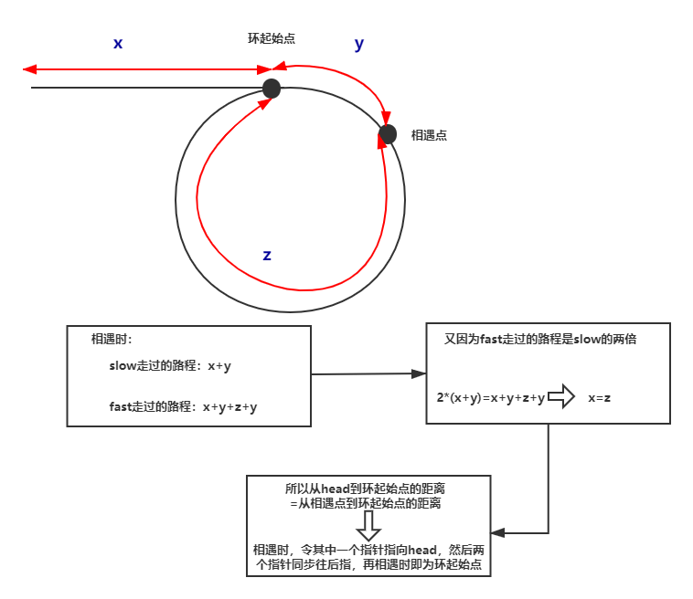

- #### 26.删除排序数组的重复项

  利用两个指针，一个慢指针留在前面保存数字，快指针向后一个一个遍历。

  - 如果慢指针等于快指针，证明是一样的数，那么慢指针不变，快指针向后加一然后再和慢指针比较
  - 如果不等，说明遇到新的数了，那么慢指针后移一位同时把当前快指针的值拷贝过来，然后快指针后移，继续比较。

  ```c++
  class Solution {
      public int removeDuplicates(int[] nums) {
          int slow = 0;
          int n = nums.length;
          for (int i = 1; i < n; i++) {
              if (nums[i] != nums[slow]) {
                  nums[++slow] = nums[i];
              }
          }
          return ++slow;
      }
  }
  ```

  还可以利用STL的unique函数配合erase函数

  **注意unique仅能缩编相邻的元素，所以使用的时候一定要搭配sort使用**

  ```c++
  class Solution {
  public:
      int removeDuplicates(vector<int>& nums) 
      {
          vector<int>::iterator it;
          it=unique(nums.begin(),nums.end()); //unique把范围内的元素折叠缩编，变成唯一的，但是并没有改变元素的个数，重复的元素就放到最后面，如[1,1,2,3,3]经过处理后就变成了[1,2,3,1,3],只是把顺序变了，同时unique函数返回一个指向第一个重复数字的迭代器，在这个例子中就返回一个指向第3个元素1的迭代器
          int b=0;
          while(it!=nums.begin())
          {
              b++;
              it--;
          }
          return b;
          //nums.erase(it,nums.end());
          //return nums.size();            这儿并没有要求要删除后面重复的元素，因此不用erase，如果要的话可以通过erase函数实现
      }
  };
  ```

- #### 27.移除元素

  **慢指针指向的是!=val的值的待插入位置**

  和上题类似，也是利用了双指针的思想。慢指针记录!=val的数，快指针在前面找!=val的数然后传回来

  - 当==val时，不处理，计入下次循环，j++
  - 当!=val时，这是我们要的值， 这时两个指针同时自加1，然后把新出现的j指的值给i，继续遍历

  ```c++
  class Solution {
      public int removeElement(int[] nums, int val) {
          int slow = 0;
          for (int i = 0; i < nums.length; i++) {
              if (nums[i] != val) {
                  nums[slow++] = nums[i];
              }
          }
          return slow;
      }
  }
  ```

- #### 38.外观数列

  利用的是递归的思想，题目的意思是从第二个开始（包括第二个），数字对应的字符串是用来描述上一个字符串的数字的。

  第一个是1，那么第二个就描述第一个，1个1即11；第三个就描述第二个，2个1即21；那么第四个就描述第三个，一个2一个1，即1211；………………

  利用的是递归的思想，先给出递归开始的条件，当n为1是，字符串为“1”；然后后面的递归的时候先表示出前一个字符串，然后对前一个字符串遍历，如果i和i+1相等，计数器count就加一，即几个几；如果不相等就把他们加到记录字符串的res里。

  ```c++
  class Solution {
  public:
      string countAndSay(int n) 
      {
          if(n==1)
              return "1";
          string pre=countAndSay(n-1);
          int count=1;
          string res;
          for(int i=0;i<pre.size();i++)
          {
              if(pre[i]==pre[i+1])  //i+1是字符串结束符\0,所以不用担心越界
              {
                  count++;
                  continue;
              }
              else
              {
                  res+=to_string(count)+pre[i];
                  count=1;
              }
          }
          return res;
          
      }
  };
  ```

- #### 58.最后一个单词的长度

  先找到最后一格不是空格的字符，然后从这个字符开始往前找，如果有空格就停，如果没有就一直加。

  ```c++
  class Solution {
  public:
      int lengthOfLastWord(string s) 
      {
          if(s.size()==0)
              return 0;
          int count=0,index=0;
          for(int i=s.size()-1;i>=0;i--)
          {
              if(s[i]!=' ')
              {
                  index=i;
                  break;
              } 
          }  
          for(int i=index;i>=0;i--)
          {
              if(s[i]==' ')
                  break;
              count++;
          } 
          return count;
      }
  };
  ```

- #### 66.加一

  相当于是初始carry为1的加法

  注意一下进位就行，还有最后插入用函数insert(i,x)，表示把x插入到迭代器i指向的位置，同时后面的元素自动往后移动

  ```c++
  class Solution {
  public:
      vector<int> plusOne(vector<int>& digits) 
      {
          int carry=1;
          int temp=0;
          for(int i=digits.size()-1;i>=0;i--)
          {
              temp=digits[i]+carry;
              digits[i]=temp%10;
              carry=temp>=10?1:0;  //准确来说应该是==0，因为最大也就是10，不会产生比1更大的进位
              temp=0;
          }
          if(carry==1)
              digits.insert(digits.begin(),1);
          return digits;
      }
  };
  ```

- #### 67.二进制求和

  设置个进位，每次循环前求出两位数字和进位的和，然后分情况讨论就行了

  - 0。证明两个数字都为0且进位也为0，那么直接加0，进位置零
  - 1。两个数字有一个为1，进位为0或者两个数字都是0且进位为1，结果加1，进位置1
  - 2。结果加0，进位置1
  - 3。结果加1，进位置1

  > 这里还有个知识点就是字符串和数字的直接运算，字符如果和数字直接运算结果是数字，字符会自动转换为ascii码值参与运算。
  >
  > eg: char b='a';
  >
  > ​      int a=b+1;
  >
  > 结果a=98，即a的ascii值转换成十进制再加上数字1
  >
  > 但如果是加引号的话就是两个字符的ascii值进行运算
  >
  > eg： char b='a';
  >
  > ​         int a=b+'1';
  >
  > 结果a=146，这儿'1'就是一个字符而不是一个单纯的数字，二者的ascii值相加，结果再转换成十进制
  >
  > ---
  >
  > 但是对于string来说，加一个字符串等于把它和原来的链接起来
  >
  > eg：string b="a"
  >
  > ​       b=b+'a'
  >
  > 输出结果即为字符串"aa"

  ```c++
  class Solution {
  public:
      string addBinary(string a, string b) 
      {
          int carry=0;
          while(a.size()>b.size())
              b='0'+b;
          while(a.size()<b.size())
              a='0'+a;
          for(int i=a.size()-1;i>=0;i--)
          {
              if(a[i]-'0'+b[i]-'0'+carry==0)
              {
                  a[i]='0';
                  carry=0; 
              }
              else if(a[i]-'0'+b[i]-'0'+carry==1)
              {
                  a[i]='1';
                  carry=0; 
              }
              else if(a[i]-'0'+b[i]-'0'+carry==2)
              {
                  a[i]='0';
                  carry=1; 
              }
              else
              {
                  a[i]='1';
                  carry=1;
              }
          }
          if(carry==1)
              a='1'+a;
          return a;
      }
  };
  ```

- #### 69.x的平方根

  - 使用二分查找

    ```c++
    class Solution {
    public:
        int mySqrt(int x) 
        {
            if(x==0)
                return 0;   //0的时候特判
            int l=1,r=x;    //确定二分的边界
            while(l<r)
            {
                long mid=l+(r-l+1)/2;   //这儿用的是取右中位数，看下面的判断条件，mid*mid<x，那么我们求得的是mid*mid>=x中最接近mid*mid<x的，即上取整；而题目要求的下取整，所以要用mid*mid>x,从而确定mid的算法
                if(mid*mid>x)
                    r=mid-1;
                else
                    l=mid;
            }        
            return l;
        }
    };
    ```
    
  - 使用牛顿迭代法。关键在于边界的判定。往往计算方程的时候都有个精度限制，误差小于这个精度就可以停止迭代了。

    

    ```c++
    class Solution {
    public:
        int mySqrt(int x) 
        {
            double a=x;   //初始值设定为x，因为x^x-a=0有两个零点，一整一副，选择初始值为x的话就从x开始向左迭代，保证先找到的的是+根号a
            while(fabs(a*a-x)>=1) //收敛半径小于1即可，注意a得是double的
                a=(a+x/a)/2;
            return int(a);
        }
    };
    ```

- #### 83.删除排序列表中的重复元素

  直接操作，如果相等就跳过相等的那个指向下一个；如果不相等就直接跳过

  ```c++
  ListNode* deleteDuplicates(ListNode* head) 
  {   
       if(head==NULL)
           return head;
       ListNode* p=head;
       while(p->next!=NULL)
       {
           if(p->val==p->next->val)
           {
               p->next=p->next->next;
           }
           else
               p=p->next;
     }
       return head;
   }
  };
  ```

- #### 100.相同的树

  满足两个条件，拓扑结构相等同时对应位置的值还要相等，使用递归的方法

  ```c++
  class Solution {
      public:
      bool isSameTree(TreeNode* p, TreeNode* q) 
      {
          if(p==NULL&&q==NULL)             //两个都为空，那必然相等
                return true;                    
          if(p!=NULL&&q!=NULL&&p->val==q->val)  //两个都不为空且值还相等，即拓扑相同且值相等，那么他们满足，开始递归遍历他们的左右子节点
              return isSameTree(p->left,q->left)&&isSameTree(p->right,q->right);
          else             //拓扑不相同或者拓扑相同值不同
              return false;
       }
  };
  ```

- #### 88.合并两个有序数组

  归并的思想，只不过直接在原数组上操作

  ```c++
  class Solution {
  public:
      void merge(vector<int>& nums1, int m, vector<int>& nums2, int n) 
      {
          int i=nums1.size()-1;
          m--,n--;
          while(n>=0)
          {
              while(m>=0 && nums1[m]>nums2[n])
              {
                  nums1[i--]=nums1[m--];
              }
              nums1[i--]=nums2[n--];
          }                
      }
  };
  ```

- #### 101.  对称二叉树

  从根节点开始看，如果根节点为空，符合；如果根节点不空，那么将就看根节点的左右子树是否是镜像的，然后再递归左子树的右子树和右子树的左子树，左子树的左子树和右子树的右子树

  ```c++
  class Solution {
  public:
      bool isSymmetric(TreeNode* root) 
      {
          if(root==NULL)
              return true;
          else 
              return isMirror(root->left,root->right);   
      }
      bool isMirror(TreeNode *p,TreeNode *q)
      {
          if(p==NULL&&q==NULL)
              return true;
          if((p==NULL&&q!=NULL)||(p!=NULL&&q==NULL))
              return false;
          if(p->val==q->val)  //前面判断两个有一个为空一个不为空是不能少的，不然这一步的取直操作就会出错，前面的两个条件就保证了到这儿的时候两个结点都不为空
              return isMirror(p->left,q->right)&& isMirror(p->right,q->left);
          return false;
      }
  };
  ```

- #### 104.二叉树的最大深度

  深度优先搜索DFS

  ```c++
  class Solution {
  public:
      int maxDepth(TreeNode* root) 
      {
          if(root==NULL)
              return 0;
          int l=maxDepth(root->left)+1;  //加1表示的是根节点那一层，下面递归的时候表示的也是递归开始的根节点那一层
          int r=maxDepth(root->right)+1;
          return l>r?l:r;   
      }
  };
  ```

  # 链表

- #### 206.翻转链表

  迭代法和递归法

  1. ```c++
     ListNode* reverseList(ListNode* head)
     {
         ListNode* new_head=NULL;
         while(head)
         {
             ListNode* tmp=head->next;
             head->next=new_head;
             new_head=head;
             head=tmp;
         }
         return new_head;
     }
     ```

  2. ```c++
     class Solution {
     public:
         ListNode* reverseList(ListNode* head) 
         {
             if(head==NULL||head->next==NULL)    //注意两个判断条件的先后顺序，head==NULL一定要放在前面，因为如果传进来空指针，那么先判断head-next就会出现越界错误
                 return head;
             ListNode *p=reverseList(head->next);  //递归一定要搞清楚这个递归函数的意思，这个函数给定一个链表节点输入，输出反转之后链表的头节点
             head->next->next=head;
             head->next=NULL;
             return p;
         }
     };
     ```

- #### 92.翻转部分链表

  递归

  先写出翻转前n个结点的，然后带入到翻转m->n个结点中，然后递归地一直减小m，直到把m减小到1，然后调用翻转前n个即可

  ```c++
  class Solution {
  public:
      ListNode* successor=NULL;
      ListNode* reverseBetween(ListNode* head, int m, int n) 
      {
          if(m==1)
              return reverseN(head,n);
          head->next=reverseBetween(head->next,m-1,n-1);
          return head;    
      }
      ListNode* reverseN(ListNode* head,int n)
      {
          if(n==1)
          {
              successor=head->next;
              return head;
          }
          ListNode* last=reverseN(head->next,n-1);
          head->next->next=head;
          head->next=successor;
          return last;
      }
  };
  ```

- #### 160.相交链表

  双指针

  A的指针遍历完A 接着从headB开始遍历
  B的指针遍历完B 接着从headA开始遍历
  如果链表相交且长度相等，那么不用第二次，第一次遍历到相交节点就找到了

  如果链表相交长度不能，那么走a+b+c步之后必然同时到达相交点

  如果不相交，同时走a+b之后为空

  

  ```c++
  ListNode *getIntersectionNode(ListNode *headA, ListNode *headB) 
  {
      ListNode *a=headA;
      ListNode *b=headB;
  
      while(a!=b)
      {
          a=a?a->next:headB;
          b=b?b->next:headA;
      }
      return a;      
  }
  ```

- #### 141.142求链表是否有环及环的节点位置

  142为进阶版本只看142

  141可以用set也可以用快慢指针

  ```c++
  bool hasCycle(ListNode *head) 
  {
         ListNode *fast=head;   //快指针一次走两步
         ListNode *slow=head;   //慢指针一次走一步
         while(fast!=NULL&&fast->next!=NULL)
         {
             fast=fast->next->next;
             slow=slow->next;
             if(fast==slow)
                 return true;
         }
         return false;
  }
  ```

  **142**

  利用快慢指针

  快指针一次两步，慢指针一次一步。两指针如果相遇，快指针的路程必然是慢指针的2倍。本来应是2(x+y)=x+y+n(y+z),即x=(n-1)(y+z)+z,这儿我们不关心n为多少即绕了多少圈，因为从head和meet出发相交的点必然为环的入口

  

  

  ```c++
  ListNode *detectCycle(ListNode *head) 
  {
      ListNode *fast=head;
      ListNode *slow=head;
      while(fast!=NULL&&fast->next!=NULL)
      {
          fast=fast->next->next;
          slow=slow->next;
          if(fast==slow)
          {
               slow=head;
                  while(fast!=slow)
                  {
                      slow=slow->next;
                      fast=fast->next;
                  }
                  return fast;
              }
          }
          return NULL;
          
      }
  ```

- #### 86.分割链表

  新建两个链表然后拼起来

  ```c++
  ListNode* partition(ListNode* head, int x) 
  {
      ListNode *small=new ListNode(0);
      ListNode *big=new ListNode(0);
      ListNode *p=small;
      ListNode *q=big;
      while(head)
      {
          if(head->val<x)
          {
              small->next=head; //直接指省去了创建新节点的空间
              small=small->next;
              head=head->next;
          }
          else
          {
              big->next=head;
              big=big->next;
              head=head->next;
          }    
      }
      big->next=NULL;    //最后一定要加上这一步，不然无法返回正确的结果。if最后一个比x小，那么把它加到small里，但是此时big指针还停留在上一次大于的值的位置，这儿如果不把big->next置空，后面还跟着原链表中比x小的值，最后返回的结果不正确；如果最后一个比x大，那这一步就没有效果了因为本来就是null
      small->next=q->next;
      return p->next;  
  }
  ```

- #### 138.复制带随机指针的链表

  利用哈希表建立映射

  ```c++
  Node* copyRandomList(Node* head) 
  {
      unordered_map<Node*,Node*> map;  //map是新旧链表对应节点的映射
      Node *cur=head;
  
      while(cur)                       //遍历原链表，每个结点都对应新建一个节点，但是这些节点相互之间并没有连接
      {
          map[cur]=new Node(cur->val);
          cur=cur->next;
      }
      cur=head;
      while(cur)                         //从头遍历，根据原链表建立新建的节点间的对应关系
      {
          map[cur]->next=map[cur->next];
          map[cur]->random=map[cur->random];
          cur=cur->next;
      }
      return map[head];
  }
  ```

- #### 23.合并k个有序链表

  使用优先队列

  ```c++
  ListNode* mergeKLists(vector<ListNode*> &lists)
  {
      priority_queue<ListNode*,vector<ListNode*>,cmp> queue;
      
      for(auto a:lists)
      {
          if(a)
              queue.push(a);
      }
      
      ListNode *res=new ListNode(0);
      ListNode *p=res;             //这两行可以换成ListNode res(1); ListNode *p=&res;这时p->next就等于res.next，最后返回res->next改成res.next即可
      
      while(!queue.empty())
      {
       	ListNode *top=queue.top();   
          queue.pop();        //最小元素出队
          p->next=top;        //最小元素接在p上
          p=p->next;
          if(top->next)       //top-next!=NULL即top后面还有节点，那就把节点加进来；为NULL即证明这个链表已经合并完了，那就不用管他了。
              queue.push(top->next);
      }
      return res->next;
  }
  ```


---

## 栈、队列和堆

- #### 225.用队列实现栈

  ```c++
  class MyStack {
  public:
    
      MyStack() {}
      
      
      void push(int x)     //关键就在这一步，因为队列每次出的队首元素，因此要保证新插入的元素一定得在队首，这儿利用了双队列，即利用了一个临时队列，当插入新的元素时，先把它放在临时队列temp中，再把原队列data中的元素push到temp队列中，这时temp队列中的次序即新插入的元素在队首，这时再把元素push到data中即可
      {
          queue<int> temp;
          temp.push(x);
          while(!data.empty())
          {
              temp.push(data.front());
              data.pop();
          }
          while(!temp.empty())
          {
              data.push(temp.front());
              temp.pop();
          }
      }
      
      
      int pop() 
      {
          int x=data.front();
          data.pop();
          return x;
      }
      
      
      int top() 
      {
          return data.front();
      }
      
      
      bool empty() 
      {
          if(data.empty())
              return true;
          else
              return false;
      }
      
  private:
      queue<int> data;
  };
  
  ```

- #### 232.用栈实现队列

  用队列实现栈使用了双队列，这儿我么利用类似的思想，用双栈来实现队列。

  ```c++
  class MyQueue {
  public:
      /** Initialize your data structure here. */
      MyQueue() {
  
      }
      
      /** Push element x to the back of queue. */
      void push(int x) 
      {
          stack<int> temp;
          while(!data.empty())
          {
              int x=data.top();
              data.pop();
              temp.push(x);
          }
          temp.push(x);
          while(!temp.empty())
          {
              int y=temp.top();
              temp.pop();
              data.push(y);
          }
      }
      
      /** Removes the element from in front of queue and returns that element. */
      int pop() 
      {
          int x=data.top();
          data.pop();
          return x;
      }
      
      /** Get the front element. */
      int peek() 
      {
          return data.top();
  
      }
      
      /** Returns whether the queue is empty. */
      bool empty() 
      {
          if(data.empty())
              return true;
          else
              return false;
      }
  private:
      stack<int> data;
  };
  
  /**
   * Your MyQueue object will be instantiated and called as such:
   * MyQueue* obj = new MyQueue();
   * obj->push(x);
   * int param_2 = obj->pop();
   * int param_3 = obj->peek();
   * bool param_4 = obj->empty();
   */
  ```

- #### 496.下一个更大元素

  维护一个单调递减栈。

  **这儿没有重复元素，所以可以用map，再加上两个数组还要比较，索引会变化，所以只能用map唯一对应每个数字。有重复的话不能用map保存数，因为会重复，要用vector保存索引，没有重复的话用vector存索引相比map也会更方便**
  
  如果只需要输出当前对应索引的下一个元素，那么直接压索引即可，然后把索引加到vector里即可
  
  ```c++
  class Solution {
  public:
      vector<int> nextGreaterElement(vector<int>& nums1, vector<int>& nums2) 
      {
          unordered_map<int,int> m;
          vector<int> res;
          stack<int> s;
          
          for(auto i:nums2)
              m[i]=-1;
          
          for(auto i:nums2)
          {
              while(!s.empty() && i>s.top())
              {
                  m[s.top()]=i;
                  s.pop();
              }
              s.push(i);
          }
          
          for(auto i:nums1)
              res.push_back(m[i]);
          return res;
      }
  };
  ```
  
- #### 503.下一个更大元素Ⅱ

  保存索引，同时循环两次。其中存在重复元素，所以不能用map，只能用vector保存索引

  ```c++
  class Solution {
  public:
      vector<int> nextGreaterElements(vector<int>& nums) 
      {
          vector<int> res(nums.size(),-1);
          stack<int> s;
  
          for(int i=0;i<nums.size()*2;i++)
          {
              while(!s.empty()&&nums[s.top()]<nums[i%nums.size()])
              {
                  res[s.top()]=nums[i%nums.size()];
                  s.pop();
              }
              s.push(i%nums.size());
          }
          return res;
      }
  };
  ```

- #### 155.最小栈

  只用一个标志位记录最小值时，如果一直压栈倒还行，但是一但出栈最小值就无法确认了，因此需要一个辅助栈，记录每时每刻栈的最小值，它的元素数量和栈相同，而且栈顶元素始终是当前栈中的最小元素。

  ```c++
  class MinStack {
  public:
      /** initialize your data structure here. */
      MinStack() {
           
      }
      
      void push(int x) 
      {
          if(data.empty())            //这儿注意判定就行，不然栈空时minStack.top()是非法访问
          {
              data.push(x);
              minStack.push(x);
          }
          else
          {
              data.push(x);
              minStack.push(min(minStack.top(),x));
          }
      }
      
      void pop() 
      {
          data.pop();
          minStack.pop();
          
      }
      
      int top() 
      {
          return data.top(); 
      }
      
      int getMin() 
      {
          return minStack.top();
      }
  private:
      stack<int> data;
      stack<int> minStack;
  };
  ```
  
- #### 224.基本计算器

  简化了计算器的功能，熟悉一下后缀表达式的计算方式和中缀转后缀的方法。

  ```c++
  class Solution {
  public:
      int calculate(string s) 
      {
          stack<int> st;
          int res=0;
          int sign=1;
          int n=s.size();
  
          for(int i=0;i<n;i++)
          {
              if(s[i]>='0')  //表示该字符是数字
              {
                  int temp=0;
                  while(i<n&&s[i]>='0')   //把连续的数字存起来
                  {
                      temp=temp*10+(s[i]-'0');
                      i++;
                  }
                  i--;
                  res+=temp*sign;
              }
              else if(s[i]=='+')
                  sign=1;     //下次再遇到数字的时候，这个标志位就要乘到那个数字的前面
              else if(s[i]=='-')
                  sign=-1;
              else if(s[i]=='(')
              {              //遇到左括号，就先把当前计算的结果和当前的标志位压栈，然后重置res和sign
                  st.push(res);
                  st.push(sign);
                  res=0;
                  sign=1;
              }
              else if(s[i]==')')
              {               //遇到右括号，就把当前的计算结果和栈顶的元素计算，因为栈的特性，遇到右括号，那么必定与栈中最近的左括号对应，这儿即栈顶的res和sign。此时栈顶保存的就是上次遇到(时的值和标志位，标志位是对于后面的元素的，即a+b，是后面的b要乘以sign再和a加，因此res乘标志位再加上原来的res
                  res*=st.top();
                  st.pop();
                  res+=st.top();
                  st.pop();
              }
          }
          return res;
  
      }
  };
  ```

- #### 295.数据流的中位数

  利用了一个最大堆和一个最小堆，保证最大堆的堆顶小于最小堆的堆顶，同时二者的个数差距不能超过一个，那么中位数就可以通过二者的堆顶来取得。

  最原始的方法就是先确定两个堆的个数：

  - big=small.
    - num>big.top().那么加入最小堆
    - num<=big.top().加入最大堆
  - big=small+1
    - num>small.top().加入最小堆
    - num<=small.top().先加到最大堆，然后把最大堆堆顶拿过来
  - big+1=small
    - num>big.top()先加到最小堆，再把最小堆堆顶拿过来
    - num<=big.top().加入最大堆

  **我们可以高度抽象上面的过程：**

  1. 来的元素先放到最大堆，然后将最大堆的堆顶放到最小堆里
  2. 如果small>big，那么把最小堆的堆顶加到最大堆。

  这两步完之后就保证要么small=big，要么small+1=big

  ```c++
  class MedianFinder {
  public:
      priority_queue<int> big;
      priority_queue<int,vector<int>,greater<int>> small;
      /** initialize your data structure here. */
      MedianFinder() {
      }
      
      void addNum(int num) 
      {
          big.push(num);
  
          small.push(big.top());
          big.pop();
  
          if(small.size()>big.size())
          {
              big.push(small.top());
              small.pop();
          }          
      }
      double findMedian() 
      {
          return big.size()>small.size() ? (double)big.top(): (small.top()+big.top())/2.0;
      }
  };
  
  ```

---

## 贪心

- #### 455.分发饼干

  先把两个vector排序，然后利用双指针遍历直到其中一个为空

  ```c++
  class Solution {
  public:
      int findContentChildren(vector<int>& g, vector<int>& s) 
      {
          sort(g.begin(),g.end());
          sort(s.begin(),s.end());
          int child=0;
          int cookie=0;
          
          while(child!=g.size()&&cookie!=s.size())
          {
              if(g[child]<=s[cookie])
                  child++;
              cookie++;
          }
          return child;
      }
  };
  ```

- #### 376.摆动序列

  注意这儿的子序列不要求是连续的，只要顺序不变就行。

  还有就是最长子序列必定从第一个元素开始，可以证明的。

  证明如下：若存在某个以第二个数为开始的摆动序列，这个摆动序列里的第二个数比第一个数大，而原始数组的第一个数比第二个数（也就是摆动序列的第一个数）大，则以原始数组的第一个数作为开始能使摆动序列长度+1；若摆动序列里的第二个数比第一个数大，而原始数组的第一个数比第二个数小，则选取原始数组的第一个数或者第二个数作为摆动序列的第一个数是等价的，不减少摆动序列长度。对于摆动序列中第二个数比第一个数小的情况对称可证。

  > 程序实现参照大力哥的实现
  >
  > 就是把原序列的看成是变化的折线，那么最长子序列只需要从第二个数字开始记录波峰波谷的个数再1即加上第一个数字即可

  ```c++
  class Solution {
  public:
      int wiggleMaxLength(vector<int>& nums) 
      {
          int n=nums.size();
          if(n<2)
              return n;
          
          int pre=0;    
          int res=1;
          for(int i=1;i<n;i++)
          {
              if(nums[i]==nums[i-1])
                  continue;
              int cur=nums[i]>nums[i-1]?1:-1;  //记录当前节点和它前一个节点的变化趋势
              res+=cur!=pre;   //此时pre记录当前节点的前一个顶点和当前节点的前一个顶点的前一个顶点的变化趋势，只要这两个不一样，那么就把当前节点加入子序列
              pre=cur;
          }
  
          return res;
      }
  };
  ```

- #### 402.移掉K位数字

  最高位对数字的大小影响最明显，因此从最高位开始遍历

  ```c++
  class Solution {
  public:
      string removeKdigits(string num, int k) 
      {
          string res;
          int n=num.size();
          int m=n-k;              //最后要保留的字符个数
  
          for(char c:num)
          {
              while(!res.empty() && k && c<res.back())  //维持单调栈递增，因为最高位对数字的大小影响最大，因此我们从最高位开始遍历。如果c比它前一位小，那么去掉前一位得到的数组比去掉它得到的数字小，因此弹栈，去掉前一位
              {
                  res.pop_back();
                  k--;
              }
              res.push_back(c);
          }
          //循环完之后两种情况，第一种是k==0，即减掉了k个数字，那么此时res即为结果；第二种情况是k>0,即原string中满足后一个比前一个小的不够k个，那么此时的res必然是递增序列不然k也不会大于0，因为只要有逆序的k就会--，而循环完成k都没有--到0证明此时的res是递增序列，那要使结果最小只需要把最后最大的几个删除了就行
          res.resize(m);   
  
          while(!res.empty()&&res[0]=='0')  //去掉res的前置0
          {
              res.erase(res.begin());
          }
  
          return res.empty() ? "0" :res;
      }
  };
  ```

- #### 55.跳跃游戏

  贪心算法，我们每次在可跳范围内选择可以使得跳的更远的位置

  如果i最远能到k，那么i到k之间的所有位置i都可以到达。那么我们就可以依次遍历数组，并实时维护最远可以到达的位置。对于当前遍历到的位置 x，如果它在最远可以到达的位置的范围内，那么我们就可以从起点通过若干次跳跃到达该位置，因此我们可以用 x + nums[x] 更新最远可以到达的位置。

  遍历所有数组，实时更新最远可以到达的位置

  ```c++
  class Solution {
  public:
      bool canJump(vector<int>& nums) 
      {
          int k=0;    //当前能跳跃到的最远位置的索引
          int n=nums.size();
  
          for(int i=0;i<n;i++)
        
              if(i>k)
                  return false;    //跳不到i，false
              k=max(k,i+nums[i]);
              if(k>=n-1)
                  return true;   //已经能跳到n-1了，那就直接返回，不用遍历了
          }
          return 0;
      }
  };
  ```

- #### 45.跳跃游戏2

  **贪婪算法，我们每次在可跳范围内选择可以使得跳的更远的位置**

  **每一次跳跃，最远可以到i+num[i]，那么对于最远位置到i之间的位置j，我们选择的j是j+nums[j]中最大的，即跳向当前可跳范围内可以的索引中最远可跳位置最大的那个索引**

  例如2 3 1 2 4 2 3

  0可以跳到1或者2，那么就看1和2哪个跳的位置远；1最远到4，2最远到3，那么第一次就从1跳到1；然后再继续相同的判断

  > 在具体的实现中，我们维护当前能够到达的最大下标位置，记为边界。我们从左到右遍历数组，到达边界时，更新边界并将跳跃次数增加 1。
  >
  > 在遍历数组时，我们不访问最后一个元素，这是因为在访问最后一个元素之前，我们的边界一定大于等于最后一个位置，否则就无法跳到最后一个位置了。如果访问最后一个元素，在边界正好为最后一个位置的情况下，我们会增加一次「不必要的跳跃次数」，即增加一次起跳次数，是从终点起跳，多加了一次count，因此我们不必访问最后一个元素。
  >

  ```c++
  class Solution {
  public:
      int jump(vector<int>& nums) 
      {
          int n=nums.size();
          int maxPos=0;  //记录当前能跳到的最大位置
          int end=0;    //表示当前起跳范围的边界，从i开始到end，中间必须要选一个起跳
          int count=0;   //记录的是起跳的次数而不是跳跃落下来的次数
  
          for(int i=0;i<n-1;i++)
          {
              maxPos=max(maxPos,i+nums[i]);
              if(end==i)    //end==i,到达边界，证明比较完了，就开始跳跃，count++,同时把end置为maxPos，然后后面继续比较i和end之间的索引
              {
                  end=maxPos;
                  count++;   //更新count其实是更新了一次起跳次数
              }
          }
          return count;
                  
      }
  };
  ```

- #### 1306.跳跃游戏3

  dfs，注意要用一个visit数组来记录已经访问过的，如果不记录的话，会存在反复横跳的情况，进入无限回溯递归，无法返回结果

  ```c++
  class Solution {
  public:
      bool canReach(vector<int>& arr, int start) 
      {
          vector<int> visit(arr.size());
          return dfs(visit,arr,start);                
      }
  
      bool dfs(vector<int>& visit,vector<int>& arr,int start)
      {
          if(start<0 || start>=arr.size() || visit[start])
              return false;
          if(arr[start]==0)
              return true;
          visit[start]=1;
          if(dfs(visit,arr,start+arr[start]) || dfs(visit,arr,start-arr[start]))
              return true;
          visit[start]=0;
          return false;
      }
  };
  ```

- #### 452.用最少数量的箭射爆气球

  - 区间排序后比较维护的箭的位置（初始时就是第一个区间的右边界）与当前区间左边界间的关系，if当前区间的start在shoot之后，那么就加一根箭

  - 这儿我们用的是对右边界进行排序，这样如果start在shoot之后，那么必然就加一根箭。如果是对左区间进行排序，需要额外更新shoot，麻烦，例如对于14和23这种情况

    ```c++
    class Solution {
    public:
      
        int findMinArrowShots(vector<vector<int>>& points) 
        {
            if(points.empty())
                return 0;
            sort(points.begin(),points.end(),[](vector<int>& a,vector<int>& b){return a[1]<b[1];});
    
            int arrow=1;
            int start,end;
            int shoot_end=points[0][1];
    
            for(auto i:points)
            {
                start=i[0];
                end=i[1];
                if(shoot_end<start)
                {
                    arrow++;
                    shoot_end=end;
                }
            }
            return arrow;
        }
    };
    ```
    

---

## 递归、回溯和分治

```c++
//自身不重复,按顺序
i=start
i+1
//自身重复，按顺序
i=start
i                              //这两种就是每个i对应一个start
//重复且不按顺序
i=start
start
//部分重复且部分按顺序
i=start
start+1                       //这两种就是所有的i都对应一个start
//使用如下代码测试
void dfs(vector<vector<int>> &res,vector<int> &temp,int start,vector<int> &num)
{
    if(temp.size()==num.size())
    {
        res.push_back(temp);
        return;
    }
    for(int i=start;i<num.size();i++)
    {
        temp.push_back(num[i]);
        dfs(res,temp,i,num);
        temp.pop_back();
    }
}

int main()
{
    vector<vector<int>> res;
    vector<int> temp;
    vector<int> num{1,2,3};
    dfs(res,temp,0,num);
}
```

1. 第一种是结果就只有123一种情况

2. 第二种自身可以重复，但要按顺序。10种情况

   ```c++
   1 1 1 
   1 1 2 
   1 1 3 
   1 2 2 
   1 2 3 
   1 3 3 
   2 2 2 
   2 2 3 
   2 3 3 
   3 3 3 
   ```

3. 第三种自身可以重复且不用按顺序，用过的还能用即3的3次方27种情况

4. 这种较为特殊，选择1次之后剩下的待选集合就是i+1到n，而且不用管是否重复

   ```c++
   1 2 3 
   1 3 3 
   2 2 3 
   2 3 3 
   3 2 3 
   3 3 3  //第一次123都可以选，那么第二次选的时候只能在23里选而且不用管第一次选的是什么，同理第三次就只能选3
   ```

递归即自己调用自己，要注意设置递归中止的条件

回溯是dfs的一种特例，本质上就是穷举遍历。区别在于dfs对顺序没有要求，而且每个节点都要遍历到；而回溯一般是有序的，一但不满足条件就返回，因此有的节点可能遍历不到

子集和子集Ⅱ的区别在于给的nums中有没有重复，有的话要多去重那一步

组合和组合Ⅱ的区别1是集合中的元素能否重复，能的话回溯的时候从索引i开始；区别2也是nums是否重复然后去重的那个操作

回溯的模板

```c++
result = []
def backtrack(路径, 选择列表):
    if 满足结束条件:
        result.add(路径)
        return
    for 选择 in 选择列表:
        做选择
        backtrack(路径, 选择列表)
        撤销选择
```

- #### 78.子集

  集合元素不重复

  

  第一层for的时候start=0，然后分别选择第一个元素,i从0->2

  第二层for的时候start=1，选择第二个元素,i从1->2

  。。。共n层循环，最后一层start=n.size()-1,i只有n.size()-1

  

  回溯

  实际实现，res就是结果，而temp相当于路径，即已经做出的选择，nums就是选择列表

  可以把res和temp都写到外面

  ```c++
  class Solution {
  public:
      vector<vector<int>> subsets(vector<int>& nums) 
      {
          vector<vector<int>> res;
          vector<int> temp;
  
          backtrack(0,temp,res,nums);
          return res;
      }
      void backtrack(int start,vector<int> &temp,vector<vector<int>> &res,vector<int> nums)
  {
          res.push_back(temp);
  
          for(int i=start;i<nums.size();i++)
          {
              temp.push_back(nums[i]);
              backtrack(i+1,temp,res,nums);   //有nums[i]，就push，然后继续遍历后面的i+1
              temp.pop_back(); //没有nums[i],就把刚才压的弹出，然后继续下一次i+1，再看nus[i+1]是不是有，直到nums里所有的都判断完
          }
      }
  };
  ```

  位运算

  还可以利用位运算，一个集合有n个元素，那么子集的个数就是2的n次方个，那么我们可以用一个n位的二进制数来表示子集中元素的取舍，例如原集合是[1,2,3]，那么二进制数100表示只有1没有2和3；二进制数110就表示有1和2，没有3

  ```c++
  class Solution {
  public:
      vector<vector<int>> subsets(vector<int>& nums) 
      {
          vector<vector<int>> res;
          int N=nums.size();
          int n=1<<N; //子集的个数。这儿用pow也可以，但是要注意pow默认返回的类型是double，不能直接&，要先变成int再&
  
          for(int i=0;i<n;i++)
        {
              vector<int> temp;
            for(int j=0;j<N;j++)
              {
                if(i&(1<<j))    //不一定非要100对应nums[0],也可以是001对应nums[0],只要满足一一对应关系即可。这儿我么就用后者，这样表达式简单。如果前者的话就是1<<(N-j-1).因为两个索引只是顺序关系，t+j=N-1，t=N-j-1
                      temp.push_back(nums[j]);
              }
              res.push_back(temp);
          }
          return res;     
  
      }
  };
  ```

- #### 77.组合

  ```c++
  class Solution {
  public:
    vector<int> temp;
      vector<vector<int>> res;
      vector<vector<int>> combine(int n, int k) 
      {
          vector<int>num;
          for(int i=1;i<=n;i++)
              num.push_back(i);
          dfs(num,n,k,0);
          return res;        
      }
      void dfs(vector<int>& num,int n,int k,int start)
      {
          if(temp.size()==k)
          {
              res.push_back(temp);
              return;
          }
          //下面这一步是剪枝操作，k为总共要找的数字的个数，temp.size()是现在已经找到的数字的个数，那么二者相减就是还剩多少个数要找，因此处于n-(k-temp.size())之后位置上的索引我们就不要找了，因为不管怎么凑后面都凑不够我们所需的k-temp.size()个数
          for(int i=start;i<=n-(k-temp.size());i++) 
          {
              temp.push_back(num[i]);
              dfs(num,n,k,i+1);
              temp.pop_back();
          }
      }
  };
  ```
  
- #### 46.全排列

  回溯

  设置used数组，记录nums中某个元素有没有被用过

  ```c++
  class Solution {
  public:
      vector<vector<int>> permute(vector<int>& nums) 
      {
          vector<vector<int>> res;
          vector<bool> used(nums.size(),false);  //默认都没有用过
          vector<int> path;
          int n=nums.size();
          backTrack(res,path,used,nums);
          return res;        
      }
      void backTrack(vector<vector<int>> &res,vector<int> &path,vector<bool> &used,vector<int> &nums)
      {
          if(path.size()==nums.size())  //证明数字个数够了，返回
              res.push_back(path);
       
  
          for(int i=0;i<nums.size();i++)
          {
              if(!used[i])
              {
                  path.push_back(nums[i]);
                  used[i]=true;    //没有用过，如果选择用，那么加入path，同时把used置为true表示已经用过
                  backTrack(res,path,used,nums);
                  path.pop_back(); //选择不用，那么把刚才加进去的再拿出来，同时回复used标识，然后继续循环
                  used[i]=false;
              }
          }
      }
  };
  ```

- #### 47.全排列Ⅱ 会重复

  ```c++
  class Solution {
  public:
      vector<vector<int>> permuteUnique(vector<int>& nums) 
  
  
      {
          sort(nums.begin(),nums.end());
          vector<vector<int>> res;
          vector<bool> used(nums.size(),false);  //默认都没有用过
          vector<int> path;
          int n=nums.size();
          backTrack(res,path,used,nums);
          return res;        
      }
      void backTrack(vector<vector<int>> &res,vector<int> &path,vector<bool> &used,vector<int> &nums)
      {
          if(path.size()==nums.size())  //证明数字个数够了，返回
              res.push_back(path);
       
  
          for(int i=0;i<nums.size();i++)
          {
              if(used[i] || i>0&& nums[i]==nums[i-1]&&!used[i-1])   //nums[i]==nums[i-1]同时used[i-1]==0这时才可以剪枝，即和他前一个元素相同同时i-1没有被用即不在已遍历的序列里，不在已遍历的序列证明前面nums[i-1]已经遍历所有序列且撤销选择，再用相同的i再遍历一次就重复了，所以要确定used[i-1]==0才可以剪枝
                  continue;
            
              path.push_back(nums[i]);
              used[i]=true;   
              backTrack(res,path,used,nums);
              path.pop_back(); 
              used[i]=false;
          }
      }
  };
  ```

- #### 90.子集Ⅱ

  集合元素会重复

  首先排序，确保相同的元素挨着。然后在回溯的时候把递归树上同一层相等的去掉，即nums[i]=nums[i-1].同时i>start，确保每一层的第一个即刚遍历到的新的不删，剪枝从每一层的第二个开始，否则下面1 2 2也要剪掉

  参考上面子集的图

  

  ```c++
  class Solution {
  public:
      vector<vector<int>> subsetsWithDup(vector<int>& nums) 
      {
          
          vector<vector<int>> res;
          vector<int> temp;
          sort(nums.begin(),nums.end());
          backTrack(0,temp,res,nums);
          return res;
      }
      void backTrack(int start,vector<int> &temp,vector<vector<int>> &res,vector<int> nums)
      {  
          res.push_back(temp);
  
          for(int i=start;i<nums.size();i++)
          {
              if(i>start&&nums[i]==nums[i-1]) //把递归树同一层相等的元素去掉。i>start表示不是该层递归的第一个元素，如果是该层递归的第一个那么它是可以和前一个相等的因为它和前一个不是同一层递归
                  continue;
              temp.push_back(nums[i]);
              backTrack(i+1,temp,res,nums);
              temp.pop_back();
          }
      }
  };
  ```

- #### 39.组合总和

  target>=candidates[i]用来剪枝

  ```c++
  class Solution {
  public:
      vector<vector<int>> res;
      vector<int> temp;
      vector<int> can;
      vector<vector<int>> combinationSum(vector<int>& candidates, int target) 
      {
          can=candidates;
          sort(can.begin(),can.end());
          dfs(0,target);
          return res;
      }
  
      void dfs(int start,int target)
      {
          if(target==0)
              res.push_back(temp);
          if(target<0)
              return;
          for(int i=start;i<can.size();i++)
          {
              //if(can[i]>target)
              //    continue;      这样剪枝也可以，一个是在加入之前剪枝，一个是把can[i]放入之后再剪枝
              temp.push_back(can[i]);
              target=target-can[i];
              dfs(i,target);
              temp.pop_back();
              target=target+can[i];
        }
      }
  };
  ```
  
- #### 40.组合总数Ⅱ

  2和1的区别在于2的数字不能重复，所以遍历的时候索引要加1，同时多了去重的操作

  ```c++
  class Solution {
  public:
      vector<vector<int>> res;
      vector<int> temp;
      vector<int> can;
      vector<vector<int>> combinationSum2(vector<int>& candidates, int target) 
      {
          can=candidates;
          sort(can.begin(),can.end());
          dfs(0,target);
          return res;
      }
  
      void dfs(int start,int target)
      {
          if(target==0)
              res.push_back(temp);
          
          for(int i=start;i<can.size();i++)
          {
              if(can[i]>target || i>start && can[i]==can[i-1])
                  continue;
              temp.push_back(can[i]);
              target=target-can[i];
              dfs(i+1,target);
              temp.pop_back();
              target=target+can[i];
          }
      }
  };
  ```
  
- #### 216.组合总数Ⅲ

  不能重复，且按顺序，即i=start,i+1;

  ```c++
  class Solution {
  public:
    vector<vector<int>> combinationSum3(int k, int n) 
      {
          vector<vector<int>> res;
          vector<int> path;
          backTrack(1,res,path,k,n);
          return res;
      }
  
      void backTrack(int start,vector<vector<int>> &res,vector<int> &path,int k,int n)
      {
          if(n<0||k<0)
              return;
          if(n==0&&k==0)
              res.push_back(path);
          for(int i=start;i<10;i++)
          {
              n-=i,k--;
              path.push_back(i);
              backTrack(i+1,res,path,k,n);
              path.pop_back();
              n+=i,k++;
          }
      }
  };
  ```

- #### 377.组合总数IV

  直接回溯的话只能通过一半的测试样例，而且这儿只让我们求个数，并没有要输出具体的组合，所以用动态规划两全其美

  > 举一个具体的例子：nums=[1, 3, 4], target=7;
  >
  > dp[7] = dp[6] + dp[4] + dp[3]
  >
  > 即：7 的组合数可以由三部分组成，1 和 dp[6]，3 和 dp[4], 4 和dp[3];

  - dp[i]表示用nums组合成i的组合的个数，因此初始化数组时索引得能到达target，即数组元素个数为target+1
  - 状态转移方程即dp[i]+=dp[i-nums[j]];

  注意整形溢出，使用unsigned long long

  ```c++
  class Solution {
  public:
      int combinationSum4(vector<int>& nums, int target) 
      {
          vector<unsigned long long> dp(target+1);
          dp[0]=1;  //dp[0] = 1，表示，如果那个硬币的面值刚刚好等于需要凑出的价值，这个就成为 1 种组合方案
  
          for(int i=1;i<=target;i++)
          {
              for(int j=0;j<nums.size();j++)
              {
                  if(i>=nums[j])  //防止i-nums[j]越界
                      dp[i]+=dp[i-nums[j]];  //if i-nums[j]==0即nums中的一个数字就可以构成i的一种组合，所以dp[0]的取值为1
              }
          }
          return dp[target];
      }
  };
  ```
  
- #### 22.括号生成

  ### **记录path的temp如果没有回退操作就只能用形参，有回退操作的话传值和传引用都可以**

  一个深度优先遍历的过程，

  1. 每次先选择左括号再选择右括号，
  2. 左括号数量小于右括号时剪枝；
  3. 当两个括号的数量都为n时，保存结果。

  ```c++
  class Solution {
  public:
      vector<string> res;
      string s;  
      vector<string> generateParenthesis(int n) 
      {   
          dfs(s,0,0,n);
          return res;                
      }
  
      void dfs(string s,int leftcount,int rightcount,int n)  //没有回退操作，所以string用的是形参，用引用的话结果错误，因为没有回退所以先前遍历过的括号无法删除。有回退操作的话传值传引用都可以。
      {
          if(leftcount==n && rightcount==n)
              res.push_back(s);
          if(leftcount<rightcount)
              return;
          if(leftcount<n)
              dfs(s+'(',leftcount+1,rightcount,n);  //不要用++，先运算后操作，会进入死循环
          if(rightcount<n)
              dfs(s+')',leftcount,rightcount+1,n);
      }
  };
  ```

- #### 51.N皇后

  利用回溯的模板。逐行递归，每一行再逐列递归，一行放一个，然后一行一行的放，每一行放一个，放的时候确保和前面已经放好的不冲突。当行数达到要求的时候就push

  ```c++
  class Solution {
  public:
      vector<vector<string>> res;
  
      vector<vector<string>> solveNQueens(int n) 
      {
          vector<string> board(n,string(n,'.'));
          backTrack(board,0);
          return res;
      }
      void backTrack(vector<string> &board,int row)
      {
          int n=board.size();  //第n行的索引是n-1，填完之后进入下一次递归，此时row的索引是n，此时才退出回溯，因此回溯中止条件为n=board.size()，if是board.size()-1的话，倒数第二行填完就退出了
          if(row==n)
              res.push_back(board);
          
          for(int col=0;col<n;col++)
          {
              if(!Valid(board,row,col))
                  continue;
              board[row][col]='Q';
              backTrack(board,row+1);
              board[row][col]='.';
          }
      }
      bool Valid(vector<string> &board,int row,int col)
       {
              int n=board.size();
              for(int i=0;i<row;i++)
              {
                  if(board[i][col]=='Q')
                      return false;
              }
  
              for(int i=row-1,j=col+1;i>=0&&j<n;i--,j++)
              {
                  if(board[i][j]=='Q')
                      return false;
              }
              for(int i=row-1,j=col-1;i>=0&&j>=0;i--,j--)
              {
                  if(board[i][j]=='Q')
                      return false;
              }
              return true;
          }
      };
  
  ```

- #### 315.计算右侧小于当前元素的个数

  即计算逆序数

  1. **新建一个排序数组sort_nums，从nums的最后一个元素开始依次遍历**，使用low_bound函数找到sort_nums中第一个大于等于nums[i]的位置，然后用索引减去sort_nums.begin()即该索引前面的元素的个数，因为是倒着遍历，那么当nums[i]比较时已经在sort_nums中的元素在原数组nums中都在nums[i]的后面，所以相减得到的个数就是nums[i]的后面比它小的元素的个数，即所求的逆序数，然后保存这个个数，同时将nums[i]插入到刚才找到的索引的位置，继续遍历nums

     ```c++
     class Solution {
     public:
         vector<int> countSmaller(vector<int>& nums) 
         {
          
             int n=nums.size();
             vector<int> count(n);
             vector<int> sort_num;
             int i=n-1;
     
             while(i>=0)
             {
                 auto it=lower_bound(sort_num.begin(),sort_num.end(),nums[i]);
                 count[i]=it-sort_num.begin();
                 sort_num.insert(it,nums[i]);  //这两步顺序一定不能乱，因为insert之后迭代器begin()会失效，所以插入操作一定要放到最后
                 i--;
             }       
             return count; 
         }
     };
     ```

  2. **利用归并排序的性质，归并排序二分完之后，在归并有序数组的过程会记录逆序数**

     

     归并的时候前后的数组都是有序的，那么对于后面数组的元素，他们的逆序数都为0，因为是升序的；因此只有前面的元素才有逆序数，当前面的元素a加入合并后的数组时，后面的数组中已经加入合并数组的元素的个数即为a的逆序数，因为已经加入合并数组即证明比a小，而他在后数组，所以个数即为逆序数。这个个数可以用当前的j指针指向的位置的索引减去后数组首元素的索引来表示。

     数组中每个元素都有对应的逆序数，但是在归并排序的过程中会打乱数组顺序，这儿我们用`pair<nums[i],i>`来记录开始时的索引，用一个数组count数组来记录逆序数，那么修改的时候用pair.second作为索引来修改count即可

     ```c++
      class Solution {
     public:
       void MergeSort(vector<pair<int,int>> &nums,vector<int> &count,int low,int high)
         {
             if(low>=high)
                 return ;
             int mid=low+(high-low)/2;
             MergeSort(nums,count,low,mid);
             MergeSort(nums,count,mid+1,high);
             Merge(nums,count,low,mid,high);
         }
     
         void Merge(vector<pair<int,int>> &nums,vector<int> &count,int low,int mid,int high)
         {
             int i=low,j=mid+1,k=0;
     
             vector<pair<int,int>> temp(high-low+1);
     
             while(i<=mid&&j<=high)
             {
                 if(nums[i].first<=nums[j].first)
                 {
                     count[nums[i].second]+=j-(mid+1);
                     temp[k++]=nums[i++];
                 }
                 else
                     temp[k++]=nums[j++];
             }
             while(i<=mid)
             {
                 count[nums[i].second]+=j-(mid+1);
                 temp[k++]=nums[i++];
             }
             while(j<=high)
             temp[k++]=nums[j++];
     
             for(int i=low,k=0;i<=high;i++,k++)
             {
                 nums[i]=temp[k];
             }
         }
     
         vector<int> countSmaller(vector<int>& nums) 
         {
             vector<pair<int,int>> res;
             vector<int> count(nums.size());
             for(int i=0;i<nums.size();i++)
             {
                 res.push_back(make_pair(nums[i],i));
             }
     
             MergeSort(res,count,0,nums.size()-1);
             return count;
         }
     };
     ```

  3. **利用二叉搜索树BST**

     ```c++
     class Solution {
     public:
         struct BSTnode
         {
             int val;
             BSTnode* left;
             BSTnode* right;
             int count;  //记录左子树的节点个数，小于等于的都插入到左子树
             BSTnode(int x):val(x),left(nullptr),right(nullptr),count(0){}
         };
         vector<int> countSmaller(vector<int>& nums) 
         {
             if(nums.empty())
                 return {};
             int n=nums.size();
             BSTnode* root=new BSTnode(nums[n-1]);
             vector<int> countNum(1);  //最后一个元素的逆序数为0
             for(int i=n-2;i>=0;i--)   //从后往前插入，类似于第一种方法
             {
                 int num=0;
                 BSTinsert(root,new BSTnode(nums[i]),num);
                 countNum.push_back(num);
             }
             reverse(countNum.begin(),countNum.end());
             return countNum;
         }
         void BSTinsert(BSTnode* root,BSTnode* node,int& num)
         {
             if(node->val<=root->val)
             {
                 root->count++;
                 if(root->left)
                     BSTinsert(root->left,node,num);
                 else
                     root->left=node;
             }
             else
             {
                 num+=root->count+1;
                 if(root->right)
                     BSTinsert(root->right,node,num);
                 else
                     root->right=node;
             }
         }
     };
     ```

---

## 二叉树与图

- #### 112.路经总和

  给定一个二叉树和一个目标和，判断该树中是否存在根节点到叶子节点的路径，这条路径上所有节点值相加等于目标和。

  使用递归方法，递归节点的左子树和右子树，直到叶子节点。其实就是深度优先遍历的方法

  ```c++
  class Solution {
  public:
      bool hasPathSum(TreeNode* root, int sum) 
      {
          if(root==NULL)
              return false;
          if(root->val==sum&&root->left==NULL&&root->right==NULL)
              return true;
          return hasPathSum(root->left,sum-root->val) ||hasPathSum(root->right,sum-root->val) ; 
      }
  };
  ```

- #### 113.路经总和Ⅱ

  回溯算法，用一个vector来记录当前的路径

  ```c++
  class Solution {
  public:
      vector<vector<int>> res;
      vector<int> temp;
      vector<vector<int>> pathSum(TreeNode* root, int sum) 
      {
          dfs(root,sum);
          return res;                
      }
      void dfs(TreeNode* root,int sum)
      {
          if(root==nullptr)
              return;
          temp.push_back(root->val);   
          if(root->val == sum && root->left==nullptr && root->right==nullptr)
              res.push_back(temp);
          dfs(root->left,sum-root->val);
          dfs(root->right,sum-root->val);
          temp.pop_back();
      }
  };
  ```
  
- #### 437.路经总和Ⅲ

  双重递归，主函数递归保证树中的每一个结点都能够dfs，而dfs则是遍历以输入节点为根节点的树

  ```c++
  class Solution {
  public:
      int res=0;
      void dfs(TreeNode* root,int sum)   //遍历以root为根节点的树
      {
          if(!root)
              return;
          sum-=root->val;
          if(sum==0)
              res++;
          dfs(root->left,sum);
          dfs(root->right,sum);
      }
      int pathSum(TreeNode* root, int sum) 
      {
          if(!root)
              return 0;
          dfs(root,sum);    //先序后序无所谓，保证每个结点都df
          pathSum(root->left,sum);    //保证每一个结点都能够dfs
          pathSum(root->right,sum);
          return res;             
      }
  };
  ```

- #### 236.二叉树的最近公共祖先

  递归

  就是从根节点开始从上往下走

  递归遍历左右子树，使用递归函数时我们就认为递归函数已经计算出了结果，按它计算出的结果算，因为只有两个节点且节点必然存在于二叉树中，那么当传入root时

  1. left和right都存在，即节点一个位于左子树一个位于右子树，那么就返回root节点
  2. 如果一个为空，那结果就在另外一个子树中，返回另外一个子树，然后继续递归
  3. 设置递归的中止条件，只有在节点为空或者找到p或者q时返回root节点本身

  ```c++
  class Solution {
  public:
      TreeNode* lowestCommonAncestor(TreeNode* root, TreeNode* p, TreeNode* q) 
      {
          if(!root||root==p||root==q)  //有p或者q的那个子树返回的是p或者q，其他没有的返回的都是NULL。那么父节点返回的时候如果只有一个为真，表明是子树返回了p或者q，如果两个都为真，证明左右子树一边一个，那么当前的父节点就是最近公共祖先，返回root，而由于其他的子树都是null，那么这个root就会一直递归传上去
              return root;
          TreeNode *left=lowestCommonAncestor(root->left,p,q);
          TreeNode *right=lowestCommonAncestor(root->right,p,q);
          if(left&&right)
              return root;
          return left?left:right;      
      }
  };
  ```

- #### 剑指offer 26 树的子结构

  分两步走

  1. 先序遍历A中所有的节点，判断以A，A->left和A->right为根节点的树能否匹配B；
  2. 具体匹配的时候
     1. 先判断B是否为空，如果B为空，证明匹配完了B的所有结点，返回true；
     2. 如果B不为空，此时看A是否为空，if A为空，证明无法匹配，返回false；
     3. 如果A和B均不为空且A和B的val不相等，则无法匹配，返回false；
     4. 如果A和B均不为空且A和B的val相等，那么就分别匹配A和B的左右子树

  ```c++
  class Solution {
  public:
      bool isSubStructure(TreeNode* A, TreeNode* B) 
      {
          if(B==nullptr || A==nullptr)
              return false;
      
          return match(A,B) || isSubStructure(A->left,B) || isSubStructure(A->right,B);
      }
      bool match(TreeNode* A,TreeNode* B)
      {
          if(B==nullptr)
              return true;
  
          if(A==nullptr || A->val!=B->val)
              return false;
  
          return match(A->left,B->left) && match(A->right,B->right);
      }
  };
  ```

- #### 剑指offer 27 .二叉树的镜像

  ```c++
  class Solution {
  public:
      TreeNode* mirrorTree(TreeNode* root) 
      {
          if(!root)
              return root;
          TreeNode* l=root->left;
         
          root->left=mirrorTree(root->right);
          root->right=mirrorTree(l);
          return root;
      }
  };
  ```

- #### 剑指offer 28 .对称的二叉树

  ```c++
  class Solution {
  public:
      bool isSymmetric(TreeNode* root) 
      {
          if(!root)
              return true;
          return isMirror(root->left,root->right);
      }
      bool isMirror(TreeNode* l,TreeNode* r)
      {
          if(!l && !r)
              return true;
          if(l && r && l->val==r->val)
              return isMirror(l->left,r->right) && isMirror(l->right,r->left);
          return false;
      }
  };
  ```

- #### 114.二叉树展开为链表

  递归修改

  递归的时候一定要理解递归函数的意思，flatten函数返回之后会把原来的树拉成一个链表，那么我们就可以对root的左右子树进行递归，递归的过程不管，我们只看结果。然后处理递归玩的链表即可 

  ```c++
  class Solution {
  public:
      void flatten(TreeNode* root) 
      {
          if(!root)
              return;
          flatten(root->left);
          flatten(root->right);
          if(root->left)    //要先判断left是否存在，不存在就不用下面这些过程
          {
              TreeNode* p=root->left;
              while(p->right)  //是p->right而不能是p,写p的话循环结束p为空指针
              {
                  p=p->right;
              }
              p->right=root->right;
              root->right=root->left;
              root->left=nullptr;
          }        
      }
  };
  ```

- #### 剑指offer 36.二叉搜索树与双向链表

  BST的中序遍历是有序的，按照中序遍历建树，用head表示链表的头节点，dfs中的root表示当前结点，pre表示当前节点的前驱节点

  ```c++
  class Solution {
  public:
      Node* treeToDoublyList(Node* root) 
      {
          if(root==nullptr)        
              return root;
          Node* head=nullptr;
          Node* pre=nullptr;
          dfs(root,head,pre);
          head->left=pre;
          pre->right=head;
          return head;
      }
      void dfs(Node* root,Node*& head,Node*& pre)
      {
          if(root==nullptr)
              return;
          dfs(root->left,head,pre);
          if(head==nullptr)  //即左子树为空，那么就把root当作链表的头节点，pre也初始化为root
          {
              head=root;
              pre=root;
          }
          else
          {
              pre->right=root;
              root->left=pre;
              pre=root;
          }
          dfs(root->right,head,pre);
      }
  };
  ```

- #### 109.有序链表转换二叉搜索树

  **使用快慢指针寻找链表的中位数**

  ```c++
  class Solution {
  public:
      TreeNode* sortedListToBST(ListNode* head) 
      {
          return buildtree(head,nullptr);           //左闭右开
      }
      TreeNode* buildtree(ListNode* left,ListNode* right)
      {
          if(left==right)
              return nullptr;
          ListNode* mid=getMiddleNode(left,right);
          TreeNode* root=new TreeNode(mid->val);  
          root->left=buildtree(left,mid);   //左闭右开
          root->right=buildtree(mid->next,right);  //左闭右开。mid作为根节点了，所以不在这两个左闭右开区间里面
          return root;
      }
      ListNode* getMiddleNode(ListNode* left,ListNode* right)  //
      {
          ListNode* slow=left;
          ListNode* fast=left;
          while(fast!=right && fast->next!=right)
          {
              slow=slow->next;
              fast=fast->next->next;
          }
          return slow;
      }
  };
  ```

- #### 199.二叉树的右视图

  使用**层次遍历**即广度优先搜索，利用队列。

  因为是层次遍历，因此每一层的最后一个节点就是最后出队列的那个。可以设置一个for循环，开始时先得到队列的长度，就是本次层次遍历的这一层的节点数目，那么循环到n-1的时候这个出队的这个节点就是该层最后一个节点，保存即可

  ```c++
  class Solution {
  public:
      vector<int> rightSideView(TreeNode* root) 
      {
          if(!root)
              return {};
          queue<TreeNode*> Q;
          vector<int> res;
          Q.push(root);
          
          while(!Q.empty())
          {
              int n=Q.size();
              for(int i=0;i<n;i++)
              {
                  if(i==n-1)
                  {
                      res.push_back(Q.front()->val);
                  }
                  TreeNode *p=Q.front();
                  Q.pop();
                  if(p->left)
                      Q.push(p->left);
                  if(p->right)
                      Q.push(p->right);
              }
          }
          return res; 
      }
  };
  ```

- #### 207.课程表

  **判断有向图有没有环使用拓扑排序一次入度为1的顶点**

  **对于无向图的话使用并查集，一次合并每条边的两个顶点，如果合并之前发现两个顶点的root相同，则存在环路；如果合并完都没有发现root相同，则不存在回路**
  
  要利用图的广度优先搜索中的拓扑排序，其实题目本质上就是判断**有向图有没有环**，利用队列实现广度优先搜索
  
  利用格外的一个变量res记录每个push到队列的节点，当队列为空时，如果res==节点个数，证明所有的节点都被拿掉了，即没有环；如果不相等，那么就证明还有节点没有push到队列，即存在回路
  
  记录出队数量也可以
  
  ```c++
  class Solution {
  public:
      bool canFinish(int numCourses, vector<vector<int>>& prerequisites) 
      {
          vector<int> in_degree(numCourses);  //有多少们课，图中就有多少个顶点，每个顶点对应自己的入度
          vector<vector<int>> adjacenyList(numCourses); //邻接表，保存每个顶点相邻的元素的集合
  
          for(auto i:prerequisites)
          {
              in_degree[i[0]]++;    //prerequisites数组中，[1,0]表示0指向1的一条边，那么i[0]++
              adjacenyList[i[1]].push_back(i[0]);          //v[1]->v[0],所以v[1]的邻接表加一个元素v[0]
          }
  
          queue<int> q;
          for(int i=0;i<numCourses;i++)
          {
              if(in_degree[i]==0)
                  q.push(i);           //拓扑排序就是要从入度为0的顶点开始遍历，即依次去掉入度为0的顶点,先初始化队列
          }
  
          vector<int> res;  //保存从队列中出队的，最后遍历完，res.size()即为拓扑排序可以删除的元素的个数
  
          while(!q.empty())
          {
              auto t=q.front();
              q.pop();
              res.push_back(t);
  
              for(auto i:adjacenyList[t])
              {
                  if(--in_degree[i]==0)     //邻接表中每个指向的顶点的入度-1
                      q.push(i);
              }
          }
  
          return res.size() == numCourses;
      }
  };
  ```
  
- #### 110.平衡二叉树

  子函数计算二叉树的最大深度，然后主函数里递归左右子树

  左子树平衡，右子树平衡，同时左右子树的高度差<=1，那么这颗树也平衡

  ```c++
  class Solution {
  public:
      int depth(TreeNode* node)
      {
          if(!node)
              return 0;
          return max(depth(node->left),depth(node->right))+1;
      }
      bool isBalanced(TreeNode* root) 
      {
          if(!root)
              return 1;
          return abs(depth(root->left)-depth(root->right))<=1 && isBalanced(root->left) && isBalanced(root->right);
          
      }
  };
  ```

---

## 二分查找与二叉排序树

1. 无重复排序数组二分，看有没有target，没有的话返回插入位置的索引(**35**)

2. 有重复排序数组二分，看有没有target，没有的话-1，有的话返回target的第一个和最后一个索引(**34**)

3. 无重复旋转排序数组的最小值，mid<right   (**153**) 和右边界比较

4. 有重复旋转排序数组的最小值，多了个mid=right时right--的步骤(**154**)

5. 无重复旋转排序数组，看有没有target，没有的话-1，有的话返回索引(**33**) 比较右边界

6. 有重复旋转排序数组，看有没有target，没有的话false，有的话true。在5的基础上当mid和右边界相等时多一个r--的操作即可(**81**)

   1和2是mid和target比，比的时候不能带等号

   剩下的4个是mid和右边界比，没有重复元素的时候带不带都行，有重复元素的话把mid==right摘出来单独处理

# 二分查找的结果

##### 如果用nums[mid]<target，那么结果找到的就是nums[mid]>=target中最接近nums[mid]<target的那个

- #### 34.在排序数组中查找元素的第一个和最后一个位置

  思想如上题

  ```c++
  class Solution {
  public:
      int findFirst(vector<int> &nums,int target)
      {
          int left=0,right=nums.size()-1;
          
          while(left<right)
          {
              int mid=left+(right-left)/2;  //第一个大于等于mid的索引
              if(nums[mid]<target)
                  left=mid+1;
              else
                  right=mid;
          }
          if(nums[left]!=target)
              return -1;
          return left;
      }
      int findLast(vector<int> &nums,int target)
      {
          int left=0,right=nums.size()-1;
          
          while(left<right)
          {
              int mid=left+(right-left+1)/2;  //最后一个小于等于mid的索引
              if(nums[mid]>target)
                  right=mid-1;
              else
                  left=mid;
          }
          if(nums[left]!=target)
              return -1;
          return left;
      }
      vector<int> searchRange(vector<int>& nums, int target) 
      {
          if(nums.empty())
              return {-1,-1};
          vector<int> res{-1,-1};
  
          int a=findFirst(nums,target);
          if(a==-1)
              return res;
          res[0]=a;
  
          int b=findLast(nums,target);
          res[1]=b;
          return res;
      }
  };
  ```

- #### 153.搜索排序数组中的最小值

  **左闭右开区间（模板）**。**比较中间元素和右边界的关系**

  ```c++
  class Solution {
  public:
      int findMin(vector<int>& nums) {
          int left = 0;
          int right = nums.size() - 1;     
          while (left < right) 
          {                      
              int mid = left + (right - left) / 2;   
              if (nums[mid] > nums[right])     //比较mid和右边界 ，由于没有重复元素，这儿的等号可以加，也可以归到下面去，结果都一样
                  left = mid + 1;                     
              else           
                  right = mid;                        
          }
          return nums[left];   
      }
  };
  ```

- #### 154

  有重复元素了，所以当mid==r时就要r--来去重

- #### 33.搜索旋转数组

  旋转之后，从mid将数组分成两半，一定有一半是排序的

  

  ```c++
  class Solution {
  public:
      int search(vector<int>& nums, int target) 
      {
          if(nums.empty())
              return -1;
          int l=0,r=nums.size()-1;
          while(l<r)
          {
              int mid=l+(r-l+1)/2;
              if(nums[mid]<nums[r])
              {
                  if(nums[mid]<=target && target<=nums[r])
                      l=mid;    //搜索区间为[mid,r]
                  else
                      r=mid-1;   
              }
              else
              {
                  if(nums[l]<=target && target<=nums[mid-1]) //为了和第10行相统一，我们强行假定[left,mid-1]有序而不是[left,mid]，这样下面边界收缩行为就可以和上面的相统一，而且边界收缩也一致
                      r=mid-1;    //搜索区间为[l,mid-1]
                  else
                     l=mid;       //搜索区间为[mid,r]      
              }
          }        
          if(nums[l]==target)
              return l;
          return -1;
      }
  };
  ```
  
- #### 81.搜索旋转排序数组

  在33的基础上加一个mid和right相等时r--的步骤去重就可以，类似于求旋转数组最小值那个去重,但是要判断是否是target，不是的话才可以--，是的话直接返回。

  ```c++
  class Solution {
  public:
      bool search(vector<int>& nums, int target) 
      {
          if(nums.empty())
              return false;
          int l=0,r=nums.size()-1;
          while(l<r)
          {
              int mid=l+(r-l+1)/2;
              if(nums[mid]<nums[r])
              {
                  if(nums[mid]<=target && target<=nums[r])
                      l=mid;  
                  else
                      r=mid-1;  
              }
              else if(nums[mid]==nums[r])
              {
                  if(nums[r]==target)
                      return true;
                  r--;
              }
              else
              {
                  if(nums[l]<=target && target<=nums[mid-1]) 
                      r=mid-1;    
                  else
                     l=mid;         
              }
          }        
          return nums[l]==target;
      }
  };
  ```
  
- #### 449.编码于解码二叉搜索树

  编码：BST->string      要在string的数字之间加上特殊符号，区分不同节点的值

  解码：string->BST      要先把特殊符号去掉，然后构建二叉搜索树
  
  > 一个二叉搜索树，前序遍历的结果再重新构造出的二叉搜索树和原来的树一样

  1. 注意BST的插入操作，前序遍历操作
  2. 在本题中将BST编码成string时中间用特殊符号如星号把不同节点的数值给隔开
  3. 解码的时候以第一个元素为根节点构造二叉搜索树，然后后面的节点往里面插就行了
  
  ```c++
  class Codec {
  public:
      void BST_preorder(TreeNode *node,string &data)  //BST的前序遍历，将遍历的结果保存到string里
      {
          if(!node)
              return;
          string temp;
          temp=to_string(node->val)+'*';
          data+=temp;
          BST_preorder(node->left,data);
          BST_preorder(node->right,data);
      }
  
      void BST_insert(TreeNode *node,TreeNode *insert_node)//BST的插入操作
      {
          if(insert_node->val<node->val)
          {
              if(node->left)
                  BST_insert(node->left,insert_node);
              else
                  node->left=insert_node;
          }
          else
          {
              if(node->right)
                  BST_insert(node->right,insert_node);
              else
                  node->right=insert_node;
          }
      }
  
      vector<int> string_to_vector(string &data) //编码之后的string里有特殊符号，解码的时候依次跳过特殊符号然后把数值保存到一个vector里
      {
          vector<int> res;
          for(int i=0;i<data.size();i++)
          {
              if(data[i]>='0')
              {
                  int temp=0;
                  while(i<data.size()&&data[i]>='0')
                  {
                      temp=temp*10+(data[i]-'0');
                      i++;
                  }
                  i--;
                  res.push_back(temp);
              }
          }
          return res;
      }
  
      
      string serialize(TreeNode* root)  //BST编码操作
      {
          if(!root)
              return "";
          string res;
          BST_preorder(root,res);
          return res;
      }
  
     
      TreeNode* deserialize(string data)  //解码string->BST
      {
          if(data.empty())
              return nullptr;
          vector<int> res;
          res=string_to_vector(data);
  
          TreeNode *root=new TreeNode(res[0]);
          res.erase(res.begin());
          for(auto s:res)
          {
              TreeNode *node=new TreeNode(s);
              BST_insert(root,node);
          }                   
          return root;
      }
  };
  ```


## 哈希表与字符串

- #### 409.最长回文串

  偶数个的全部要，奇数个的取个数-1。同时最中间还能放一个奇数，开始的时候设置一个标志位，如果发现奇数个的就置1，最后再把标志位加上

  ```c++
  class Solution {
  public:
    int longestPalindrome(string s) 
      {
        int res[128]={0};
          for(auto i:s)
              res[i]++;
          int ans=0;
          int flag=0;
          
          for(int i=0;i<128;i++)
          {
              if(res[i]%2==0)
                  ans+=res[i];
              else
              {
                  flag=1;
                  ans+=res[i]-1;
              }
          }
          return ans+flag;
      }
  };
  ```
  
- #### 290.单词规律

  ```c++
  class Solution {
  public:
    bool wordPattern(string pattern, string str) 
      {
        unordered_map<char,string> ps;
          unordered_map<string,char> sp;
          stringstream ss(str);
          string temp;
          for(char a:pattern)
          {
              if(!(ss>>temp) || ps.count(a)==1 && ps[a]!=temp || sp.count(temp)==1 && sp[temp]!=a)
                  return false;
              ps[a]=temp;
              sp[temp]=a;
          }       
          return ss>>temp ? false :true;
      }
  };
  ```
  
- #### 49.字母异位词分组

  `unordered_map <string,vector<string>> hash;`，哈希表的value可以是vector

  用for auto遍历哈希表时，得到的时[key,value]对，访问单独一个需要用first或者second

  ```c++
  class Solution {
  public:
      vector<vector<string>> groupAnagrams(vector<string>& strs) 
      {
          unordered_map <string,vector<string>> hash;
  
          for(auto i:strs)
          {
              string temp=i;
              sort(i.begin(),i.end());
              hash[i].push_back(temp);
          }          
  
          vector<vector<string>> res;
          for(auto i:hash)
          {
              res.push_back(i.second);
          }      
          return res;
      }
  };
  ```

- #### 3.无重复字符的最长字串的长度

  使用滑动窗口的办法，在字符和位置之间建立一个hash映射，初始建立m[256]={0},有256个元素，初始值全为零，256是因为ascii有256个。

  ```c++
  class Solution {
  public:
      int lengthOfLongestSubstring(string s) 
      {
          int hash[128]={0};
          int left=0;
          int res=0;
  
          for(int i=0;i<s.size();i++)
          {
              if(hash[s[i]]==0 || hash[s[i]]<=left)
              {
                  res=max(res,i-left+1);      //窗口变大的时候才保存窗口长度，下面窗口变小的话就不用保存了
              }
              else
              {
                  left=hash[s[i]]; 
              }
              hash[s[i]]=i+1;
          }
          return  res;
      }
  };
  ```

- #### 187.重复的DNA序列

  简单的哈希记录每一个字符串

  ```c++
  class Solution {
  public:
      vector<string> findRepeatedDnaSequences(string s) 
      {
          unordered_map<string,int> m;
          vector<string> res;
  
          string temp;
          for(int i=0;i+9<s.size();i++)
          {
              temp=s.substr(i,10);
              if(m[temp]==1)
                  res.push_back(temp);
              m[temp]++;
          }
          return res;
      }
  };
  ```

- #### 76.最小覆盖子串

  使用滑动窗口，即双指针

  1. 设置两个map来记录频数数组
  2. 起始固定左端点，右端点先划，当得到一个可行解的时候，右端点固定，从左端点开始依次删减；
  3. 如果删减之后仍然可行，那就得到一个可行解的优化；如果删减之后不可行，那就固定左端点，右端点右划，回到第2步

  ```c++
  class Solution {
  public:
      string minWindow(string s, string t) 
      {
          unordered_map<char,int> need,window; //两个频数数组，need保存t中每个字符的及其出现次数，window保存t中的每个字符在window中的出现次数
          
          for(auto i:t)
              need[i]++;
  
          int left=0,right=0;  //窗口的区间为[left,right)
          int valid=0;        //表示window中能够满足t的频数的字符的个数，对于t中的任一字符s,window[s]>=need[s]时，valid才加1，即当valid=t.size()的时候表明当前的window已经可以完全覆盖t
  
          int start=0,len=INT_MAX;  //记录最短子串的长度和开始的索引
  
          while(right<s.size())
          {
              char a=s[right];
              right++;  //right必须保证时开区间
              
              //更新窗口数据
              if(need.count(a))
              {
                  window[a]++;
                  if(window[a]==need[a])   //等于的时候++，这样后面再碰到的时候已经是window[a]>need[a]，这时valid就不用加了，避免了valid重复++
                      valid++;
              }
  
              //判断窗口是否需要收缩
              while(valid==need.size())   //==证明已经找到了可行解，现在就开始收缩左窗口来得到局部最优解
              {
                  if(right-left<len)
                  {
                      start=left;       //因为是左开右闭区间，所以right-left即为子串长度
                      len=right-left;
                  }
  
                  char b=s[left];   //移除最左边的字符
                  left++;
  
                  if(need.count(b))
                  {
                      window[b]--;      
                      if(window[b]<need[b])   //这儿可以用<也可以用==，因为这个if一但执行只会执行1次，执行完之后valid不满足就开始往右窗口加元素，而右窗口加元素只要不满足第二个while就会一直加，所以要用==来避免再次进来一样的元素时重复valid++
                          valid--;
                  }
              }
          } 
          return len==INT_MAX ? "" : s.substr(start,len);       
      }
  };
  ```

## 搜索

- #### 200.岛屿的数量

  - 深度优先搜索，两个循环遍历所有表格，对每个点进行搜索，如果是0跳过，如果是1，那么islandNumber+1，同时将其置0，然后dfs它的上下左右，是1的全变成0

    ```c++
    class Solution {
    public:
        int dx[4]={1,-1,0,0};
        int dy[4]={0,0,1,-1};
        int numIslands(vector<vector<char>>& grid) 
        {
            int count=0;
            int row=grid.size();
            if(!row)
                return 0;
            int column=grid[0].size();
    
            for(int i=0;i<row;i++)
            {
                for(int j=0;j<column;j++)
                {
                    if(grid[i][j]=='1')
                    {
                        count++;
                        dfs(grid,i,j);
                    }
                }
            }
            return count;
        }
        void dfs(vector<vector<char>>& grid,int x,int y)
        {
            int m=grid.size();
            int n=grid[0].size();
            grid[x][y]='0';
    
            for(int i=0;i<4;i++)
            {
                if(x+dx[i]>=0 && x+dx[i]<m && y+dy[i]>=0 && y+dy[i]<n && grid[x+dx[i]][y+dy[i]]=='1')
                    dfs(grid,x+dx[i],y+dy[i]);
            }
        }
    };
    ```
    
  - 广度优先搜索。
  
    #### **<u>广搜入队的时候修改，而不要出队的时候再修改</u>**
  
    ```c++
    class Solution {
    public:
      int numIslands(vector<vector<char>>& grid) 
        {
            int count=0;
            int row=grid.size();
            if(!row)
                return 0;
            int column =grid[0].size();
            queue<pair<int,int>> q;
           
            int dx[]={1,-1,0,0};
            int dy[]={0,0,1,-1};
            for(int i=0;i<row;i++)
            {
                for(int j=0;j<column;j++)
                {
                    if(grid[i][j]=='1')
                    {
                        count++;
                        grid[i][j]='0';
                        q.push({i,j});
                        while(!q.empty())
                        {
                            auto it=q.front();
                            q.pop();
                            int x=it.first,y=it.second;
                            for(int i=0;i<4;i++)
                            {
                                if(x+dx[i]>=0 && x+dx[i]<row && y+dy[i]>=0 && y+dy[i]<column && grid[x+dx[i]][y+dy[i]]=='1')
                                {
                                    grid[x+dx[i]][y+dy[i]]='0';  //入队的时候就要修改，如果出队的时候再改会死循环
                                    q.push({x+dx[i],y+dy[i]});
                                }
                            }
                        }
                    }
                }
            }
            return count;
        }
    };
    ```
    
  - 并查集
  
    ```c++
    class UF
    {
        public:
        unordered_map<int,int> father;
        int count;
        UF(vector<vector<char>>& grid)
        {
            count=0;
            int m=grid.size();
            int n=grid[0].size();
            for(int i=0;i<m;i++)
            {
                for(int j=0;j<n;j++)
                {
                    if(grid[i][j]=='1')
                    {
                        father[i*n+j]=i*n+j;
                        count++;
                    }   
                }
            }
        }
        int findRoot(int x)
        {
            return x==father[x]?x:father[x]=findRoot(father[x]);
        }
        void unite(int x,int y)
        {
            int a=findRoot(x);
            int b=findRoot(y);
            if(a==b)
                return;
            father[a]=b;
            count--;
        }
    };
    class Solution {
    public:
        int dx[4]={1,-1,0,0};
        int dy[4]={0,0,1,-1};
        int numIslands(vector<vector<char>>& grid) 
        {
            if(grid.size()==0)
                return 0;
            UF t(grid);
            int m=grid.size();
            int n=grid[0].size();
            for(int i=0;i<m;i++)
            {
                for(int j=0;j<n;j++)
                {
                    if(grid[i][j]=='1')
                    {
                        for(int c=0;c<4;c++)
                        {
                            int newx=i+dx[c];
                            int newy=j+dy[c];
                            if(newx>=0 && newx<m && newy>=0 && newy<n && grid[newx][newy]=='1')
                            {
                                t.unite(i*n+j,newx*n+newy);
                            }
                        }
                    }
                }
            }
            return t.count;
        }
    };
    ```
  
- #### 127.单词接龙

  1. 直接构图时间复杂度太大，选择一边遍历一边构图。
  2. 生成新的路径的时使用字母a-z枚举，而不是先构建邻接表然后每次比较两个字母的是否相差一个，前者为`O(26*wordlength)`，后者为`O(N* wordlength)`,N为字典中单词的个数，因此每次比较花的时间为wordLength，一共要和N个比较。枚举的话时间复杂度更低，而且不用先构建图的邻接表。
  3. 使用hashtable而不用使用rb-tree，前者的查找效率更高。使用set会超时，而unordered_set会快很多

  ```c++
  class Solution {
  public:
      int ladderLength(string beginWord, string endWord, vector<string>& wordList) {
          unordered_set<string> dict(wordList.begin(),wordList.end()); //这儿我么只需要查找，不要求顺序，因此用unordered_set效率比set会快很多，因为前者是基于哈希表，而后者是基于红黑树，哈希表查找速度O(1).
          unordered_set<string> visited;
          visited.insert(beginWord);
          queue<string> q;
          q.push(beginWord);
          int res=1;
          while(!q.empty())
          {
              int size=q.size();
              while(size--)
              
                  auto t=q.front();
                  q.pop();
                  for(int i=0;i<t.size();i++)
                  {
                      string word=t;
                      for(auto ch='a';ch<='z';ch++)  //依次变换word的每一位上的字母
                      {
                          word[i]=ch;
                          if(dict.count(word) && !visited.count(word)) 
                          {
                              if(word==endWord) 
                                  return res+1;
                              visited.insert(word);
                              q.push(word);
                          }
                      }
                  }
              }
              res++;
          }
          return 0;
      }
  };
  ```

- #### 473.火柴拼正方形

  ```c++
  class Solution {
  public:
      int res[4]={0};   //每条边的啊和你共度
      vector<int> nums;  //给的数组，这样全局写了之后后面就不用写形参了
      int target;  //数组和的四分之一即边长
      bool makesquare(vector<int>& _nums) 
      {
          nums=_nums;
          int n=nums.size();
          if(n<4)              
              return false;
          int sum=0;
          for(int s:nums)
              sum+=s;
          if(sum%4!=0)
              return false;
          target=sum/4;
          sort(nums.begin(),nums.end(),greater<int>());  //把长的放到前面，先搜索，因为更长的棍子对结果的影响更大，这一步是十分必要的，没有的话会超时
          return dfs(0);
      }
  
      bool dfs(int n)
      {
          if(n==nums.size())
              return res[0]==res[1]&&res[1]==res[2]&&res[2]==res[3]&&?1:0;
          for(int i=0;i<4;i++)   //尝试往四条边上放
          {
              if(res[i]+nums[n]>target)
                  continue;
              res[i]+=nums[n];
              if(dfs(n+1))     //进行回溯，前面的回溯都是void因此直接写，这儿有返回值之后，应该把回溯的结果返回出来判断一下。如果为真，那么找到结果了，直接返回，如果为假，那么就回退，不能return dfs(n+1)，这样的话如果这条path即nums[i]放i边上是假，那么整个for循环直接在这儿return，后面在其他边上放的分支还没有遍历到就return了，可能会有true的情况存在于后面。所以如果是真的话直接return，如果是假的话回退然后继续判断后面的path就好了
                  return true;
              res[i]-=nums[n];
          }  
          return false;  
      }
  };
  ```

- #### 84.柱状图中最大的矩形

  要求一个矩形的面积需要宽和高，必须固定一个，x和y，而在这儿我们固定x的话，情况太多，如1-1，1-2，1-3，2-3等等，共有Cn2个，n为nums.size();但是我么固定y的话，y只有nums.size()个选项。因此我们固定高，即每个位置求以它位高度的矩形的最大面积。

  **对于每个高度，以他为高度的矩形的最大面积就是先找到它左右两边比他小的第一个元素，中间围起来的就是宽度，再乘以高度即为所求**

  暴力解法的话每个高度都需要从当前位置开始向左右两边遍历，时间复杂度太高

  这儿我们使用单调递增栈来解决。

  - 栈空则压栈

  - 如果当前元素a大于等于栈顶元素b,那么push a

  - 如果a<b，那么a就是b的右边第一个比b小的，同时因为我们维护的是单调自增栈，那么b弹栈之后栈顶的元素即为b的左边第一个比b小的，直接求面积即可

    **要注意连续多个元素相等的情况下，第一次弹栈求出的并不是准确的面积，最后一个弹栈求的面积才是以它为高度的最大面积，但是我们这儿只要最后结果，因此次序可以不用管。**

  ```c++
  class Solution {
  public:
      int largestRectangleArea(vector<int>& heights) 
      {
          heights.insert(heights.begin(),0);
          heights.push_back(0);        //前后加0，方便边界计算，保证原heights中每个高度都可以计算到
          stack<int> s;
  
          int ans=0;
  
          for(int i=0;i<heights.size();i++)
          {
              while(!s.empty() && heights[i]<heights[s.top()])
              {
                  int height_index=s.top();   //保存要弹出的高度的索引
                  s.pop();
                  int left=s.top()+1;       //记录宽度的左索引
                  int right=i-1;             //记录宽度的右索引
                  ans=max(ans,(right-left+1)*heights[height_index]);   //两个索引构成的闭区间的长度即为r-l+1，即[left,right]再乘以高度即为以heights[height_index]为高的矩形的最大面积
              }
              s.push(i);
          }        
          return ans;
      }
  };
  ```

- #### 42.接雨水

  - 把每个位置都看成是一个容器

    使用双指针法，从左右两边逼近，同时维护leftmax作为0-left的最大值，right同理。当rightmax<leftmax时，处理right；反之处理left

    **最后会停在数组中最高的元素的位置。因为left和right移动时都是因为另一端出现了更高的元素，所以两个指针都是想着更高的位置前进，那么最终，两个指针就会在整个数组最高的位置相遇**

    ```c++
    class Solution {
    public:
        int trap(vector<int>& height) 
        {
            if(height.empty())
                return 0;
            int res=0;   //保存雨水
            int left=0,right=height.size()-1;  //从数组的两端向中间夹逼
            int leftMax=height[left];
            int rightMax=height[right];
    
            while(left<right)   //这儿加不加等号都一样，因为最终两个指针都会停在整个数组中最高的位置，那个位置必然是无法保存雨水的
            {
                leftMax=max(leftMax,height[left]);
                rightMax=max(rightMax,height[right]);
                //我们只能保证left<=leftMax,right<=rightMax,但是对于left和rightMax和right和leftMax的关系是未知的，那么当确定leftMax和rightMax的大小关系时，其中较小的一方的指针和leftMax和rightMax的关系就可以确定。例如leftMax<rightMax，那么就可以确定left比两个边界都小，那么它的盛水量就可以确定，而right和leftMax大小关系不知道，所以无法确定。
                if(leftMax<rightMax)     
                {
                    res+=leftMax-height[left];
                    left++;
                }
                else
                {
                    res+=rightMax-height[right];
                    right--;
                }
            }        
            return res;
        }
    };
    ```

  - 双指针变种，既然最后双指针都会到最高位置，那么我们可以开始的时候就找到最高位置，然后从最高位置向两边扩散

    ```c++
    class Solution {
    public:
        int trap(vector<int>& height) 
        {
            if(height.empty())
                return 0;
            
            int res=0;
            int top=max_element(height.begin(),height.end())-height.begin();  //得到山顶的索引
            
            int cur=0;                //保存当前遍历到的位置索引
            int leftMax=height[cur];    //保存当前的左边界最大值
            for(int i=0;i<top;i++)
            {
                if(leftMax<height[i])  //如果大就更新，然后跳过，如果小，就把它的差值加上
                    leftMax=height[i];
                else
                    res+=leftMax-height[i];
            }
    
            cur=height.size()-1;     //从最高点往右重复上述过程
            int rightMax=height[cur];
            for(int i=height.size()-1;i>top;i--)
            {
                if(rightMax<height[i])
                    rightMax=height[i];
                else
                    res+=rightMax-height[i];
            }
            return res;
    
        }
    };
    ```
    
  - 单调栈

    类似于上一题的矩形，不过这儿我们用的单调递减栈

    ```c++
    class Solution {
    public:
        int trap(vector<int>& height)
        {
            int ans=0;
            vector<int> res;
    
            for(int i=0;i<height.size();i++)
            {
                while(!res.empty() && height[i]>height[res.back()])
                {
                    int temp=res.back();
                    res.pop_back();
                    if(res.empty())
                        break;    //这道题是单调递减栈，如果有一个比前面所有的都大的元素，就会把栈前面所有的元素全部弹出，所以如果最后一个弹出之后，栈位空，此时res.back()会越界，所以需要手动break退出循环，继续遍历后面的元素
                    //上一题中最后一个0元素用来把栈清空，最后清到第一个0的时候就退出循环，由于第一个0的存在，后面不可能出现比它还小的元素，所以它永远不会出栈，那也就不用担心会出现栈空的情况
                    int left=res.back();
                    int right=i;
                    int width=right-left-1; //和上一题矩形类似，也是求面积,这儿用的是开区间(left,right),因为下面计算的时候还要用到left和right的索引，对应的高度，所以用开区间写起来方便，用闭区间也可以，只是下面的height[right]也要跟着改
                    int high=min(height[right],height[left])-height[temp];
                    ans+=width*high;
                }
                res.push_back(i);
            }
        return ans;
        }
    };
    ```

- #### 407.接雨水Ⅱ

  使用优先级队列，先把最外面的一层入队，然后从堆顶开始使用宽度优先搜索直到队空；每次遇到还未访问的就标记为1同时如果高度小就加上高度差然后修改高度

  ```c++
  class Solution {
  public:
      struct Dot
      {
          int x,y,z;
          Dot(int a,int b,int c):x(a),y(b),z(c){}
      };
      struct cmp
      {
          bool operator()(const Dot &a,const Dot &b)
          {
              return a.z>b.z;
          }
      };
      int trapRainWater(vector<vector<int>>& heightMap) 
      {
          if(heightMap.size()<3 ||heightMap[0].size()<3)
              return 0;
          priority_queue<Dot,vector<Dot>,cmp> Q;  //优先级队列
          int column=heightMap[0].size();  //长度
          int row=heightMap.size();    //宽度
          vector<vector<int>> visited(row,vector<int>(column));   //访问数组，记录是否被访问
  
          for(int i=0;i<row;i++)   //把长方形的两个宽放进去
          {
              Q.push(Dot(i,0,heightMap[i][0]));
              visited[i][0]=1;
              Q.push(Dot(i,column-1,heightMap[i][column-1]));
              visited[i][column-1]=1;
          }  
          for(int i=1;i<column-1;i++)   //把长方形的两个长放进去
          {
              Q.push(Dot(0,i,heightMap[0][i]));
              visited[0][i]=1;
              Q.push(Dot(row-1,i,heightMap[row-1][i]));
              visited[row-1][i]=1;
          }   
          int ans=0;   //积水量
  
          const int dx[]={1,-1,0,0};
          const int dy[]={0,0,1,-1};   //方向数组，控制点上下左右移动
  
          while(!Q.empty())
          {
              auto [x,y,z]=Q.top();
              Q.pop();
              
              for(int i=0;i<4;i++)
              {
                  int newx=x+dx[i];
                  int newy=y+dy[i];
  
                  if(newx<=0||newy<=0||newx>=row-1||newy>=column-1||visited[newx][newy])  //碰到边界或者之前已经访问过
                      continue;
                  if(z>heightMap[newx][newy])
                  {
                      ans+=z-heightMap[newx][newy];
                      heightMap[newx][newy]=z;
                  }
                  Q.push(Dot(newx,newy,heightMap[newx][newy]));
                  visited[newx][newy]=1;  
              }
          }
          return ans;
      }
  };
  ```

## 动态规划

- #### 322.零钱兑换（类似于组数总和Ⅳ）

  贪心问题也可以处理类似的问题，但是贪心问题对于硬币的面额有要求，只有金币的面额互为倍数关系时才可以

  dp的方法则拓展到了一般化的情况

  状态转移方程即为

  `dp[amount] = min(1 + dp[amount - coin[i]]) for i in [0, len - 1] if coin[i] <= amount`

  **即依次减去每一个面额，然后最后加1.如果自上而下的话由于面额大小位置，数组越界问题难处理，因此使用自下而上的方式**

  

  ```c++
  class Solution {
  public:
      int coinChange(vector<int>& coins, int amount) 
      {
          vector<int>dp(amount+1,amount+1);  //初始化数量为amount+1，这样的话数组的索引就是要凑成的目标金额数，方便比较；然后初始化硬币数量为amount+1,因为凑成 amount 金额的数最多只可能等于 amount（全用 1 元面值的），所以初始化为 amount + 1 就相当于初始化为正无穷，便于后续取最小值。
  
         
  
          dp[0]=0;   //面额0当然是不需要硬币
          for(int j=0;j<coins.size();j++)
          {
              for(int i=1;i<=amount;i++)
              {
                  if(i-coins[j]>=0)
                      dp[i]=min(dp[i],dp[i-coins[j]]+1);   //因为硬币数量初始化为amount+1,所以如果dp[i-coins[j]]无法凑成的话即为amount+1，那么取最小值就必然不会取到它
              }
          }
          return dp[amount]==amount+1 ? -1 : dp[amount];
  
      }
  };
  ```

- #### 518.零钱兑换Ⅱ

  #### 背包问题中的N和W，如果dp定义成一维的，那么N在外层W在内层计算的就是组合数，每个面额的硬币依次遍历，按照顺序；而W在外层N在内层的计算的是排列数，因为不同面额的硬币交替使用，顺序不同用的硬币种类和数量相同也当成是不同的结果

  #### 但是dp如果是二维的话，谁在里面谁在外面结果都一样，计算的都是组合数

  ```c++
  class Solution {
  public:
      int change(int amount, vector<int>& coins) 
      {
          vector<vector<int>> dp(coins.size()+1,vector<int>(amount+1));
  
          for(int i=0;i<=coins.size();i++)
          {
              dp[i][0]=1;
          }
  
          for(int i=1;i<=coins.size();i++)
          {
              for(int j=1;j<=amount;j++)
              {
                  if(j-coins[i-1]>=0)
                  {
                      dp[i][j]=dp[i-1][j]+dp[i][j-coins[i-1]];
                  }
                  else
                      dp[i][j]=dp[i-1][j];
              }
          }
          return dp[coins.size()][amount];
      }
  };
  ```

  **压缩状态，压缩成一维，这个时候就和组合总数Ⅳ差不多一样了，区别只是它计算的是排列数，所以N要在里循环，而我们这儿计算的是组合数，所以N要在外层循环**

  ```c++
  class Solution {
  public:
      int change(int amount, vector<int>& coins) 
      {
          vector<int> dp(amount+1);
          dp[0]=1;
          
          for(int i=0;i<coins.size();i++)
          {
              for(int j=1;j<=amount;j++)
              {
                  if(coins[i]<=j)
                      dp[j]+=dp[j-coins[i]];
              }
          }
          return dp[amount];
      }
  };
  ```

- #### 120.三角形最小路径和

  - 自上而下，注意处理一下边界的点，每一行最左边和最右边特殊处理

    dp ij代表经过这个点的路径的最小值

    ```c++
    class Solution {
    public:
        int minimumTotal(vector<vector<int>>& triangle) 
        {
            int n=triangle.size();
            vector<vector<int>> dp(triangle);//直接用原数组初始化就行，因为动态规划的初始条件就是dp[0][0]就是triangle[0][0]，只要这个一样，剩下的都是要更新的
            for(int i=1;i<n;i++)
            {
                for(int j=0;j<=i;j++)
                {
                    if(j==0)
                        dp[i][j]=dp[i-1][j]+triangle[i][j];  //最左边
                    else if(j==i)
                        dp[i][j]=dp[i-1][j-1]+triangle[i][j];  //最右边
                    else
                        dp[i][j]=min(dp[i-1][j],dp[i-1][j-1])+triangle[i][j];//正常的
                }
            }
            sort(dp[n-1].begin(),dp[n-1].end());
            return dp[n-1][0];
        }
    };
    
    
    //可以和自下而上一样，直接在原数组上操作，不需要新建数组
    class Solution {
    public:
        int minimumTotal(vector<vector<int>>& dp) 
        {
            
            int n=dp.size();
           
            for(int i=1;i<n;i++)
            {
                for(int j=0;j<=i;j++)
                {
                    if(j==0)
                        dp[i][j]=dp[i-1][j]+dp[i][j];  //最左边
                    else if(j==i)
                        dp[i][j]=dp[i-1][j-1]+dp[i][j];  //最右边
                    else
                        dp[i][j]=min(dp[i-1][j],dp[i-1][j-1])+dp[i][j];//正常的
                }
            }
            sort(dp[n-1].begin(),dp[n-1].end());
            return dp[n-1][0];
        }
    };
    ```

  - 自下而上，从倒数第二行开始向上，这样的话不用新建dp数组，直接修改原来的数组即可，而且没有边界条件的判断

    ```c++
    class Solution {
    public:
        int minimumTotal(vector<vector<int>>& triangle) 
        {
            for(int i=triangle.size()-2;i>=0;i--)
            {
                for(int j=0;j<=i;j++)
                    triangle[i][j]=min(triangle[i+1][j],triangle[i+1][j+1])+triangle[i][j];
            }
            return triangle[0][0];
        }
    };
    ```

- #### 64.最小路径和

  直接在原数组上修改，类似于上面的120题，分情况讨论就行，从头开始走

  记忆化搜索。

  ```c++
  class Solution {
  public:
      int minPathSum(vector<vector<int>>& res) 
      {
          int x=res.size();
          int y=res[0].size();
          for(int i=0;i<x;i++)
          {
              for(int j=0;j<y;j++)
              {
                  if(i==0&&j==0)   //只需要处理上边界和左边界就可以，剩下得元素都可以访问到左邻居和上邻居
                      continue;
                  else if(j==0)
                      res[i][j]=res[i-1][j]+res[i][j];
                  else if(i==0)
                      res[i][j]=res[i][j-1]+res[i][j];
                  else
                      res[i][j]=min(res[i-1][j],res[i][j-1])+res[i][j];
              }
          }        
          return res[x-1][y-1];
      }
  };
  ```
  
- 
