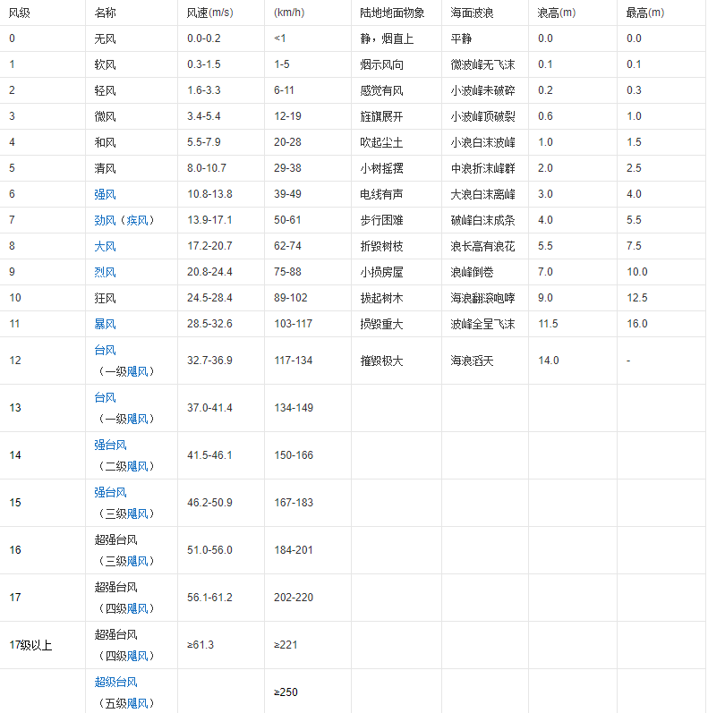

台风飓风都是指中心持续风速达到12级（即64[节](https://baike.baidu.com/item/节)或以上、每秒32.7米或以上，又或者每小时118千米或以上12级及以上）的热带气旋。

名字的不同只是不同地方的叫法，实质一样。台风和飓风都是一种热带气旋，只是发生地点不同，叫法不同，在北太平洋西部、国际日期变更线以西，包括[南中国海](https://baike.baidu.com/item/南中国海)和[东中国海](https://baike.baidu.com/item/东中国海)称作台风；而在大西洋或北太平洋东部的热带气旋则称飓风，也就是说在美国一带称飓风，在菲律宾、中国、日本一带叫台风；如果在南半球，就叫作旋风。