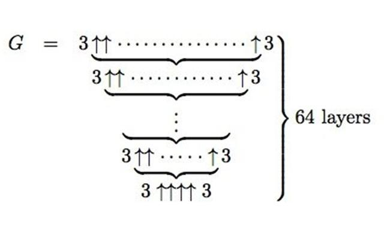

### 高德纳符号

是一个表示运算的符号⬆

3⬆3=3^3

3⬆⬆3=3⬆3⬆3=3⬆(3^3)=3^3^3(算的时候从右往左算，最右边的3加上它前面的一个箭头表示有3个前面那样的运算相重复，在这儿，⬆3就表示有3个3⬆运算重复，即3⬆3⬆3)

3⬆⬆⬆3=3⬆⬆3⬆⬆3⬆⬆3。。。。。。很大很大

### 葛立恒数

正式数学证明中出现过最大的数大小为

### 后来又出现了比葛立恒数还大的叫tree(3)