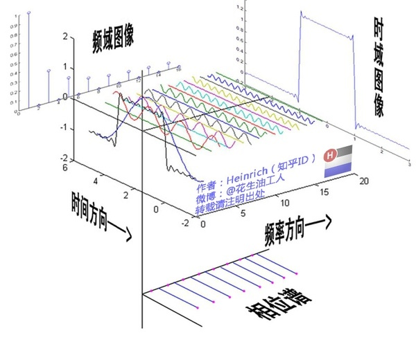
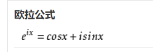
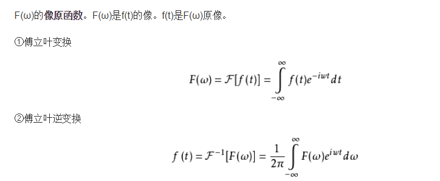

周期信号采用傅里叶级数，非周期信号采用傅里叶变换

- 傅里叶级数：任何周期性的函数都可以变换成一系列正（余）弦函数的和（正弦和余弦就差个变换，表示的时候要么都用正弦要么都用余弦，习惯上我们一般都用正弦，有余弦的话变成正弦再算）

  

  经过傅里叶变换之后会得到三种信息

  - 不同信号的频率
  - 不同信号的振幅
  - 不同信号的相位

  即把时域信号转换为频域信号，当然频域也可以转换为时域，傅里叶级数针对的是周期性的信号，对于非周期性的我们使用第二种

- 傅里叶变换（又叫连续傅里叶变换）：将一个时域非周期的连续信号，转换为一个在频域非周期的连续信号。就是将傅里叶级数扩展到了非周期

  理想的情况当然是周期性的信号，但实际应用中往往都是非周期的信号，对于非周期的函数可以看作是周期为无穷大的函数，用到了欧拉公式，

  变换方式为

  

---

傅里叶变换在实际应用中主要应用与语音处理和图像处理，主要就是通过把时域转换为频域然后对频域进行操作之后再逆变换回去

---

傅里叶变换和拉普拉斯变换都属于积分变换，两个有些相似，然后小波变换是傅里叶变换的加强版