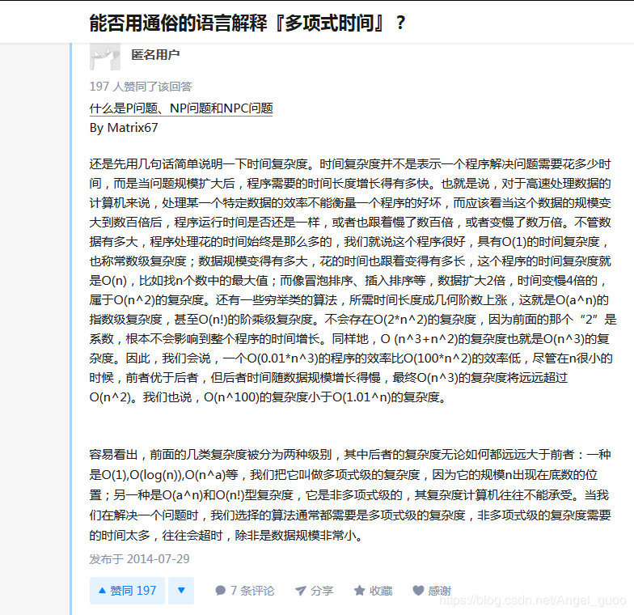

时间复杂度并不是程序结局问题需要运行多少时间，而是当问题规模扩大后时间长短增长的有多块。

O(1):常数级，不管数据怎么增长，时间都是固定的，这样的程序是最好的

O(n):数据规模变多大，时间就变多长。例如找n个数的最大值

O(n^a):数据规模变为n倍，时间就要变为n^a倍，例如冒泡排序

O(a^n):指数级复杂度，数据变为n倍，时间就变为a^n倍，一些穷举类的算法

O(n!):阶乘级复杂度，更高

> 后两种的复杂度远远大于前三种，前三种我们称为多项式复杂度，因为它的规模n出现在底数的位置。通式即为O(n^a),a=0,1,2...
>
> 后面的两种即指数级和阶乘级，属于非多项式级，复杂度是计算机往往无法承受的。
>
> 解决问题时算用的算法通产是多项式级的复杂度，非多项式往往会超时，除非数据规模很小。

