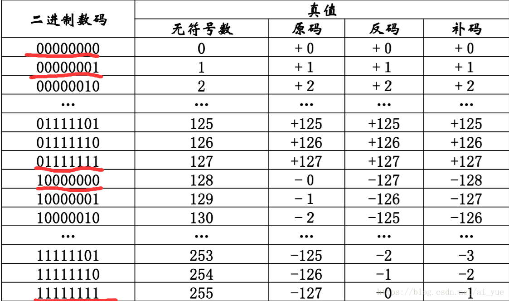

以8位为例，有符号位

原码，最大正数时01111111，即127；最小负数为11111111，-127。范围为-2^n -1 ~2^n -1

可以表示255个数，本来有256个可能，但是因为00000000和10000000都表示的0，浪费，而且10000000如果看作无符号数就是128，而且第一位就是1，所以用10000000来表示-128，因此补码的表示范围比原码在负数上多了个1，即-2^n ~ 2^n -1.

