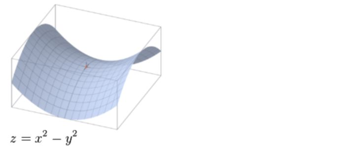

不是局部极值点的驻点称为鞍点。

驻点即一阶倒数为0的点。例如f(x)=x^3，那么点(0,0)即为函数的鞍点。

- 判断是否为鞍点的一个充分条件是计算该点的海森矩阵看是否为不定矩阵（正定矩阵是特征值全为正，不定矩阵即特征是有负有正）

**eg：**

下面对函数 ![[公式]](https://www.zhihu.com/equation?tex=z%3Dx%5E2-y%5E2) 的驻点(0,0)判断是否为鞍点。函数图像如下：

我们根据定义来判断(0,0)点的黑塞矩阵：

我们容易求得二元函数 ![[公式]](https://www.zhihu.com/equation?tex=z%3Dx%5E2%E2%88%92y%5E2) 在驻点 (0,0) 处的 Hessian 矩阵形式为

容易解出特征值一个为2,一个为-2（***有正有负\***），显然是不定矩阵，所以该点是鞍点

