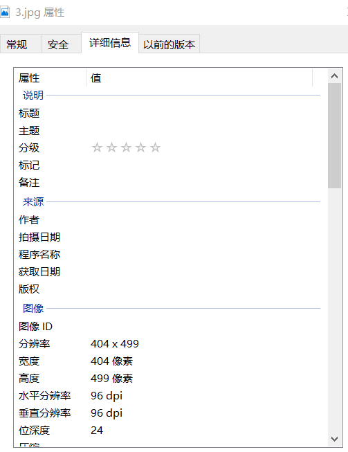

#### 像素

图像都是由不可分割的小方格组成的，这些小方格是图像中的最小单位，称为像素。一个像素里只能由一种颜色

#### 位深度

表示颜色的数的位数；如果设位深度为a，那么一共有2^a种颜色。eg：只有黑白两种颜色的话，0是黑色，1是白色，那么位深度就是1，一共有2^1即2种颜色。

> 常用的位深度是24，又叫24位颜色，称之为真彩色。即有2^24即16777216种颜色.
>
> 当我们用24位颜色时，实际上是 2^（8×3） ,即红黄蓝（RGB）各有256种，256x256x256即2的24次方。

#### 分辨率

- 显示分辨率（屏幕分辨率）。表示的是屏幕或图像一共显示的信息量，即整个屏幕可以显示多少个像素如1920x1080或一张图片包含的像素的总数。

  > 我们平常说的几K屏幕的衡量标准是**水平方向的像素个数**。
  >
  >  数字电影联盟(Digital Cinema Initiatives,DCI) 定义 2K 分辨率的标准为 2048×1080 。因此准确来说我们的1920x1080的屏幕也可以近似称为2k
  >
  > 720p和1080p说的是列数，即垂直方向的像素个数

- 图像分辨率。每英寸包含的像素点数。

  ppi计算公式：PPI=√（X^2+Y^2）/ Z （X：长度像素数；Y：宽度像素数；Z：屏幕大小，单位英寸）

### dpi和ppi

- dpi一般用来表示图片的属性，是水平分辨率和垂直分辨率的单位

  eg右击一张图片->属性->详细信息

   
  
  这里的水平分辨率和垂直分辨率只有打印的时候才有用，图片的分辨率一定，那么dpi越小完整打印图片需要的纸张就越大。
  
- ppi。即图像分辨率，屏幕显示常用这个作为单位，因此在电脑看图片的时候查看图片的实际大小那么图片就会跟根据屏幕本身的ppi计算出它的实际长度然后显示出来。

  eg500x500的图片，在ppi为50的屏幕上的实际大小就是10x10英寸，而在ppi为100的屏幕上的实际大小就是5x5英寸。

  **<u>总之图片的分辨率（即AxB）确定之后，在不同的屏幕上显示就看不同屏幕的ppi，和它本身的内禀属性dpi是没有关系的，dpi只有在打印的时候才用</u>**

