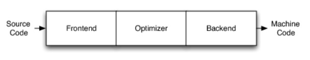
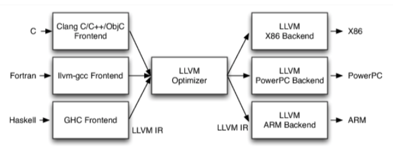

**传统的编译器架构**

- **Frontend：前端**

  词法分析、语法分析、语义分析、生成中间代码

- **Optimizer：优化器**

  中间代码优化

- **Backend：后端**

  生成机器码

---

**LLVM项目**是模块化、可重用的编译器以及工具链技术的集合，创始人:Chris Lattner，亦是Swift之父。本来只是想写一个底层的虚拟机，这也是LLVM名字的由来，low level virtual machine，和java的jvm一样。后来却从未被用作虚拟机，和虚拟机没半毛钱关系，后来习惯了就懒得改了，名字仅仅作为一个商标。

LLVM就是一种编译器框架结构

**LLVM的架构**：

- 不同的前端后端使用统一的中间代码LLVM Intermediate Representation (LLVM IR)
- 如果需要支持一种新的编程语言，那么只需要实现一个新的前端
- 如果需要支持一种新的硬件设备，那么只需要实现一个新的后端
- 优化阶段是一个通用的阶段，它针对的是统一的LLVM IR，不论是支持新的编程语言，还是支持新的硬件设备，都不需要对优化阶段做修改
- 相比之下，GCC的前端和后端没分得太开，前端后端耦合在了一起。所以GCC为了支持一门新的语言，或者为了支持一个新的目标平台，就变得特别困难
- LLVM现在被作为实现各种静态和运行时编译语言的通用基础结构(GCC家族、Java、.NET、Python、Ruby、Scheme、Haskell、D等）

**什么是Clang**

**LLVM的一个子项目**，是整个LLVM框架的一部分，基于上述的LLVM架构的C/C++/Objective-C编译器前端

相比于GCC，Clang具有如下优点：

- 编译速度快:在某些平台上，Clang的编译速度显著的快过GCC(Debug模式下编译OC速度比GGC快3倍)

- 占用内存小:Clang生成的AST所占用的内存是GCC的五分之一左右

- 模块化设计:Clang采用基于库的模块化设计，易于 IDE 集成及其他用途的重用

- 诊断信息可读性强:在编译过程中，Clang 创建并保留了大量详细的元数据 (metadata)，有利于调试和错误报告

- 设计清晰简单，容易理解，易于扩展增强

**Clang和LLVM的关系**

Clang是LLVM编译器架构的一种编译器前端，即C/C++/Objective-c编译器前端，是LLVM项目的一部分。

