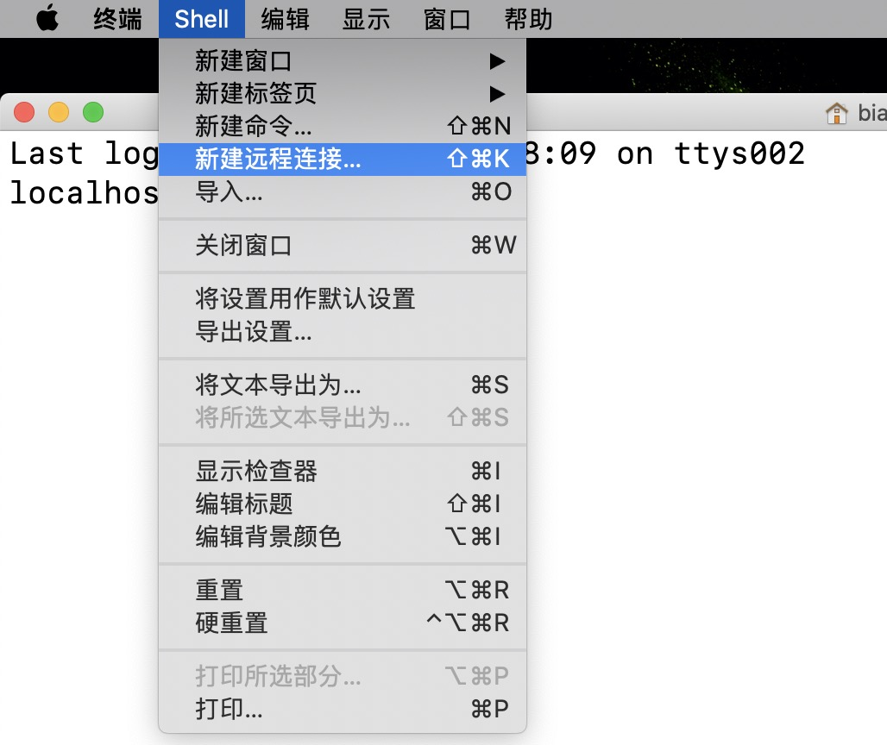
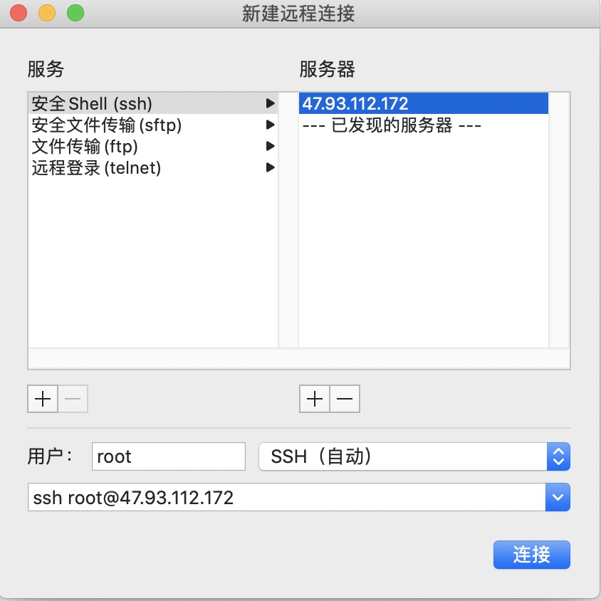
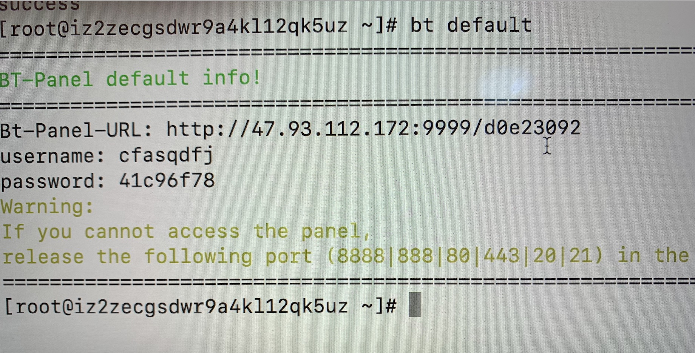

## 前期准备

- 域名：直接到阿里云购买即可，注意看首年开通费用的同时也要看续费的价格，有的第一年很便宜但是续费的价格贼高，注意这个坑。
- 服务器：购买阿里的ecs或者轻量应运用服务器，前者就是可操作性强，自己捣鼓，后者就是省事
- 使用的wordpress的模板建站的方式。

## 服务器

- 在阿里云购买服务器后会得到一个公网的IP，然后重置登陆密码

- 使用mac终端中自带的ssh登陆服务器

  

  

- 要运行wordpress程序，必须要有对应的软件，也就是服务器程序，LNMP(Linux+Nginx+Mysql+PHP)或者LAMP(Linux+Apache+Mysql+PHP)。这里我们使用宝塔面板来安装，宝塔面板相当于是一个远程的服务器可视化管理面板。在服务器上安装面板之后，就可以宝塔面板可视化的管理服务器。

  对于centos7，使用如下命令安装

  ```
  yum install -y wget && wget -O install.sh http://download.bt.cn/install/install_6.0.sh && bash install.sh 
  ```

  安装完成之后如下图所示
  
  
  
  这样就得到了宝塔面板的登陆信息，每次登陆宝塔页面管理服务器都要用这个用户名和密码，要牢记。登陆的时候直接用公网ip后面跟端口号就行。
  
  > 注意9999端口默认服务器是不开的，需要在服务器上手动开启。
  >
  > 进入ecs服务器控制台->进入创建的实例->在实例这行的最后面点击"更多"->"网络和安全组"->"安全组配置"->点击"配置规则"->点击“克隆”->授权策略选择“自定义TCP”，端口写9999/9999->保存之后即可在宝塔页面登陆服务器

## 安装网络环境

- 使用宝塔默认的LNMP安装即可

- 点击“网站”->添加站点，在域名里填写顶级域名biasbb.top和二级域名www.biasbb.top，剩下的默认即可

  > 注意这里填域名的时候默认是用80端口，而服务器的80端口默认是不开的，要在服务器里手动开启80端口

## 域名解析

上面添加站点之后服务器已经绑定了域名，接下来就是域名解析了，要添加两条A记录

在阿里云的域名控制台中找到自己的域名点击解析，填写两条A记录，分别是

```
主机记录写@，记录值填公网ip。表示解析顶级域名
主机记录写www，记录值填公网ip。表示解析二级域名
```

解析完访问域名，如果显示**恭喜，站点创建成功**，就表示解析完成，进行下一步的网站搭建

## Wordpress

https://themeforwp.net/archives/wordpress-website-tutorial/