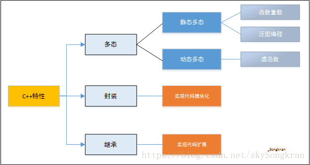

多态，字面理解即多种形态，**在c++中就是一种接口，多种实现**，**即同一操作作用于不同的对象，可以有不同的解释结果，产生不同的执行结果。**c++的多态分为**静态多态**和**动态多态**两种。静态多态通过函数重载和泛函编程（入如函数模板）来实现，而动态多态是通过虚函数（在某[基类](https://baike.baidu.com/item/基类/9589663)中声明为 virtual 并在一个或多个[派生类](https://baike.baidu.com/item/派生类/9589520)中被重新定义的成员函数）来实现。

- **联编**

  确定程序中的操作调用（函数调用）与执行该操作（函数）的代码段之间的映射关系的过程，即知道要调用的函数的具体地址并与调用操作绑定。

  - 静态联编即联编在编译阶段进行，程序开始运行时已经完成了，已经知道调用函数的地址了即知道调用哪个函数了。c++默认是静态联编。

    优点是调用速度快，效率高。

  - 动态联编即联编在程序运行时进行，程序运行时才知道要调用的函数。

    灵活，问题抽象性和问题的易维护性。

- **静态多态**

  使用静态联编的多态。（静态联编包括所有的函数调用，而多态只是指一种接口，多种实现的函数调用）

  ```c++
  int add(int a,int b)
  {
    return a+b;
  }
  int add(float a,float b)
  {
    return a+b;
  }
  ```

  ```c++
  template<typename T>
  T add(T a,T b)
  {
     return a+b
  }   
  ```

  还有一种是类中,这种和动态多态的区别就在于基类中没有声明虚函数，同时调用是用类指针而不是类对象。这种是静多态

  ```c++
  class Base
  {
    public:
    void run()
    {
      cout<<"Base is running"<<endl;
    }
  };
  class Derived(获得,获取,派生):public Base
  {
    public:
    void run()
    {
      cout<<"Derived is running"<<endl;
    }
  };
  int main()
  {
    Base b;
    Derived d;
    b.fun();  //输出Base is running
    d.fun();  //输出Derived is running
    d.Base::fun();  //使用作用域限定符显示调用基类的fun()函数，虽然是d的对象但是输出Base is running
    return 0;
  }
  ```

- **动态多态**

  通过**继承+虚函数**来实现，使用动态联编的多态。具体格式就是使用**virtual关键字**修饰类的成员函数时，指明该函数为虚函数，并且派生类需要重新实现该成员函数，编译器将实现动态绑定。**在运行时，可以通过指向基类的指针，来调用实现派生类中的方法。**

  ```c++
  class Base
  {
    public:
    virtual void run()
    {
      cout<<"Base is running"<<endl;
    }
  };
  class Derived(获得,获取,派生):public Base
  {
    public:
    void run()
    {
      cout<<"Derived is running"<<endl;
    }
  };
  int main()
  {
    Base *b=new Base();  //这行代码就等价于Base x;
                                        Base *a=&x;     
    Base *d=new Derived();
    b->run();  //输出Base is running
    d->run();  //输出Derived is running
    return 0;
  }
  ```

  如果基类中没有用virtual声明run函数，那么后面的两个对象指针b和d因为都是Base型的指针，不论 指向父类还是子类对象都是调用父类的run函数，输出都为Base is running。因此为了实现多态，在父类中声明虚函数，然后子类重写该函数，那么基类指针就会根据指向对象所属的不同类调用不同类的函数。

  **动态多态的条件：**

  - 基类中必须包含虚函数，并且派生类中一定要对基类中的虚函数进行**重写**。
  - 通过基类对象的指针或者引用调用虚函数。

  > 动态多态的意义：
  >
  > 把不同的子类对象都当作父类来看，可以屏蔽不同子类对象之间的差异，写出通用的代码，做出通用的编程，以适应需求的不断变化。
  >
  > 赋值之后，父类型的引用就可以根据当前赋值给它的[子对象](https://baike.baidu.com/item/子对象)的特性以不同的方式运作。也就是说，父亲的行为像儿子，而不是儿子的行为像父亲。