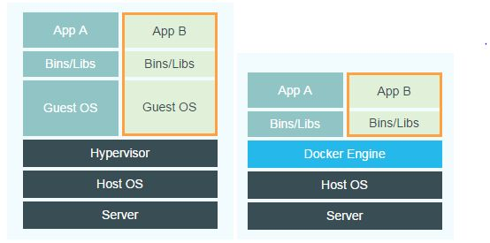

**docker是一个开源的应用容器引擎，使用轻量级虚拟化技术。开发者可以打包自己的应用到容器里面，然后迁移到其他机器的docker应用中，可以实现快速部署。如果出现的故障，可以通过镜像，快速恢复服务。**

docker是操作系统内核相关的，我们说的docker镜像打包移植针对的是同样内核的不同操作系统，如ubuntu和centos，都是用的同样的linux内核。

在mac和win下运行docker实际上是先开启了一个linux虚拟机，然后在虚拟机上运行docker

hypervisor(虚拟化管理器）相当于是docker中的docker engine，但是docker没有guest os。

docker不同的容器用的是同一个操作系统，共享操系统内核，不同的container是进程级别的隔离；而vm通过hypervisor对物理硬件层进行抽象，产生不同的guest os，是操作系统级别的隔离。

vm相比docker隔离更彻底，但是会占用大量的内存空间同时运行较慢。