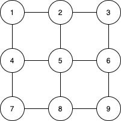

- #### 1.CPU占用率

  任务管理器显示的CPU占用率是管理器一个刷新周期内CPU工作时间占总刷新周期的比例

  例如任务管理器的刷新周期是1s，那么占用率50%即1s内CPU工作了0.5s，sleep了0.5秒；并CPU一工作就全力工作，50%并不是说只有一半的CPU在干活。

- #### 2.中国象棋将帅问题

  >将象棋中的将帅看做A和B，那么A和B都只能在各自的3x3的正方形格子里移动，将正方形的位置数字标注，根据象棋的规则，两个子不能碰面，请输出A和B所有的合法位置，**而且要求在代码中只能用一个字节存储变量。**
  >
  >
  
  寻找所有的合法位置，其实就是两层循环
  
  ```
  遍历A所有的位置
     遍历B所有的位置
        判断二者的位置是否满足需求
        是则输出
  ```
  
  只能用一个char存储变量，每个棋子位置有9种，需要4bit，那么就可以用高位4bit保存一个，用低位4bit保存另一个，可以用宏来写，
  
  ```c++
  #include"iostream"
  #define FULLMASK 255
  #define HALF_OF_CHAR 4
  #define LMASK (FULLMASK<<HALF_OF_CHAR)
  #define RMASK (FULLMASK>>HALF_OF_CHAR)
  #define LSET(b,n) (b=(b&RMASK)|(n<<HALF_OF_CHAR))
  #define RSET(b,n) (b=(b&LMASK)|n)
  #define LGET(b) ((b&LMASK)>>HALF_OF_CHAR)
  #define RGET(b) (b&RMASK)
  #define width 3
  using namespace std;
  
  int main()
  {
      unsigned char b;
      for(LSET(b,1);LGET(b)<width*width;LSET(b,LGET(b)+1))
      {
          for(RSET(b,1);RGET(b)<width*width;RSET(b,RGET(b)+1))
          {
              if(RGET(b)%3!=LGET(b)%3)
                  cout<<"A="<<RGET(b)<<","<<"B="<<LGET(b)<<endl;
          }
      }
      return 0;
  }
  ```
  
  - 还有一种更简单的方法，利用了位域
  
    ```c++
    int main()
    {
        struct{
            unsigned char a:4;
            unsigned char b:4;
        }i;
    
        for(i.a=1;i.a<=9;i.a++)
        {
            for(i.b=1;i.b<=9;i.b++)
            {
                if(i.a%3!=i.b%3)
                    cout<<"A="<<int(i.a)<<","<<"B="<<int(i.b)<<endl;   //这里注意输出的时候要强制转换成int输出，char a =1 ，这个1其实保存的是ascii的1
            }
        }
        return 0;
    }
    ```
  
- 