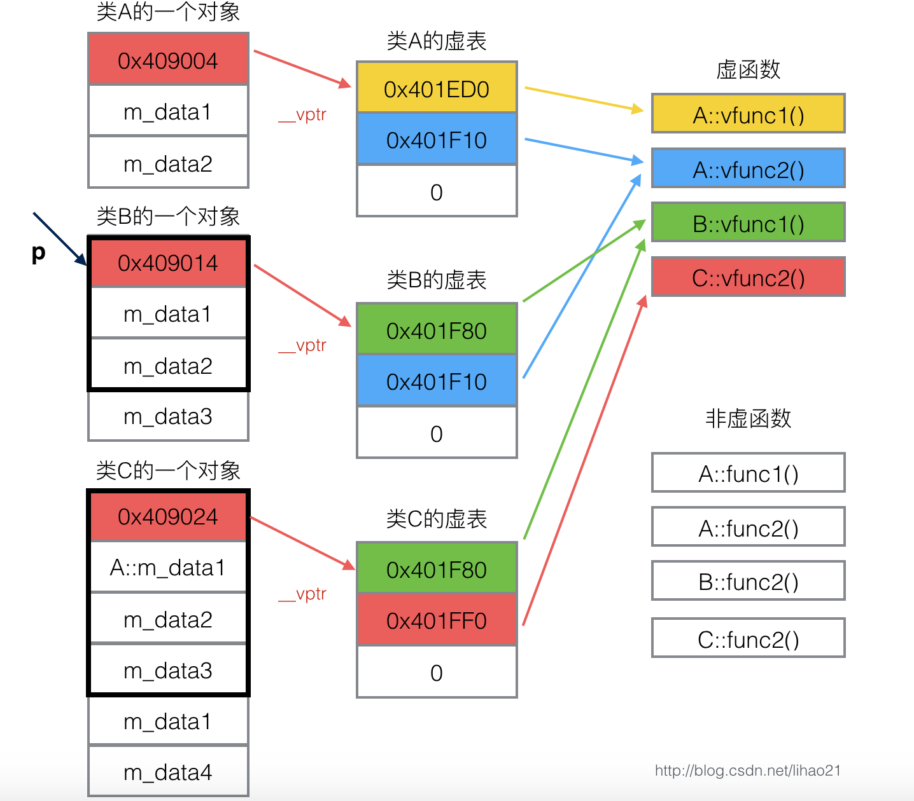

#### 纯虚函数

没有具体实现，对于其派生类，要么继续定义父类的所有纯虚函数为出纯虚函数，即子类仍作为抽象类；或者实现父类的**所有**的纯虚函数，这时子类才不是抽象类

```c++
class Base
{
    public:
    virtual void fun()=0;
}
```

含有纯虚函数的类被称为**抽象类**

1. 抽象类只能作为基类派生出子类，不能实例化对象，**但是可以只是使用指向抽象类的指针**。（专门为了实现多态而生的）
2. 子类如果不继续作为抽象类，**那么必须提供抽象类所有纯虚函数的实现**，否则编译失败。

### 类的虚表

虚函数即函数声明前加**virtual**关键字的函数，每个包含虚函数的类都包含一个虚表。当一个类（B）继承类（A）时，类B会继承类A的函数的调用权。所以如果一个基类包含了虚函数，那么继承类也可以调用这些虚函数，因此如果B有虚函数，有虚表，那么从B继承的A也有自己的虚表

 如下面的类A，其中有虚函数vfunc1和vfunc2，因此A拥有一个虚表

```c++
class A
{
    public:
    virtual void vfunc1();
    virtual void vfunc2();
    void func1();
    void func2();
    private:
    int data1,data2;
}   
```


虚表本质上是一个指针数组，其元素是虚函数的指针，每个指针指向一个虚函数。而普通函数是不会存储在虚表中的。

虚表中指针的赋值是发生在编译器的编译阶段，也就说在代码的编译阶段，虚表就构建出来了。

### 虚表指针

虚表是属于类的，而不属于某个具体的对象，一个类只需要一个虚表，同一个类的所有对象都使用同一个虚表。**虚表从属于类**

此外，**编译器会为包含虚函数的类加上一个成员变量，是一个指向该虚函数表的指针（常被称为vptr）**，每一个由此类别派生出来的类，都有这么一个vptr。**虚表指针是从属于对象的**。也就是说，如果一个类含有虚表，则该类的所有对象都会含有一个虚表指针，并且该虚表指针指向同一个虚表。

为了指定对象所用的虚表，对象在调用构造函数初始化时，会定义虚表指针`vptr`，指向构造函数所属类的虚表（会指向最近的构造函数，例如子类对象初始化时会先调用父类的构造函数，再调用子类的构造函数，这时对象的虚表指针会指向最近的构造函数所属类的虚表，即子类的虚表）。


### 动态绑定

```c++
class A {
public:
    virtual void vfunc1();
    virtual void vfunc2();
    void func1();
    void func2();
private:
    int m_data1, m_data2;
};

class B : public A {
public:
    void vfunc1();
    void func1();
private:
    int m_data3;
};

class C: public B {
public:
    void vfunc2();
    void func2();
private:
    int m_data1, m_data4;
};
```

A是基类，B从A继承，C又从B继承，其对象模型如下



**对象的虚表指针用来指向自己所属类的虚表，虚表中的指针会指向其继承的最近的一个类的虚函数**（即如果没有重新实现虚函数的话，那么最近继承的类的虚函数是什么，子类的虚函数就是什么，如果有重写的，那么子类的虚函数就是重写的这个加上父类中剩下的没有重写的虚函数）

上面的图，首先A的的虚函数为A::v1和A::v2；B从A继承，那么B的虚函数也是A::v1和A::v2，而B重写了v1，因此B的虚函数为B::v1和A::v2；而C继承B，那么C的虚函数为B::v1和A::v2，而C重写了v2，因此C的虚函数为B::v1和C::v2

现在我们声明一个类B的对象

```c++
int main()
{
    B bObject;
}
```

现在用一个类A的指针指向bObject，然后调用vfunc1()函数

```c++
int main()
{
    B bObject;
    A *p=&bObject;
    p->vfunc1();
}
```

调用的是B::vfunc1()

首先指针p指向对象bObject，而bObject的虚表指针`vptr`指向的是类B的虚表，因此调用vfunc1()即调用`B::vfunc1()`

---

### Q&A

#### 构造函数可以声明为虚函数吗？

显然构造函数是不能声明为虚函数的。
我们知道，在调用虚函数前，需要先访问虚表指针，得到虚表，然后再执行虚表中相对应的函数。假设，现在将构造函数声明为虚函数：调用构造函数时，发现构造函数是一个虚函数，然后去访问虚表指针，可是虚表指针是在构造函数中进行初始化的，而目前构造并没有执行，也就是说，虚表指针还没有初始化，只是一个空值，理所当然的，也就找不到指向构造函数的函数指针，因此无法完成构造函数的调用。可见，构造函数是不能声明为虚函数的。

#### 析构函数可以声明为虚函数吗？

**1、C++默认的析构函数不是虚函数，因为虚函数需要使用额外的虚函数表和虚表指针，占用额外的内存。因此对于不会被继承的类来说，没有必要用虚函数。但如果这个类要被继承，为了防止内存泄漏，基类的析构函数必须声明为虚函数！**
**2、为什么将基类析构函数声明为虚函数，就可以防止内存泄漏？**

如果没有将基类析构函数声明为虚函数，在释放**指向派生类对象的基类指针**的时候，只会调用基类的析构函数，而派生类的析构函数不会被调用，导致属于派生类的新添加的数据得不到释放，从而导致内存泄漏。
如果将析构函数声明为虚函数，在释放**指向派生类对象的基类指针**的时候，会调用派生类的析构函数，而派生类的析构函数会自动调用基类的析构函数，从而释放所有内存，避免了内存泄漏。
**3、可是，有个问题，为什么将基类析构函数声明为虚函数之后，在释放指向派生类对象的基类指针时，调用的是派生类的析构函数？难道派生类的析构函数重写了基类的析构函数？不可能啊，基类析构函数和派生类析构函数的函数名不同，不能构成重写啊。**

其实，析构函数是一个特殊的函数，编译器在编译时，析构函数的名字统一为destucter；
所以只要将基类的析构函数声明为虚函数，子类的析构函数只要定义就构成重写。重写之后，子类的虚函数表中的析构函数变为子类的析构函数，那么当释放指向派生类对象的基类指针时，虚表指针指向派生类的虚表，而派生类的虚表中的析构函数为子类的析构函数，因此调用，而派生类的析构函数会自动调用基类的析构函数，从而释放所有内存，避免了内存泄漏。

