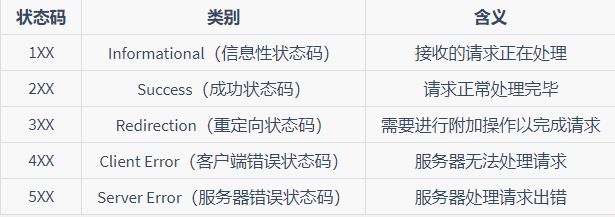
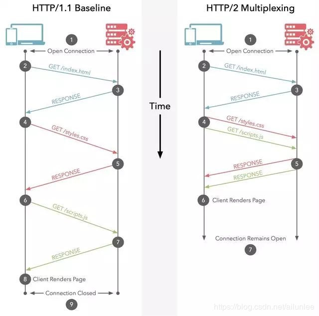
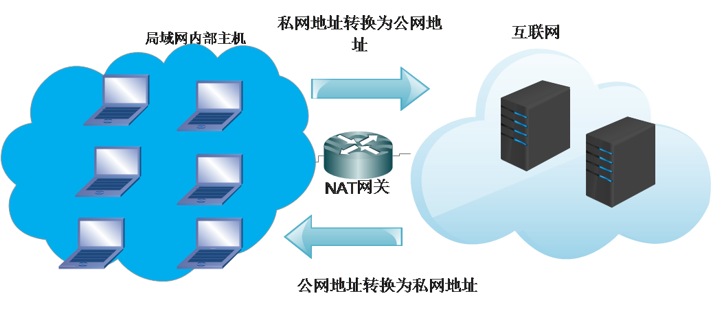
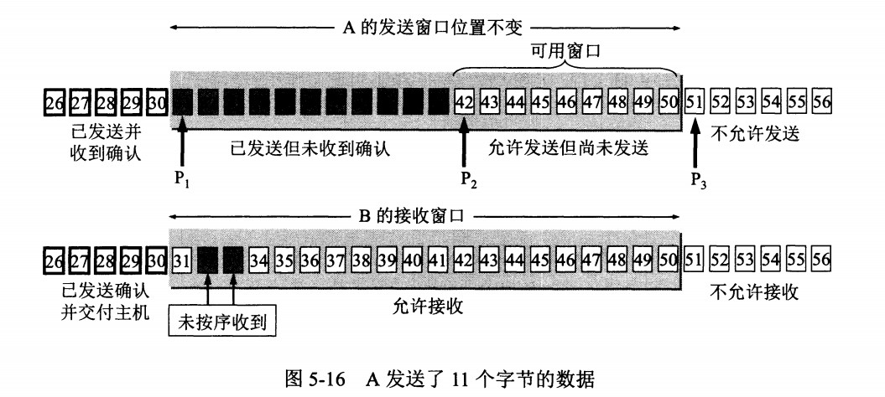

## 应用层

应用层协议定义了应用进程间的交互和通信规则，不同主机的应用进程间如何相互传递报文，比如传递的报文的类型、格式、
有哪些字段等等。

### HTTP 协议

#### 概况

HTTP 是超文本传输协议，它定义了客户端和服务器之间交换报文的格式和方式，**默认使用 80 端口**。它使用 TCP 作为传输层协议，保证了数据传输的可靠性。

HTTP 是一个无状态的协议，HTTP 服务器不会保存关于客户的任何信息。

**HTTP 有两种连接模式**，一种是持续连接，一种非持续连接（也叫长连接和短连接）

非持续连接指的是服务器必须为每一个请求的对象建立和维护一个全新的连接。

持续连接下，TCP 连接默认不关闭，可以被多个请求复用。

**当浏览器访问一个包含多张图片的 HTML 页面时，除了请求访问的 HTML 页面资源，还会请求图片资源。如果每进行一次 HTTP 通信就要新建一个 TCP 连接，那么开销会很大。**

长连接只需要建立一次 TCP 连接就能进行多次 HTTP 通信。

- 从 HTTP/1.1 开始默认是长连接的，如果要断开连接，需要由客户端或者服务器端提出断开，使用 `Connection : close`；
- 在 HTTP/1.1 之前默认是短连接的，如果需要使用长连接，则使用 `Connection : Keep-Alive`。

采用持续连接的好处是可以避免每次建立 TCP连接三次握手时所花费的时间。

#### HTTP 请求报文

HTTP 报文有两种，一种是请求报文，一种是响应报文。

HTTP 请求报文的格式如下：

```http
GET / HTTP/1.1
User-Agent: Mozilla/5.0 (Macintosh; Intel Mac OS X 10_10_5)
Accept: */*
                    
这儿开始请求信息的实体内容。。。。。
。。。。。。。
```

HTTP 请求报文的**第一行叫做请求行**，**后面的行叫做请求头部**，上面的23行都属于。请求头部之后有一个空行，这个空行不能省略，它用来划分首部与实体。

**请求行包含三个字段：方法字段、URL 字段和 HTTP 版本字段**。

方法字段可以取几种不同的值，一般有 GET、POST、HEAD、PUT 和 DELETE。

1. GET

   > 获取资源

    只被用于向服务器获取资源。网路请求中绝大部分使用的是GET方法

2. HEAD

   > 获取报文首部（上面1-3行），请求行和请求头部合起来就是请求报文首部

   获取报文请求报文头部，与GET方法类似，但是不返回报文实体主体部分

3. POST

   > 传输实体主体

   与GET相对，GET是用来获取，而POST用来往服务器传数据

   

4. PUT

   > 上传文件

   用客户端向服务器传送的数据取代指定的文档的内容，因此亦不能使用前都需要安全验证。PUT和POST的区别在于put具有幂等性，即执行多次和执行一次效果一样。用put传A，第一次传上去，后面再put还是A；而post第一次一个A，第二次两个A，一次加下去

5. PATCH

   > 部分修改资源

   PUT也可以修改但是只能完全替代原始资源，而PATCH允许部分修改

6. DELETE

   > 删除文件

   与PUT功能相反，并且同样不带验证机制

#### HTTP 响应报文

HTTP 响应报文的格式如下：

```html
HTTP/1.0 200 OK
Content-Type: text/plain
Content-Length: 137582
Expires: Thu, 05 Dec 1997 16:00:00 GMT
Last-Modified: Wed, 5 August 1996 15:55:28 GMT
Server: Apache 0.84

<html>
  <body>Hello World</body>
</html>
```

HTTP 响应报文的第一行叫做**状态行**，包含了状态码以及原因短语，用来告知客户端请求的结果。，**后面的行是响应头部**，最后是相应信息主体。

状态行包含了三个字段：协议版本字段、状态码和相应的状态信息。

实体部分是报文的主要部分，它包含了所请求的对象。



200-请求成功、202-服务器端已经收到请求消息，但是尚未进行处理
301-永久重定向、302-临时重定向、304-所请求的资源未修改、
400-客户端请求的语法错误、403-请求被拒绝、404-请求的资源不存在
500-服务器内部错误。

一般 1XX 代表服务器接收到请求、2XX 代表成功、3XX 代表重定向、4XX 代表客户端错误、5XX 代表服务器端错误。

更多关于状态码的可以查看：

#### 首部header

首部可以分为四种首部，**请求首部**、**响应首部**、**通用首部**和**实体首部**。通用首部和实体首部在请求报文和响应报文中都可以设置。

常见的请求首部有 Accept 可接收媒体资源的类型、Accept-Charset 可接收的字符集、Host 请求的主机名。

常见的响应首部有 ETag 资源的匹配信息，Location 客户端重定向的 URI。

常见的通用首部有 Cache-Control 控制缓存策略、Connection 管理持久连接。

常见的实体首部有 Content-Length 实体主体的大小、Expires 实体主体的过期时间、Last-Modified 资源的最后修改时间。

#### HTTP/1.1 协议缺点

HTTP/1.1 默认使用了持久连接，多个请求可以复用同一个 TCP 连接，但是在同一个 TCP 连接里面，数据请求的通信次序是固定的。服务器只有处理完一个请求的响应后，才会进行下一个请求的处理，如果前面请求的响应特别慢的话，就会造成许多请求排队等待的情况，这种情况被称为“队头堵塞”。

队头阻塞会导致持久连接在达到最大数量时，剩余的资源需要等待其他资源请求完成后才能发起请求。

为了避免这个问题，一个是减少请求数，一个是同时打开多个持久连接。这就是我们对网站优化时，使用雪碧图、合并脚本的原因。

#### HTTP/2 协议

2009 年，谷歌公开了自行研发的 SPDY 协议，主要解决 HTTP/1.1 效率不高的问题。这个协议在 Chrome 浏览器上证明可行以后，就被当作 HTTP/2 的基础，主要特性都在 HTTP/2 之中得到继承。2015 年，HTTP/2 发布。

HTTP/2 主要有以下新的特性：

#### 2.0相比1.1的不同

1. 二进制协议

   HTTP/2 是一个二进制协议。在 HTTP/1.1 版中，报文的头信息必须是文本（ASCII 编码），数据体可以是文本，也可以是二进制。HTTP/2 则是一个彻底的二进制协议，头信息和数据体都是二进制，并且统称为"帧"，可以分为头信息帧和数据帧。帧的概念是它实现多路复用的基础。

2. 多路复用

   HTTP/2 实现了多路复用，HTTP/2 仍然复用 TCP 连接，但是在一个连接里，客户端和服务器都可以同时发送多个请求或回应，而且不用按照顺序一一发送，这样就避免了"队头堵塞"的问题。

   

3. 数据流

   HTTP/2 使用了数据流的概念，因为 HTTP/2 的数据包是不按顺序发送的，同一个连接里面连续的数据包，可能属于不同的请求。因此，必须要对数据包做标记，指出它属于哪个请求。HTTP/2 将每个请求或回应的所有数据包，称为一个数据流。每个数据流都有一个独一无二的编号。数据包发送的时候，都必须标记数据流 ID ，用来区分它属于哪个数据流。

4. 头信息压缩（即压缩header）

   HTTP/2 实现了头信息压缩，由于 HTTP 1.1 协议不带有状态，每次请求都必须附上所有信息。所以，请求的很多字段都是重复的，比如 Cookie 和 User Agent ，一模一样的内容，每次请求都必须附带，这会浪费很多带宽，也影响速度。

   在HTTP1.1中，**HTTP请求和响应都是由状态行、请求/响应头部、消息主体三部分组成。一般而言，消息主体都会经过gzip压缩，或者本身传输的就是压缩过后的二进制文件，但状态行和头部却没有经过任何压缩，直接以纯文本传输**。随着Web功能越来越复杂，每个页面产生的请求数也越来越多，导致消耗在头部的流量越来越多，尤其是每次都要传输UserAgent、Cookie这类不会频繁变动的内容，完全是一种浪费。

    HTTP1.1不支持header数据的压缩，HTTP2.0使用HPACK算法对header的数据进行压缩，这样数据体积小了，在网络上传输就会更快。

5. 服务器推送

   HTTP/2 允许服务器未经请求，主动向客户端发送资源，这叫做服务器推送。使用服务器推送，提前给客户端推送必要的资源，这样就可以相对减少一些延迟时间。这里需要注意的是 http2 下服务器主动推送的是静态资源，和 WebSocket 以及使用SSE 等方式向客户端发送即时数据的推送是不同的。

#### HTTP/2 协议缺点

因为 HTTP/2 使用了多路复用，一般来说同一域名下只需要使用一个 TCP 连接。由于多个数据流使用同一个 TCP 连接，遵守同一个流量状态控制和拥塞控制。只要一个数据流遭遇到拥塞，剩下的数据流就没法发出去，这样就导致了后面的所有数据都会被阻塞。HTTP/2 出现的这个问题是由于其使用 TCP 协议的问题，与它本身的实现其实并没有多大关系。

#### HTTP/3 协议

由于 TCP 本身存在的一些限制，Google 就开发了一个基于 UDP 协议的 QUIC 协议，并且使用在了 HTTP/3 上。 QUIC协议在 UDP 协议上实现了多路复用、有序交付、重传等等功能

#### HTTP 存在的问题

1. HTTP 报文使用明文方式发送，可能被第三方窃听。

2. HTTP 报文可能被第三方截取后修改通信内容，接收方没有办法发现报文内容的修改。

3. HTTP 还存在认证的问题，第三方可以冒充他人参与通信。

#### HTTPS 简介。http使用的是80端口，https会使用向443端口发请求协商传输细节，然后拿数据还是用80

TLS是从SSL3.0修改来的，可以认为是SSL3.1，二者差距很小

HTTPS 指的是超文本传输安全协议，HTTPS 是基于 HTTP 协议的，不过它会使用 TLS/SSL 来对数据加密。使用 TLS/SSL 协议，所有的信息都是加密的，第三方没有办法窃听。并且它提供了一种校验机制，信息一旦被篡改，通信的双方会立刻发现。它还配备了身份证书，防止身份被冒充的情况出现。

#### TLS 握手过程

1. 第一步，客户端向服务器发起请求，请求中包含使用的协议版本号、生成的一个随机数、以及客户端支持的加密方法。

2. 第二步，服务器端接收到请求后，确认双方使用的加密方法、并给出服务器的证书、以及一个服务器生成的随机数。

3. 第三步，客户端确认服务器证书有效后，生成一个新的随机数，并使用数字证书中的公钥，加密这个随机数，然后发给服务器，还有编码改变的通知，表示随后的信息都将使用双方协定的加密方法和密钥发送。并且还会提供一个前面所有内容的 hash 的值，用来供服务器检验。
   
4. 第四步，服务器使用自己的私钥，来解密客户端发送过来的第三个随机数。计算出会话密钥。然后发送编码改变通知同时发送前面所有内容的 hash 值来供客户端检验。

5. 第五步，客户端和服务器端根据约定的加密方法使用前面的三个随机数，生成对话秘钥，以后的对话过程都使用这个秘钥来加密信息。

#### 实现原理

TLS 的握手过程主要用到了三个方法来保证传输的安全。

首先是对称加密的方法，对称加密的方法是，双方使用同一个秘钥对数据进行加密和解密。但是对称加密的存在一个问题，就是如何保证秘钥传输的安全性，因为秘钥还是会通过网络传输的，一旦秘钥被其他人获取到，那么整个加密过程就毫无作用了。
这就要用到非对称加密的方法。

非对称加密的方法是，我们拥有两个秘钥，一个是公钥，一个是私钥。公钥是公开的，私钥是保密的。用私钥加密的数据，只有对应的公钥才能解密，用公钥加密的数据，只有对应的私钥才能解密。我们可以将公钥公布出去，任何想和我们通信的客户，都可以使用我们提供的公钥对数据进行加密，这样我们就可以使用私钥进行解密，这样就能保证数据的安全了。但是非对称加密有一个缺点就是加密的过程很慢，因此如果每次通信都使用非对称加密的方式的话，反而会造成等待时间过长的问题。

因此我们可以使用对称加密和非对称加密结合的方式，因为对称加密的方式的缺点是无法保证秘钥的安全传输，因此我们可以非对称加密的方式来对对称加密的秘钥进行传输，然后以后的通信使用对称加密的方式来加密，这样就解决了两个方法各自存在的问题。

**但是现在的方法也不一定是安全的，因为我们没有办法确定我们得到的公钥就一定是安全的公钥**。可能存在一个中间人，截取了对方发给我们的公钥，然后将他自己的公钥发送给我们，当我们使用他的公钥加密后发送的信息，就可以被他用自己的私钥解密。然后他伪装成我们以同样的方法向对方发送信息，这样我们的信息就被窃取了，然而我们自己还不知道。

CA中心为每个使用[公开密钥](https://baike.baidu.com/item/公开密钥)的用户发放一个数字证书，数字证书的作用是证明证书中列出的用户合法拥有证书中列出的公开密钥。

申请者给CA如下信息：

证书用途

申请的公钥

某宝的加密算法

某宝用的HASH算法

证书的到期时间等

CA拿到这些申请内容之后会把上面的内容做一个HASH，然后用CA的私钥加密这个HASH结果，得到**数字签名**，加到上面哪些信息后面，构成**数字证书**。

这样拿到一个数字证书之后，用CA的公钥解密数字签名之后，得到的结果如果和证书中前面内容的HASH结果一样，那么证书有效，信任。

这样就算别人盗用服务器的证书前面的内容，但是它后面的数字签名用CA公钥解密之后是必定不会是其HASH值，因为CA私钥加密的内容只能用CA公钥才能解开得到对应的内容

为了解决这样的问题，我们可以使用数字证书的方式，首先我们使用一种 Hash 算法来对明文data进行加密生成一个信息摘要，然后让有公信力的认证中心（简称 CA ）用它的私钥对消息摘要加密，形成签名。最后将原始的信息和签名合在一起，称为数字证书。当接收方收到数字证书的时候，先根据原始信息使用同样的 Hash 算法生成一个摘要，然后使用公证处的公钥来对数字证书中的摘要进行解密，最后将解密的摘要和我们生成的摘要进行对比，就能发现我们得到的信息是否被更改了。这个方法最要的是认证中心的可靠性，一般浏览器里会内置一些顶层的认证中心的证书，相当于我们自动信任了他们，只有这样我们才能保证数据的安全。


### VPN

利用公用网络架设专用网络。在外地可以访问内网，解决方法就是在**内网中架设一台VPN服务器**。外地员工在当地连上互联网后，通过互联网连接VPN服务器，然后通过VPN服务器进入企业内网

### NAT（Network Address Translation，网络地址转换）

局域网内部的主机使用本地 IP 地址又想和互联网上的主机通信时，可以使用 NAT 来将本地 IP 转换为公网 IP。路由器里一般都有NAT，校园网也要用这个。NAT网关



### DNS 协议

#### 概况

DNS 协议提供的是一种主机名到 IP 地址的转换服务，就是我们常说的域名系统。它是一个由分层的 DNS 服务器组成的分布式数据库，是定义了主机如何查询这个分布式数据库的方式的应用层协议。DNS 协议运行在 UDP 协议之上，使用 53 号端口。

#### 域名的层级结构

域名的层级结构可以如下


根据域名的层级结构，管理不同层级域名的服务器，可以分为根域名服务器、顶级域名服务器和权威域名服务器。

顶级域名：.com

二级域名：baidu.com

#### 查询过程

DNS 的查询过程一般为，我们首先将 DNS 请求发送到本地 DNS 服务器，由本地 DNS 服务器来代为请求。

1. 从"根域名服务器"查到"顶级域名服务器"的 NS 记录和 A 记录（ IP 地址）。
2. 从"顶级域名服务器"查到"次级域名服务器"的 NS 记录和 A 记录（ IP 地址）。
3. 从"次级域名服务器"查出"主机名"的 IP 地址。

比如我们如果想要查询 www.baidu.com 的 IP 地址，我们首先会将请求发送到本地的 DNS 服务器中，本地 DNS 服务器会判断是否存在该域名的缓存，如果不存在，则向根域名服务器发送一个请求，根域名服务器返回负责 .com 的顶级域名服务器的 IP 地址的列表。然后本地 DNS 服务器再向其中一个负责 .com 的顶级域名服务器发送一个请求，负责 .com的顶级域名服务器返回负责 .baidu 的权威域名服务器的 IP 地址列表。然后本地 DNS 服务器再向其中一个权威域名服务器发送一个请求，最后权威域名服务器返回一个对应的主机名的 IP 地址列表。

#### DNS缓存

DNS 缓存的原理非常简单，在一个请求链中，当某个 DNS 服务器接收到一个 DNS 回答后，它能够将回答中的信息缓存在本地存储器中。返回的资源记录中的 TTL 代表了该条记录的缓存的时间。

#### DNS 实现负载平衡（一个域名对应多个服务器，即多个ip，协同工作）

DNS 可以用于在冗余的服务器上实现负载平衡。因为现在一般的大型网站使用多台服务器提供服务，因此一个域名可能会对应多个服务器地址。当用户发起网站域名的 DNS 请求的时候，DNS 服务器返回这个域名所对应的服务器 IP 地址的集合，但在每个回答中，会循环这些 IP 地址的顺序，用户一般会选择排在前面的地址发送请求。以此将用户的请求均衡的分配到各个不同的服务器上，这样来实现负载均衡。

#### 文件传送协议FTP

FTP 使用 TCP 进行连接，它需要两个连接来传送一个文件：

- 控制连接：服务器打开端口号 21 等待客户端的连接，客户端主动建立连接后，使用这个连接将客户端的命令传送给服务器，并传回服务器的应答。
- 数据连接：用来传送一个文件数据。

根据数据连接是否是服务器端主动建立，FTP 有主动和被动两种模式：

- 主动模式：服务器端主动建立数据连接，其中服务器端的端口号为 20，客户端的端口号随机，但是必须大于 1024，因为 0~1023 是熟知端口号。
- 被动模式：客户端主动建立数据连接，其中客户端的端口号由客户端自己指定，服务器端的端口号随机

## 传输层

网络层只把分组发送到目的主机，但是真正通信的并不是主机而是主机中的进程。传输层提供了进程间的逻辑通信，传输层向高层用户屏蔽了下面网络层的核心细节，使应用程序看起来像是在两个传输层实体之间有一条端到端的逻辑通信信道。

### 多路复用与多路分解（发和收）

**所谓套接字(Socket)，就是对网络中不同主机上的应用进程之间进行双向通信的端点的抽象。一个套接字就是网络上进程通信的一端，提供了应用层进程利用网络协议交换数据的机制**

将传输层报文段中的数据交付到正确的套接字的工作被称为多路分解。**（在接收端，运输层检查报文中的标识并标识出接收套接字，然后将该报文定向到该套接字）**

从源主机的不同套接字中收集数据块，并为每个数据块封装上首部信息从而生成报文段，然后将报文段传递到网络层中去**（发信息）**

无连接的多路复用和多路分解指的是 UDP 套接字的分配过程，一个 UDP 套接字由一个二元组来标识，这个二元组（就是一对一对的）包含了一个目的地址和一个目的端口号。因此不同源地址和端口号的 UDP 报文段到达主机后，如果它们拥有相同的目的地址和目的端口号，那么不同的报文段将会转交到同一个 UDP 套接字中。

面向连接的多路复用和多路分解指的是 TCP 套接字的分配过程，一个 TCP 套接字由一个四元组来标识，这个四元组包含了源 IP 地址、源端口号、目的地址和目的端口号。因此，一个 TCP 报文段从网络中到达一台主机上时，该主机使用全部 4 个值来将报文段定向到相应的套接字。

### UDP 协议

用户数据报协议 UDP（User Datagram Protocol）是无连接的，尽最大可能交付，没有拥塞控制，面向报文（对于应用程序传下来的报文不合并也不拆分，只是添加 UDP 首部），**支持一对一、一对多、多对一和多对多的交互通信。**

特点：

1. 使用 UDP 时，在发送报文段之前，通信双方没有握手的过程，因此 UDP 被称为是无连接的传输层协议。因为没有握手过程，相对于 TCP 来说，没有建立连接的时延。因为没有连接，所以不需要在端系统中保存连接的状态。
   
2. UDP 提供尽力而为的交付服务，也就是说 UDP 协议不保证数据的可靠交付。

3. UDP 没有拥塞控制和流量控制的机制，所以 UDP 报文段的发送速率没有限制。

4. 因为一个 UDP 套接字只使用目的地址和目的端口来标识，所以 UDP 可以支持一对一、一对多、多对一和多对多的交互通信。
   
5. UDP 首部小，只有 8 个字节。

#### UDP 报文段结构

UDP 报文段由UDP首部和应用数据组成。首部包含四个字段，分别是源端口号、目的端口号、长度和检验和，每个字段的长度为两个字节。长度字段指的是整个报文段的长度，包含了首部和应用数据的大小。校验和是 UDP 提供的一种差错校验机制。**虽然提供了差错校验的机制，但是 UDP 对于差错的恢复无能为力**。


### TCP 协议

TCP 协议是**面向连接的**，**提供可靠数据传输服务**的传输层协议。

三次握手之后，双方都会开辟资源，接受或响应对方发送的数据包，这个资源开辟完成之后就算建立了连接

套接字Socket=（IP地址：端口号）。socket就是两个网络应用程序进行通信时，各自通信连接中的端点。每一个传输层连接唯一地被通信两端的两个端点（即两个套接字）所确定。例如：如果IP地址是210.37.145.1，而端口号是23，那么得到套接字就是(210.37.145.1：23) 

socket：ip+port  +  ip+port。你套在我上面，我套在你上面，双方就可以开始通信了。套接完成之后双方就会通过各自的socket发送和接受数据

端口号一共由65535个，用完之后就从内核中申请不到了，所以用完之后就用四次挥手把端口释放

netstat命令用来显示网络相关信息，网络连接，路由表，接口状态。

netstat -natp ：显示tcp连接及其端口号

特点：

1. TCP 协议是面向连接的，在通信双方进行通信前，需要通过三次握手建立连接。它需要在端系统中维护双方连接的状态信息。

2. TCP 协议通过序号、确认号、定时重传、检验和等机制，来提供可靠的数据传输服务。

3. TCP 协议提供的是点对点的服务，即它是在**单个发送方和单个接收方之间的连接**。

4. TCP 协议提供的是全双工的服务，也就是说连接的双方的能够向对方发送和接收数据。

5. TCP 提供了**拥塞控制机制**，在网络拥塞的时候会控制发送数据的速率，有助于减少数据包的丢失和减轻网络中的拥塞程度。

6. TCP 提供了**流量控制机制**，保证了通信双方的发送和接收速率相同。如果接收方可接收的缓存很小时，发送方会降低发送速率，避免因为缓存填满而造成的数据包的丢失。

#### TCP 报文段结构


- **序号** ：用于对字节流进行编号，例如序号为 301，表示第一个字节的编号为 301，如果携带的数据长度为 100 字节，那么下一个报文段的序号应为 401。
- **确认号** ：期望收到的下一个报文段的序号。例如 B 正确收到 A 发送来的一个报文段，序号为 501，携带的数据长度为 200 字节，因此 B 期望下一个报文段的序号为 701，B 发送给 A 的确认报文段中确认号就为 701。
- **数据偏移** ：指的是数据部分距离报文段起始处的偏移量，实际上指的是首部的长度。
- **确认 ACK** ：当 ACK=1 时确认号字段有效，否则无效。TCP 规定，在连接建立后所有传送的报文段都必须把 ACK 置 1。
- **同步 SYN** ：在连接建立时用来同步序号。当 SYN=1，ACK=0 时表示这是一个连接请求报文段。若对方同意建立连接，则响应报文中 SYN=1，ACK=1。
- **终止 FIN** ：用来释放一个连接，当 FIN=1 时，表示此报文段的发送方的数据已发送完毕，并要求释放连接。

TCP 报文段由首部和数据组成，它的首部一般为 20 个字节。

源端口和目的端口号用于报文段的多路复用和分解。

32 比特的序号和 32 比特的确认号，用与实现可靠数据运输服务。

16 比特的接收窗口字段用于实现流量控制，该字段表示接收方愿意接收的字节的数量。

4 比特的首部长度字段，该字段指示了以 32 比特的字为单位的 TCP 首部的长度。

6 比特的标志字段，ACK 字段用于指示确认序号的值是有效的，RST、SYN 和 FIN 比特用于连接建立和拆除。设置 PSH 字段指示接收方应该立即将数据交给上层，URG 字段用来指示报文段里存在紧急的数据。校验和提供了对数据的差错检测。


#### TCP 三次握手的过程


假设 A 为客户端，B 为服务器端。

1. seq为32位序列号
2. ack为32为序列号，且只有在ACK==1时才有效，ack=上一次的seq+1，

- 首先 B 处于 LISTEN（监听）状态，等待客户的连接请求。
- A 向 B 发送连接请求报文，SYN=1，ACK=0，选择一个初始的序号 x。
- B 收到连接请求报文，如果同意建立连接，则向 A 发送连接确认报文，ACK=1，确认号为 x+1表示收到序列号seq，同时发送链接请求报文，SYN=1，初始序列号 y。
- A 收到 B 的连接确认报文后，还要向 B 发出确认，seq=x+1表示收到服务器的确认号并将其作为序列号；确认号为 y+1，表示收到服务器发的序号seq。
- B 收到 A 的确认后，连接建立。

在我看来，TCP 三次握手的建立连接的过程就是相互确认初始序号的过程，告诉对方，什么样序号的报文段能够被正确接收。

双方都要确认我发送的数据对方能收到，经过前两次之后，客户端收到确认了，但是服务端发送数据之后并没有受到客户端的回应，不能确定他发送的数据对方能收到，**第三次握手的作用是客户端对服务器端的初始序号的确认。如果只使用两次握手，那么服务器就没有办法知道自己的序号是否已被确认。同时这样也是为了防止失效的请求报文段被服务器接收，而出现错误的情况。**

客户端发送的连接请求如果在网络中滞留，那么就会隔很长一段时间才能收到服务器端发回的连接确认。客户端等待一个超时重传时间之后，就会重新请求连接。但是这个滞留的连接请求最后还是会到达服务器，**如果不进行三次握手，那么服务器就会打开两个连接**。如果有第三次握手，延迟到达的连接请求因为没有第三次握手，就不会建立连接，否则会再次建立连接但此时真正的客户端已经close了

#### **TCP 四次挥手的过程**


ACK 在连接建立之后都为 1。

- A 发送连接释放报文，FIN=1。发送后客户端进入 FIN_WAIT_1 状态
- B 收到之后发出确认，此时 TCP 属于半关闭状态，B 能向 A 发送数据但是 A 不能向 B 发送数据。服务
  器端进入 CLOSE_WAIT 状态。。
- 当 B 不再需要连接时，发送连接释放报文，FIN=1。
- A 收到后发出确认，进入 TIME-WAIT 状态，等待 2 MSL（最大报文存活时间）后释放连接。
- B 收到 A 的确认后释放连接。

**TCP 使用四次挥手的原因**是因为 TCP 的连接是全双工的，所以需要双方分别释放到对方的连接，单独一方的连接释放，只代表不能再向对方发送数据，连接处于的是半释放的状态。

客户端发送了 FIN 连接释放报文之后，服务器收到了这个报文，就进入了 CLOSE-WAIT 状态。这个状态是为了让服务器端发送还未传送完毕的数据，传送完毕之后，服务器会发送 FIN 连接释放报文。

**TIME_WAIT**

客户端接收到服务器端的 FIN 报文后进入此状态，此时并不是直接进入 CLOSED 状态，还需要等待一个时间计时器设置的时间 2MSL(报文最大生存时间)。这么做有两个理由：

- 确保最后一个确认报文能够到达。如果 B 没收到 A 发送来的确认报文，那么就会重新发送连接释放请求报文，A 等待一段时间就是为了处理这种情况的发生。
- 等待一段时间是为了让本连接持续时间内所产生的所有报文都从网络中消失，使得下一个新的连接不会出现旧的连接请求报文。

#### 状态转化图


#### ARQ 协议。**自动重传请求**（Automatic Repeat-reQuest)

[OSI模型](https://zh.wikipedia.org/wiki/OSI模型)中[数据链路层](https://zh.wikipedia.org/wiki/数据链路层)和[传输层](https://zh.wikipedia.org/wiki/传输层)的错误纠正协议之一.ARQ 协议指的是自动重传请求，它通过超时和重传来保证数据的可靠交付，**它是 TCP 协议实现可靠数据传输的一个很重要的机制。**

它分为停止等待 ARQ 协议和连续 ARQ 协议。

一、停止等待 ARQ 协议

停止等待 ARQ 协议的基本原理是，对于发送方来说发送方每发送**一个**分组，就为这个分组设置一个定时器。当发送分组的确认回答返回了，则清除定时器，发送下一个分组。如果在规定的时间内没有收到已发送分组的肯定回答，则重新发送上一个分组。

对于接受方来说，每次接受到一个分组，就返回对这个分组的肯定应答，当收到冗余的分组时，就直接丢弃，并返回一个对冗余分组的确认。当收到分组损坏的情况的时候，直接丢弃。

**使用停止等待 ARQ 协议的缺点是每次发送分组必须等到分组确认后才能发送下一个分组，这样会造成信道的利用率过低。**

二、连续 ARQ 协议

连续 ARQ 协议是为了解决停止等待 ARQ 协议对于信道的利用率过低的问题。它通过连续发送**一组**分组，然后再等待对分组的确认回答，对于如何处理分组中可能出现的差错恢复情况，一般可以使用滑动窗口协议和选择重传协议来实现。



1. 滑动窗口协议

   发送窗口内的字节都允许被发送，接收窗口内的字节都允许被接收。如果发送窗口左部的字节已经发送并且收到了确认，那么就将发送窗口向右滑动一定距离，直到左部第一个字节不是已发送并且已确认的状态；接收窗口的滑动类似，接收窗口左部字节已经发送确认并交付主机，就向右滑动接收窗口。

   接收窗口只会对窗口内最后一个按序到达的字节进行确认，例如接收窗口已经收到的字节为 {31, 34, 35}，其中 {31} 按序到达，而 {34, 35} 就不是，因此只对字节 31 进行确认。发送方得到一个字节的确认之后，就知道这个字节之前的所有字节都已经被接收。

   **滑动窗口协议的缺点是因为使用了累计确认的机制，如果出现了只是窗口中的第一个分组丢失，而后面的分组都按序到达的情况的话，那么滑动窗口协议会重新发送所有的分组（这个叫做Go-back-N,回退N）。例如发了前5个分组，但是中间的第三个丢了，这时接收方只对前两个分组发出确认，那么后面的三个分组就要重传一次这样就造成了大量不必要分组的丢弃和重传。**

2. 选择重传协议**（允许乱序发送和乱序接受）**

   因为滑动窗口使用累计确认的方式，所以会造成很多不必要分组的重传。使用选择重传协议可以解决这个问题。

   **理论上选择重传协议要为每个分组使用一个计时器.当某个计时器超时后,只有相应的分组被重传.换而言之,返回N协议将所有的分组当做一个整体对待,而选择重传协议则分别对待每一个分组**

   重传协议便是用来解决这个问题。原理也很简单，**接收端总会缓存所有收到的帧**，当某个帧出现错误时，只会要求重传这一个帧，只有当某个序号后的所有帧都正确收到后，才会一起提交给高层应用。**重传协议的缺点在于接受端需要更多的缓存**。

#### TCP 的可靠运输机制

TCP 的可靠运输机制是基于**连续 ARQ 协议**的。而且滑动窗口协议和选择重传协议都有使用

#### TCP 的流量控制机制

**主要是通过滑动窗口协议实现的**，上面的ARQ也属于流量控制

> 发送方根据接收方的窗口大小调整发送窗口的大小，从而控制发送速率

TCP 提供了流量控制的服务，这个服务的主要目的是控制发送方的发送速率，保证接收方来得及接收。因为一旦发送的速率大于接收方所能接收的速率，就会造成报文段的丢失。接收方主要是通过接收窗口来告诉发送方自己所能接收的大小，发送方根据接收方的接收窗口的大小来调整发送窗口的大小，以此来达到控制发送速率的目的。

#### TCP 的拥塞控制机制

在某段时间，若**对网络中某一资源的需求超过了该资源所能提供的可用部分，网络性能就要变坏**，这种情况就叫做**网络拥塞**


**如果网络出现拥塞，分组将会丢失，此时发送方会继续重传，从而导致网络拥塞程度更高**。因此当出现拥塞时，应当控制发送方的速率。这一点和流量控制很像，但是出发点不同。**流量控制是为了让接收方能来得及接收，而拥塞控制是为了降低整个网络的拥塞程度。**

TCP 的拥塞控制主要是根据网络中的拥塞情况来控制发送方数据的发送速率，如果网络处于拥塞的状态，发送方就减小发送的速率，这样一方面是为了避免继续增加网络中的拥塞程度，另一方面也是为了避免网络拥塞可能造成的报文段丢失。

TCP 的拥塞控制主要使用了四个机制，分别是**慢启动**、**拥塞避免**、**快速重传**和**快速恢复**。

TCP 主要通过四个算法来进行拥塞控制：慢开始、拥塞避免、快重传、快恢复。

发送方需要维护一个叫做拥塞窗口（**cwnd，即congestion window，阻塞的窗口**）的状态变量，注意拥塞窗口与发送方窗口的区别：拥塞窗口只是一个状态变量，实际决定发送方能发送多少数据的是发送方窗口。

为了便于讨论，做如下假设：

- 接收方有足够大的接收缓存，因此不会发生流量控制；
- 虽然 TCP 的窗口基于字节，但是这里设窗口的大小单位为报文段。


#### 1. 慢开始与拥塞避免

发送的最初执行慢开始，令 cwnd = 1，发送方只能发送 1 个报文段；当收到确认后，将 cwnd 加倍，因此之后发送方能够发送的报文段数量为：2、4、8 ...

注意到慢开始每个轮次都将 cwnd 加倍，这样会让 cwnd 增长速度非常快，从而使得发送方发送的速度增长速度过快，网络拥塞的可能性也就更高。设置一个慢开始门限 ssthresh，当 cwnd >= ssthresh 时，进入拥塞避免，每个轮次只将 cwnd 加 1。

如果出现了超时，则令 ssthresh = cwnd / 2，然后重新执行慢开始。

#### 2. 快重传与快恢复

在接收方，要求每次接收到报文段都应该对最后一个已收到的有序报文段进行确认。例如已经接收到 M1 和 M2，此时收到 M4，应当发送对 M2 的确认。

在发送方，如果收到三个重复确认，那么可以知道下一个报文段丢失，此时执行快重传，立即重传下一个报文段。例如收到三个 M2，则 M3 丢失，立即重传 M3。

在这种情况下，只是丢失个别报文段，而不是网络拥塞。因此执行快恢复，令 ssthresh = cwnd / 2 ，cwnd = ssthresh，注意到此时直接进入拥塞避免。

**慢开始和快恢复的快慢指的是 cwnd 的设定值，而不是 cwnd 的增长速率。慢开始 cwnd 设定为 1，而快恢复 cwnd 设定为 ssthresh。**


### 网络层

网络层协议主要实现了不同主机间的逻辑通信功能。网络层协议一共包含两个主要的组件，一个 **IP 网际协议**，一个是**路由选择协议**。

IP 网际协议规定了网络层的编址和转发方式，比如说我们接入网络的主机都会被分配一个 IP 地址，常用的比如 IPV4 使用32 位来分配地址，还有 IPv6 使用 128 位来分配地址。

路由选择协议决定了数据报从源到目的地所流经的路径，常见的比如距离向量路由选择算法等。

### 数据链路层

数据链路层提供的服务是如何将数据报通过单一通信链路从一个结点移动到相邻节点。每一台主机都有一个唯一的 MAC 地址，这是由网络适配器决定的，在全世界都是独一无二的。

### 物理层

物理层提供的服务是尽可能的屏蔽掉组成网络的物理设备和传输介质间的差异，使数据链路层不需要考虑网络的具体传输介质是什么。

#### 1. Post 和 Get 的区别？

```
Post 和 Get 是 HTTP 请求的两种方法。

（1）GET 请求是一个幂等的请求，一般 Get 请求用于对服务器资源不会产生影响的场景，比如说请求一个网页。而 Post 不是一个幂等的请求，一般用于对服务器资源会产生影响的情景。比如注册用户这一类的操作。

（2）浏览器一般会对 Get 请求缓存，但很少对 Post 请求缓存。

（3）从发送的报文格式来说，Get 请求的报文中实体部分为空，Post 请求的报文中实体部分一般为向服务器发送的数据。

（4） Get 请求的参数放入 url 中向服务器发送，而url只支持ascii码，因此 GET 的参数中如果存在中文等字符就需要先进行编码。而Post参数存储在实体主体中，同时支持标准字符集，不用再编码，同时因为不会在url中暴露，相对更安全。
```

#### 2. TLS/SSL 中什么一定要用三个随机数，来生成"会话密钥"？

```
客户端和服务器都需要生成随机数，以此来保证每次生成的秘钥都不相同。使用三个随机数，是因为 SSL 的协议默认不信任每个主机都能产生完全随机的数，如果只使用一个伪随机的数来生成秘钥，就很容易被破解。通过使用三个随机数的方式，增加了自由度，一个伪随机可能被破解，但是三个伪随机就很接近于随机了，因此可以使用这种方法来保持生成秘钥的随机性和安全性。
```

#### 3. SSL 连接断开后如何恢复？

```
一共有两种方法来恢复断开的 SSL 连接，一种是使用 session ID，一种是 session ticket。前者是服务端保存握手记录，后者是客户端保存握手记录

使用 session ID 的方式，每一次的会话都有一个编号，当对话中断后，下一次重新连接时，只要客户端给出这个编号，服务器如果有这个编号的记录，那么双方就可以继续使用以前的秘钥，而不用重新生成一把。目前所有的浏览器都支持这一种方法。但是这种方法有一个缺点是，session ID 只能够存在一台服务器上，如果我们的请求通过负载平衡被转移到了其他的服务器上，那么就无法恢复对话。

另一种方式是 session ticket 的方式，session ticket 是服务器在上一次对话中发送给客户的，这个 ticket 是加密的，只有服务器能够解密，里面包含了本次会话的信息，比如对话秘钥和加密方法等。这样不管我们的请求是否转移到其他的服务器上，当服务器将 ticket 解密以后，就能够获取上次对话的信息，就不用重新生成对话秘钥了。
```

#### 4. RSA 算法的安全性保障？

```
对极大整数做因数分解的难度决定了 RSA 算法的可靠性。换言之，对一极大整数做因数分解愈困难，RSA 算法愈可靠。现在1024位的 RSA 密钥基本安全，2048位的密钥极其安全。
```

#### 5. DNS 为什么使用 UDP 协议作为传输层协议？

```
DNS请求通常非常小，用tcp太墨迹了
DNS 使用 UDP 协议作为传输层协议的主要原因是为了避免使用 TCP 协议时造成的连接时延。因为为了得到一个域名的 IP 地址，往往会向多个域名服务器查询，如果使用 TCP 协议，那么每次请求都会存在连接时延，这样使 DNS 服务变得很慢，因为大多数的地址查询请求，都是浏览器请求页面时发出的，这样会造成网页的等待时间过长。

当数据长度大于512字节时，为了保证传输质量就会使用TCP
使用 UDP 协议作为 DNS 协议会有一个问题，由于历史原因，物理链路的最小MTU(最大传输单元) = 576，所以为了限制报文长度不超过576，UDP的报文段的长度被限制在 512 个字节以内，这样一旦 DNS 的查询或者应答报文，超过了 512 字节，那么基于 UDP 的DNS 协议就会被截断为 512 字节，那么有可能用户得到的 DNS 应答就是不完整的。这里 DNS 报文的长度一旦超过限制，并不会像 TCP 协议那样被拆分成多个报文段传输，因为 UDP 协议不会维护连接状态，所以我们没有办法确定那几个报文段属于同一个数据，UDP 只会将多余的数据给截取掉。为了解决这个问题，我们可以使用 TCP 协议去请求报文。因此古国

DNS 还存在的一个问题是安全问题，就是我们没有办法确定我们得到的应答，一定是一个安全的应答，因为应答可以被他人伪造，所以现在有了 DNS over HTTPS 来解决这个问题。
```

#### 6. 当你在浏览器中输入 Google.com 并且按下回车之后发生了什么？

```
（1）URL解析
首先会对 URL 进行解析，分析所需要使用的传输协议和请求的资源的路径。如果输入的 URL 中的协议或者主机名不合法，将会把地址栏中输入的内容传递给搜索引擎。如果没有问题，浏览器会检查 URL 中是否出现了非法字符，如果存在非法字符，则对非法字符进行转义后再进行下一过程。

（2）检查缓存
浏览器会判断所请求的资源是否在缓存里，如果请求的资源在缓存里并且没有失效，那么就直接使用，否则向服务器发起新的请求。

（3）DNS查询
下一步我们首先需要获取的是输入的 URL 中的域名的 IP 地址，首先会判断本地是否有该域名的 IP 地址的缓存，如果有则使用，如果没有则向本地 DNS 服务器发起请求。本地 DNS 服务器也会先检查是否存在缓存，如果没有就会先向根域名服务器发起请求，获得负责的顶级域名服务器的地址后，再向顶级域名服务器请求，然后获得负责的权威域名服务器的地址后，再向权威域名服务器发起请求，最终获得域名的 IP 地址后，本地 DNS 服务器再将这个 IP 地址返回给请求的用户。用户向本地 DNS 服务器发起请求属于递归请求，本地 DNS 服务器向各级域名服务器发起请求属于迭代请求。

（5）TCP连接
下面是 TCP 建立连接的三次握手的过程，首先客户端向服务器发送一个 SYN 连接请求报文段和一个随机序号，服务端接收到请求后向服务器端发送一个 SYN ACK报文段，确认连接请求，并且也向客户端发送一个随机序号。客户端接收服务器的确认应答后，进入连接建立的状态，同时向服务器也发送一个 ACK 确认报文段，服务器端接收到确认后，也进入连接建立
状态，此时双方的连接就建立起来了。

（6）TLS连接
如果使用的是 HTTPS 协议，在通信前还存在 TLS 的一个四次握手的过程。首先由客户端向服务器端发送使用的协议的版本号、一个随机数和可以使用的加密方法。服务器端收到后，确认加密的方法，也向客户端发送一个随机数和自己的数字证书。客户端收到后，首先检查数字证书是否有效，如果有效，则再生成一个随机数，并使用证书中的公钥对随机数加密，然后发送给服务器端，并且还会提供一个前面所有内容的 hash 值供服务器端检验。服务器端接收后，使用自己的私钥对数据解
密，同时向客户端发送一个前面所有内容的 hash 值供客户端检验。这个时候双方都有了三个随机数，按照之前所约定的加密方法，使用这三个随机数生成一把秘钥，以后双方通信前，就使用这个秘钥对数据进行加密后再传输。

（7）浏览器向web服务器发送http请求
（8）服务器处理请求
（9）服务器返回一个http响应和html文件
（10受响应并进行html解析
当页面请求发送到服务器端后，服务器端会返回一个 html 文件作为响应，浏览器接收到响应后，开始对 html 文件进行解析，开始页面的渲染过程。

（9）断开连接
最后一步是 TCP 断开连接的四次挥手过程。
```

#### 7. 谈谈 CDN 服务？(类似于代理和中介)

```
CDN 是一个内容分发网络，通过对源网站资源的缓存，利用本身多台位于不同地域、不同运营商的服务器，向用户提供资就近访问的功能。也就是说，用户的请求并不是直接发送给源网站，而是发送给 CDN 服务器，由 CND 服务器将请求定位到最近的含有该资源的服务器上去请求。这样有利于提高网站的访问速度，同时通过这种方式也减轻了源服务器的访问压力。
```

#### 8. 什么是正向代理和反向代理？

> 一个隐藏真实的客户端，一个隐藏真实的服务端

```
用户知道目标服务器地址，但由于网络限制等原因，无法直接访问。这时候需要先连接代理服务器，然后再由代理服务器访问目标服务器。
服务端不知道真实的客户端是谁。
我们常说的代理也就是指正向代理，正向代理的过程，它隐藏了真实的请求客户端，服务端不知道真实的客户端是谁，客户端请求的服务都被代理服务器代替来请求。

客户端不知道真实的服务端是谁
反向代理隐藏了真实的服务端，当我们请求一个网站的时候，背后可能有成千上万台服务器为我们服务，但具体是哪一台，我们不知道，也不需要知道，我们只需要知道反向代理服务器是谁就好了，反向代理服务器会帮我们把请求转发到真实的服务器那里去。反向代理器一般用来实现负载平衡。
```

#### 9. 负载平衡的两种实现方式？

反向代理和dns

```
一种是使用反向代理的方式，用户的请求都发送到反向代理服务上，然后由反向代理服务器来转发请求到真实的服务器上，以此来实现集群的负载平衡。

另一种是 DNS 的方式，DNS 可以用于在冗余的服务器上实现负载平衡。因为现在一般的大型网站使用多台服务器提供服务，因此一个域名可能会对应多个服务器地址。当用户向网站域名请求的时候，DNS 服务器返回这个域名所对应的服务器 IP 地址的集合，但在每个回答中，会循环这些 IP 地址的顺序，用户一般会选择排在前面的地址发送请求。以此将用户的请求均衡的分配到各个不同的服务器上，这样来实现负载均衡。这种方式有一个缺点就是，由于 DNS 服务器中存在缓存，所以有可能一个服务器出现故障后，域名解析仍然返回的是那个 IP 地址，就会造成访问的问题。
```

#### 11. http1.1 和 http1.0 之间有哪些区别？

```
http1.1 相对于 http1.0 有这样几个区别：
（1）连接方面的区别，http1.1 默认使用持久连接，而 http1.0 默认使用非持久连接。http1.1 通过使用持久连接来使多个 http 请求复用同一个 TCP 连接，以此来避免使用非持久连接时每次需要建立连接的时延。

（2）http1.1 中还新增了 host 字段，用来指定服务器的域名。http1.0 中认为每台服务器都绑定一个唯一的 IP 地址，因此，请求消息中的 URL 并没有传递主机名（hostname）。但随着虚拟主机技术的发展，在一台物理服务器上可以存在多个虚拟主机，并且它们共享一个IP地址。因此有了 host 字段，就可以将请求发往同一台服务器上的不同网站。

（3）http1.1 相对于 http1.0 还新增了很多方法，如 PUT、HEAD、OPTIONS 等。
```

建立连接

内核利用文件描述符来访问文件，文件描述符是非负整数

```shell
exec 8<> /dev/tcp/www.baidu.com/80   //创建文件描述符8
cd /proc/$$/fd   //$$代指当前进程的进程号

echo -e "GET / HTTP/1.0\n" 1>&  8    //1是标准输出 1>即输出重定向   这句即把请求头发到8
而8就是建立socket链接的文件描述符，即发到百度去了
cat 0<& 8   //0是标准输入  0<即输入重定向

exec 8>& -  //关闭连接
```

