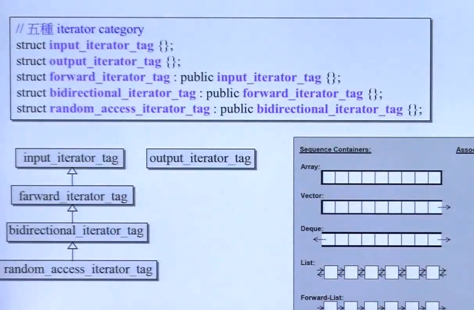
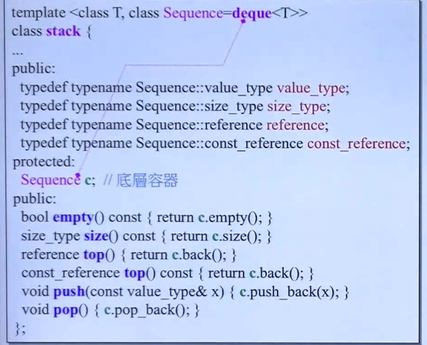
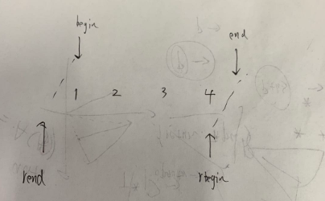
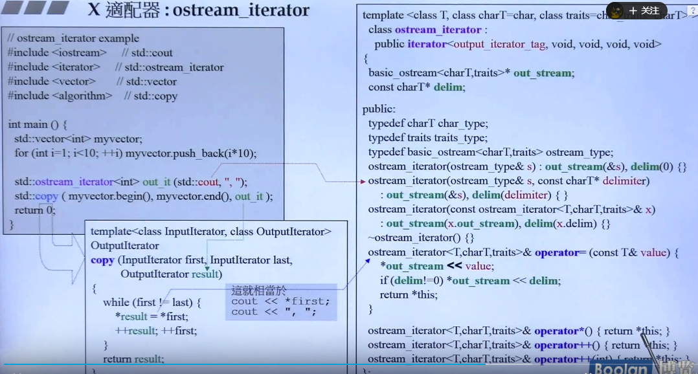
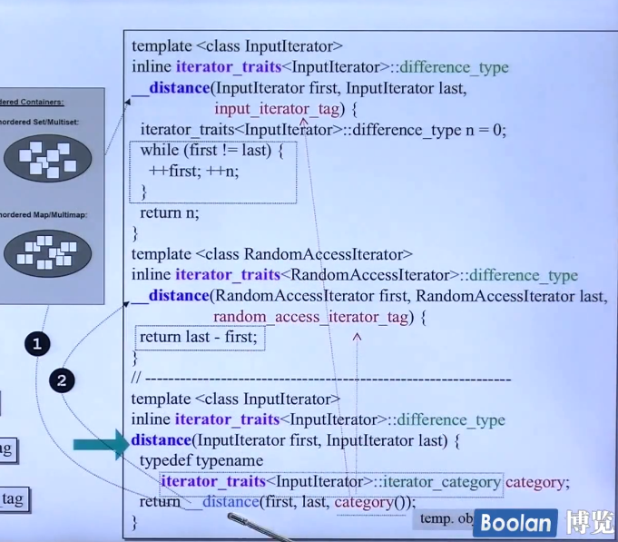
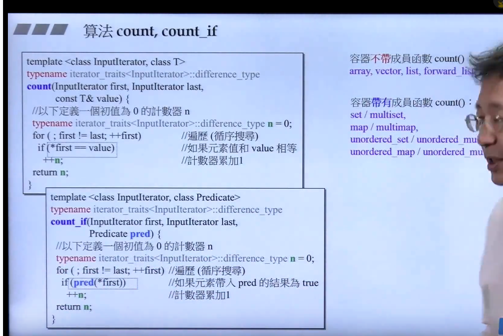

- # STL六大部件

  > 算法是函数模板，其他五个都是类模板

  

  - ## **分配器**

    allocator：内存分配函数operator new()和malloc()。operator new()的函数实现里面会调用malloc，而使用操作符（操作符即运算符，如+，-等）new的时候会先调用operator new()分配内存，再调用构造函数，因此最终的内存分配都回到最底层的malloc上。

    **分配器allocator是个模板类**，把内存配置和释放分成两个阶段来做：内存配置由函数allocate，调用operator new；内存释放由deallocate调用operater delete；对象创建由construct()完成，对象析构由destory()负责

    同时为了提升内存管理的效率，减小申请小内存造成的内存碎片，**STL使用了两级分配器**。当分配的空间大于128k时，使用一级分配器；小于128k时，使用二级分配器。

    第一级分配器直接使用malloc和free

    第二级分配器使用内存池技术，通过空闲链表来管理。即申请一大块内存，挂在链表上，用多少拿多少，用完再申请一大块

    ```c++
    class A
    {
        int a=1;
    }
    int b=A().a; 
    ```

    由于malloc申请会附带overhead记录大量状态信息，属于额外开销，当内存量大的时候overhead在整体占的比例不大，但是申请小内存时就会占用较大的比例，效率不高

    **当然我们可以直接使用分配器来分配内存，就类似于new和malloc，但是使用分配器申请的时候需要数量同时还的时候也需要声明数量**。

    >当调用malloc(size)时，实际分配的内存大小大于size字节，这是因为在分配的内存区域头部有类似于
    >struct control_block {
    >unsigned size;
    >int used;
    >};
    >这样的一个结构，如果malloc函数内部得到的内存区域的首地址为void *p,那么它返回给你的就是p + sizeof(control_block)，而调用free(p)的时候，该函数把p减去sizeof(control_block)，然后就可以根据
    >((control_blcok*)p)->size得到要释放的内存区域的大小。这也就是为什么free只能用来释放malloc分配的内存，如果用于释放其他的内存，会发生未知的错误。

  - ## **容器**：

    分为两类，序列容器和关联容器

    

    - ### **list**

      老千层饼了。即iterator也是一个类，并不是单纯的一个指针，里面重载了很多指针要用到的运算符，是一个类因此才能实现许多单纯指针无法实现的智能操作

      ```c++
      //list是一个模板类，然后它里面有用到 __list_iterator
      template<class T,class Alloc=alloc>  
      class list
      {
          typedef __list_iterator<T,T&,T*> iterator;//只是定义别名，并不是声明成员变量
          ...
      }
      // __list_iterator又是一个模板类（结构体和类差不多）
      template<class T,class Ref,class Ptr>
      struct __list_iterator
      {
          typedef T value_type;
          .......
      }
      ```

    - ### deque

      并不是完全连续的，是分段连续的，通过一个连续的vector作为控制区，然后控制区的每个节点控制对应一段连续的内存。

      deque的对象有四个指针

      1. 控制中心map
      2. 控制中心map的size
      3. 指向开头的迭代器
      4. 指向结尾下一位的迭代器

      iterator中有四个指针

      1. node指向该块内存在控制中心中对应的索引的位置
      2. cur指向当前对应的节点
      3. first和last指向当前分配的块的起点和终点

      deque对外呈现出连续的假象，主要归功于它的iterator，当走完一个内存块之后，会自动根据控制区map上的索引自动跳到下一个i块，这样看起来就是连续的

      

      deque的insert有一种很聪明的做法，对于vector而言insert的话找到索引然后把后面的全往后推，然后插入。而对于deque，由于是双端队列，两边都可以移动，所以它会判断insert的位置离开始和结尾哪边比较近，然后从近的那边移动元素腾一个位置，然后插入。这样就减小了移动元素的个数

      同时deque的map是在vector的中间开始向两边递增，如果vector超了扩充的的话，map复制过去还是在vector的中间。如果放在vector的开头的话，map向后孔虫可以，但是向前扩充第一次就不够就要扩充vector，这样的话使vector得不到有效的利用。

    - ### **stack和queue**

      其实不算是容器，是容器适配器，底层是通过调用deque来实现，对应功能的函数底层都是调用deque的函数然后根据stack和queue的特点做一些修改。本身不做事，都是考deque来做，即stack和queue里其实内含了一个deque。
      
      `Stack<int, deque<int>>` 后面这个参数默认是deque，也可以显示声明成其他的容器
      
      
      
      stack是一种后进先出的特殊线性数据结构，因此只要具有push_back()和pop_back()操作的线性结构，都可 以作为stack的底层容器，比如vector和list都可以；queue是先进先出的特殊线性数据结构，只要具有 push_back和pop_front操作的线性结构，都可以作为queue的底层容器，比如list。**但是STL中对stack和queue默认选择deque作为其底层容器，主要是因为**：
      
      1. stack和queue不需要遍历(因此stack和queue没有迭代器)，只需要在固定的一端或者两端进行操作。
      2. 在stack中元素增长时，deque比vector的效率高；queue中的元素增长时，deque不仅效率高，而且内存使用率高。vector 当容量不够时，会开更大的空间，拷数据然后释放原来的空间，操作复杂。而deque会找另一块内存继续存放数据，效率高。
      3. 相比较list，deque的插入操作会更加的高效，而且内存的使用率高，list会导致更多的内存碎片。
      
    - ### set和multiset，map和multimap

      底层都是使用红黑树来实现，红黑树**_Rb_tree**是一个容器，即是一个类，然后set和map的类实现中调用rb_tree，这样看来**其实set和map也是是适配器，调用了基本容器rb_tree，它自己不做事**

      set和multiset的区别就是调用rb_tree的插入操作时，set调用**insert_unique**，而multiset调用**insert_equal**

      由于set和map的有序性，因此使用他们的迭代器不能改变key的值（在实现上set和map会自动把传入的key设置为const），因为树中存储节点时的排序依据就是key，是有序的，改变key会破坏树的平衡和有序性。但是map的value是可以改的。

    - ### unordered_set和unordered_multiset,unordered_map和unordered_multimap

      底层使用的容器时hashtable

      hashtable初始时会申请一块vector,然后每一个作为一个位置索引，hash到相同的位置时<key,value>就以链表的形式挂到后面。当某个索引对应的链表的长度大于我们初始时申请的vector的长度时，就要进行rehash，重新计算。

      为了方便计算，申请的vector的数量都是质数，按照下图右上角的数量顺序依次申请。初始默认就是53，有一个链表超过53时rehash，vector扩充到93

      

  - ## **迭代器**

    下面用list举例，其他的都类似（其中有一个很重要的设计，**迭代器萃取机**，iterator_traits，是迭代器和算法算法之间的桥梁）

    **迭代器要定义五个typedef，类似于它的属性(例如value，categoty等，category用来标示迭代器的种类，下面会说到）algotithm调用它的时候会提问它，问他的这五个属性。**

    下面algorithm传入的参数I即为迭代器，那么下面I::iterator即为回答。指针是一种退化的迭代器，如果把它作为迭代器传入，那么它并没有五个typedef，无法回答，直接用在algorithm里直接用就会出错。那么如何区分呢。下面通过一种间接的方式。

    使用中间层traits。即原来是algorithm直接问iterator，现在是algorithm问iterator_traits，然后traits再问iterator，if iterator是class，那么就返回相应的值；if iterator是个指针，那么它本身没有那五个特性，自然无法回答，这时traits就会代替pointer回答，然后传回algorithm。

    **提问的过程**

    

    **筛选的过程**

    

    

    通过偏特化来实现，如果传进来的是一个迭代器类型，就返回迭代器的value_type，如果传进来的指针，就直接返回指针指向的值

    ---

    ！！！！！但是如果传进来的不是iterator而是一个指针，那么我么通过萃取机来区分。**<u>注意对于vector，由于它是连续的，使用vector模板传入的类型参数的类型的指针构造迭代器就可以，而不用再构造复杂的类</u>**。

    刚开始gnu也是这样做的，但是后来为了统一，把vector<int>::iterator

    也变成和后面的list等的一样了，但是一级一级看回来本质的实现还是和原来的一样用的普通指针，却多了很多的继承和跳转，有点多此一举

    

    - 迭代器的category根据移动的方式分为五种，除了ouput_iterator之外，剩下的四种迭代器category类之间有继承关系
      
      
      
      1. random_access随机访问。vector，array，duque
      2. forward单向依次移动。forward list，hashtable家族（因为下面挂的链表是单向链表）
      3. bidirectional双向依次移动。list，Rb_tree家族

  - ## **适配器**

    适配器的目的是**改造**某个东西，例如A改造B之后，A就代表了B，原来使用者面对B，现在就要面对A，就不会看到B了；但是给A的任务到里面还是会给到B去做。**A就充当了使用者和B之间的桥梁**

    A要取用B的功能，有两种方式，一种是A继承于B，另外一种是**A内含B**。而在标准库的实现中采用的是第二种方式。B原始是什么类型，**A适配B之后也是什么类型不会改变。** 

    1. ### **容器适配器**

       典型的就是stack和queue

       

       容器适配器本质上还是容器，只不过**此容器模板类的实现，利用了大量其它基础容器模板类中已经写好的成员函数**。当然，如果必要的话，容器适配器中也可以自创新的成员函数。

       **set和map其实也是容器适配器，因为底层是用rb_tree容器来实现**

       

    2. ### 迭代器适配器

       首先它里面要内含一个iterator。

       reverse_iterator 。通过在reverse_iterator中，传入begin和end，然后重载操作符++和--来实现 

       

       对逆向取值相当于对正向退一格取值，左移

       ```c++
       vector<int> a{1,2,3,4};
       vector<int>::iterator it=a.begin()+1;
       cout<<*it;  //2
       vector<int>::reverse_iterator _it(it);
       cout<<*_it;  //1
       ```

    3. ### 仿函数适配器

       `count_if(a.begin(),a.end(),bind2nd(less<int>(),40))`

       这个bind2nd就是一个仿函数适配器，原来less<int>()默认是小于，现在bind2nd给它绑定了第二个参数为40,即变成了<40。修饰之后相当于变成一个新的仿函数。

       而并不是每个仿函数都可以被适配，有要求：

       

       因此我们自己写仿函数如果要能被适配的话必须要继承自binary_function和unary_function（表示函数的操作数个数 ，同时里面还有一些内禀的定义）。否则就只能是单纯的当个函数用一下。

       c++11之后推荐使用适配器bind来代替bind2nd，它可以绑定4种东西。

       1. 普通函数。**把后面的绑到前面的上**

          ```c++
          #include<functional>
          using namespace placeholders;  //
          
          double add(double x,double y)
          {
              return x-y;
          }
          auto i=bind(divide,_1,4);//这儿的_1是占位符，表示待定的意思，就是后面调用的时候才会指定
          auto j=bind(divide,_1,_2);
          auto m=bind<int>(divide,_2,_1);
          int main()
          {
              cout<<i(8);//i(8)即add(8,4);
          }
          ```

       2. 函数对象。function objects。即仿函数的对象，下面的less<int>()即为一个less类的临时对象，即为函数对象。

          ```c++
          vector<int>  a{1,2,3,4};
          count_if(a.begin(),a.end(),bind(less<int>(),_1,5));
          ```

       3. 成员函数,member_functions。_1且必须是某个object的地址

       4. 数据成员,data_members。_1必须是某个对象的地址。

          下面是2和3的例子。**这儿是把前面的绑定到后面的对象上，前面绑的东西要加&**

          ```c++
          struct Test
          {
              int a,b;
              int add()
              {
                  return a+b;
              }
          };
          Test t{1,2};
          auto i=bind(&Test::add,_1);//注意这儿的_1是十分必要的，因为类的成员函数都有一个默认的参数this，这儿如果不给它留位置的话参数个数就会不一致
          cout<<i(t);  //即t.add()
          
          auto j=bind(&Test::a,t);
          cout<<j();   //即t.a
          ```

    4. **X 适配器（X是未知的意思）outstream_iterator**。这儿是用来修饰cout。关键点在于重载操作符

       copy的代码是提前写好不能改的，所以实现是通过在ostream_iterator中重载运算符实现。copy的第三个参数result，在这儿传入的是out_it，而out_it是一个ostream_iterator对象，在ostream_iterator类中，重载了`*`和`++`操作符，返回还是this，即在copy中执行的时候，`*`return返回的还是return，然后后面的赋值运算符`=`被重载，这儿的`*out _stream`是类数据成员，传入的是cout，cout就是个类对象，那么`*`out_stream<<value即把value传入cout中，然后后面delim传入的","，下面再把delim也传入到cout中，然后返回，即再copy中，`*result=*first`这一步相当于把是cout<<*first;cout<<","。然后++result由于++被重载就是++，而fisrt继续向后遍历

       

       ```c++
       vector<int> a{1, 2, 3, 4};
       ostream_iterator<int> out_it(cout,",");
       copy(a.begin(),a.end(),out_it); //会自动把结果cout到控制台
       ```

  - ## **算法**

    算法是看不到容器的，所需要的一切信息都是从iterator获得的。而iterator必须能够回答Algorithm的所有提问，才能搭配该Algorithm的所有操作，所以算法的函数模板的参数必定会有迭代器

    算法对于传入的容器迭代器，会根据它的categoty来做不同的操作

    

    例如上面这个distance函数，传入迭代器之后，先通过萃取器判断迭代器的category，然后次函数`_distance`传入的迭代器的category不同调用不同的重载函数。

    因此算法的效率除了本身的实现以外，还有就是能不能快速判断出迭代器的分类，对对应类型的迭代器使用效率最高的重载函数

    - 算法有通用的算法和容器自己对应的成员算法

      1. count。count(first,last,value)。返回容器中value的个数。

         8个关联式容器有自己的成员函数count，速度比通用的count快。而序列容器只能使用通用版本的，没有自己的。当然那8个也可以用通用的

         count_if是计算满足谓词关系的，谓词一般就传入一个函数名就可以

         ```c++
         vector<int> a{1,2,3,4};
         int b=count(a.begin(),a.end(),2);
         -----
         set<int> c{1,2,3,4};
         int d=c.count(2);
         ---
         bool greater4(int x)
         {
             return x>4;
         }
         int r=count_if(a.begin,a.end(),greater4);//满足谓词关系的元素的个数
         ```

         

      2. find。返回的是迭代器。8个有自己的find，剩下的容器只能用通用的。

         > find是循序查找，而lower_bound是在排序数组中二分，所以如果数组已经排序好了，用lower_bound比find快，但是如果没有排序，先排序再二分其实比find慢

         find_if是找第一个满足谓词关系的元素的下标

      3. sort。list和forward_list有自己的成员sort，而剩下的容器都要用通用的sort。这儿list和forward_list不能用通用的sort，和上面的注意区别。上面的是自己的成员函数里有但是也可以用通用的，这儿这两个只能用自己的，不能用通用的

  - ## **仿函数**

    **是为算法来服务的。是一个能够行使函数功能的类或struct，通过重载小括号来实现**

    仿函数的形式就是写一个struct(或者class)，然后里面重载小括号，然后把这个动作传入算法中，即算法的形参里的谓词参数。

- # 模板特化

  - ## **全特化**

    使用模板时碰到一些特殊的类型需要特殊处理，不能直接使用当前的模板函数，所以需要写一个特化的版本。即专门写一个模板函数供该类型用

    例如有一个比较是否相等的模板函数

    ```c++
    template<class T>
    bool isEqual(T &a,T &b)
    {
        return a==b;
    }
    ```

    但是要比较字符串就不能用这个模板了，因此我们为字符串单独写一个模板

    ```c++
    template<>
    bool isEqual<char *>(char * &a,char * &b)
    {
        return strcmp(a,b)==0;//strcmp接受的参数只能是char*,不能是string，会从头开始依次比较两个字符的ascii值，如果比较到结尾二者都相等就返回0，a>b返回1，反之返回-1
    }
    ```

    - 使用特化模板时，前面必须有基础模板
    - 写的时候前面template然后后面<>里什么都不用写
    - 函数名后面要跟上特化类型，而且后面参数列表的样式要和原来的相同
    - 调用的时候直接用就行，可以不显式声明特化类型，会自动推导

  - ## **偏特化**

    偏特化只有类模板有，因为函数有函数重载的概念，C++根据参数的类型来判断重载哪一个函数，如果还进行偏特化，这就与重载相冲突。

    有两种情况

    - 部分特化，即只对类模板的一部分模板类型进行特化
    
      ```c++
      template<class T1,class T2>
      class Test{};
      //部分特化
      template<class T2>  //这儿只写未进行特化的模板类型，转换过的就不用写，因此全特化的时候因为都进行特化，所以就是空的都不用写。这儿我们特化T1，所以T1不写，只写T2就可以
    class Test<int,T2>{};
      ```

    - 对模板类型的**范围的限制**
    
      ```c++
      template<class T1,class T2>
      class Test{};
      
      template<class T1,class T2>  //只写未进行特化的模板类型，我们这儿只是对它做了限制但是没有指定确定的类型，即没有特化写上
      class Test<T1*,T2*>{};  //对类型作限制，当传入指针的时候用这个模板
      ```
      
      指针类型，引用类型，或者const类型都可以是偏特化的修饰

- 

