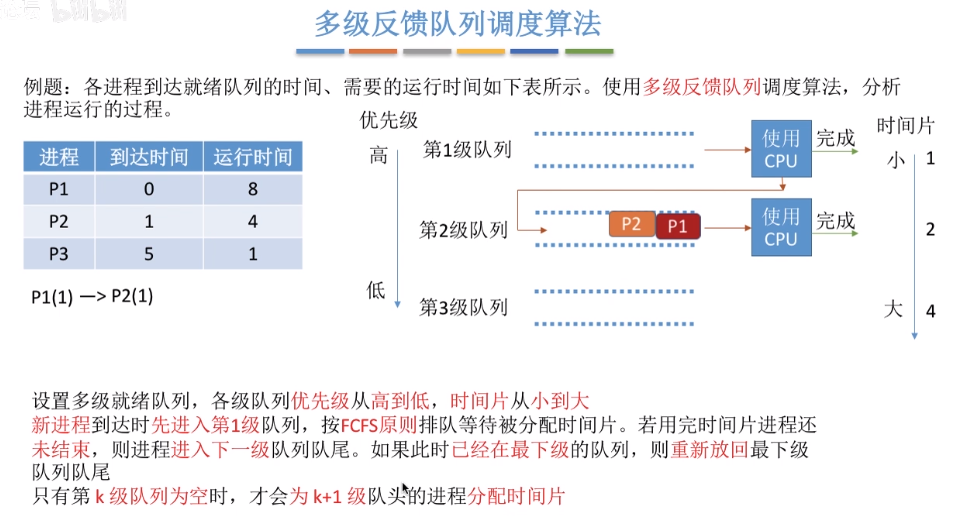
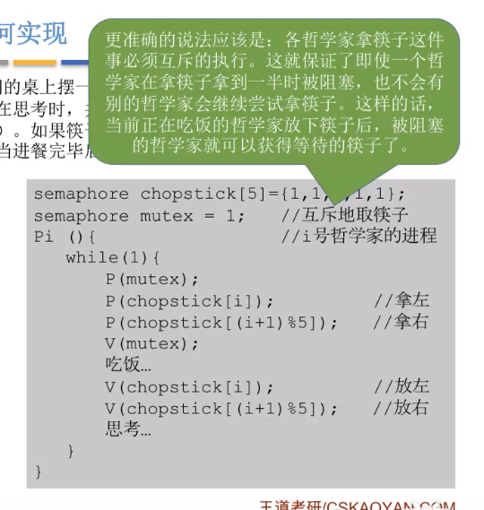

### 第一章 概论

#### 1. 操作系统定义

操作系统是运行在内核态的软件，它执行两个基本上独立的任务。

* 隐藏计算机底层硬件的实现，为用户及应用程序提供一个资源集的清晰抽象。
  
* 管理计算机硬件资源。

任何操作系统的核心是它可处理的系统调用集。这些系统调用集真实地说明了操作系统做的工作。

#### 2. CPU的两种状态，大内核和微内核

**内核态和用户态**。

**用户态和核心态的切换是通过中断实现的，而且是唯一的途径**

处理器的这两种状态是用程序状态字寄存器(PSW)中的某个标志位来标识的，例如0为用户态，1为核心态

只有操作系统的内核运行在内核态，这内核态模式下，操作系统具有对所有硬件的完全访问权，可以执行机器能够运行的任何指令。而OS中除了内核的部分及所有的用户程序，都是运行在用户态，只能使用机器指令中的一个子集。

**内核是OS中最核心的部分，是OS中的底层软件。**

时钟管理、终端管理和原语是最接近硬件的部分，微内核就是仅把这些核心功能模块归入操作系统内核；而大内核就是除了这些以外，把进程管理等功能也归入了操作系统内核。

原语不会被中断，是通过关中断和开中断指令来实现，执行原语代码 执行，先执行关中断指令，这样任何中断指令都会被忽略，等待原语执行完成之后，执行开中断指令。

#### 3.中断和异常

**中断的引入是为了实现程序并发执行**

一但中断发生，就以为需要OS的介入，开展管理工作

- 中断发生时，CPU立刻进入核心态
- 中断发生后，当前程序暂停，由OS内核对中断进行处理
- 对不同的中断有不同的处理

**中断的分类，根据中断的信号来源来区分！！！**

#### 4.操作系统的四个基本特征

1. 并发。同一时间间隔发生。并行是同时发生。例如单核心的话同一时刻就只能执行一个程序。
2. 共享（资源）
   - 互斥共享。多个进程都可以用，但是同一时间只有一个能用
   - 同时共享。同一时间多个进程都可以用
3. 异步。异步指进程不是一次性执行完毕，而是走走停停，以不可知的速度向前推进。
4. 虚拟：把一个物理上的实体变成若干个逻辑上的对应物，物理实体是实际存在的，而逻辑上对应物是用户感受到的
   - 空分复用技术：如虚拟存储器，虚拟内存。虚拟内存使用了空分复用技术，它将**物理内存抽象为地址空间，每个进程都有各自的地址空间**。地址空间的页被映射到物理内存，地址空间的页并不需要全部在物理内存中，当使用到一个没有在物理内存的页时，执行页面置换算法，将该页置换到内存中。
   - 时分复用技术：如虚拟处理器。**一个程序需要放入内存并分配CPU才能执行**。多个进程能在同一个处理器上并发执行使用了时分复用技术，让每个进程轮流占用处理器，每次只执行一小个时间片并快速切换。

#### 5.系统调用

如果一个进程正在用户态中运行一个用户程序，并且**需要一个系统服务**，比如从一个文件读数据，那么它就必须执行一个陷阱或系统调用指令，将控制转移到操作系统。操作系统接着通过参数检查，找出所需要的调用进程。然后，它执行系统调用，并把控制返回给在系统调用后面跟随着的指令。

**系统调用就是OS提供的一组接口**

### 第二章 进程与线程

####  一、进程

#### 1.概述

**进程是对运行时程序的封装。是系统资源分配的基本单位。**

进程由程序段、数据段和PCB组成

进程控制块 (Process Control Block, PCB) 描述进程的基本信息和运行状态，所谓的创建进程和撤销进程，都是指对 PCB 的操作。**它是进程存在的唯一标志**

在 UNIX 系统中，**只有一个系统调用可以用来创建新进程：fork**。在调用了 fork 后，这两个进程（父进程和子进程）拥有相同的存储映像、同样的环境字符串和同样的打开文件。

在 UNIX 和 Windows 中，进程创建之后，**父进程和子进程有各自不同的地址空间**。如果其中某个进程在其地址空间中修改了一个字，这个修改对其他进程而言是不可见的。

#### 2.进程的状态转换

#### 3.进程通信（Inter-Process Communication）

每个进程在系统进行资源分配时获得各自独立的内存地址空间，相互之间是无法访问的。但是有时进程之间的信息交换又是必须的，因此操作系统提过了进程之间通信的方式：

- ##### 共享空间

  优：允许多个进程共享一个给定的可以直接访问的存储区，因为数据不需要在进程之间复制，所以这是最快的一种IPC。

  缺：需要实现对共享空间的**互斥**访问，互斥通过OS提供的工具来完成，eg：PV、互斥锁

  

- ##### 管道通信

  1. 无名管道

     优：简单方便

     缺：局限于单向通信；只能在有亲缘关系的进程之间；缓冲区有限

  2. 有名管道

     优：可以实现任意关系的进程通信

     缺：长期存在于内存中，使用不当容易出错；缓冲区有限

  实现简单，但是只能单向通信

  

- ##### 消息队列 

  消息的连接表，一个消息队列由一个标识符（队列id）来标记。
  
  优：可以实现任意进程间的通信，并通过系统调用来实现消息发送和接受之间的同步，无需考虑同步
  
  缺：消息队列中信息的赋值需要额外消耗CPU时间，不适用信息量大和操作频繁的场合
  
  
  
- ##### 套接字socket

  用于不同主机之间的进程通信

#### 二、线程

**线程是资源调度的基本单位。**每个线程独自占用一个而虚拟处理器：独自的寄存器组，指令计数器和处理器状态，**每个线程完成不同的任务但是共享统一地址空间**

同一进程的多个线程共享代码段（代码和常量），数据段（全局变量和静态变量），扩展段（堆空间）。但是每个线程拥有自己的栈段，又叫运行时段，用来存放局部变量和临时变量。

**由于线程共享地址空间，因此一个线程的崩溃将会导致整个进程的崩溃**

#### 1.基本属性

#### 2.线程的实现方式

用户级线程和内核级线程，用户级线程通过线程库实现，用户能看到，OS看不到

- **用户级**                                                          **内核级**

  

  

#### **3.线程模型**

**多对一**

用户级线程切换不需要切换到核心态。但是如果一个用户级线程阻塞，所有的都要阻塞

**多对一**

一个阻塞不影响其他，并发能力强。但是用户级切换就要切换内核级，开销大

**多对多**

集上面二者所长

#### 4.进程调度算法

进程调度，就是按照某种算法从就绪队列中选择一个进程，然后进行进程切换为其分配处理机。（进程切换是是一个进程让出处理机，然后让另一个进程占用处理机）

**批处理系统中**。在这种系统中，没有太多的用户操作，算法的目标就是为了保证吞吐量和周转时间（从到达队列到执行完成的时间）

1. ##### 先来先服务（FCFS，first come first serve ）

   非抢占式，占用处理及的进程只有主动放出CPU，才会对就绪队列的进程进行调度。

   实现简单，对长作业有利，但是对短作业不利

2. ##### 短作业优先（SJF, short job first）

   - 非抢占式，每次调度选择当前已经到达的运行时间最短的进程。
   - 抢占式的SJF，也叫做最短剩余时间优先算法（SRTN)， 当一个新的作业到达时，其整个运行时间与当前进程的剩余时间作比较。如果新的进程需要的时间更少，则挂起当前进程，运行新的进程。否则新的进程等待。

   对短作业有利，长作业不利，而且有可能会造饥饿，但是各项指标值都很小

3. ##### 高相应比优先

   非抢占式。**结合了上面两种算法的优势**。调度时先计算就绪队列各个进程的相应比，选择相应比最高的进程为其服务

   

---

**交互式系统，**这种系统中有大量的用户交互操作，因此调度算法的目标是快速的进行响应

1. **时间片轮转**

   按照每个进程到达就绪队列的顺序，轮流让每个进程执行一个时间片

2. **优先级调度**

   每个进程提前有自己的优先级，调度每次选择优先级最高的进程

3. **多级反馈队列**

   上面两种算法的结合。66666

   

#### 5.进程互斥与进程同步

**互斥**：依次只允许一个进程使用的资源称为临界资源。许多物理设备如打印机等都属于临界资源。进程之间通过互斥的方式来共享临界资源。

**同步**：由于异步环境进程并发执行，二者交替的次序不可知。但有时我们需要让代码按照一定的顺序执行才能完成我们的任务，这时就需要通过进程同步让本来异步的进程互相配合，有序推进

#### 6.**信号量机制**

- 信号量其实就是一个变量，用来表示系统中某种资源的数量。例如系统中只有一个打印机，就可以设置一个初值为1的信号量

  **整形信号量**

  

  **记录型信号量**

  

- 原语是一种特殊的程序段，执行的时候不能打断。

- 一对原语：wait(S)和signal(S)对信号量进行操作。可以把wait和singal理解为函数，括号里的信号量就是函数调用时传过来的参数

- wait和signal原语简称P，V操作，wait(S)可以写成P(S)

#### 7.用信号量机制实现进程互斥和进程同步

- 互斥：对不同的临界资源设置不同的互斥信号量且初值为**1**可以实现进程互斥

  

- 同步：同步信号量的初始值要看对应资源的初始值是多少。

  

  复杂一点的同步。不同的前后驱关系设置不同的同步信号量且初值为0。   

  

#### 8.生产者消费者问题

**互斥的P操作一定要在同步的P操作之后**，即P(empty)要在P(mutex)之前，不然会造成死锁，即生产者等待消费者释放空闲缓冲区，而消费者又等待生产者释放临解区，你等我我等你，结果谁都执行不了

#### 9.哲学家进餐

关键在于解决死锁，因为这儿的临界资源有两个。

### 第三章 死锁

并发环境下，各进程因竞争资源而造成的一种互相等待对方手里的资源，导致各进程都阻塞，都无法向前推进的现象。发生死锁之后，如果无外力干涉，这些进程都无法向前推进

死锁的四个条件

- 互斥：每个资源要么已经分配给了一个进程，要么就是可用的。
- 请求和保持条件：进程已经保持了至少一个资源，但是又提出了新的资源请求，而该资源又被其他进程占有，此时请求进程被阻塞，但是又对自己已有的资源保持不放。
- 不可抢占：已经分配给一个进程的资源不能强制性地被抢占，它只能被占有它的进程显式地释放。
- 环路等待：有两个或者两个以上的进程组成一条环路，该环路中的每个进程都在等待下一个进程所占有的资源

**死锁的处理策略**

#### 2.避免死锁

#### 3.银行家算法

### 第四章 内存管理

#### 1.内存空间的分配和回收

连续分配管理（为进程分配连续的内存空间）    非连续分配

#### 1.1基本分页存储

内存是页框，而进程分成页

#### 1.2基本分段存储

**<u>分页是每个页都一样，而分段的大小的不等的</u>**

#### 1.3分段、分页管理的对比

**分段比分页更容易实现信息的共享和保护**

#### 1.4段页式管理

#### 2.从逻辑上扩充内存空间（虚拟技术）

使用传统的内存分配方式，作业必须一次性全部装入内存后才能开始运行，造成的问题：如果作业很大，无法全部装入，就无法运行，如80G的GTA

虚拟内存的实现利用了局部性原理（**虚拟内存使用的是分页技术**）

**实现虚拟内存技术。主要是两个功能：**

- **请求调页功能。访问的内存不在内存时从外面调进来**
- **页面置换功能。内存空间不够时，把不用的先换出去**

#### 2.1页面置换算法

程序运行时如果要访问的不在内存中，就发生缺页中断，然后从外面把页调入。如果此时内存已经满了，就需要调出去一个腾位置。页面置换算法的主要目标是使页面置换频率最低（即缺页率最低）

1. 最佳置换（无法实现）。每次淘汰以后永久不适用或最长时间内不被访问。理论上的，因为并不知道一个页面多长时间不再被访问

2. 先进先出置换（容易实现但性能很差）。每次淘汰最早进入队列的，有一个队列，每次淘汰队头的

3. 最近最久未使用（性能最接近1的，但是实现困难）。将来的不知道，但是过去的知道，每次淘汰最近最久未使用的。

   

4. 时钟算法

   

5. 改进型时钟置换算法

   

#### 3.地址转换

程序完成编译之后链接成的装入模块种保存的是逻辑地址，即从0开始然后跟上相对偏移量。而程序最终执行是要放到内存中去的，这时就需要装入程序将装入模块装入内存来运行，即完成**逻辑地址到物理地址的转换**

##### 装入的三种方式

1. 绝对装入。编译的时候就知道会放到内存中的位置，就直接用绝对地址。但是灵活性很低，只适用于单道程序环境即内存中同一时刻只有一个程序在运行

2. 静态重定位

   装入模块的地址都是从0开始，其中存放的地址都是相对于0的逻辑地址；装入时，会根据内存中的地址对装入模块中的地址进行重定位，例如要装入到内存中100的位置，那就装入模块中的内存地址全部+100

   要求装入时必须分配其要求的全部内存空间；而且装入之后就不能再移动了，因为地址已经定了，移动就会出现地址错误

3. **动态重定位也叫动态运行时装入**

   装入时不用改变逻辑地址，会用一个重定位寄存器记录装入模块的起始位置。只有程序要执行时才根据重定位寄存器中保存的起始位置进行地址转换。

   这种就很灵活。

#### 4.内存保护

防止进程访问越界。

### 第四章 设备管理

 

延迟时间和传输时间是磁盘的内禀属性，因此OS只能优化寻道时间，磁盘调度算法针对的就是寻道时间

#### 磁盘调度算法

1. 先来先服务
2. 最短寻道时间优先：贪心算法思想，优先选择里当前磁头最近的（可能会出饥饿）
3. 电梯算法：磁头总是保持一个方向运行，直到没有请求为止，然后改变运行方向。
4. 循环扫描算法。只有钞某个方向移动时才处理请求，返回时直接快速移动到始端不处理任何请求

#### 操作系统中程序的内存结构

一个程序本质上由三个部分组成：

1. BSS段（未初始化数据）
2. data段（已初始化数据）
3. text段（存放程序二进制代码）

用户空间分布，再往上就是内核空间

