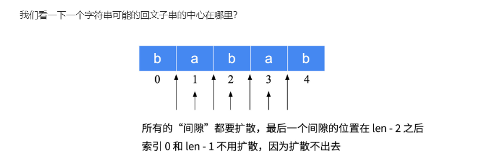
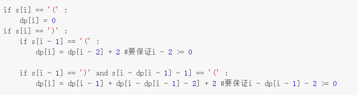
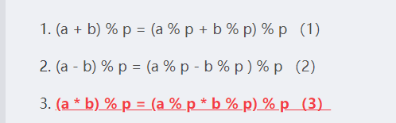
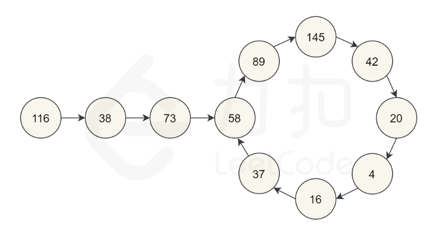
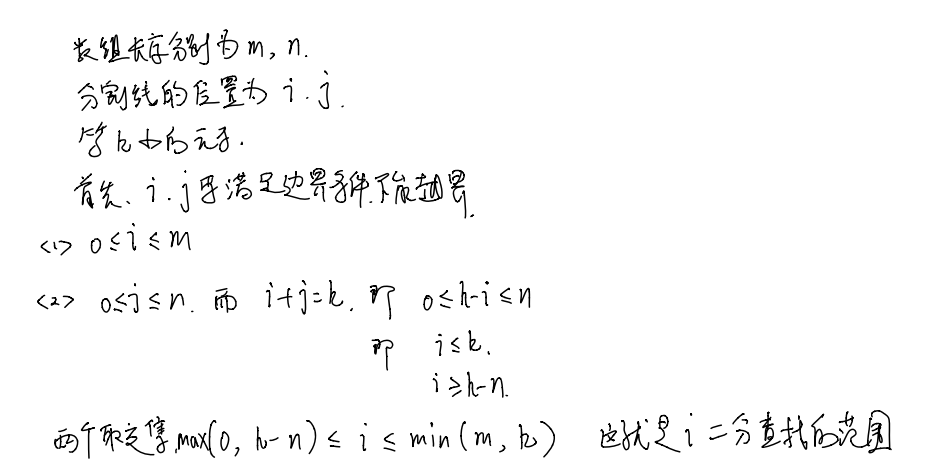

## 动态规划

- #### 5.最长回文子串

  `dp[i][j]`表示子串[i,j]是不是回文子串

  ```c++
  class Solution {
  public:
      string longestPalindrome(string s) 
      {
          int n=s.size();
          vector<vector<int>> dp(n,vector<int>(n));
          int maxLen=1;
          int start=0;
          for(int i=0;i<n;i++)
              dp[i][i]=true;    //单个字符必然是回文子串
          for(int j=1;j<n;j++)
          {
              for(int i=0;i<j;i++)
              {
                  if(s[i]!=s[j])
                      dp[i][j]=false;
                  else
                  {
                      if(j-i<=2)  //下面右i+1和j-1,因此要构成区间，j-1要严格大于i+1，即j-1>i+1,j-i>2，那么相反的情况就是j-i<=2，即j-i+1<=3,区间的长度<=3,而i！=j,即区间长度为3和2两种情况，即[a,b,a]和[a,a]的情况，这种情况显然是回文串，因此结果即为true，不用放到下面转移状态了
                          dp[i][j]=true;
                      else
                          dp[i][j]=dp[i+1][j-1];
                  }
                  if(dp[i][j]==true && j-i+1>maxLen)
                  {
                      maxLen=j-i+1;
                      start=i;
                  }
              }
          }        
          return s.substr(start,maxLen);
      }
  };
  ```

  **中心扩散法**

  两种扩散方式，奇数扩散和偶数扩散

  

  ```c++
  class Solution {
  public:
      string longestPalindrome(string s) 
      {
          int n=s.size();
          int maxLen=1;
          int start=0;
          for(int i=0;i<n-1;i++) //每次以i为中心扩散，奇数
                                 //以i，i为中心扩散，偶数
          {
              int oddLength=centerSpread(s,i,i);
              int evenLength=centerSpread(s,i,i+1);
              if(max(oddLength,evenLength)>maxLen)
              {
                  maxLen=max(oddLength,evenLength);
                  start=i-(maxLen-1)/2;
              }
          }
          return s.substr(start,maxLen);
                  
      }
      int centerSpread(string s,int left,int right)
      {
          int n=s.size();
          while(left>=0 && right<=n-1)
          {
              if(s[left]==s[right])
              {
                  left--;
                  right++;
              }
              else
                  break;
          }
          return right-left-1;  //right-left+1-2,break退出循环的时候s[left]!=s[right],所以最后结果不包括right和left
                               //如果不是break退出循环的，即遍历了全部的字符串，那么最后一次循环的时候left--,right++执行，此时left=-1，right=s.size()，最后的结果还是不能left和right，所以这样写是通用的
      }
  };
  ```

- #### 1143.最长公共子序列

  `dp[i][j]`表示s1的前i个字符（**i的取值范围是[1,m],对应的字符串为s1.substr(0,i)**）和s2的前j个字符组成的字符串的公共子序列的长度

  即s1的子串s1.substr(0,i)和s2的子串s2.substr(0,j)的最长公共子序列的长度

  **想象成填表格的过程**

  求`dp[i][j]`时，`dp[i-1][j-1]`是已知的，那么如果text1[i-1]==text2[j-1]，那么这个字符必然在LCS中，即`dp[i][j]`=`dp[i-1][j-1]`+1，如果不等，那么就依次把i和j分别加入当前的串，扩大串的长度，然后求能让结果最大对应的i或者j

  **对于求公共子串，`dp[i][j]`即为以i和j结尾的子串（i和j在公共子串中）的最长公共子串的长度**

  那么显然当i和j相等时，直接加1，如果不等时，由于子串的连续性，所以结果即为0，最后在所有的以i和j结尾的子串的最长公共子串中找最大的那个即为结果

  ```c++
  class Solution {
  public:
      int longestCommonSubsequence(string text1, string text2) 
      {
          int m=text1.size();
          int n=text2.size();
          int dp[m+1][n+1];
          memset(dp,0,sizeof(dp));
          for(int i=1;i<=m;i++)
          {
              for(int j=1;j<=n;j++)
              {
                  if(text1[i-1]==text2[j-1])//前i个字符组成的字符串的最后一个字符的索引即为i-1
                      dp[i][j]=dp[i-1][j-1]+1;
                  else//如果不等，那么至少有一个不在LCS中，需要丢弃一个，看丢了哪个剩下的结果大就选哪个
                      dp[i][j]=max(dp[i-1][j],dp[i][j-1]);
              }
          }
          return dp[m][n];  
      }
  };
  ```

  #### 最长公共子串就是在循环的判断里当else时`dp[i][j]`=0(即不处理)，然后最后返回的结果即为dp里最大的那个元素（可以用一个变量来跟踪记录dp中的最大值）

- #### 300.最长上升子序列

  这种上升子序列的用动态规划时，dp[i]一般定义为以nums[i]结尾的最长子序列。

  那么dp[i]就等于从0-i（左闭右开区间），以每一个小于nums[i]的元素为结尾的上升子序列的长度+1的最大值

  ```c++
   for(int i=1;i<n;i++)
          {
              for(int j=0;j<i;j++)
              {
                  if(nums[j]<nums[i])
                      dp[i]=max(dp[i],dp[j]+1);
              }
          }               
  ```

- #### 152.乘积最大子数组

  由于是乘法，所以不能用最大子序和那种方法， 需要同时记录最大最小值，然后根据nums[i]是正数或者负数来调整最大自小值

  **max[i]表示以i结尾的子数组乘积的最大值**

  min[i]即乘积最小值

  ```c++
  class Solution {
  public:
      int maxProduct(vector<int>& nums) 
      {
          int n=nums.size();
          if(!n)
              return 0;
          if(n==1)
              return nums[0];
          vector<int> Max(n),Min(n);
  
          Max[0]=nums[0];
          Min[0]=nums[0];
          for(int i=1;i<n;i++)
          {
              if(nums[i]>=0)
              {
                  Min[i]=min(nums[i],nums[i]*Min[i-1]);  //nums[i]正数的话，最大值最小值乘以正数还是最大最小值
                  Max[i]=max(nums[i],nums[i]*Max[i-1]);
              }
              else
              {
                  Min[i]=min(nums[i],nums[i]*Max[i-1]);   //负数的话相反，最大值乘以负数变成最大值，最大值乘以负数变成最小值
                  Max[i]=max(nums[i],nums[i]*Min[i-1]);
              }
          }
          return *max_element(Max.begin(),Max.end());
      }
  };
  ```

- #### 198.打家劫舍Ⅰ

  dp[i]定义为偷到索引i是获得的最大利润，那么两种可能

  1. 偷i。那么dp[i]=dp[i-2]+nums[i]
  2. 不偷i。那么dp[i]=dp[i-1]

  取max即可

- #### 213.打家劫舍Ⅱ

  保存dp[i]的同时数组加一维，表示有没有强第一个房间

  ```c++
  class Solution {
  public:
      int rob(vector<int>& nums) 
      {
          int n=nums.size();
          if(nums.size()==0)
              return 0;
          if(nums.size()<4)
              return *max_element(nums.begin(),nums.end());
          vector<vector<int>> dp(nums.size(),vector<int>(2));
          dp[0][0]=0;     //表示没有抢第一个房间的情况下抢到i时的最大金额
          dp[0][1]=nums[0];
          dp[1][0]=nums[1];
          dp[1][1]=nums[0];
          
          for(int i=2;i<n;i++)
          {
              if(i!=n-1)
              {
                  dp[i][0]=max(nums[i]+dp[i-2][0],dp[i-1][0]);
                  dp[i][1]=max(nums[i]+dp[i-2][1],dp[i-1][1]);
              }
              else
              {
                  dp[i][0]=max(nums[i]+dp[i-2][0],dp[i-1][0]);
                  dp[i][1]=dp[i-1][1];
              }
          }
  
          
          return max(dp[n-1][0],dp[n-1][1]);
  
      }
  };
  ```

- #### 337.打家劫舍Ⅲ

  树状dp，使用二维数组，i表示到当前节点，j表示是否选中当前节点，`dp[i][j]`就表示从树底到当前节点可以获得的最大值

  因此要使用后序遍历，**我们的逻辑是子结点陆续汇报信息给父结点，一层一层向上汇报，最后在根结点汇总值**

  **可以用哈希，每个结点在两个哈希表中分别对应选中和不选中时的值，省去了数组的空间复杂度**

  ```c++
  class Solution {
  public:
      int rob(TreeNode* root) 
      {
          vector<int> res=dfs(root);
          return max(res[0],res[1]);     //每个节点都有一个对应的vector<int>,里面两个元素，第一个0是不包括root，第二个1表示包括root
          
      }
      vector<int> dfs(TreeNode* root)
      {
          if(!root)
              return {0,0};   //要返回2个元素，不能返回{}，不然上面的访问就会越界
          vector<int> left=dfs(root->left);
          vector<int> right=dfs(root->right);  //后序遍历，先得到子节点的vector，再根据子节点的vector生成父节点的vector
  
          int have=root->val+left[0]+right[0]; //选root的话，两个子节点就不能选
          int nothave=max(left[0],left[1])+max(right[0],right[1]);//不选root的话，就从子节点的选不选子节点中跳出大的那个
          return {nothave,have};
      }
  };
  ```

  哈希

  ```c++
  class Solution {
  public:
      unordered_map<TreeNode*,int> yes,no;   //yes,no
      int rob(TreeNode* root) 
      {
          dfs(root);
          return max(yes[root],no[root]);
      }
      void dfs(TreeNode* root)
      {
          if(!root)
              return ;
          
          dfs(root->left);
          dfs(root->right);
  
          yes[root]=root->val+no[root->left]+no[root->right];
          no[root]=max(yes[root->left],no[root->left])+max(yes[root->right],no[root->right]);
      }
  };
  ```

- #### 128.最长连续序列

  - 使用unordered_set

    ```c++
    class Solution {
    public:
        int longestConsecutive(vector<int>& nums) 
        {
            unordered_set<int> a;
            for(auto i:nums)
                a.insert(i);
            int res=0;
            for(auto i:a)
            {
                if(a.count(i-1))  //如果存在比i-1更小的元素存在，那么i必然不是该局部最优解上升序列的开头
                    continue;
                int temp=1;
                while(a.count(i+1))
                {
                    temp++;
                    i++;
                }
                res=max(res,temp);
            } 
            return res;       
        }
    };
    ```
  
- **经典的并查集思路**
  
  使用map来做uf数组，注意cnt记录当前元素集合中元素个数，只会更新当前元素的cnt，并不是所有的都更新
  
  1. 将连续的数字作为一个集合
  2. 那么扫描到一个数字，只要将它和它的下一个数字（假如存在）merge在一个集合即可。同时更新这个集合的元素个数
    3. 如果当前经过merge的集合的元素个数比当前记录的最长序列的长度都长，则更新当前最长记录
  
    ```c++
    class Solution {
    public:
        unordered_map<int,int> uf,cnt; //uf为并查集的数组，初始时就是对应的数，cnt保存对应的集合的元素数目，但是要得到cnt必须是以该集合的root为key，因为unite的时候只更新了root对应的cnt
        int find(int x)   //寻找根节点
        {
            return x==uf[x] ? x : uf[x]=find(uf[x]); //寻根问祖，回把从x开始的都更新
        }
        
        int _union(int x,int y)
        {
            int c=find(x);
            int d=find(y);
            if(c==d)
                return cnt[c];
            uf[d]=c;
            cnt[c]+=cnt[d];
            return cnt[c];
        }
        int longestConsecutive(vector<int>& nums) 
        {
            if(nums.empty())
                return 0;
            for(int i:nums)
            {
                uf[i]=i;
              cnt[i]=1;
            }
          int ans=1;
            for(int i:nums)
            {
                if(i!=INT_MAX && uf.count(i+1))
                  ans=max(ans,_union(i,i+1));
            }
            return ans;
    
        }
    };
    ```
  
- #### 25.K个一组翻转链表

  先把要翻转的摘出来，然后反转完之后再接到原来的链子上

  官方题解的动图还可以

  ```c++
  class Solution {
  public:
      pair<ListNode*,ListNode*> reverse(ListNode* head,ListNode*tail)
      {
          ListNode *new_head=nullptr;
          ListNode *p=head;
          while(new_head!=tail)
          {
              ListNode *temp=p->next;
              p->next=new_head;
              new_head=p;
              p=temp;
          }
          return {tail,head};
  
      }
     
      ListNode* reverseKGroup(ListNode* head, int k) 
      { 
          ListNode* hair=new ListNode(0);   //hair指向链表头结点的前驱结点，所以可以一直保存原始链表
          hair->next=head;
          ListNode* pre=hair;
  
          while(head)
          {
              ListNode* tail=pre;   //pre即为要翻转的链表的前驱节点
              //判断剩下的长度还够K吗
              for(int i=0;i<k;i++)
              {
                  tail=tail->next;
                  if(!tail)
                      return hair->next;
              }
              
              ListNode* nex=tail->next;  //保存后继，到时候能找回来
              pair<ListNode*,ListNode*> result=reverse(head,tail);
              head=result.first;
              tail=result.second;
  
              pre->next=head;   //前面接上
              tail->next=nex;   //后面接上
  
              pre=tail;         //pre继续保存前驱
              head=tail->next;  //head即为下一组翻转链表的头节点
          }
          return hair->next;
      } 
  };
  ```

- #### 105.从前序与中序遍历序列构造二叉树

  二叉树的构造一定是利用递归来完成的，同时注意中序和前序的特点，前序的第一个结点即为根节点，那么对应到中序里就可以把左子树和右子树分开

  ```c++
  class Solution {
  public:
      map<int,int> m;
      TreeNode* buildTree(vector<int>& preorder, vector<int>& inorder) 
      {
          int n=preorder.size();
          for(int i=0;i<n;i++)
              m[inorder[i]]=i;     //把中序的索引保存起来，这样后面用前序中的元素为key找它在中序中的位置时直接一查就可以
  
          return build(preorder,inorder,0,n-1,0,n-1);
      }
      TreeNode* build(vector<int>& preorder,vector<int>& inorder,int preorder_left,int preorder_right,int inorder_left,int inorder_right)
      {
          if(preorder_left>preorder_right)
              return nullptr;
          
          int inorder_root=m[preorder[preorder_left]];  //中序中根节点的位置
  
          //构造根节点
          TreeNode* root=new TreeNode(preorder[preorder_left]);
          int child_tree_size=inorder_root-inorder_left;
          root->left=build(preorder,inorder,preorder_left+1,preorder_left+child_tree_size,inorder_left,inorder_root-1); 
          root->right=build(preorder,inorder,preorder_left+1+child_tree_size,preorder_right,inorder_root+1,inorder_right); //索引最好用加不要用减
          return root;
      }
  };
  ```

- #### 剑指offer17 

  使用字符串记录

  ```c++
  class Solution {
  public:
      vector<int> res;
      vector<int> printNumbers(int n)
      {
          if(n<=0)
              return res;
          string a(n,'0');
          for(int i=0;i<10;i++)
          {
              a[0]=i+'0';  //每一位有10种选择
              nextDigits(a,n,1);
          }
          return res;
      }
      void nextDigits(string& a,int n,int index)
      {
          if(index==n)
          {
              save(a);  //只有==n才算完成了一次排列，才能输出
              return;
          }
          else
          {
              for(int i=0;i<10;i++)
              {
                  a[index]=i+'0';
                  nextDigits(a,n,index+1);
              }
          }
      }
      void save(string a)
      {
          string temp;
          auto it=a.begin();
          while(*it=='0')
              it++;
          while(it!=a.end())
          {
              temp+=*it;
              it++;
          }
          if(temp!="")   //排除string里全是0的情况
              res.push_back(stoi(temp));
      }
  
  };
  ```

- #### 32.最长有效括号

  动态规划建立状态方程

  dp[i]表示以以i结尾的子序列的最大有效长度，那么左括号的全为0

  右括号有两种情况：

  1. 前一个是左括号

     那么dpi=dpi-2  +2(i>=2的情况下)

  2. 前一个是右括号

     那么i对应的右括号对应的左括号的位置为i-dp[i-1]-1，即dp[i-1]有效序列的前一个位置，如果这个位置是左括号，那么结果就等dp[i-1]+2,同时还有考虑再前一个位置它的有效长度，即i-dp[i-1]-1-1这个位置

  

  ```c++
  class Solution {
  public:
      int longestValidParentheses(string s) {
          int size = s.length();
          vector<int> dp(size, 0);
  
          int maxVal = 0;
          for(int i = 1; i < size; i++) 
          {
              if (s[i] == ')') 
              {
                  if (s[i - 1] == '(') 
                  {
                      dp[i] = ((i-2>0)?dp[i-2]:0)+2;
                  } 
                  else if(i-dp[i-1]-1>=0&&s[i-dp[i-1]-1]=='(')
                  {
                      dp[i] = dp[i - 1] + ((i - dp[i - 1] - 2 >=0)?(dp[i - dp[i - 1] - 2]):0) + 2 ;                  
                  }
              }
              maxVal = max(maxVal, dp[i]);
          }
          return maxVal;
      }
  };
  ```

- #### 50.实现pow(x,n)

  递归，每次把n分成一半，在根据n的奇偶性判断要不要再乘一个x

  ```c++
  class Solution {
  public:
      double myPow(double x, int n) 
      {
          if(n==0)
              return 1;
          if(n==1)
              return x;
          if(n==-1)     //处理n时负数的情况
              return 1/x;
          double half=myPow(x,n/2);
          double rest=myPow(x,n%2);   
          return rest*half*half; 
      }
  };
  ```

- #### offer14 .剪绳子1和2，性质类似于整数拆分343题

  动态规划和贪心

  取模的时候。第三个，所有的都乘完再取模，等于每个都取模相乘，最后结果再取模

  

- #### 231.  2的幂  还有3、4的幂

  1. 对于2，因为2的幂的二进制数中只有一位是1，所以n&n-1必然是0，可以通过这个结果判断
  2. 通过换底公式 log10(n)/log10(2),然后用floor函数下取整看是不是相等
  3. 逆向思维，可以设置a位1然后一直乘以底数

- #### 50.pow  快速幂 递归和非递归

  1. ```c++
     class Solution {
     public:
         double myPow(double x, int n) 
         {
             if(n==0)
                 return 1;
             if(n==1)
                 return x;
             if(n==-1)
                 return 1/x;
             double half=myPow(x,n/2);  //每次把指数减半
             double rest=myPow(x,n%2);  //指数是偶数的话乘1，指数是奇数就再乘一个底数
             return rest*half*half; 
         }
     };
     ```

  2. ```c++
     //非递归快速幂
     long long  qpow(long a, long n){
         long long ans = 1;
         while(n){
             if(n&1)        //如果n的当前末位为1
                 ans *= a;  //ans乘上当前的a
             a *= a;        //a自乘
             n >>= 1;       //n往右移一位
         }
         return ans;
     }
     ```

- #### 191.二进制中1的个数

  n和n-1与，会消去n中最右边的一个1，有几个1就消几次，即循环几次

- #### 169.摩尔投票

  多数元素，超过一半

- #### 202.快乐数  

  快慢指针找环。可以证明所有的叔最终都会快乐循环，那么双指针相遇的时候就是在环里，如果这个元素是1，环上如果有一个1，那么所有的都是1，即满足快乐数的要求；如果不是1，证明环路上不存在1，即无限循环但是到不了1，即不是快乐数

  

- #### 287.重复数

  floyd判圈算法，利用边i->nums[i]构造图，那么重复的数target至少有两个索引都指向它，即链表存在回路，那么重复的数即为环的入口那个数

  抽象成链表找环的入口，快慢指针

- #### 104.二叉树的最大深度

- #### 264.丑数-Ⅱ

  使用小顶堆是先存进去然后自动排序，而使用动态规划是先排序，然后把最小的存进去

  **利用的原理都是后面的丑数都是前面的丑数乘以2.3.5得到的。**

  ```c++
  
  class Solution {
  public:
      int nthUglyNumber(int n)
      {
          vector<int> dp(n);
          dp[0]=1;
          int p2=0,p3=0,p5=0;
          for(int i=1;i<n;i++)
          {
              dp[i]=min(min(dp[p2]*2,dp[p3]*3),dp[p5]*5);
              if(dp[i]==dp[p2]*2)
                  p2++;
              if(dp[i]==dp[p3]*3)
                  p3++;
              if(dp[i]==dp[p5]*5)
                  p5++;
          }
          return dp[n-1];
      }
  };
  ```

- #### 88.合并有序数组

  1. 从前往后，利用归并的思想，但是使用额外空间
  2. 从后往前，进行比较赋值，不使用额外空间
  
- ### 4.寻找有序数组的中位数

  是求第k小树中的特殊情况

  #### **求有序数组的第K小的数**
  
  首先确定二分的范围，前面求中位数的话就在[0,m]二分，但是我们求K的话需要限制。m和n分别为两个数组的
  
  
  
  ```c++
  int findK(vector<int>& a,vector<int>& b,int k)
  {
      int m=a.size();
      int n=b.size();
  
      int l=max(0,k-n);   //这儿限定范围之后就不用再管数组的谁长谁短访问越界了
      int r=min(m,k);
  
      while(l<r)
      {
          int i=l+(r-l+1)/2;
          int j=k-i;
          if(a[i-1]>b[j])
              r=i-1;
          else
              l=i;
      }
  
      int i=l;
      int j=k-i;
      int nums1LeftMax=i==0?INT_MIN:a[i-1];
      int nums2LefrMax=j==0?INT_MIN:b[j-1];
      return max(nums1LeftMax,nums2LefrMax);
  }
  ```
  
- #### 课程表3

  给了每门课程的结束时间d和修每门课程需要的的时间t，求最多可以修多少门课（t，d)

  1. 如果当前优先队列中所有课程的时间之和 t 与 ti 之和小于等于 di，那么就把 (ti, di) 加入优先队列中；

  2. 如果当前优先队列中所有课程的时间之和 t 与 ti 之和大于 di，那么找到当前优先队列中课程时间最大的课

     程 (tj, dj)（即为堆顶），如果 tj > ti，则将它移出优先队列，并把 (ti, di) 加入优先队列中。

  **优先级队列中的元素，满足他们的时间之和<=最邻近的ddl，那么我们没有移除堆顶元素的时候，cur<=上一个ddl，而现在ti<q.top()，那么cur-q.top()+ti还是小于上一个ddl，保证了之前的课程还是可以修完的；同时因为ddl是递增的，上一个ddl一定小于ti对应的ddl，那么ti也可以修完，那么把ti加入队列。这样总的修的课程的数目并没有改变，但是总的用时变少了，就给后面修更多的课程创造了机会。**

  ```c++
  class Solution {
  public:
      struct cmp
      {
          bool operator()(vector<int>& a,vector<int>& b)
          {
              return a[1]<b[1];
          }
      };
      int scheduleCourse(vector<vector<int>>& courses) 
      {
          sort(courses.begin(),courses.end(),cmp());
          priority_queue<int> q;
          
          int cur=0;
          for(int i=0;i<courses.size();i++)
          {
              if(cur+courses[i][0]<=courses[i][1])
              {
                  cur+=courses[i][0];
                  q.push(courses[i][0]);
              }      
              else if(!q.empty() && q.top()>courses[i][0])
              {
                  cur=cur-q.top()+courses[i][0];
                  q.pop();
                  q.push(courses[i][0]);
              }      
          }        
          return q.size();
      }
  };
  ```

- 

