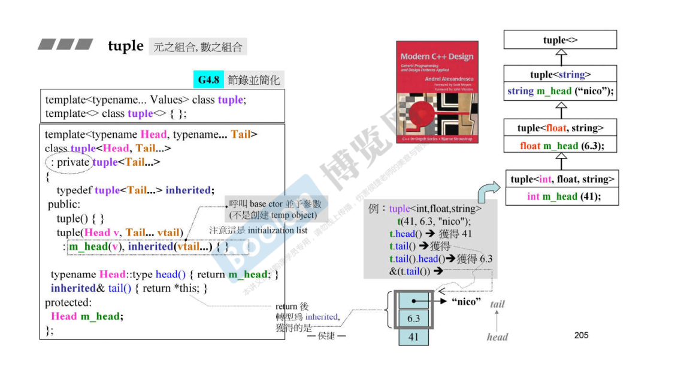
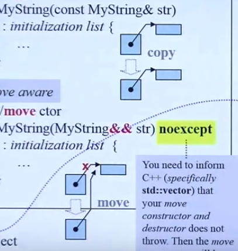

- #### auto

  1. 定义时必须初始化，不能像普通的类型定义那样，因为auto仅仅是一个占位符。因此也能被sizeof和typeid

     ```c++
     int a;  //可以
     auto b;  //错误，必须初始化
     ```

  2. 初始化表达式是引用，则**去除引用语义**。即当赋值符号右边是引用类型时，auto会抛弃他推导出原类型（如果想保留引用，要自己在auto后面再加一个）

     ```c++
     int a=1;
     int& b=a;
     auto c=b; //推导为int而不是
     auto &d=b;   //d为int&，此时d才为引用
     ```

  3. 忽略表达式的顶层const，但是会保留其低层const（如果想保存顶层const就在auto前面加const）

     ```c++
     const int a=1;
     auto d=a; //int d=1  d的类型为int，会忽略表达式a的顶层const
     --------------
     const int a=1;
     int const* p=&a;
     const int const*q=p;
     auto b=q;   //int const* b=p;忽略了表达式q的顶层const，保留了它的低层const
     ```

  4. 初始化表达式为数组时，推导为指针；但是如果表达式为数组且auto带上&，那么推导为数组

     ```c++
     int a[2]={1,2};
     auto b=a;  //b为int*且指向a的第一个元素
     auto &c=a;  //c为int[2]类型即是数组引用 
     cout<<*b;   //1
     cout<<c[0];  //1
     ```

  5. 模板参数不能是auto

- #### decltype（declared type）

  可以推断出表达式的类型

  ```c++
  int a=1;
  decltype(a) b;  //等价于int b；
  ```

  和auto的一些区别

  1. auto会去引用，而decltype不会

     ```c++
     int a=2;
     int& b=a;
     decltype(b) d=a;  //推断出b为int型的引用,即等价于int& d=a
     auto e=b;  //推断出的类型为b的原有类型即a的类型，等价于int d=a;
     ```

  2. auto会忽略顶层引用而decltype不会

     ```c++
     const int a=1;
     auto b=a; //b为int
     decltype(a) d=1;  //d为const int类型
     d=2; //非法，无法修改const类型
     ```

  **相比之下，decltype更纯粹，没有auto哪些复杂的推到规则**。

- #### c++的元组tuple

  tuple的实现是通过自己继承自己的递归方式来实现的。刚开始分成Head和Tail...  然后它继承自Tail...  那么Tail传入时又分成Head和Tail...   每次减一个元素个数同时命名一个，最后就变成空，然后写一个模板参数为空的全特化版本，调用之后什么也不干那么就返回，终止递归。

  

  **tuple是一个固定大小的不同类型值的集合，是pair的泛化。**

  - 构造tuple

    ```c++
    tuple<int,double,string> a(1,2.0,"abc");
    tuple<int,double,string> a{1,2.0,"abc"};
    tuple<int,double,string> a={1,2.0,"abc"};
    //还可以使用make_tuple来自动推导
    auto a=make_tuple(1,2.0,"abv");
    ```

  - 获取元素

    ```c++
    int x=get<0>(a); //获取a的第0个元素
    ```

  - 获取元组的元素个数

    ```c++
    int size=tuple_size<tuple<int,double,string>>::value;
    tuple_size<>::value    模板参数为tuple对象的类型
    //但是这样看起来很蠢，因为这样我们其实是输入tuple元素个数求元素个数
    //这里我们使用decltype（）,自动推导表达式的类型
    例如上面的tuple a
    int size=tuple<decltype(a)>::value;
    ```

  - 获取元组某个位置元素的类型

    ```c++
    tuple<int,double,string> a{1,2,"aaa"};
    typle_element<2,decltype(a)>::type d="abv";  //即string d="abv";
    ```

  - tie操作

    ```c++
    int a=1;
    double b=2;
    string c="abc";
    auto d=tie(a,b,c);  //把abc绑到d上
    ---
    也可以反向操作，把tie绑到abc上
    int a=1;
    double b=2;
    string c="abc";
    tuple<int,double,string> d={1,2,"aaa"};
    tie(a,b,c)=d;
    cout<<c;  //c就变成了aaa
    ```

- #### type traits

  类型萃取机，是一个模板类（结构体），即向类型询问，然后返回答复的内容，即是或者不是

  ```c++
  typedef int i;
  cout<<is_integral<i>::value;  //1
  
  class A
  {};
  cout<<is_class<A>::value; //2
  还有很多其他的，可以帮你问各种各样的问题，而不需要你了解模板参数类型的具体实现
  ```

- #### 数量不定的模板参数（递归）

  n变成1和n-1，n-1又变成1和n-2........

  ```c++
  void print()
  {}    //递归终止条件，这个一定要写而且要写在前面
  template<typename T,typename... Types>
  void print(const T& first,const Types&... args)
  {
      cout<<first<<endl;
      print(args...);   //递归调用
  }
  ```

  例如

  ```c++
  print(1,1.2,"abv");
  ```

- #### 初始化列表initializer_list<>,是一个模板类。可以接受同类型任意个数的参数，然后把他们看作一个整体处理，看成一包（背后的实现是array容器）

  其实就是利用大括号,统一初始化方式

  ```c++
  int a{2};
  int b{};
  pair<int,int> add(int x,int y)
  {
      return {x,y};
  }
  vector<int> a{1,2,3,4}    //{1，2，3，4}就是一个initializer_list
  ```

  更复杂一点

  ```c++
  class A
  {
      public:
      A(int a,int b)  //1
      {
          cout<<a<<endl<<b<<endl;
      }
      A(initializer_list<int> initilist) //2
      {
          for(auto i:initialist)
              cout<<i<<endl;
      }
  };
  
  A a1(1,2);  //调用第一个构造函数
  A a2{1,2}; //使用{},当成初始化列表，调用2，剩下的都是调用2
  A a3{1,2,3};
  A a4={1,2};
  ```

  如果没有2只有1的话，a2和a4还可以初始化，只不过原来是把{}当成一个整体扔过去，现在没有initializer_list之后就一个一个拆开传给1

- #### =default和=delete

  c++的类有6大默认成员函数

  **默认构造函数、默认析构函数、复制构造函数、赋值运算符重载函数、移动构造函数、移动赋值运算符重载函数**

  - =default，显示缺省函数的意思。只能作用在这6中函数

    上面的6种函数，只要类中自己实现之后，编译器就不会生成默认版本。这时如果我们还要生成默认版本，就在后面加上=default

    ```c++
    class A
    {
        public:
        int a;
        A(int x)
        {
            a=x;
        }
        A()=default;
        
    };
    A a;   //if没有第9行，这个是错误的，因为5行实现了构造函数，那么系统默认就不能生成默认构造函数，这样调用就会出错
    A a(2);
    ```

  - =delete。可以作用在任何函数，表示将该函数禁用

    ```c++
    class A
    {
        public:
        int a;
        A(int x)
        {
            a=x;
        }
        A(const A& a)=delete;   //将复制构造函数禁用，那么对象间的复制将会被禁止
    };
    
    A a(2);
    A b=a;  //错误
    ```

- #### 模板类别名

  如果我要给的vector模板娶个别名，这样以后再用vector直接用别名然后指定参数就可以，就不用再写原模板的名字了（这儿vector比较短，当类型名很长的时候每次都写模板名就很麻烦）

  > 当然不仅仅是少打几个字，在模板模板参数中这个技巧很有用

  1. 如果使用typedef的话

     ```c++
     template<typename T>
     typedef vector<T> Vec;   //这样是无法通过编译的
     ```

     需要通过一层包裹来实现

     ```c++
     template<typename T>
     struct alias_vector
     {
         typedef vector<T> Vec;
     }
     
     alias_vector<int>::Vec a;//等价于vector<int> a;
     ```

  2. 而用using可以直接给模板取别名

     ```c++
     template<typename T>
     using Vec=vector<T>;
     
     Vec<int> a;//等价于vector<int> a;
     ```

  当然简单的

  ```c++
  typedef vector<int> Vec;    //这相当于只是特化了一种参数类型的模板
  Vec a;//vector<int> a;
  ```

  这样是可以的，但是这只声明了int这一种类型，而我们的目的是模板别名可以像模板一样接受类型参数，所以还是用using来解决

- #### final

  1. 修饰class，表示它不可被继承

     ```c++
     class A final
     {};
     class B:A //error
     ```

  2. 修饰虚函数，表示不能被重写

     ```c++
     class A
     {
         virtual void fun() final
         {
             cout<<"A";
         }
     };
     class B:A
     {
         void fun()    //error
         {}
     }
     ```

- #### override

  子类重写父类的虚函数，函数名和参数类型个数都一样，实现可以不一样。但是如果不小心把实参写错了，那就是写了个新的虚函数而不是重写父类的虚函数了。因此我们在重写虚函数的时候在函数声明后面加override表示我正在重写父类的虚函数，这样万一形参写错，编译器就会提示error

  ```c++
  class A
  {
      virtual void fun(int x)
      {
          cout<<x;
      }
  };
  class B:A
  {
      virtual void fun(float x) override  //加上之后这儿就会报错，因为参数类型和上面的父类虚函数参数类型不一致，如果不加的话就不是重写而是新声明了一个虚函数
      {
          cout<<x;
      }
  };
  ```

- #### lambdas表示，又称为匿名函数，本质上是一个仿函数

  定了一个内联函数。可以写一些小的函数当仿函数用。一般搭配auto使用

  - ```c++
    auto I=[]     //[]里是变量捕获列表
    {
        cout<<"hello";
    };
    I();  //调用函数，输出hello
    ```

  - 还可以有参数

    ```c++
    auto I=[](int x)
    {
        cout<<x;
    };
    I();
    ```

  - []里是变量捕获列表，只有在里面声明的变量，函数体内才能用，不然是不能调用外部变量。可以在括号里写=表示默认捕获所有的变量

    ```c++
    int a=1;
    auto I=[a]    //这种相当于传值，但是这样是函数体内是不能修改a的，相当于const int，要修改的话要变成[a]()mutable{}，要加mutable关键字同时还要加个小括号
    {
        cout<<a;
    };
    I();
    -----
    如果传引用的话就可以直接改没有问题
    auto I=[&a]
    {
        cout<<++a;
    };
    I();
    ```

  - 函数可以有返回值

    ```c++
    int a=1;
    auto I=[a](int val)
    {
        return val==a;
    };
    bool t=I(2);  //bool即为0
    ```

  - 用在stl的函数里作为仿函数

    ```c++
    template<typename T>
    using Vec=vector<T>;
    int main()
    {
        Vec<int> a{1,4,3,5,6};
        sort(a.begin(),a.end(),[](const int& x,const int& y)  //这儿的形参即为a中元素
        {return x>y;});
    }
    ```

- #### 右值引用和移动语义

  为了消除很多不必要的拷贝。哪些是不必要的拷贝呢？

  **临时对象：临时对象本来就要删除，但是拷贝的时候还需要申请新内存复制；不如直接在临时对象删除前把它偷过来，这些省了复制，而且临时对象的删除也不再是毫无意义**

  **要拷贝的对象以后不用了，那么就不需要复制，直接偷就行了**

  当赋值的右手边是个右值的话，那么左手边可以去偷右手边的资源，而不需要重新开辟内存。

  这个偷就是指针浅拷贝的意思，原来是深拷贝，即创建新的指针，然后开辟内存存入原来的复制的值，再把指针指向新的内存。而浅拷贝直接新建一个指针和它指向相同地址。当然两个指针指向相同，这是很危险，所以后面要把原来的指针断掉

  

  移动构造函数是参数类型为右值引用的拷贝构造函数，移动赋值运算符重载函数类似。

  移动构造函数接受右值为参数，那么当我们传入的是临时对象或者move之后的对象时，就会调用移动，直接偷资源，指针直接指而过去而不用先拷贝再指向拷贝过来的

- #### 完美转发

  所谓转发，就是通过一个函数将参数继续转交给另一个函数进行处理，原参数可能是右值，可能是左值，如果还能继续保持参数的原有特征，那么它就是完美的。

  ```c++
  void process(int& i){    
      cout << "process(int&):" << i << endl;
  }
  void process(int&& i){    
      cout << "process(int&&):" << i << endl;
  }
  
  void myforward(int&& i){    
      cout << "myforward(int&&):" << i << endl;
      process(i);
  }
  
  int main()
  {
      int a = 0;
      process(a);  //a被视为左值 process(int&):0
      process(1);  //1被视为右值 process(int&&):1
      process(move(a)); //强制将a由左值改为右值 process(int&&):0
      myforward(2);  //右值经过forward函数转交给process函数，却称为了一个左值，
      //原因是该右值有了名字  所以是 process(int&):2
      myforward(move(a));  // 同上，在转发的时候右值变成了左值  process(int&):0
      // myforward(a) // 错误用法，右值引用不接受左值
  }
  ```

  myforward接受右值引用参数i，交给precess处理时却变成了左值，不完美。

  要实现完美转发，需要两个步骤，一个是通用引用，一个是forward()模板函数

  - ##### 通用引用（左右值都可以接受）

    `template<typename T> void f(T&&);`

    通用引用满足两个条件

    1. 使用T&&这种形式，（不能加const）
    2. 类型T必须是模板函数的参数，通过推断得到

    一个模板函数，根据定义的实参和传入的形参的类型，分为下面4中。

    1. `X& &`（定义左值引用，传入左值引用）,

       `X& &&`（定义左值引用，传入右值引用

       `X&& &`（定义右值引用，传入左值引用）

       这三种都会被折叠为左值引用

    2. `X&& &&`折叠为：只有这种才代表右值引用

    使用通用引用可以涵括上面的四种情况，但是光有这个我们只是能够同时接受左值和右值，但是处理时还是会把右值变为左值，那么就需要下面的

  - ##### forward()  会根据接受的实参推断出其具体类型并返回，即保持参数的类型

    完美转发技术的核心，修改之后的版本为

    ```c++
    template<typename T>
    void myforward(T&& t)      //通用引用形式
    {
        cout << "myforward(int&&):" << t << endl;
        process(forward<T>(t));   //使用forward模板函数
    }
    ```

- #### 
