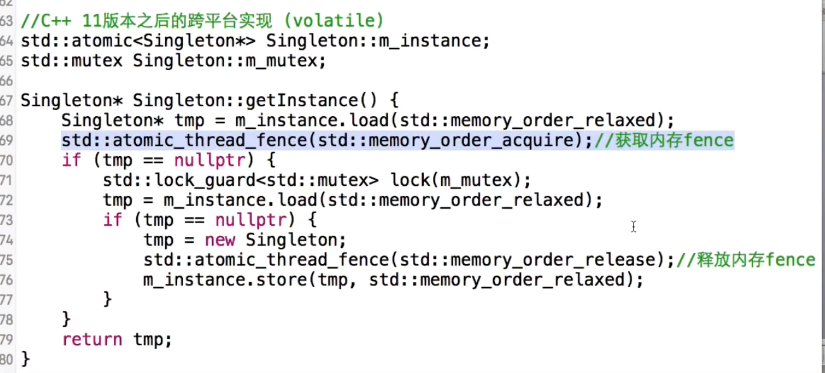
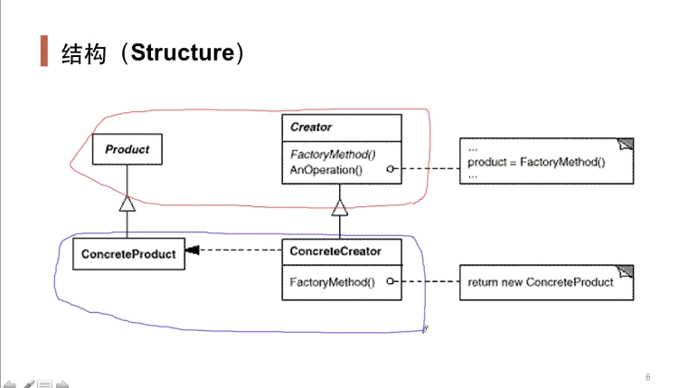
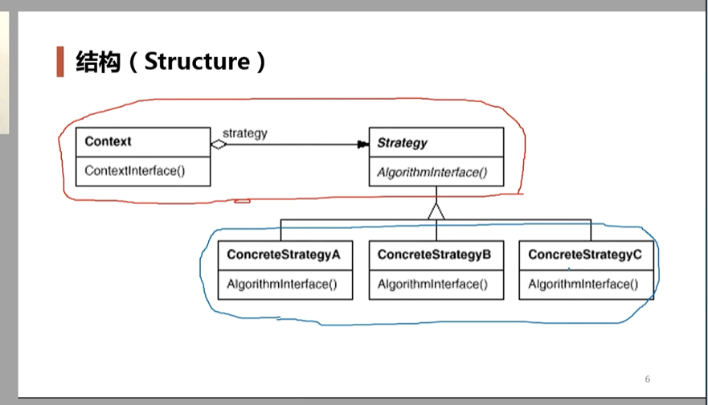

设计模式（Design Pattern）是一套被**反复使用**、**多数人知晓的**、**经过分类的**、**代码设计经验**的总结。使用设计模式的目的：**为了代码可重用性、让代码更容易被他人理解、保证代码可靠性**。 设计模式使代码编写真正工程化；设计模式是软件工程的基石脉络，如同大厦的结构一样。

> 设计模式的根本目的就是利用抽象的技术来实现松耦合的设计
>
> （1）针对接口编程，而不是针对实现编程。
>
> （2）优先使用对象组合，而不是类继承。

#### 对象组合和类继承

**让某个类的对象作为另一个类的数据成员出现，这就是对象组合**

A想用B的功能的，可以选择A从比B继承，这就是和白盒复用，B完全暴漏给了A，破坏了封装性。

但是这样如果A只是要用一部分的B，那么这样其实A中多了很多B的冗余；这时我们就可以使用对象组合，即在A中包含B的对象，要用B的哪个功能就用B对象拿过来，不用的就不用拿了。这就是黑盒复用，被包含对象的细节对外是不可见的

#### 面向对象设计原则

1. **依赖倒置原则**

   高层模块（稳定）不应该依赖于底层模块（变化），二者都应该依赖于抽象（稳定）

2. **开放封闭原则**

   对扩展开放，对更改封闭。例如要加个新功能，应该想着在源代码的基础上进行扩展，而不是把源代码主体改了重新

3. **单一职责**

   一个类应该仅有一个引起它变化的原因。即类的功能不应该太臃肿

4. **接口隔离**

   接口应该小而完备。如果没有必要public，就做成private或者protected

5. **优先使用对象组合而不是类继承**

## 设计模式

### 1.单例模式---对象性能模式

有一些特殊的类， 必须保证只有一个对象，才能保证逻辑正确性格和良好的效率

1. **将构造函数和拷贝构造函数私有，然后设置静态函数和静态数据成员。**

   > 单线程可以用，但是多线程不行

   这样虽然能实现目的，但是对于多线程来说不安全。如果两个线程同时访问到if语句，那么就会同时创建两个对象。

   ```c++
   class Singleton
   {
   private:
       Singleton();
       Singleton(const Singleton& other);
   public:
       static Singleton* instance;
       static Singleton* getInstance();
   };
   Singleton* Singleton::instance=nullptr;
   Singleton* Singleton::getInstance() 
   {
       if(instance==nullptr)
       {
           instance=new Singleton();
       }
       return instance;
   }
   ```

2. **使用线程锁**。但是这样在高并发环境下会造成较大的代价。例如已经修改完instance之后，那么后面的线程其实就是要读一下这个变量，然后就走；但是加锁之后，只有一个能读，而且它读了也不会改变instance，反而会使后面的进程读这个变量的时间变长，代价增大

   > 多线程可以用，但是代价过大

   ```c++
   Singleton* Singleton::getInstance() 
   {
       Lock lock;  //加锁
       if(instance==nullptr)
       {
           instance=new Singleton();
       }
       return instance;
   }
   ```

3. **双检查锁**。锁前锁后都检查。锁前不检查就是上面的情况；如果锁后不检查，即把锁后的if去掉，那么当两个线程同时进到4行时，线程A加锁，线程B阻塞，然后A创建对象，开锁，这时B加锁，然后创建对象，这时如果有if的话就跳过，不创建，但是如果没有的话，还是会创建一个对象。即两个线程都进来的时候，加锁只是延缓第二个线程的执行时间

   > 不能用，会出问题，要限制内存的reorder之后才可以用

   ```c++
   Singleton* Singleton::getInstance() 
   {
       if(instance==nullptr)
       {
           Lock lock;  //加锁
           if(instance==nullptr)
           {
               instance=new Singleton();
           }        
       }
       return instance;
   }
   ```

   这种方法理想很美好，但是实际实践中出现了reorder的问题，即编译器由于优化的原因会打乱指令的执行顺序

   对于第8行的代码，理论上的执行顺序为

   1. 先分配内存
   2. 执行构造器
   3. 指针赋值给instance

   但是实际执行中，编译器为了优化可能会打乱这个顺序，可能会

   1. 分配内存
   2. 直接指针赋值给instance
   3. 执行构造器

   那么当A线程执行new时，执行完这个步骤2，此时B线程进来判断第三行，此时由于赋值过了，因此instance不是nullptr，所以直接返回，但是返回的这个对象还没有执行构造器，这个对象是不能用的，只有地址而没有对象的状态

   下面是解决办法，目的就是要屏蔽编译器的自动排序

   

### 2.工厂模式---对象创建模式

定义一个用于创建对象的接口（即下面的工厂基类中的createSpecificCar方法），**让子类（即具体工厂类）决定实例化哪一个类**。工厂模式使得一个类的实例化延迟（目的：解耦，手段：虚函数）到子类

通过“对象创建”模式绕开new，来避免对象创建（new）过程中所导致的紧耦合（依赖具体类），从而支持对象创建的稳定，它是接口抽象化之后的第一步工作

**通过工厂来创建对象**。并不是把变化消灭了，而是本来变化的活动范围是全局，现在把它限制到局部去了



Product即Car

Concrete(具体的)Product即BenzCar和BmwCar

Createor即工厂基类

ConcreteCreator即具体工厂

红色即为稳定部分，蓝色是变化的，我们的目的就是让externalCall依赖稳定的部分，把蓝色的部分隔离出去。

**把Car型new它的不同子类的过程放到了子类对应的工厂类中**

**原来创建对象需要在extrenalCall里new，现在不需要了**

```c++
class Car
{
public:
    virtual void createCar()=0;    //定义成抽象类，定义抽象方法
    virtual ~Car(){}
};
//具体类
class BenzCar:public Car
{
public:
    BenzCar()
    {
        cout<<"BenzCar::Ctor()"<<endl;
    }
    virtual void createCar()
    {
        cout<<"BenzCar::createCar()"<<endl;
    }
};
class BmwCar:public Car
{
public:
    BmwCar()
    {
        cout<<"BmwCar::Ctor()"<<endl;
    }
    virtual void createCar()
    {
        cout<<"BmwCar::createCar()"<<endl;
    }
};

class CarFactory     //工厂基类
{
public:
    virtual Car* createSpecificCar()=0;   //定义抽象方法，返回对应类类型的对象
};

//具体工厂
class BenzFactory:public CarFactory
{
    virtual Car* createSpecificCar()
    {
        return new BenzCar();
    }
};
class BmwFactory:public CarFactory
{
    virtual Car* createSpecificCar()
    {
        return new BmwCar();
    }
};

void externalCall(CarFactory* factory)    //调用函数，从这儿把外部参数传进来。它里面的全是抽象基类，不依赖任何具体类
{
    Car* specificCar=factory->createSpecificCar();  //多态new，会根据传入的工厂对象指针的类型生成对应类型的对象
    specificCar->createCar();  //调用对应类型的虚函数
}
int main()
{
    CarFactory* factory=new BmwFactory();   //外界传入的参数，这儿可以一直变，但是上面的类和调用函数都是不用变的
    externalCall(factory);
}
```

### 3.策略模式----组件协作模式

**定义一系列算法啊，并把他们一个个封装起来**，并且使他们可以互相替换，该模式使得算法可独立于使用它的客户程序（稳定）而变化（扩展，子类化）

用扩展的而方式面对未来算法需求的变化

**设计模式的结构图，红色为不可变部分，蓝色是可变部分**



程序中的出现if else的时候，除了少数的if else的条件判断绝对不变如if男else女，都需要使用策略模式，即封装多个类，然后给一个统一的调用接口，利用多态调用。这样出现变化的时候，我们直接加一个类就行，统一调用接口不用变，剩下的类也不用变。不然就得在原来的代码里的else if后面加，这违背了开放封闭原则，对扩展开放，对修改封闭，而且这样修改很容易出错误

