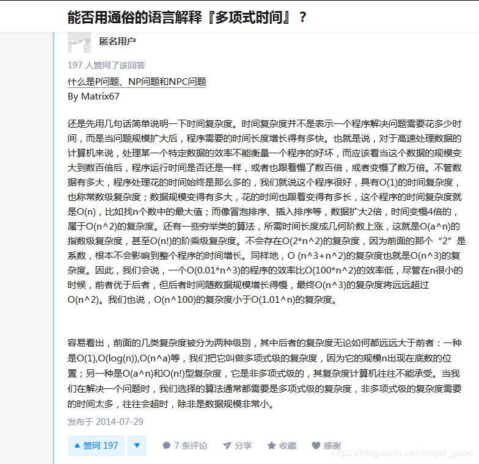

## 前期准备

- 域名：直接到阿里云购买即可，注意看首年开通费用的同时也要看续费的价格，有的第一年很便宜但是续费的价格贼高，注意这个坑。
- 服务器：购买阿里的ecs或者轻量应运用服务器，前者就是可操作性强，自己捣鼓，后者就是省事
- 使用的wordpress的模板建站的方式。

## 服务器

- 在阿里云购买服务器后会得到一个公网的IP，然后重置登陆密码

- 使用mac终端中自带的ssh登陆服务器

  

  

- 要运行wordpress程序，必须要有对应的软件，也就是服务器程序，LNMP(Linux+Nginx+Mysql+PHP)或者LAMP(Linux+Apache+Mysql+PHP)。这里我们使用宝塔面板来安装，宝塔面板相当于是一个远程的服务器可视化管理面板。在服务器上安装面板之后，就可以宝塔面板可视化的管理服务器。

  对于centos7，使用如下命令安装

  ```
  yum install -y wget && wget -O install.sh http://download.bt.cn/install/install_6.0.sh && bash install.sh 
  ```

  安装完成之后如下图所示